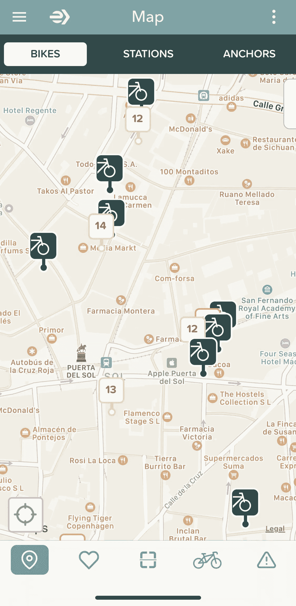
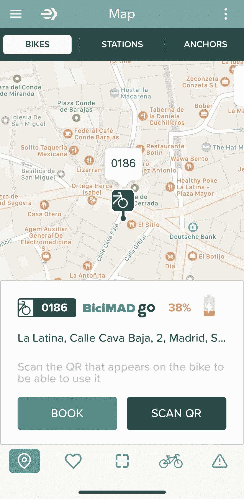
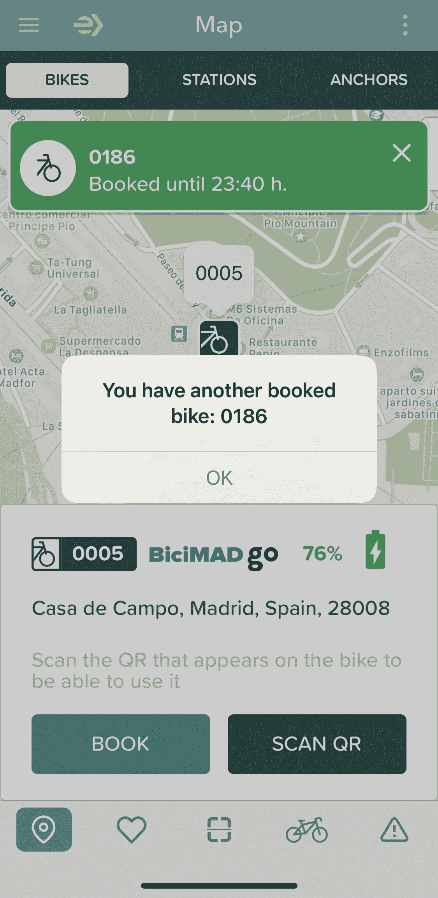
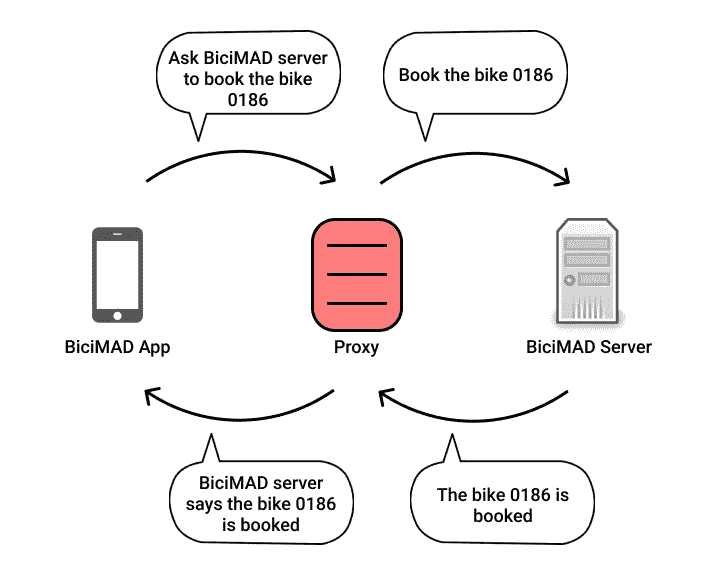
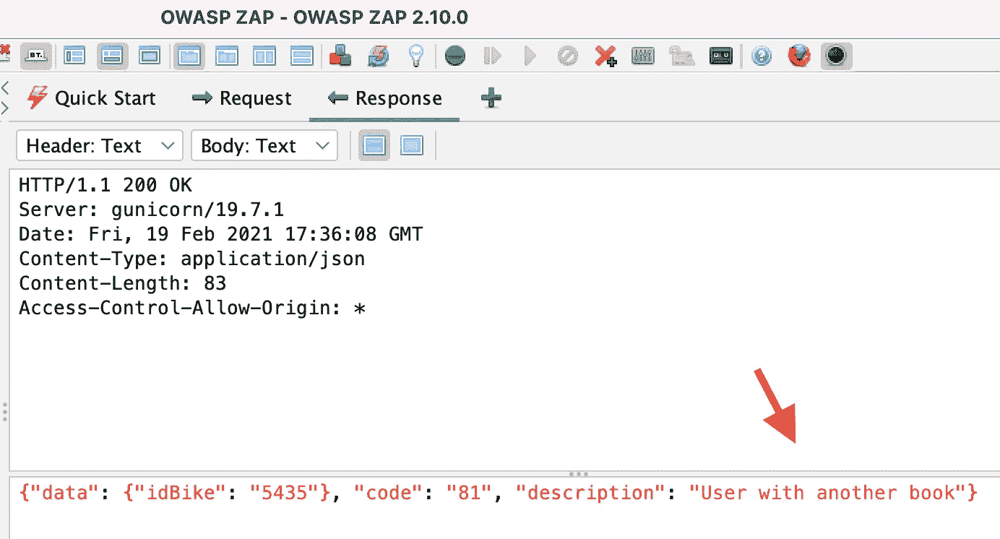
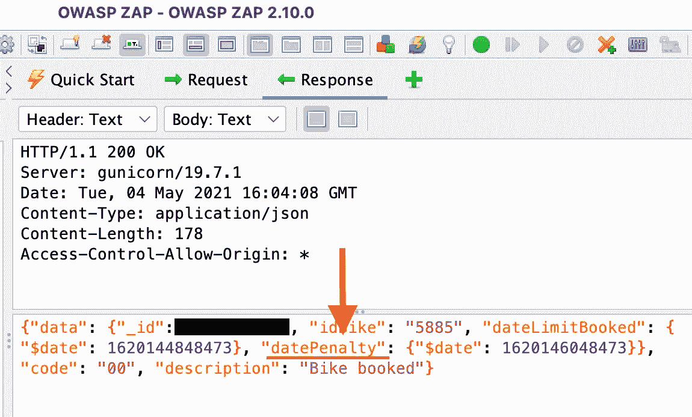
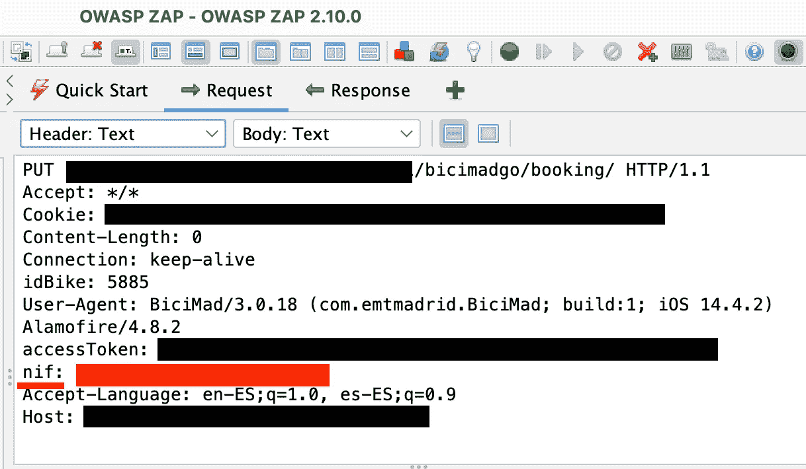
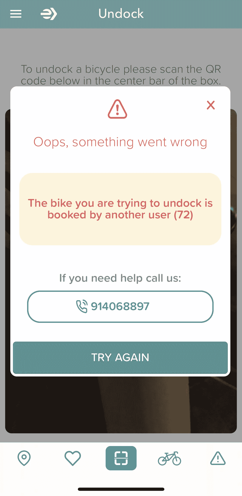

# 道德黑客故事——拒绝为 BiciMAD 自行车提供服务

> 原文：<https://infosecwriteups.com/ethical-hacking-stories-denial-of-service-to-bicimad-bikes-e16e4b3f6bbb?source=collection_archive---------1----------------------->

## 马德里公共自行车租赁服务中存在一个漏洞，使得攻击者能够预订所有可用的自行车

2014 年，马德里市对移动性做出了重大承诺，部署了自己的自行车租赁服务，名为 [*BiciMAD*](https://www.accessiblemadrid.com/en/blog/bicimad-public-bike-rental-service-madrid) 。

有了 BiciMAD，你可以从 264 个车站中的任何一个骑自行车

这个故事将向你展示我如何在 *BiciMAD* 服务中发现**的一个漏洞，这个漏洞** **允许攻击者预订所有可用的自行车**。

> **免责声明**:本故事中表达的观点仅代表作者本人，不代表 BiciMAD 公司的观点。事件得到了适当通报，并采取了相关措施予以解决。敏感信息隐藏在以下截图中。

# 比奇马德围棋赛

2020 年秋天，马德里增加了 454 辆自由浮动自行车，采用了一种叫做 *BiciMAD Go* 的新形式。BiciMAD 自行车的不同之处在于它们不需要停靠在车站。你可以把它们放在允许区域内的任何地方。

找到一辆这样的自行车最便捷的方式就是使用官方的*bici mad*[*App*](https://www.bicimad.com/index.php?s=app)。

带数字的标记代表 BiciMAD 站，而其他标记表示 BiciMAD Go 自行车

你可以预订一辆 BiciMAD Go 自行车，以避免另一个用户在接下来的 10 分钟内骑走这辆自行车。

预订一辆自行车会给你足够的时间到达自行车的位置

一天，一个问题出现在我的脑海里:

> 我可以同时预订多辆自行车吗？

允许用户同时预订多辆自行车可能会影响自行车的可用性，所以我希望有某种控制。

有一个控件可以防止用户在同一时间段内预订多辆自行车

这应该是一个服务器端控件，但这不是我第一次在客户端看到这些控件，它们很容易被绕过。

为了在网络层了解 *BiciMAD* *App* 中发生了什么，我设置了一个 [*OWASP ZAP*](https://www.zaproxy.org/) 代理。

通过代理，我可以看到 BiciMAD 应用程序和服务器之间的请求交换

在检查了由 *BiciMAD* *App* 产生的网络流量后，我发现**在 *App* 中显示的错误确实是服务器端错误**。

来自服务器的响应确认服务器端控制已经就绪

此外，我注意到，如果你试图在 10 分钟预订限制后预订另一辆自行车，将会受到时间惩罚。

在预订限制之后和处罚日期之前预订自行车将导致 30 分钟的锁定

**这种控制将防止用户损害自行车的可用性。**

> 所以…这似乎是故事的结尾。也可能不是…

# 安全漏洞

看了一下预订请求，我意识到**我的身份证号码是在标题**中发送的。

“nif”字段引起了我的注意

在一个头**中发送用户的国家 *ID* 号允许攻击者轻易地伪造值**，所以我开始怀疑…

> **身份证号会在服务器上验证吗？**

使用 [*邮递员*](https://www.postman.com/) ，我复制了预订请求**，用“*00000013 b*”**替换我的 *ID* ，并且请求**似乎成功了**。

什么鬼*’*时刻由奥巴马和[吉菲](https://giphy.com/gifs/wtf-obama-wth-pPhyAv5t9V8djyRFJH)

通过对预订端点的 *GET* 请求，我能够验证自行车是否被成功预订。此外，我发现**没有对用户的国家 *ID* 字段进行输入验证**，因此**我可以使用任意值**来预订任何自行车，例如' *1* '、' *hi* '，甚至是一个空 ID。

然后，我发现自己在问…

> 我能利用这个漏洞对 BiciMAD Go bikes 进行拒绝服务攻击吗？

# 剥削

***拒绝服务*** ( *DoS* )是一种网络攻击，其中恶意行为者旨在**通过中断设备的正常功能，使资源或设备对其目标用户不可用**。

**我使用这些*道德黑客*的意图是** **增加我使用的**应用程序的安全性，以便它们在未来对每个人都更安全。

一个 *DoS* 会导致 *BiciMAD* 的经济损失，并且会越过道德黑客的界限——除了法律影响。

> 根据以前的漏洞证据，很明显这种攻击可以成功实施

虽然我不想损害 bici mad Go T1 自行车的可用性，但我想用一小组自行车 T5 对攻击 T3 T4 进行 T2 概念验证。

为此，我创建了一个脚本，使用随机生成的*id*在我的区域附近预订了一组选定的自行车。

然后，我运行脚本，走到街上，试着骑上选中的自行车。当我试图解锁它们时，*应用*显示一个错误，确认它们已经被预订了。

应用程序中的错误确认了预订的自行车不可用

十分钟后，我让我的妻子再次运行脚本，这样我就可以验证自行车仍然不可用。

**时间惩罚控制被证明是完全无用的**，因为惩罚似乎被应用于用户的 *ID* — *，该 ID 可以随机生成*。

在确认攻击可行后，是时候**报告漏洞**以便修复了。

# 最后的想法

这个漏洞使得攻击者可以用任意的国民身份证号码预订任何自行车，严重影响了自行车的可用性。

我还发现，用另一个 *BiciMAD* 用户的 *ID* 预订自行车是可能的，这也**影响了预订服务的完整性**。

在我看来，利用的容易程度以及对 *BiciMAD* 服务的影响使得这个安全漏洞成为一个**高严重性漏洞**。

根据[通用漏洞评分系统](https://nvd.nist.gov/vuln-metrics/cvss)，我提议的 CVSS 3.1 向量返回了 7.6 的基础分数

尽管对该漏洞最有害的利用是*拒绝服务*，但它也可以被**利用，悄悄减少某些地区的自行车可用性**——让竞争对手获得竞争优势。

> 如果你喜欢这个故事，你想阅读更多，请在[媒体](https://medium.com/@h_martos)、[推特](https://twitter.com/h_martos)或 [LinkedIn](https://www.linkedin.com/in/h%C3%A9ctor-martos-g%C3%B3mez-99838776/) 上关注我。
> 
> 感谢阅读！