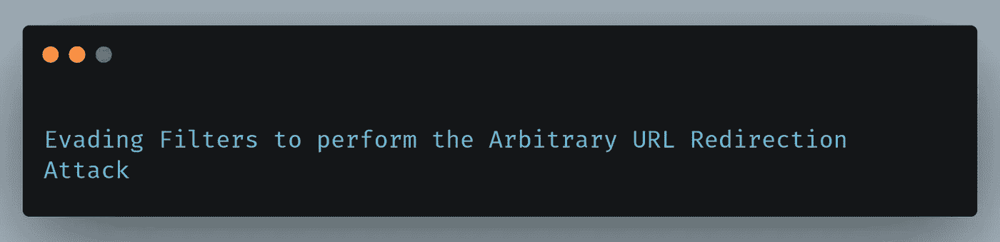

# 避开过滤器执行任意 URL 重定向攻击

> 原文：<https://infosecwriteups.com/evading-filters-to-perform-the-arbitrary-url-redirection-attack-cce628b9b6a0?source=collection_archive---------2----------------------->



任意 URL 重定向攻击通常被称为开放重定向攻击，这是一种常见的 web 漏洞，允许攻击者将受害用户重定向到攻击者控制的域。这种攻击可以用来窃取令牌等敏感信息，执行社会工程和其他攻击。

任意 URL 重定向攻击大多发生在应用程序接受用户提供的 URL 并在执行易受攻击的功能时将其重定向的端点。一些常见的参数有**？return=，？returnURI=，？转发给=，？重定向=，？redirectURI=，？url=，？forward=** 和其他类似参数，这些参数似乎将用户加载或重定向到另一个端点。

> 【如果你喜欢读我的文章，请在推特上关注:[***【https://www.twitter.com/harshbothra_】***](https://www.twitter.com/harshbothra_)

嗨，各位黑客和 Bug 赏金猎人，在这篇文章中，我将分享我最近的一个发现，我能够通过规避过滤器来执行任意 URL 重定向攻击。

默认情况下，现代框架实现安全检查来验证和避免开放重定向攻击。通常，各种过滤器，如验证是否使用了第三方 URL 或 IP，验证是否使用了 **HTTPS://** 协议，如果找到，应用程序会阻止重定向的发生。

最近，我在测试一个叫做**target.com 的私人应用时遇到了类似的情况。**在检查我的应用程序安全清单中的各种漏洞时，我正在寻找下一个 **URL 重定向**。

我测试这种攻击的一般方法如下:

# **方法— 1:**

1.  登录应用程序并导航至任何认证页面，如**我的个人资料。**
2.  网址一般是这样的:[https://www.target.com/my-profile/T21](https://www.target.com/my-profile/)
3.  现在，从应用程序中注销，通常一些应用程序抛出一个重定向参数，该参数重定向到 **/my-profile** 页面。
4.  网址如下:[**https://www.target.com/login?forward=/my-profile**](https://www.target.com/login?forward=/my-profile)
5.  现在，在这种情况下，**转发**参数是测试**任意 URL 重定向攻击的潜在攻击媒介。**

# **方法— 2:**

1.  使用参数枚举工具，如 **ParamSpider & Arjun**
2.  测试可疑参数对抗**任意 URL 重定向攻击。**

# **方法— 3:**

1.  在目标应用程序上运行 **gau & waybackurls** 并将它们保存到一个文件中。
2.  对步骤 1 保存的文件运行**打开重定向 GF 模式**，并将输出保存到另一个文件。
3.  这些 URL 是**任意 URL 重定向攻击的可疑和潜在端点。**

在这种情况下，对于我正在测试的应用程序，我使用了**方法— 1** ，并且我发现了以下开放重定向的潜在端点:

```
[***https://www.target.com/login?forward=/account/address***](https://www.target.com/login?forward=/account/address)
```

然而，**转发**参数正在验证是否提供了**URL**并阻止重定向发生。经过进一步调查，我了解到:

*   应用程序正在过滤 **HTTPS** 协议。
*   应用程序正在过滤**主机&的 IP 地址。**

然而，应用程序允许使用 **HTTP** 协议。想了一会儿，我用下面的有效载荷作为旁路:

[**http://2899905732**](http://2899905732):2899905732 是 **google.com 的**IP:**142.250.64.100 的整数 IP 表示**

**最终的有效载荷如下所示:**

```
[***https://www.target.com/login?forward=***](https://www.target.com/login?forward=/account/address)[**http://2899905732**](http://2899905732)
```

**我导航到上面的 URL 并用有效的凭证登录。登录后，应用程序重定向到**google.com**，导致成功的**任意 URL 重定向攻击。****

# **外卖食品**

*   **尝试所有可能的方法来查看每一个漏洞。**
*   **如果某个东西不起作用或被阻塞，尝试寻找可能的替代方案。**
*   **尝试所有可能的方法来逃避过滤器获得成功。**
*   **一路学习，处处应用你的知识。**

**如果你喜欢阅读文章**，请鼓掌并关注*媒体和推特:*****

*****推特:***[***https://www.twitter.com/harshbothra_***](https://www.twitter.com/harshbothra_)**

*****领英:***[***https://www.linkedin.com/in/harshbothra***](https://www.linkedin.com/in/harshbothra)**

*****网站:*** [***https://harshbothra.tech***](https://harshbothra.tech/)**

*****Talks:*** [***WEB //www.youtube.com/playlistlist=PLYn5_MxRvV-fxPL90I-uebXQzQBXfIaY0***](https://www.youtube.com/playlist?list=PLYn5_MxRvV-fxPL90I-uebXQzQBXfIaY0)**

*****幻灯片:***[***【HTTPS://speakerdeck.com/harshbothra***](https://speakerdeck.com/harshbothra)**