# 利用 nmap 在网络侦察中规避防火墙/IDS

> 原文：<https://infosecwriteups.com/evading-firewall-ids-during-network-reconnaissance-using-nmap-7dc393138178?source=collection_archive---------0----------------------->

IDS(入侵检测系统)和防火墙是旨在防止未经授权的人访问网络的安全机制。然而，即使是 IDS 和防火墙也有一些安全限制。

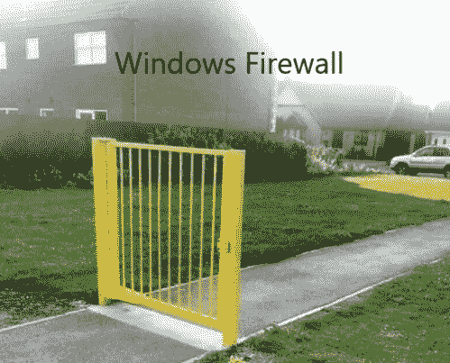

防火墙和入侵检测系统旨在避免恶意流量进入网络，但某些技术可用于向目标发送预期的数据包并避开入侵检测系统/防火墙。

我们将涉及的一些技术有:-

**数据包分片** -向预定目标发送分片的探测数据包，目标在收到所有分片后重新组装。

**源端口操纵**——用普通源端口操纵实际源端口，以规避 IDS/防火墙

**IP 地址欺骗/诱骗 IP** -生成或手动指定诱骗 IP 地址，使 IDS/防火墙无法确定实际 IP。

**创建定制数据包:-** 发送定制数据包来扫描防火墙之外的目标。

**欺骗 MAC 地址:-** 欺骗我们的 MAC 地址来隐藏我们的真实身份

**实验室要求** :- Windows 7/10/11，Linux 机器(Kali/ubuntu/Parrot)

要设置我们的实验室，我们需要打开 Windows Defender 防火墙。导航到**控制面板- >系统和安全- > windows defender 防火墙- >打开或关闭 windows defender 防火墙**，启用 defender 并单击确定。

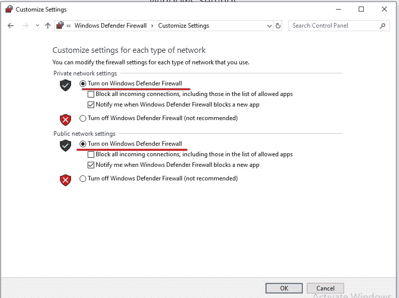

如下所示，我们的扫描被 windows defender 阻止。

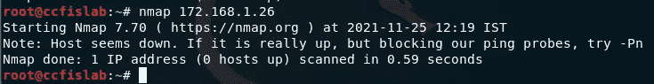

## **使用数据包分片绕过 defender:-**

数据包分段是指在将探测发送到网络时，将其分成几个更小的数据包(片段)。当这些数据包到达主机时，主机后面的 IDS 和防火墙一般会将它们全部排队并逐个处理。但是，由于这种处理方法会消耗更多的 CPU 和网络资源，大多数 IDS 的配置会使其在端口扫描期间跳过碎片数据包。

再次运行扫描， **nmap -f <目标 IP 地址>**

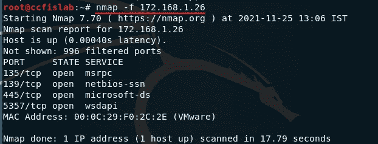

另外，另一种技术是指定最大传输单元(mtu)的数量。使用 mtu，传输较小的数据包，而不是一次发送一个完整的数据包。这种技术避开了目标机器中启用的过滤和检测机制。

nmap -mtu 8 <target ip="">，(-mtu 指定最大传输单元数)这里是 8 个字节的数据包。</target>

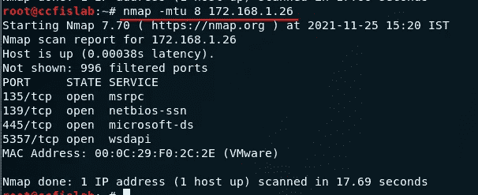

## **源端口操纵:-**

源端口操纵是指用普通端口号操纵实际端口号，以规避 IDS/防火墙。当防火墙配置为允许来自众所周知的端口(如 HTTP、DNS、FTP 等)的数据包时，这很有用。

**nmap -g 80 <目标 IP >** ，( **-g** 或 **-源端口**选项进行源端口操作)

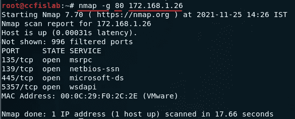

## **IP 地址欺骗/诱骗 IP:-**

IP 地址诱饵技术是指生成或手动指定诱饵的 IP 地址，以规避 IDS/防火墙。这种技术使得 IDS/防火墙很难确定哪个 IP 地址真正在扫描网络，哪个 IP 地址是诱饵

通过使用此命令，nmap 自动为扫描生成随机数量的诱饵，并在诱饵 IP 地址之间随机定位真实 IP 地址。

**nmap -D RND:12 个 172.168.1.26**，( **-D** 执行诱饵扫描， **RND** 生成随机且非保留的 IP 地址，这里是 12 个 IP)

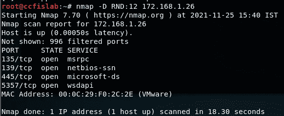

在 Wireshark 中，我们可以看到同一个目标 IP 的不同 IP。

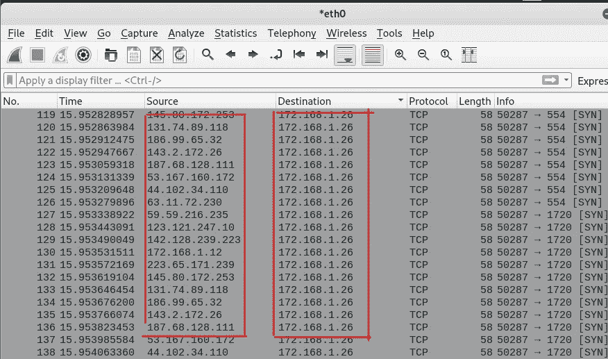

# **使用 nmap 创建自定义数据包**

我们可以使用 nmap 来执行各种扫描技术，如附加自定义二进制数据、附加自定义字符串、附加随机数据、随机化主机顺序以及发送错误校验和来扫描 IDS/防火墙之外的目标主机。

## ***二进制数据作为有效载荷***

**nmap <目标 IP > -数据 0xdeadbeef** ( **-数据** <十六进制字符串>，在发送的数据包中发送二进制数据(0 和 1)作为有效载荷，以扫描防火墙以外的内容)

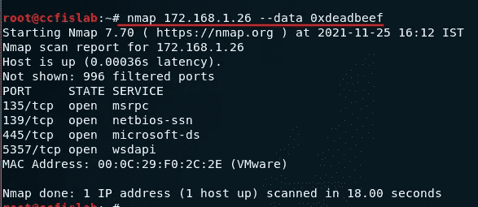

## **作为有效载荷的常规字符串**

**nmap <目标 IP > - data-string“我的 l33t 技能”**(**-data-string<string>**)，将一个常规字符串作为发送数据包中的有效载荷发送到目标机器进行防火墙外扫描。

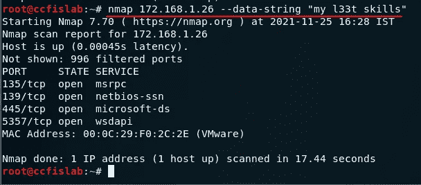

## **追加随机数据字节**

**nmap -数据-长度 5 <目标 IP >** ( **-数据-长度<长度>** 是将一定数量的随机数据字节附加到没有任何协议特定有效载荷的大多数发送的包中)

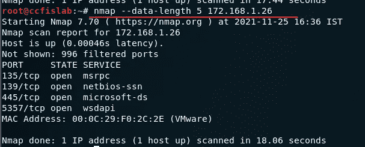

## 随机化主机顺序

**nmap - randomize-hosts <目标 IP>**(**-randomize-hosts**随机扫描目标网络中的主机数量，扫描防火墙外的预定目标)

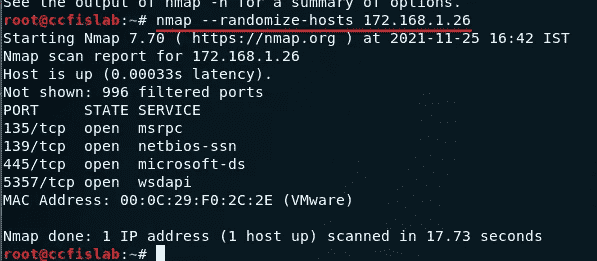

## 发送错误的校验和

**nmap - badsum <目标 IP >** ( **- badsum** 用于将带有错误或伪造 TCP/UDP 校验和的数据包发送到预定目标，以避开某些防火墙规则集)

扫描结果显示所有端口都被过滤，表明没有响应或数据包被丢弃，因此可以推断系统已配置。

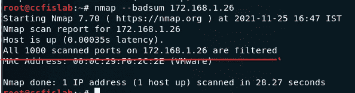

# **假冒 MAC 地址**

假冒我们的 MAC 地址有助于我们扫描网络，即使我们的真实 MAC 地址被防火墙/IDS 阻止。这也有助于我们保持匿名和绕过某些过滤器。

**nmap -sT -Pn - spoof-mac 0 <目标 IP >** ( **-sT** ，TCP 扫描。 **-Pn** ，无 ping。 **-欺骗 mac** 0，欺骗 mac 地址，0 随机化 mac)

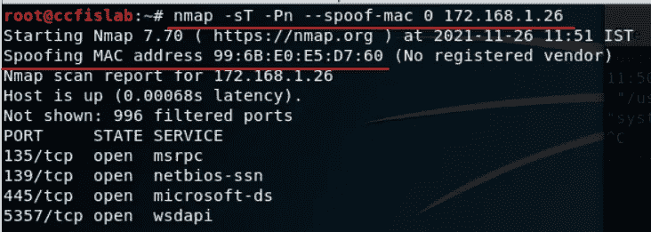

有关通过使用代理链绕过防火墙的更多信息，nmap 和 hp3 即将推出。

希望这对你有帮助。如果你喜欢这篇文章或者它对你有任何帮助。请留下一些掌声。我不介意他们中的 50 个；)

