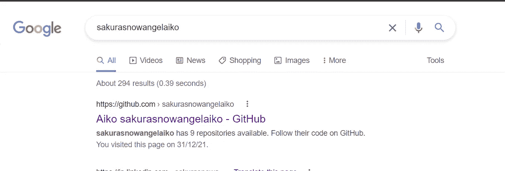
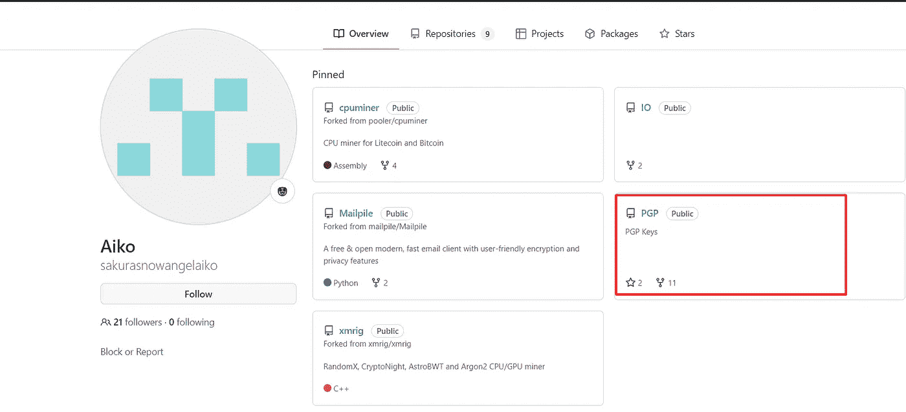
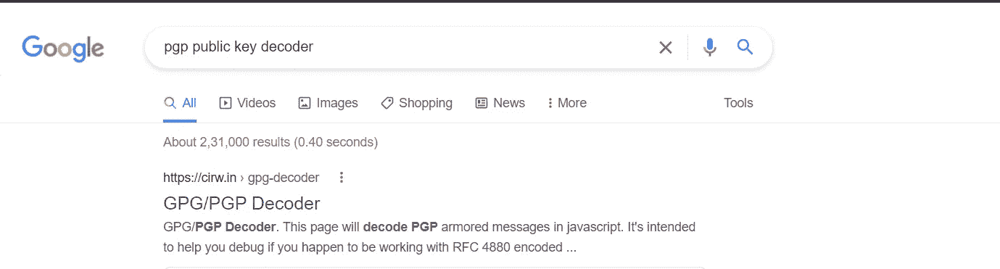
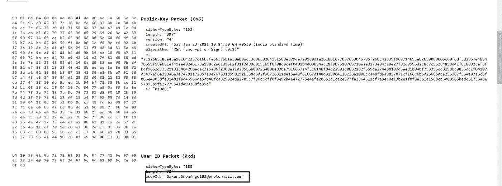
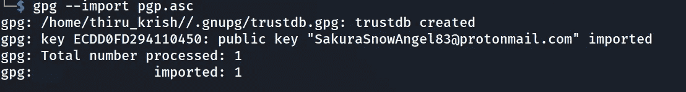
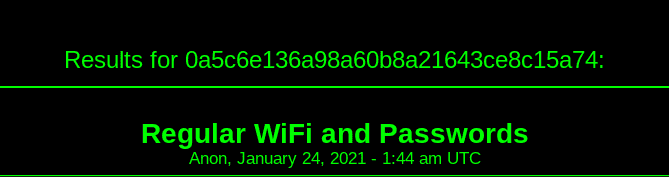
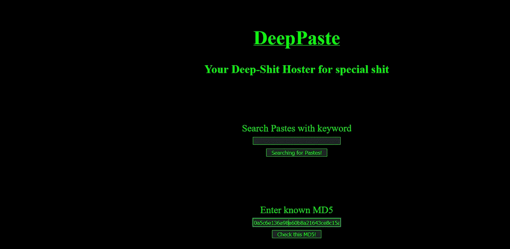
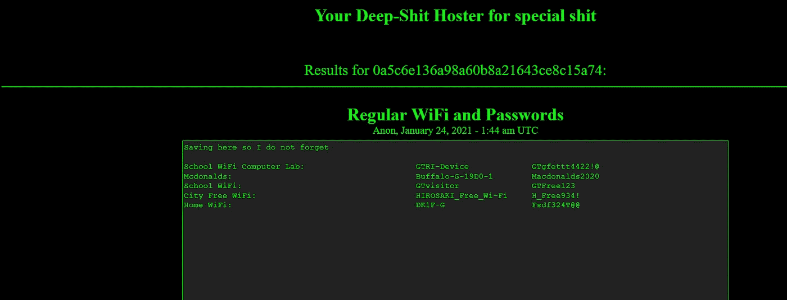

# 日常网络

> 原文：<https://infosecwriteups.com/everyday-cyber-f7d215d93841?source=collection_archive---------2----------------------->

第一天

你好，朋友！！

我们好久没见面了！希望你一切都好！

从现在开始，为了回到正轨，我将每天写一些关于进攻安全的新东西。此外，我即将参加 PNPT 认证，所以你甚至可以看到一些关于它的内容。如果你不知道什么是 PNPT，但有兴趣了解它，请查看下面的链接。

> [https://certifications.tcm-sec.com/pnpt/](https://certifications.tcm-sec.com/pnpt/)

今天，您将了解一些关于 PGP 加密的知识，以及如何从公开暴露的加密密钥中收集一些敏感信息。

我是在[樱花屋](https://tryhackme.com/room/sakura)下的 Tryhackme 的一次挑战中知道这个的，这次挑战和 OSINT 有关。所以再一次戴上你的侦探帽子，准备一些真正的行动吧！！

# **PGP(相当好的隐私):**

相当好的隐私(PGP)是一个加密系统，用于发送加密电子邮件和加密敏感文件。自从 1991 年发明以来，PGP 已经成为电子邮件安全事实上的标准。

它是免费的，并使用对称和公钥加密，这大大有助于它的普及。

它使用对称密钥加密(比公钥加密快得多)在客户端之间实际发送和接收消息，并使用公钥加密在客户端之间安全地传输密钥。简而言之，它利用了两种加密系统的优点。

如果你需要更多关于 PGP 的内容，你可以访问这个 [**PGP-explained**](https://www.varonis.com/blog/pgp-encryption) 我觉得很有用，你也可以和我分享一些关于这个的有趣的事情😉。

# **挑战:**

因此，是时候进入实际调查并亲自动手操作 PGP 加密了。

我们知道攻击者的名字是**sakurasnoangelaiko**我们希望找到攻击者使用的电子邮件。

通过快速的谷歌搜索，我们得到了攻击者的 Github 档案。

既然我们知道 PGP 是用来加密电子邮件的，我想沿着这条路走下去可能会帮助我们获得攻击者的电子邮件。

在 PGP 存储库中，您可以看到用于发送会话密钥的公钥。现在我们必须找到一种方法从这个密钥中提取 email-id。

再次回到我们的朋友谷歌解码公钥，第一个结果为我们做的把戏！

电子邮件:SakuraSnowAngel83@protonmail.com

在命令行中，我们可以使用 GPG (GNU PrivacyGuard)来获取 email-id。

> 有关使用 gpg 加密或解密文件的更多内容，请访问此链接[https://www . how togeek . com/427982/how-to-encrypt-and-decrypt-files-with-gpg-on-Linux/](https://www.howtogeek.com/427982/how-to-encrypt-and-decrypt-files-with-gpg-on-linux/)

# **暗网调查:**

接下来，我们将会看到一种从黑暗网络中获取信息的方法，这是我在同一个樱花屋学到的。

在这里，我们看到一张图片和一条微博

我们可以观察到单词 DEEP PASTE 是大写的，这可能是一个线索。

因此，搜索 Deep Paste 我们可以了解到，它很像一个论坛，任何拥有个人资料的人都可以分享文本并提出问题，其他用户可以回答这些问题。在这个网站上只允许有文字，这可以用来了解深网，但也可以用来寻找古，人口贩卖，红楼等地方。

要找到这个网站上的私人文本，我们必须知道确切的网址或 md5。

幸运的是，我们可以在图像中看到与文本相关的散列。

在深贴的主页上我们可以看到这一点(使用 tor 浏览器访问该网站)

> 深度粘贴洋葱链接(将来可能会改变，所以最好使用 Ahmia 这样的搜索引擎来查找深度粘贴):
> 
> [http://depasteon 6 cqgrykzrgya 52 xglohg 5 vyuyhte 3 ll 7 hzix 7 H5 ldfqsyd . onion/](http://depasteon6cqgrykzrgya52xglohg5ovyuyhte3ll7hzix7h5ldfqsyd.onion/)

> 文本的洋葱链接:
> 
> [http://depasteon 6 cqgrykzrgya 52 xglohg 5 vyuyhte 3 ll 7 hzix 7 H5 ldfqsyd . onion/show . PHP？MD5 = 0 a5c 6 e 136 a98 a60 b8a 21643 ce 8 c15 a 74](http://depasteon6cqgrykzrgya52xglohg5ovyuyhte3ll7hzix7h5ldfqsyd.onion/show.php?md5=0a5c6e136a98a60b8a21643ce8c15a74)

嘣！我们在文本中得到一些 Wi-fi 接入点的细节。

# 🔈 🔈Infosec Writeups 正在组织其首次虚拟会议和网络活动。如果你对信息安全感兴趣，这是最酷的地方，有 16 个令人难以置信的演讲者和 10 多个小时充满力量的讨论会议。[查看更多详情并在此注册。](https://iwcon.live/)

 [## IWCon2022 - Infosec 书面报告虚拟会议

### 与世界上最优秀的信息安全专家建立联系。了解网络安全专家如何取得成功。将新技能添加到您的…

iwcon.live](https://iwcon.live/)