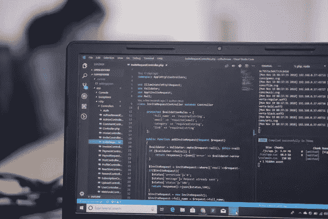
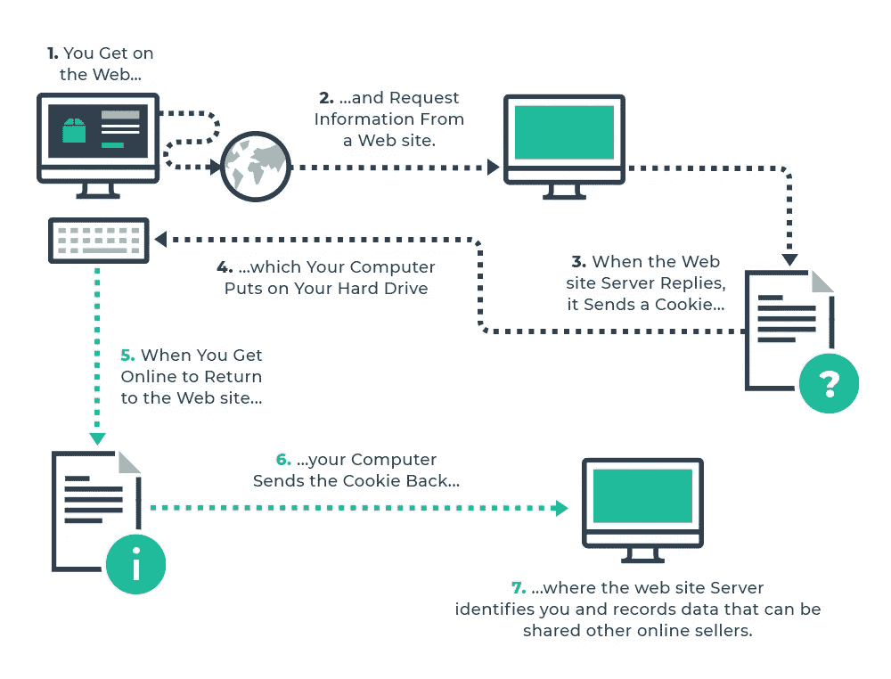
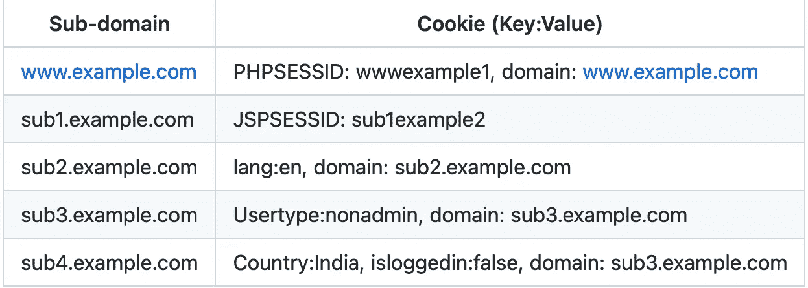
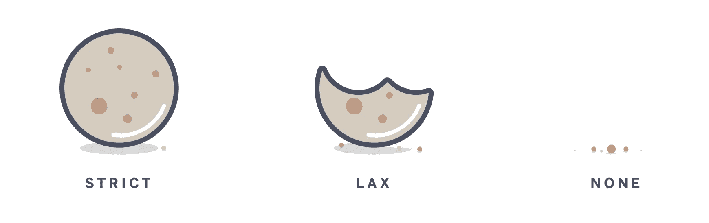
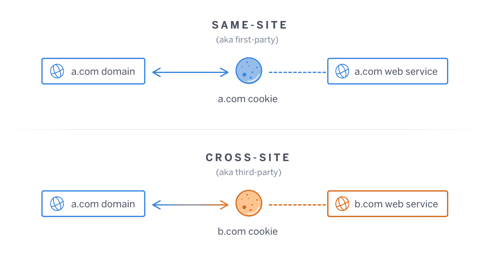

# 关于 Cookie 及其安全性的一切

> 原文：<https://infosecwriteups.com/everything-about-cookie-and-its-security-f5742381d6e7?source=collection_archive---------4----------------------->

Vishnu R Nair 在 [Unsplash](https://unsplash.com/@vishnurnair?utm_source=unsplash&utm_medium=referral&utm_content=creditCopyText) 上的照片

**什么是饼干，为什么要用它？**

HTTP 是一种无状态协议，这意味着它无法区分来自同一台计算机、网络或用户的两个连续请求。这是一个主要问题。由于这个原因，用户无法维持其会话，如果我们继续做同样的事情，互联网将与十年前一样，只由一堆静态 html 页面组成。没有用户帐户，没有定制，等等，如果有任何用户帐户，你需要登录一次又一次地访问每个页面。

为了解决这个问题，HTTP 必须是有状态的。答案是一块饼干。与你晚餐吃的饼干不同，这些是由你访问的网站创建的小文件。它们由 web 应用程序生成并存储在您的 web 浏览器中，以键值对的形式存在。

例如:PHPSESSID: xyjaez1081lze23，lang: en

让我们用一个例子来理解这一点。假设你去一家商店，带回一些餐具。当你到家时，你发现其中一个坏了。所以，你去找店主，告诉他你的问题。但是令你沮丧的是，他回答说他不认识你。这是 HTTP 没有 cookies 的初始条件。网络服务器无论如何都不会认出你。

[来源](https://devopedia.org/images/article/288/5564.1602410667.png)

现在考虑一个不同的场景。店主给你收据。收据上有一个号码。这个号码是唯一的，可以用来识别你。他的电脑里还有一份号码的拷贝。当你返回商店时，他向你要代币。他把这个号码和他电脑上的号码进行了比对。然后他认出了你。这正是 cookies 的作用，与用来记住你的令牌没有什么不同。

它们也可以用于各种原因。比如:

1.  记住你的语言偏好。例如，上面的 **lang** cookie 已经被设置为 **en。**因为它们已经保存在您的浏览器上，所以会被发送到最初保存它们的站点。这个 web 应用程序将解析它，并向您发送网站的英文版本。
2.  来追踪你。他们也可以用来跟踪你的国家，城市等。
3.  您访问免费服务的次数。
4.  最重要的是，保存你的会话数据。

**Cookie 中使用了哪些不同的标志？**

它们可能是小文件，但每个 cookie 本身都有复杂的结构。使它变得复杂的是每个 cookie 中可能存在的不同标志。这些标志不过是用于不同目的的 cookies 的属性，或者就像可用于识别这些数字的值的名称。

[来源](https://auth0.com/docs/manage-users/cookies/samesite-cookie-attribute-changes)

让我们简单地浏览一下所有的标志。

1.  **安全**:可设置为真或假。如果设置为 true，则仅当连接是 HTTPS 时才发送 cookie。这可用于降低 MITM 攻击的风险，在这种攻击中，攻击者强迫用户浏览 HTTP 上的网站。如果设置了此标志，cookie 将不会通过 HTTP 传输。
2.  **HttpOnly** :如果设置为 true，客户端 JavaScript 将无法访问 cookie。这可用于从窃取 cookie 的 XSS 攻击中保存 cookie。因此客户端 javascript 将无法访问 cookie
3.  **域**:包含 cookie 可以发送到的域或子域。
4.  **路径**:每条路径上可以有不同的东西。如果开发人员想要为每个路径设置不同的 cookie，他可以使用 path 属性来实现。
5.  **过期:**用于定义 cookie 的有效期。
6.  **SamePath** :用于定义跨站点请求时 cookies 可以发送的条件。

**什么是域属性，它是如何在 Cookie 中使用的？**

现在让我们扩展一下 cookie 的域属性。顾名思义，它用于保存域名和子域名。然后，浏览器可以使用它来判断 cookie 需要发送到哪个域/子域，以及需要禁止从哪个域/子域发送 cookie。

或者，您也可以将其视为设置 cookie 的范围。一个 Web 应用程序可以有多个子域，每个子域可以设置自己的 cookie。

让我们假设网站[www.example.com](http://www.example.com/)有 4 个子域名，每个子域在不同的框架上运行不同的网站。他们自己做饼干。

下表很好地解释了这一点。

各个子域的 Cookies

因此，如果你访问[www.example.com](http://www.example.com/)，网络应用程序将为你提供**PHP sesid:wwwexample 1**，作为一个 cookie。它会被你的浏览器保存，当你向 www.example.com 的 T4 发送请求时，你的浏览器会向网络服务器发送完全相同的 cookie。基本上，它识别 cookie 中的域属性，如果您访问 cookie 中提到的同一个域，cookie 将包含在请求中。

例如，如果您访问 sub1.example.com，web 应用程序会将 JSPSESSID: sub1.example2 设置为 cookie。虽然域是相同的，这是 example.com，但子域是不同的。因此，如果您向 sub1.example.com 发送一个请求，您的浏览器会将 **JSPSESSID:sub1example2** 作为一个 cookie 发送到 web 服务器。

相同站点 Cookie

[来源](https://blog.heroku.com/chrome-changes-samesite-cookie)

这是现代浏览器正在使用的一个新属性。

让我们先了解一下什么是第一方和第三方 cookies:

第一方 cookie 是由与当前正在访问的域名同名的网站设置的，显示在浏览器的地址栏中。第三方 cookie 是来自用户当前所在域以外的域的 cookie。

因此，基本上，相同的站点属性修复了几个利用 cookie 中的域属性的漏洞(如果请求被发送到 cookie 中设置的域，cookie 将自动包括在内)，如 CSRF。

因此，如果用户从 abc.com 被重定向到 bcd.com，并且浏览器有一个域为 bcd.com 的 cookie，它将自动包含在重定向请求中。但是，如果设置了相同的站点 cookie 属性，cookie 将不会包含在重定向请求中。

同一站点属性中有两个标志。

**严格**

[来源](https://blog.heroku.com/chrome-changes-samesite-cookie)

如果设置了 strict 属性，那么即使用户使用常规链接，strict 选项也会禁止浏览器将 cookie 传输到目标站点。

**松懈**

对于那些希望在用户来自外部链接后保持用户登录的网站来说，lax 值是安全性和可用性之间的一个很好的平衡。因此，如果一个用户正在跟踪常规链接，cookie 将包含在请求中。

**结论**

Cookies 为使 web 有状态做出了重大贡献，但是它们也增加了攻击面。对手可以利用它们来控制特权功能、执行 SQL 注入、会话劫持和帐户接管。当然，所有这些都很大程度上取决于应用程序的类型和 web 应用程序提供的功能，以及它对 cookies 的依赖。曾经有过这样的例子，攻击者只需翻转 cookies 中的值，就可以访问只有管理员才能访问的隐藏功能。

作为开发人员，您必须检查 web 应用程序提供了哪些功能，以及 cookies 是如何与 web 应用程序集成在一起的。cookie，尤其是会话 cookie，应该很难猜测，并且必须根据您的需要设置适当的标志/属性。

## 来自 Infosec 的报道:Infosec 每天都有很多内容，很难跟上。[加入我们的每周简讯](https://weekly.infosecwriteups.com/)以 5 篇文章、4 条线索、3 个视频、2 个 GitHub Repos 和工具以及 1 个工作提醒的形式免费获取所有最新的 Infosec 趋势！