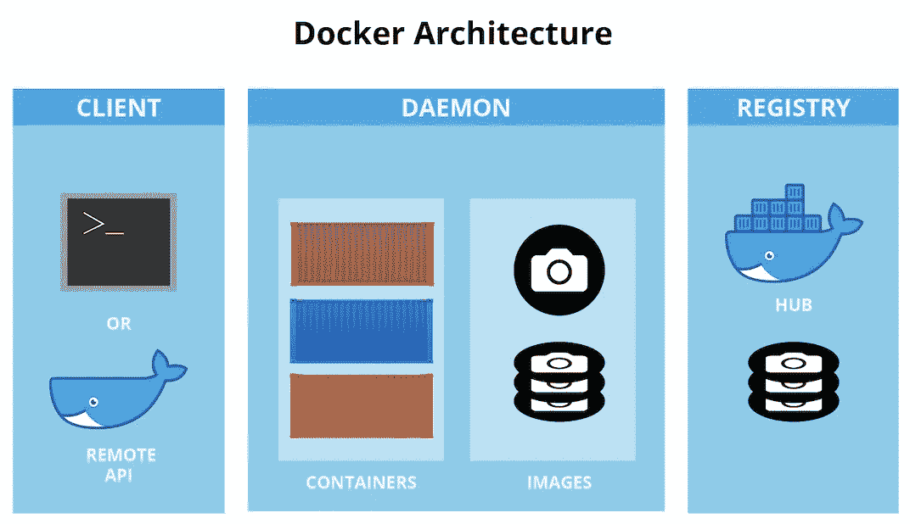
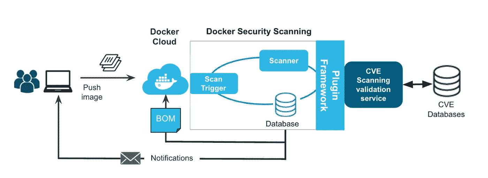
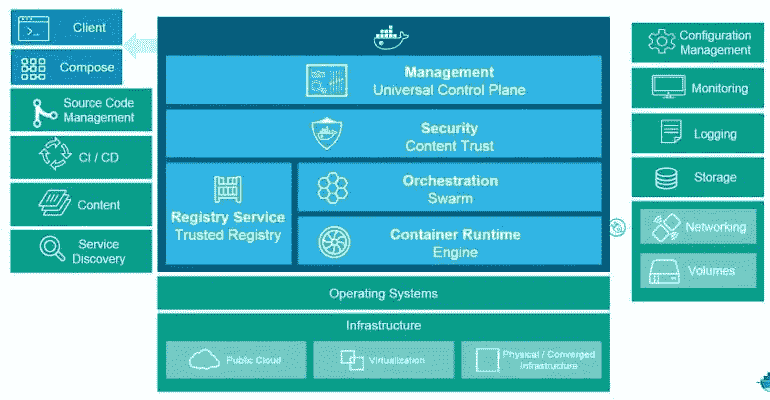

# 码头保安的一切

> 原文：<https://infosecwriteups.com/everything-about-docker-security-ceaef9612ebe?source=collection_archive---------4----------------------->


[黑客正午](https://unsplash.com/@hackernoon?utm_source=unsplash&utm_medium=referral&utm_content=creditCopyText)在 [Unsplash](https://unsplash.com/?utm_source=unsplash&utm_medium=referral&utm_content=creditCopyText) 上的照片

**Docker 是什么，为什么要使用它？**

在我们真正进入技术部分之前，让我们假设你为一家公司工作，该公司有两个部门负责服务、产品等的开发和部署。

他们被称为生产团队和运营团队。经过无数个小时的讨论和会议，最终决定了公司网站的需求。需求被发送到开发团队。现在是他们在网站上工作的时候了。正如你我所知，一个网站需要整合的特性和功能越多，需要导入的库和包就越多。假设他们在 NodeJS 上工作，有一个 express 框架，MongoDB 作为服务器。当网站最终完成时，他们会在将网站发送到运营团队之前，在开发服务器上检查网站是否运行良好，运营团队的工作是将网站部署到生产服务器上。

您是否想过，在开发服务器上实际开发网站时使用的 node、express 和其他库的版本可能与安装在生产服务器上的版本不同。

结果会怎样？当网站被部署时，它很可能会在生产服务器上抛出错误。生产服务器可能已安装了不推荐使用的库、版本、配置问题，或者开发服务器可能已安装了不推荐使用的库、版本。不管怎样，这都是一个失败的局面，因为最终的结果是网站无法安装。



[来源](https://jfrog.com/knowledge-base/the-basics-a-beginners-guide-to-docker/)

现在考虑一个不同的场景。开发团队制作网站，但现在他们不是将原始代码直接发送给运营团队，而是制作一个容器并将其保存在容器中。把这个容器看作一种沙箱。它有代码、数据库以及配置文件，团队可以安装他们想要包含在容器中的所有依赖项。现在，运营团队所要做的就是将容器连接到网络，然后运行该容器，使网站上线。简而言之，这就是 docker。所有的依赖项、工件和配置都可以保存在容器中。该容器将独立运行，不会干扰其他包和依赖项等。就像沙盒或者虚拟机一样。

**为什么 Docker 安装变得易受攻击？**



[来源](https://www.docker.com/blog/docker-security-scanning/)

容器技术并不新鲜，但对我们许多人来说却是。为了防止被对手利用，遵循最佳实践是非常必要的。

以下是 docker 安装容易受到攻击的情况。

1.  一些用户可能对最新版本一无所知，因此可能会安装过时版本的 docker 引擎和具有一些已知漏洞的底层主机操作系统，也可能会安装一些过时的依赖项..
2.  码头守护进程是任何码头的大脑和心脏。它监听 docker API 请求，创建和管理 docker 对象，如图像、容器、网络和卷。默认情况下，它归 root 用户所有。如果其他任何人获得了对套接字的访问权限，他们将拥有 root 权限，这是您永远也不想看到的。您还可以通过将守护进程绑定到网络接口来远程使用 docker 容器。
3.  在根模式下运行 docker 是团队要做的事情。当我们配置一个网站时，我们创建一个新用户，并为他分配完成日常任务所需的最低权限。我们不只是用根用户的特权来保持网站运行。但是在 docker 的情况下我们经常会忘记这一点。
4.  安装带有不必要组件的基本映像。如果您在基本映像中安装了不必要的组件和您不了解的组件，将会增加攻击面。
5.  泄露敏感信息是主要问题之一。Docker 的正常操作需要 TLS 证书、SSH 密钥、凭证等。在 docker 文件中暴露它们就像把你家的钥匙交给你的敌人一样。
6.  安装易受攻击的开源库。信不信由你。当一个特定的软件可以很容易地解决我们的问题时，我们只需点击一下按钮就可以安装它。更重要的是，它是完全免费的。但是由于他们是开源的，他们没有一个团队全天候为他们服务。因此，它们可能存在漏洞，而且许多漏洞可能无法修补。
7.  允许用户运行系统命令。您可以让用户在新安装的 docker 容器上运行系统命令。

我们能做些什么来确保安装安全？



来源:Docker

既然我们已经知道了使 docker 安装易受攻击的一些方法，那么让我们来看看使它们安全的一些方法。

1.  跟踪 docker 引擎。如果您发现可能危及您安全的漏洞，请尽快修补它。这不会让你晚上睡不着。
2.  将守护程序绑定到网络接口时要特别小心。它不仅能让你的 docker 被你远程访问，也能让你的对手远程访问。如果你必须让它可访问，使用 Docker 的加密 HTTP 套接字，因为它支持认证。
3.  API 是 docker 使用的东西，你可以通过配置 API 来保护你的容器，防止它们被公众访问。或者通过实施基于证书的认证，有可能实施加密通信。
4.  我们知道用提升的特权运行 docker 可能是有害的。Docker 提供了一种“无根模式”。要在无根模式下运行:

```
docker context use rootlessdocker run –d –p 8080:80 nginx
```

要检查容器是否在特权模式下运行，

```
docker inspect –format = ‘ ‘ [container_id]
```

如果它返回 true，那么它正在特权模式下运行。如果它抛出一个错误，它不是。

5.使用 docker 文件泄漏敏感信息会导致攻击者迅速危害您的容器。像 Kubernetes 和 Docker Swarn 这样的容器编排器提供了秘密管理功能，可以解决使用 Docker 文件泄漏敏感信息的问题。

6.尽量使用组件最少的基础映像。即使您已经安装了一些组件，很好地理解它们也是很重要的。因为如果你这样做，肯定会增加攻击面。

7.用户可以使用允许系统调用来提升权限。您可以选择允许或拒绝系统调用。此外，就像在 Linux 中一样，您可以获得使用。bash_history 文件，还可以监控系统命令的发出。

# 结论

Docker 让开发人员的开发和运营团队在生产服务器上的部署变得非常简单有效。从外面看起来可能很简单，事实也确实如此，但是忽略安全隐患可能非常容易。因此，在部署 docker 容器之前，考虑安全性问题非常重要。您可以从考虑上述安全措施开始。

## 来自 Infosec 的报道:Infosec 每天都有很多内容，很难跟上。[加入我们的每周简讯](https://weekly.infosecwriteups.com/)以 5 篇文章、4 条线索、3 个视频、2 个 GitHub Repos 和工具以及 1 个工作提醒的形式免费获取所有最新的 Infosec 趋势！