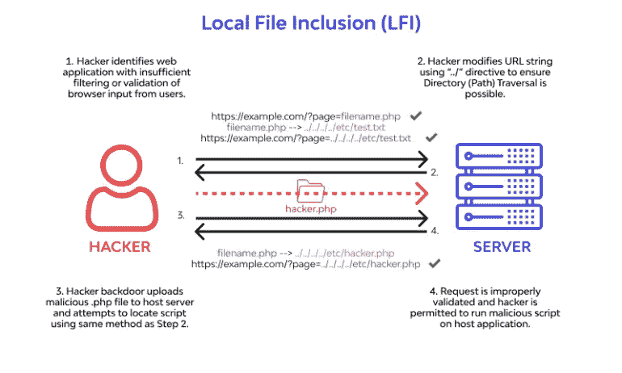
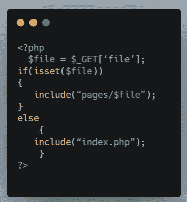
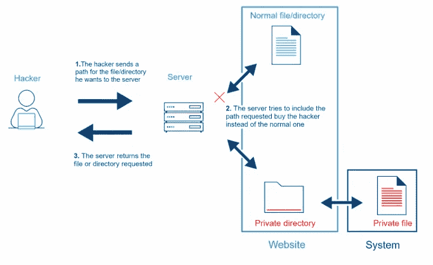

# 关于路径遍历漏洞的一切

> 原文：<https://infosecwriteups.com/everything-about-path-traversal-vulnerability-c40ba5465bc4?source=collection_archive---------1----------------------->

萨法尔·萨法罗夫在 [Unsplash](https://unsplash.com/s/photos/coding?utm_source=unsplash&utm_medium=referral&utm_content=creditCopyText) 上拍摄的照片

**简介**

网站是为不同的目的而建立的。它可以由几个到几百个静态网页组成。静态网页一个这样的例子是“关于我们”页面。你几乎可以在每个网站上找到它。开发者经常直接从目录中包含静态网页，以显示在网页上。这些可以是 pdf 文件、word 文档，甚至是标准的 php 文件和脚本。这为开发人员提供了一个非常简单的界面，因为一段代码可以用来获取大量的文件，即使有些东西发生了变化，你只需要改变文件名，没有必要更新所有的链接。我们遇到的一个特别的例子是一个包含 en.php 文件的网站，它的工作是将当前打开的页面中提供的所有文本转换成英语。如果要求他们将所有文件转换成英语和其他语言，这项任务将非常耗时。只需将文件名传递到 en.php 中，文件就会完全显示在英文翻译中。这将解决大量的时间和工作，每当开发人员未能执行适当的后端检查的文件名或网址是包括或提取的网页上，问题出现。因此，当攻击者试图包含敏感文件时，结果是不可预测的。路径遍历漏洞，也称为本地文件包含，是一种可以被利用的漏洞。

**什么是路径遍历漏洞，为什么会出现？**

[来源](https://securityboulevard.com/2021/12/what-is-local-file-inclusion-vulnerability/)

您的 web 服务器上存在一个路径遍历漏洞，使得攻击者能够访问您的 web 服务器上的文件，而这些文件在默认情况下是他们不能访问的。为此，他们欺骗 web 服务器或在其上运行的 web 应用程序返回不包含在 web 根文件夹中的文件。当没有对从服务器获取文件的参数进行验证时，这种情况最常见。考虑一下我们假设的站点 example.com 的代码片段

我们可以看到，站点需要一个名为 file 的 GET 参数，并将它的值存储在$file 变量中。如果设置了它，后端脚本将尝试从页面的目录中包含它，前提是它存在。如果未设置 file 参数；它会显示默认的 index.php 页面。

现在考虑提供的 URL:

[https://www.example.com/file?file=page1.php](https://www.example.com/file?page=file1.php)

我们可以看到，设置了 file 参数；它将提取它的值(即 page1.php)，并检查目录中是否存在具有该文件名的页面。如果是，将显示该页面。这是因为使用了 include 方法。

该脚本将尝试执行以下查询:include(pages/page1.php)

看起来一切都很完美。让我们变得狡猾一点。如果我们尝试一个包含 passwd 文件的奇特有效负载会怎么样？

【https://www.example.com/file? 文件=../../../../../../../etc/passwd

如果文件参数的值包含一对(..)，可以用来从它所在的子文件夹中转义。会有很多点点斜线(../)符号，这将指向根目录，因此我们可以包含根目录中的文件。因为我们使用了/etc/passwd 目录，所以将包含/etc 目录中的 passwd 文件。

该脚本将尝试执行以下查询:

**包括(页数/../../../../../../../etc/passwd)**

因为不涉及后端检查，所以它将包含/etc/passwd 文件的内容，并获取它们供您使用。

路径遍历漏洞的出现有多种原因

1.  使用不安全的方法包含来自服务器的文件
2.  没有应用后端过滤和验证。

**测试路径遍历漏洞**

[来源](https://www.cloudprotector.com/path-traversal/)

在我们开始测试路径遍历漏洞之前，有两件事需要考虑:

1.  接受文件名的参数。
2.  对 web 服务器进行指纹识别。

**案例 1:**

枚举接受文件名的参数

大多数在线应用程序可以被配置为接受几个参数，每个参数执行一个特定的活动或功能。很多时候，由于技术限制，您无法列出所有参数。让我们详细讨论它们。

*   接受几个参数的 web 应用程序允许您尝试猜测与每个参数相关的功能。例如，一些可用于过滤出最近的产品，其他可用于根据一组标准进行排序，等等。如果您知道哪个选项接受一个文件名，您可以试验一下，看看是否可以包含一些已经存在于 Linux 或 Windows 操作系统中的默认文件。页面、视图、文件和其他常用参数都是可以用它们来做什么的例子。
*   在某些情况下，您不能完全确定应用程序是否接受文件参数，您可以尝试暴力破解或猜测它。如果您选择暴力方法，您可以尝试像 ffuf 和 wfuzz 这样的工具。

**案例二:**

**对网络服务器进行指纹识别**

如果您发现了一个 LFI 漏洞，但无法利用它，您会怎么想？也许有白名单或黑名单，或者也许你正试图包括不适合这种情况的有效载荷。在我的分析中包含错误的有效载荷是什么意思？如果您试图包含作为 Linux 系统一部分的文件，如/etc/passwd、/etc/hosts，但实际上 web 服务器是托管在 windows 平台上的，该怎么办呢？因此，为了节省您的时间和精力，也请尝试对 web 服务器进行指纹识别。这可以通过使用 wappalyzer 之类的扩展、nikto、nmap 之类的工具，甚至通过查看响应的标题来完成。找到服务器后，您就可以使用特定于该操作系统的有效负载了。

在某些测试场景中，即使您发现了 LFI，您也可能无法利用它。在这种情况下，您可以尝试:

1.  使用 URL 编码的有效负载。举个例子，../可以变成%2e%2e%2f
2.  双重 URL 编码
3.  如果应用程序是用 PHP 开发的，就使用包装器

**整治**

仅仅因为不安全的编码实践或逻辑问题，攻击者就可以访问敏感文件，这使他更容易危害 web 应用程序。因此，实施以下补救技术非常重要:

1.  永远不要相信用户的输入。
2.  使用需要包含的文件的黑名单和白名单。大多数情况下，必须维护白名单
3.  如无必要，禁用 PHP 包装器。
4.  晶片使用可能是有帮助的。

## 来自 Infosec 的报道:Infosec 每天都有很多内容，很难跟上。[加入我们的每周简讯](https://weekly.infosecwriteups.com/)以 5 篇文章、4 个线程、3 个视频、2 个 GitHub Repos 和工具以及 1 个工作提醒的形式免费获取所有最新的 Infosec 趋势！