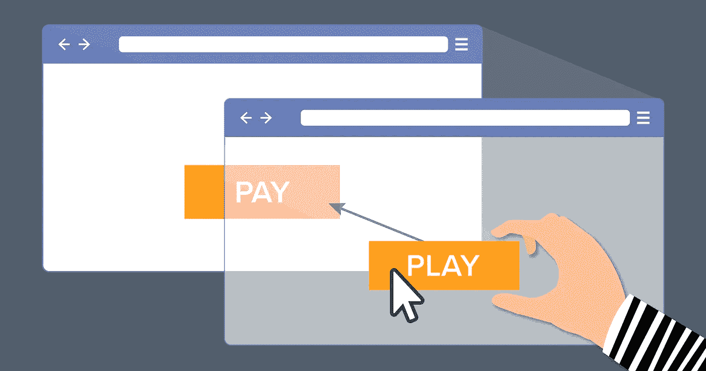
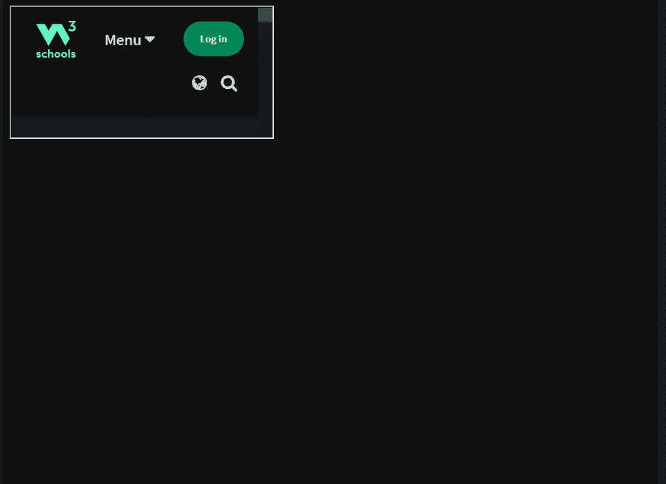
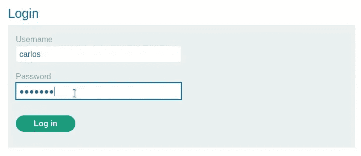
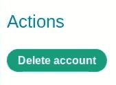
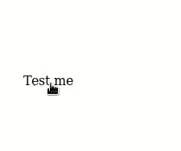

# 关于点击劫持你需要知道的一切

> 原文：<https://infosecwriteups.com/everything-you-need-to-know-about-clickjacking-a522b188f2fe?source=collection_archive---------0----------------------->

如何利用点击劫持以及如何防止点击劫持的完整指南。

[](https://securityboulevard.com/2019/08/clickjacking-attacks-what-they-are-and-how-to-prevent-them/)

大家好。

因为我最近发现了一个容易被点击劫持的网站，我想写一篇关于它的文章可能是个好主意。

所以我们系好安全带出发吧！

# 1) Iframe 标签

在进入点击劫持之前，我们需要理解什么是 iframe 标签。

看看下面的代码。

```
<!DOCTYPE html>
<html>
<body>
<iframe src="[https://www.w3schools.com](https://www.w3schools.com)"></iframe>
</body>
</html>
```

这段代码可以在这里找到: [HTML iframe 标签(w3schools.com)](https://www.w3schools.com/tags/tag_iframe.ASP)。

上面的代码非常简单。

iframe 标签所做的只是在你的页面中包含另一个页面。

让我们看看代码的结果。



如您所见，w3 站点已经包含在页面中。

简单对吗？有了 iframe 标签，你可以在你的页面中包含其他网站，太棒了！(可能吧)。

# 2)一个基本的点击劫持漏洞

那么，iframe 标签的问题是什么呢？

主要问题是 iframe 可能隐藏在某些东西后面。

你现在可能很困惑，但是不要担心，实际上这比你想象的要简单得多。

我将使用 Portswigger 实验室来演示攻击。

【portswigger.net T2 实验室:使用 CSRF 令牌保护的基本点击劫持|网络安全学院】

使用给定的凭据登录应用程序。



如果我们转到帐户操作，我们可以删除我们的帐户。



那么我们现在能做什么呢？

如果页面容易被点击劫持，我们可以隐藏 iframe，说服用户在他不知道的情况下点击我们在页面中添加的另一个按钮(或单词)。

你要做的就是把下面的代码交给受害者。

```
<!DOCTYPE html>
<html>
<body>
<style>
   iframe {
       position:relative;
       width:500px;
       height: 700px;
       opacity: 0.0001;
       z-index: 2;
   }
   div {
       position:absolute;
       top:320px;
       left:60px
       z-index: 1;
   }
</style>
<div>Test me</div>
<iframe src="Your_URL"></iframe>
</body>
</html>
```

这是代码的结果。



简而言之，上面的代码确保了编写的**测试我**文本在 iframe 页面的删除按钮上准确对齐。

我们可以从 CSS 参数中看到，iframe 具有非常低的不透明度，因此它对用户来说是不可见的。z-index 标签将确保 Portswigger 页面位于 Test me 的顶部。

更多关于 z-index [的信息请点击](https://www.freecodecamp.org/news/z-index-in-css-what-it-is-and-what-it-does/#:~:text=Z%20Index%20(%20z%2Dindex%20),%2C%20or%20position%3Afixed%20).)。

# 3)针对点击劫持的防御机制

减轻点击劫持漏洞有几种方法，我将从最不可靠到最安全的方法开始写。

1.  框架破坏。

框架破坏，这是一种客户端技术，使用 JavaScript 来避免您的页面被框架到另一个页面中。

像几乎所有的客户端技术一样，使用 iframe 标签的沙箱属性可以很容易地绕过它，例如，使用允许标签执行 JavaScript 代码的 allow-script 参数，从而绕过保护机制。

如果你想练习一下，你可以找到 Portswigger 实验室。

**2。** X-Frame 选项。

X-Frame 选项是一种服务器端技术，可以使用 X-Frame 头减轻点击劫持。
这个头可以在一个 HTTP 请求中配置 3 个参数。

*   否认。

每个 iframe 都将被阻塞。

*   同源。

Iframe 是允许的，但是只能嵌入到页面上与自身具有相同原点的框架中(例如，如果[http://example.com](http://example.com)只请求自身的 iframe，它将被允许使用它)。

*   允许从。

列入白名单的网站可以使用 iframe。

```
X-Frame-Options: deny
X-Frame-Options: sameorigin
X-Frame-Options: allow-from http://example.com
```

即使它是一种优秀的技术，但现在它已被弃用，取而代之的是 CSP。

**3。** CSP。

CSP 代表内容安全策略，是一种由网站实施的防御机制，用于防止点击劫持和其他客户端攻击，如 XSS。

它通常在 web 服务器中作为返回头来实现。

您可以使用 frame-ancestors 参数进行 clickjacking，并使用 none 选项(相当于拒绝 X-Frame)、self as sameorigin 和允许嵌入网页的网站名称。

```
Content-Security-Policy: frame-ancestors 'none'
Content-Security-Policy: frame-ancestors 'self'
Content-Security-Policy: frame-ancestors http://example.com
```

[CSP 上更多](https://portswigger.net/web-security/cross-site-scripting/content-security-policy)。

# 最后的想法。

在结束之前，我想对这个漏洞的报告做一个说明。

即使页面可以包含在 iframe 中，也不意味着它本身就是一个漏洞。

事实上，点击劫持只能在例如页面中出现表单或 XSS 漏洞时被利用。

一如既往，伙计们，谢谢你们走到最后。

下一篇文章再见。

再见。

# 🔈 🔈Infosec Writeups 正在组织其首次虚拟会议和网络活动。如果你对信息安全感兴趣，这是最酷的地方，有 16 个令人难以置信的演讲者和 10 多个小时充满力量的讨论会议。[查看更多详情并在此注册。](https://iwcon.live/)

[](https://iwcon.live/) [## IWCon2022 - Infosec 书面报告虚拟会议

### 与世界上最优秀的信息安全专家建立联系。了解网络安全专家如何取得成功。将新技能添加到您的…

iwcon.live](https://iwcon.live/)