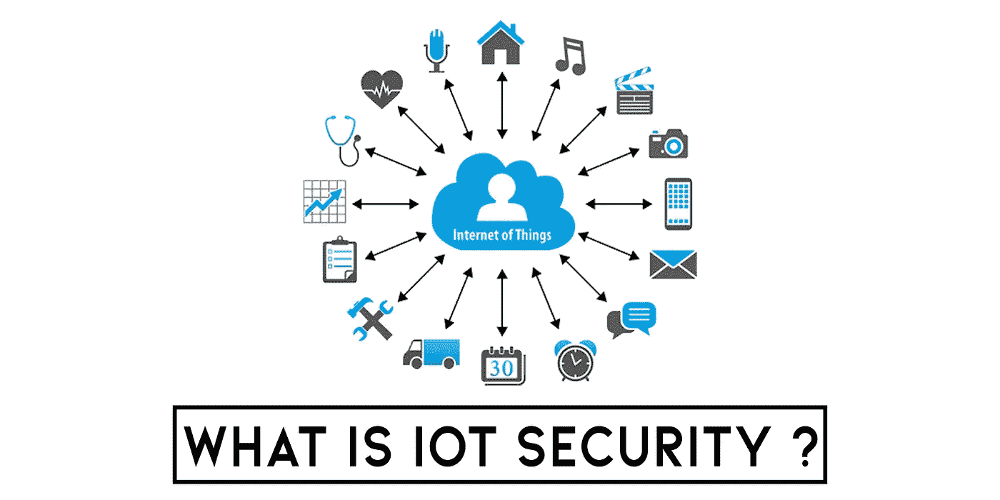
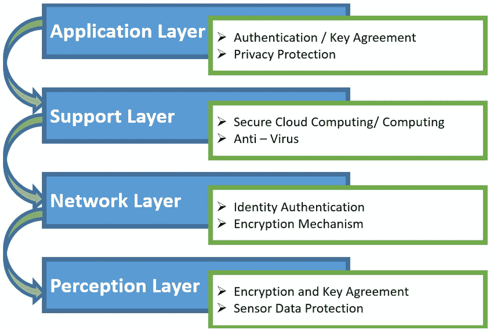

# 你想知道的关于 IOT 安全的一切！简化了的

> 原文：<https://infosecwriteups.com/everything-you-want-to-know-about-iot-security-simplified-7dca1b9e1c22?source=collection_archive---------2----------------------->

物联网是连接到互联网的设备网络，通过互联网进行控制，并可以相互交换数据。

> 物联网设备可以通过无线或有线通信直接连接到互联网，也可以使用物联网网关连接，网关的使用使我们能够更有效地收集数据，并以更安全的方式从远程用户和应用程序传输设备中的数据。

> **物联网的架构基于 5 层模型:-**

**以下是智能设备的一些来龙去脉:**

1.  网络协议栈是物联网中大多数协议的基础
2.  微控制器基础
3.  使用无线电协议的基础知识
4.  固件/编译程序的逆向工程
5.  搜索 web 漏洞
6.  利用二进制漏洞

> [OWASP 物联网设备十大漏洞-:](https://owasp.org/www-project-internet-of-things/)

10。物理安全性不足- 缺乏物理保护措施，使得潜在的攻击者能够获取机密信息，这在将来可能有助于实施远程攻击或获得对设备的本地控制。

**9。不安全的默认设置-** 设备或系统带有不安全的默认设置，或者无法通过限制用户更改配置来提高系统的安全性。

**8。无法控制设备-** 缺乏对生产中部署的设备的安全支持，包括资产管理、更新管理、安全退役、系统监控和响应。

**7。不安全的数据传输和存储-** 缺乏对生态系统中任何位置的敏感数据的加密或访问控制，包括在存储、传输或处理期间。

**6。隐私保护不足-** 存储在设备或生态系统中的用户个人信息被不安全、不当或未经许可地使用。

**5。使用不安全或过时的组件-** 使用可能危及您设备的过时或不安全的软件组件或库。这包括操作系统平台的不安全配置，以及使用来自受损供应链的第三方软件或硬件组件。

**4。缺乏安全更新机制-** 无法安全更新设备。这包括设备上缺乏固件验证、缺乏安全交付(在传输过程中没有加密)、缺乏防止回滚的机制以及缺乏关于由于更新而引起的安全变化的通知。

**3。不安全的生态系统接口-** 设备外部生态系统中不安全的 web 接口、API、云或移动接口，这些接口会危及设备或其相关组件的安全。常见的问题包括缺少身份验证或授权、缺少加密或加密很弱，以及缺少输入和输出过滤。

*   移动应用程序忽略了服务器证书的有效性。
*   web 应用程序容易受到跨站点脚本的攻击。
*   绕过云服务器上的文件是可能的。
*   设备更新不受保护。
*   设备忽略了服务器证书的有效性。

**2。不安全的网络服务-** 在设备本身上运行的不必要或不安全的网络服务，尤其是对外部网络开放的服务，会危及信息的机密性、完整性、真实性和可访问性，或允许未经授权的远程控制。

**1。脆弱、可猜测或硬编码的密码-** 使用容易破解、公开可用或不可变的凭证，包括固件或客户端软件中的后门，提供对已部署系统的未授权访问。

只要物联网的安全没有法律规定，厂商就不会额外花钱。事实证明，激励制造商的唯一方法是不要购买易受攻击的设备。

> 为此，我们需要考虑他们的安全。

# **我劝大家有兴趣的去读:**

1.  **物联网黑客手册**，Aditya Gupta——这本书详细考察了测试智能事物的每个阶段，对初学者会很有用。
2.  **物联网渗透测试食谱**，Aaron Guzman&Aditya Gupta——许多信息与第一本书交叉，但有几章专门讨论产品的安全开发和冗长测试。

*关注* [*Infosec 报道*](https://medium.com/bugbountywriteup) *获取更多此类精彩报道。*

 [## 信息安全报道

### 收集了世界上最好的黑客的文章，主题从 bug 奖金和 CTF 到 vulnhub…

medium.com](https://medium.com/bugbountywriteup)