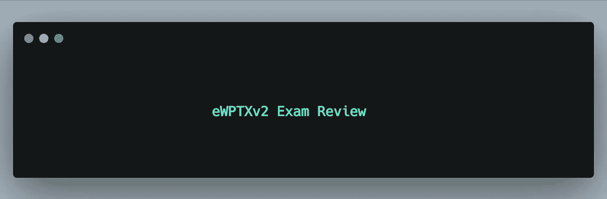
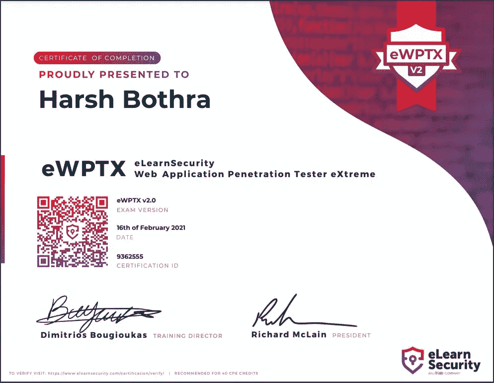

# eWPTXv2 考试复习

> 原文：<https://infosecwriteups.com/ewptxv2-exam-review-2646dd145940?source=collection_archive---------0----------------------->

Web 应用程序通常是任何组织的基础结构的一部分，并且通常是公开的，全世界都可以访问。因此，攻击者通常会考虑攻击 web 应用程序，以便在组织的网络中获得初步的立足点。从我作为 Pentester & Bug 赏金猎人的个人经验来看，你会看到 Web 应用无处不在，大多数组织都希望他们暴露的基础设施是安全和健壮的。因此，Web 应用渗透测试是 Pentesting & Bug Bounty 的核心技能之一。

我最近尝试了 eLearnSecurity 的 **eLearnSecurity Web 应用渗透测试员极限(eWPTXv2)** 认证，这是一个基于实际黑盒渗透测试的真实场景考试。

在这篇文章中，我将涵盖我对考试的详细(不带偏见的)反馈和一些需要记住的要点。**请注意，这篇评论没有得到任何人的支持/赞助，这是一篇没有偏见的诚实反馈。**

***请注意:*** *我没有带课件，因为我有 Web 应用渗透测试的工作经验。然而，对于打算尝试该认证的初学者，我强烈建议浏览课件和练习实验室。*

# **考试概述**

**考试费用:** $400(含税)——**这不包括课件和练习实验室**，只包括考试。

**优惠券有效期:**自购买之日起 6 个月

**预调度:**不需要。准备好了就开始

考试时间: 7 天考试+ 7 天报到。(从考试开始日期起 7 天后将无法访问考试环境。)

**考试时支撑线:**可用&真快。

# 考试门户概述

1.  您需要使用电子安全门户网站开始考试。
2.  在开始考试之前，请确保您的测试环境设置正确。
3.  一旦你将开始考试，你将有所有需要的测试范围，你可以连接到提供的 VPN，并开始黑客攻击。
4.  7 天之后，您将无法访问考试环境。
5.  考试结束后，您将有 7 天时间提交详细的漏洞报告。你也可以在考试的 7 天内提交一份报告。您将看到一个上传报告的选项。

# **考试总结**

1.  这个考试是一个基于真实生活场景的考试，你会看到一些你需要测试的应用程序。
2.  为了获得考试认证，我们规定了一些最低要求，您需要在确保发现其他严重问题的同时获得这些要求。
3.  我在这里感觉到的唯一缺点是考试环境不像我在 eCPPTv2 考试中发现的那样稳定。有时，您需要进行多次重置，以实现您正在尝试做的事情。这可能会让你有点困惑和沮丧，但如果你卡住了，就重置环境。
4.  24 小时内只允许 4 次重置。
5.  由于这是一个基于真实场景的考试，请确保尽可能多地发现和利用漏洞。
6.  请记住，本次考试是一次模拟渗透测试。
7.  这是一次真正具有挑战性的考试，在参加考试的同时，你会学到很多东西。
8.  您可以使用任何工具，包括但不限于 Burp Suite、自动扫描仪、Nmap、SQLMap 等。
9.  这又是一次开卷考试，因为它模拟了现实生活中的 pentest 场景。考试时你可以自由使用互联网。

**第一天:**当我开始考试时，我发现这将是一次有趣的旅程。

我做了所有的侦察和计数活动，以获得尽可能好的信息，在一天结束时，我有一些安全问题，但我无法实现任何一个考试目标。

**第二天:**开始第二天，带着一些希望找到有趣的问题，以完成考试目标。我在考试环境中遇到了一些不稳定因素，因此我花了几个小时才明白，我只需要重置几次我的机器就可以完成考试目标，到那天结束时，我已经成功完成了 50%的考试目标。

第三天:整整第三天，我连一英寸都动不了，挑战看起来真的很艰难。我从各处阅读了大量的资料，以便理解可能出了什么问题。

**Day — 4:** 我成功地完成了所有的考试目标，并开始参加所有的概念证明。开始为 pentest 报告写初稿。

**第 5 天:**完成了我的 pentest 报告，它的长度足以消耗我整个周末。

**第 6 天:**审核报告并在电子学习考试门户网站上提交。

结果是这样的:

# **考试提示**

1.  深挖是取得这个认证的关键。
2.  不要紧张，你有足够的时间。在你攻击目标的时候，休息一下，享受一下。
3.  重点关注每个漏洞类别，包括 OWASP 前 10 名，因为您将看到 OWASP 前 10 名中的几乎每个漏洞。
4.  确保您阅读并练习了他们的学习材料，尤其是如果您是 Web 应用程序的初学者。因为存在多个漏洞，需要您编写一些代码才能成功利用这些漏洞。
5.  旁路，编码和安全博客将是你整个考试的朋友。你会发现，即使是微小的变化也会让你的有效载荷发挥作用😉
6.  尽可能多地练习 eLearn 课件/课程大纲中的问题(以防你没有订阅 ine ),因为你会看到几乎所有内容，这是一次真正的极限水平考试。

# **总体反馈**

考试挑战真的很好&在更大程度上模拟现实生活中的 pentest 体验。它涵盖了几乎每一个可能的和有趣的安全漏洞，包括现代漏洞，并要求你超越自己的极限。考试本身就是一次很好的学习经历。然而，与此同时，我面临着考试环境的稳定性问题。我注意到你需要多次重置，有时才能成功利用漏洞。

总的来说，考试真的很好，我发现黑盒测试方法在课堂上是最好的。对于任何想在黑盒测试中挑战自己技能的人，我会强烈推荐这个认证。

考试部分的电子安全团队做得很好。

如果你喜欢阅读**这篇文章，请鼓掌并跟随*媒体。***

***碎碎念:***[***https://www.twitter.com/harshbothra_***](https://www.twitter.com/harshbothra_)

***领英:***[***https://www.linkedin.com/in/harshbothra***](https://www.linkedin.com/in/harshbothra)

***网址:***[***https://harshbothra . tech***](https://harshbothra.tech/)

***会谈:***[**【https://www.youtube.com/playlist?】T42list = plyn 5 _ MxRvV-fxpl 90 I-uebxqzqbxfiay 0**](https://www.youtube.com/playlist?list=PLYn5_MxRvV-fxPL90I-uebXQzQBXfIaY0)

***幻灯片:***[***https://speakerdeck.com/harshbothra***](https://speakerdeck.com/harshbothra)