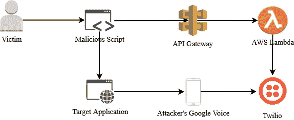

# 使用电话验证执行 CSRF

> 原文：<https://infosecwriteups.com/executing-csrf-with-phone-validation-103c525dd310?source=collection_archive---------2----------------------->

## 如何以编程方式获取 OTP

当我提交一个 Bug Bounty 程序的漏洞时，我通常会试图构建一个漏洞利用，尽可能多地自动化概念证明，以:

1.  确保 100%清楚漏洞可以做我声称的事情。
2.  简化分流团队和公司的复制——如果复制步骤需要团队简单地导航到您提供的 URL，您可以消除任何混淆。
3.  玩得开心！做东西是学习新技术的好方法。

我最近在一个 API 上发现了一个跨源资源共享(CORS)漏洞，该漏洞允许用户向他们的帐户添加电话号码。在一个相当常见的流程中，用户首先提交他们的电话号码，应用程序将向该电话号码发送一个六位数的一次性密码(OTP ),然后用户将 OTP 输入网站，以证明这确实是他们的合法电话号码。

此流程可以提供验证(通过确保用户输入他们控制的电话号码)和安全性，因为它使攻击者难以利用跨站点请求伪造(CSRF)漏洞，因为您必须进行两次不同的 API 调用，第一次调用触发的动态值(重要的是在带外交付)将在第二次提交。

我花了几个小时试图使用 AWS Pinpoint 和 Twilio long 代码(这是一个普通的 10 位美国电话号码)来接收 OTP，但没有成功，我在这一点上的假设是，有某些检查限制了这种 B2B 类型的消息传递，而不是只与实际的手机号码进行联系。

## **输入**谷歌**语音**

我使用谷歌语音已经有几年了，我事实上的标准是将所有收到的短信转发到我的个人电话号码——这是一个额外的便利，允许我通过 iOS 消息应用程序正常发送短信，而不是切换到谷歌语音应用程序。

目标应用程序向我的 Google Voice 号码发送 OTP 也没有问题，所以我开始尝试使用 Google Voice 作为应用程序和 Twilio 之间的中介。Google 需要向我的 Twilio 号码发送一个 OTP 来验证它，就像应用程序想要验证我的 Google 号码一样。使用 Twilio API，我能够获得代码并完成转发。你可以直接从谷歌支持:【https://support.google.com/voice/answer/9182115】T4 了解更多关于设置短信转发的信息。

## 体系结构

让这种利用变得现实和无缝的关键是以编程方式检索 OTP，并且要快速完成，这需要构建客户端“恶意”JavaScript 来执行 API 调用，并设置第三个由攻击者控制的 API 来检索 OTP。

基本架构如上所示，流程如下:

1.  受害者访问运行恶意脚本的网页。
2.  JavaScript 向目标应用程序发送一个带有 JSON 主体的 HTTPS POST 请求，其中包括攻击者的电话号码。这触发了预检选项请求，但最终通过回应请求来源的访问控制允许来源报头被允许。
3.  目标应用程序向攻击者的 Google Voice 号码发送一个 OTP，然后攻击者将该 SMS 转发给 Twilio。
4.  JavaScript 向攻击者的 API 发送 HTTPS GET 请求，这触发 Lambda 从 Twilio 获取代码，并在 HTTPS 响应中返回它。
5.  JavaScript 向目标应用程序发送最终的 HTTPS POST 请求，其中包含攻击者的电话号码和要验证的 OTP。

## 客户端代码

我绝不是一个 JavaScript 开发人员——相反，我可以很好地将一些东西组合在一起，让我的开发发挥作用。也就是说，实现这一点的几个关键是强制 JavaScript 阻塞并等待，以确保三个 API 调用按顺序发生，并且只在准备好的时候发生(相对于典型 JS 的异步免费)。

* *注意:客户端和服务器端代码片段都包含我使用的基本工作代码。然而，为了简单和可读性，我已经删除和更改了一些内容。如果您想要重复这项工作，请使用这些作为基线。**

我将每个 API 调用设置为一个独立的函数，只有当请求成功完成时，它才会调用下一个函数——即第一个 API 调用必须在第二个 API 调用被触发之前完成。此外，在 poll_twilio 函数中，我添加了递归来重试对攻击者 API 的调用，直到成功返回 OTP 代码——这将允许 OTP 从目标应用程序运行到 twilio，并防止在此过程中出现任何延迟时被利用。

## 服务器端代码

在 Lambda 中，代码只需要做一些事情——轮询任何消息的 Twilio，解析它们以查看是否收到了 OTP 代码，并根据结果返回适当的响应(200 或 404)。Twilio 确实提供了一个 Python SDK，但是对于这样一个简单的集成，我选择了 REST API。

我做的一些设计决定是每次都删除每条信息。如果您在现有号码上配置了转发功能，您就不能假定只有 OTP 消息会发送到 Twilio。我还想确保后续的漏洞利用实例不会试图在庞大的消息队列中进行排序，或者找到旧的、以前有效的 OTP 代码并将其作为有效代码返回。

然而，在规模上，这是行不通的。如果多个受害者同时被利用，您需要一种更好的方法来找到正确的 OTP 代码，这超出了本概念证明的范围。

## 最后的想法

虽然没有提到，但您需要熟悉 AWS API Gateway，并在 Twilio 上设置一个试用帐户来自己构建这个漏洞。我的客户端代码只是被托管在 S3，作为一个有效的空白网页，只包含脚本。

尽管这整个 POC 可能并不需要展示该漏洞，但分流团队和项目都对工作质量进行了评价。此外，其他漏洞目前通过使用 OTP 得到缓解，并且可以通过这种自动化可靠地被利用。

我在社交媒体上不太活跃，但你可以在 LinkedIn、T2、Bugcrowd 或各种安全漏洞或不和谐的服务器上找到我！