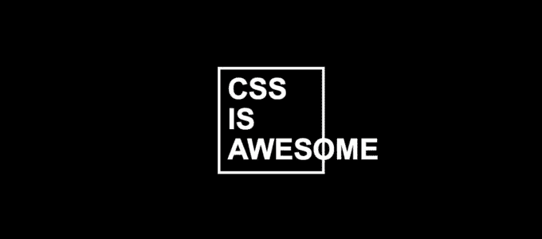
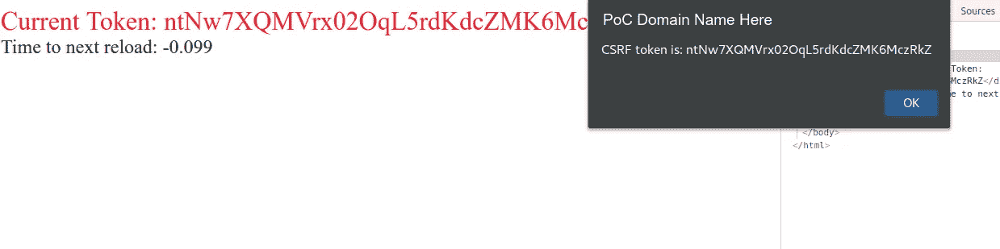

# 通过 CSS 注射渗出

> 原文：<https://infosecwriteups.com/exfiltration-via-css-injection-4e999f63097d?source=collection_archive---------0----------------------->

今天的主题是[已经](https://curesec.com/blog/article/blog/Reading-Data-via-CSS-Injection-180.html) [很好地涵盖了](http://eaea.sirdarckcat.net/cssar/v2/)的东西:CSS 注入。我想谈谈我在一个真实网站上实施这种攻击的经历。正如您可能遇到过的，您发现漏洞的情况可能不是最初描述的情况，许多漏洞最初在([类似 XSS，但有一个 WAF](https://buer.haus/2017/03/08/airbnb-when-bypassing-json-encoding-xss-filter-waf-csp-and-auditor-turns-into-eight-vulnerabilities/) )中描述。因此，写下研究人员在现实生活中遇到的经历可以为预防机制(或一般路障)的实际实施以及这些路障的旁路提供帮助。

你们中的一些人可能知道，我最近在业余时间开始研究昆虫奖金。在提供 bug 奖金的同时，我有幸与业内两位最优秀的黑客合作: [Behrouz Sadeghipour](https://medium.com/u/9a72584d6865?source=post_page-----4e999f63097d--------------------------------) 和 [Brett Buerhaus](https://twitter.com/bbuerhaus) 。当我们正在攻击不同的目标时，纳哈姆西(Benrouz)发消息给我说他们发现了一个 [CSS 注入](https://www.owasp.org/index.php/Testing_for_CSS_Injection_(OTG-CLIENT-005))但是很难利用它。

利用 CSS 注入的主要用途是从输入元素中提取数据。我们最关心的输入元素通常是 [CSRF 令牌输入元素](https://www.owasp.org/index.php/Cross-Site_Request_Forgery_(CSRF)_Prevention_Cheat_Sheet#Synchronizer_.28CSRF.29_Tokens)，因为它们通常作为`type=hidden`输入元素放在页面的表单中。这给我们带来了利用 CSS 注入的第一个问题:在 Chrome 和 Firefox 中，`input[type=hidden]`元素不能获取`background-image`URL。

一般的 css 注入数据导出方法是像下面这样使用 CSS:

然后，`attacker.com`会在`target.com`上加载带有 css 注入的 iframe。`attacker.com`然后会等待对`https://attacker.com/exfil/<data>`的请求。

我们假设令牌是`csrF`。这个 CSS 将在`[https://attacker.com/exfil/c](https://attacker.com/exfil/c.)` [上触发页面加载。](https://attacker.com/exfil/c.)然后，我们将重新加载 iframe，但使用 CSS，如下所示:

这将导致在`[https://attacker.com/exfil/cs](https://attacker.com/exfil/cs.)` [的页面加载。](https://attacker.com/exfil/cs.)最终，在重复这个模式几次后，对`[https://attacker.com/exfil/csrF](https://attacker.com/exfil/csrF)`的最终请求允许攻击者了解访问者的 CSRF 令牌。

对于我们正在查看的特定站点，幸运的是，没有指定`X-Frame-Options`，这将阻止我们使用`iframes`以简单的方式利用`css`注入(从技术上讲，你可以打开更多的标签..但那真的很丑..而且超级“吵”)。

# 问题是

好了，以上都解释清楚了，实现起来也很简单，还有什么问题呢？嗯，记住`type=hidden`输入元素实际上并不请求那些图像。事实证明，由于表单中几乎所有的 csrf 标记都是`type=hidden`，这意味着直接使用输入字段来过滤数据变得更加困难。

最初，我们研究了可以用来从页面中调用的其他方法，但是我们没有发现任何简单的方法。我们认为有另一种方式来进行攻击，但我们必须想出它。经过一些调查，我们了解到 CSS 中的`~`和`+`是[通用和相邻兄弟](https://css-tricks.com/child-and-sibling-selectors/)选择器。

同级选择器允许您获取一个共享公共父元素的元素，并基于 CSS 查询对其进行样式化。例如，假设我们有一个如下所示的页面:

使用以下 CSS:

这表示(从右向左读)“任何与`p[color=red]`同级的`p`都应该有`color: red`。

这个选择器让我们做的是说“如果任何元素紧挨着包含 CSRF 令牌的输入元素，就为它设置一个背景图像”。我们可以通过在上面的语句中类似地从右向左书写来构造一个潜在的 CSS 指令:

因为在我们的目标上存在一个表单，其中的元素不是`type=hidden`，所以我们能够让这些元素代表 CSRF 令牌元素发出请求。

为我们最近的 CSS 注入 CSRF 令牌泄漏报告编写的概念验证屏幕截图

最后，这里是我们在报告中使用的概念验证的匿名版本:[https://gist . github . com/d0nutptr/928301 BD E1 D2 aa 761d 1632628 ee8 f 24 e](https://gist.github.com/d0nutptr/928301bde1d2aa761d1632628ee8f24e)

这不包括服务器端的代码，因为大部分代码应该是显而易见的(我们让`background-image`请求在 cookie 上设置一个值；这也有好处，我们的 PoC 不能在 Safari 中工作。

# 未来

当我们最初试图利用这个漏洞时，页面上的一些表单与我们有关。一些表单*只有*包含隐藏输入。这意味着我们不能使用兄弟选择器技术，因为没有一个兄弟能够通过`background-image`为我们发出请求。

对这个问题的一些研究产生了 W3C 的`selectors-4` [草案中的](https://drafts.csswg.org/selectors-4/#relational)[后续指令](https://developer.mozilla.org/en-US/docs/Web/CSS/:has)。`:has()`允许您执行与兄弟选择器类似的查询，最大的不同是您可以从元素的父元素执行这个查询。

例如，在我们的概念证明中，我们可以写成:

它说“任何具有名称为`csrf`和值为`token`的后代输入元素的表单都应该有一个< url >的背景图像”。

显然，当所有的输入字段都是`type=hidden`时，这是可行的，并且允许更容易地利用这个问题。目前，这个特性还没有得到普遍支持([或*任何*支持](https://caniuse.com/#feat=css-has)，就此而言)，所以我们可能还需要一段时间才能将它用于 CSS 注入开发。不过，这绝对是值得注意的事情！

# 结束语

这个月的文章到此为止。下一篇文章要么是关于我将在 8 月初参加的一个活动，要么是我(re？)通过 macOS 邮件客户端发现。

说到活动和 8 月，我将于 8 月 6 日至 13 日在拉斯维加斯。在此期间，我会参加各种活动，但如果你感兴趣，我很乐意与你见面:)

下次见！