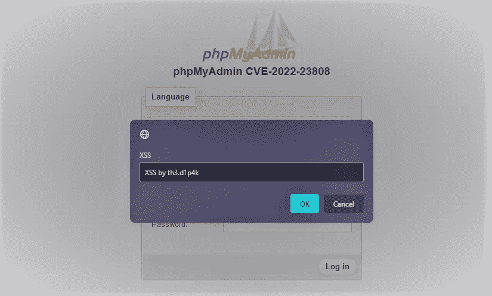

# 开发 CVE-2022–23808

> 原文：<https://infosecwriteups.com/exploit-cve-2022-23808-85041c6e5b97?source=collection_archive---------0----------------------->

H ello 网络安全爱好者！这篇文章是关于我最近指派的非常流行的数据库管理工具 CVE。所以，让我们毫不迟疑地开始吧。

# **phpMyAdmin 是什么？**

phpMyAdmin 是 MySQL 和 MariaDB 的免费开源管理工具。作为一个主要用 PHP 编写的便携式 web 应用程序，它已经成为最流行的 MySQL 管理工具之一，尤其是对于 web 托管服务。

# **如何识别？**

## 你可以通过做来识别

*   目录暴力强制(即 **/phpMyAdmin/** )
*   Nmap(端口，即 8081、9090、2086)
*   shod an(query:**http . component:phpMyAdmin**)
*   Google Dork(Inurl:/phpMyAdmin Intitle:phpMyAdmin)等。

**剥削**

 [## GitHub-dipakpanchal 456/CVE-2022-23808](https://github.com/dipakpanchal456/CVE-2022-23808) 

# 参考:

确认: [phpMyAdmin](https://www.phpmyadmin.net/security/PMASA-2022-2/)

漏洞利用: [GitHub](https://github.com/dipakpanchal456/CVE-2022-23808)

CVE:[CVE-2020–23808](https://cve.mitre.org/cgi-bin/cvename.cgi?name=CVE-2022-23808)

感谢您的阅读！😊

杰·欣德、万德·马塔兰·🇮🇳

推特:[迪帕克·潘查尔](https://twitter.com/DipakPanchal05)

Instagram: [th3.d1p4k](https://instagram.com/th3.d1p4k)

# 🔈 🔈Infosec Writeups 正在组织其首次虚拟会议和网络活动。如果你对信息安全感兴趣，这是最酷的地方，有 16 个令人难以置信的演讲者和 10 多个小时充满力量的讨论会议。查看更多详情并在此注册。

 [## IWCon2022 - Infosec 书面报告虚拟会议

### 与世界上最优秀的信息安全专家建立联系。了解网络安全专家如何取得成功。将新技能添加到您的…

iwcon.live](https://iwcon.live/)