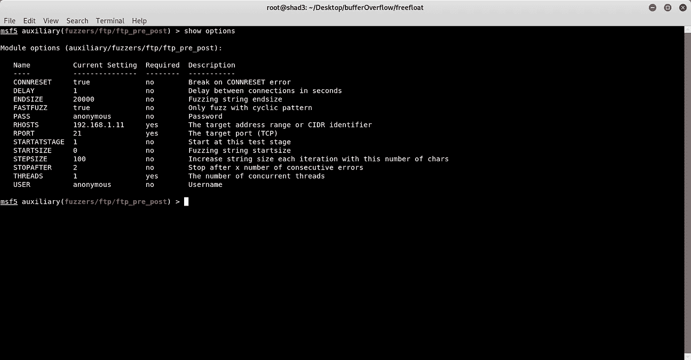
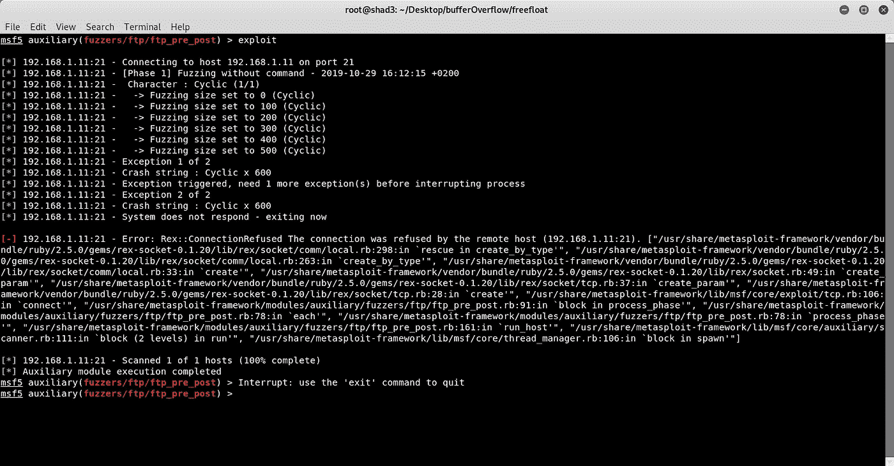
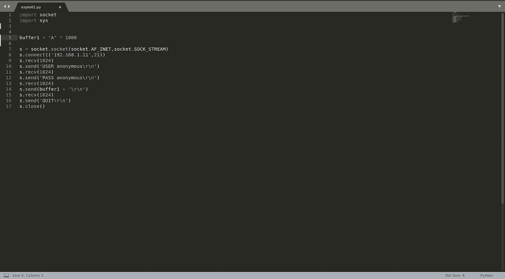
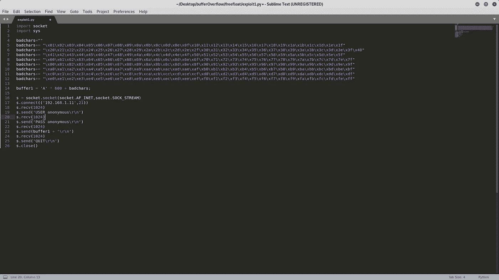
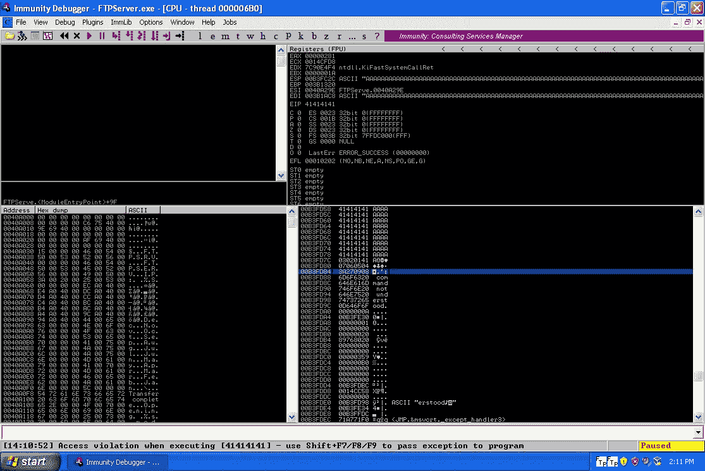
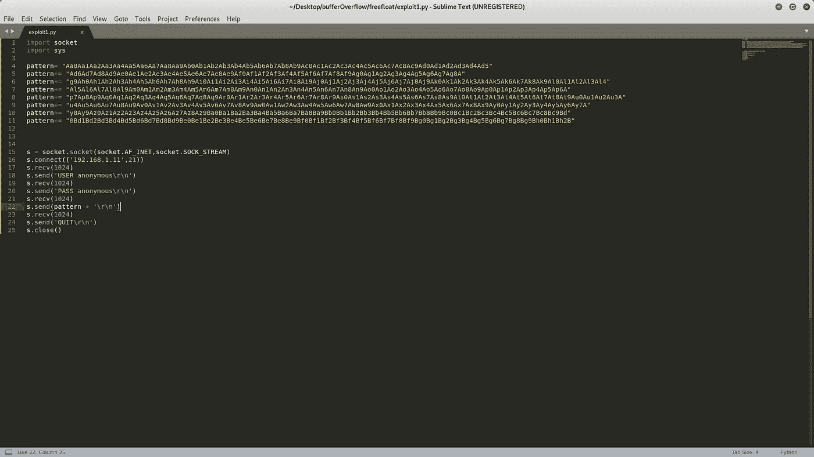
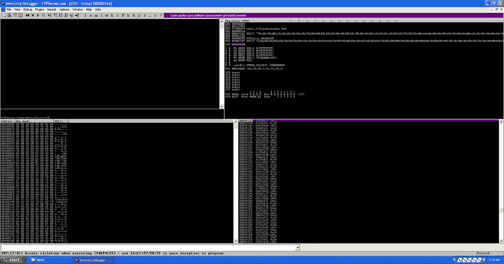
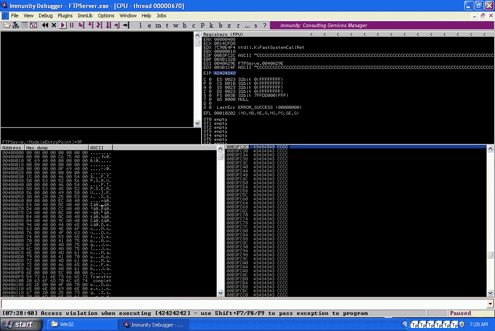
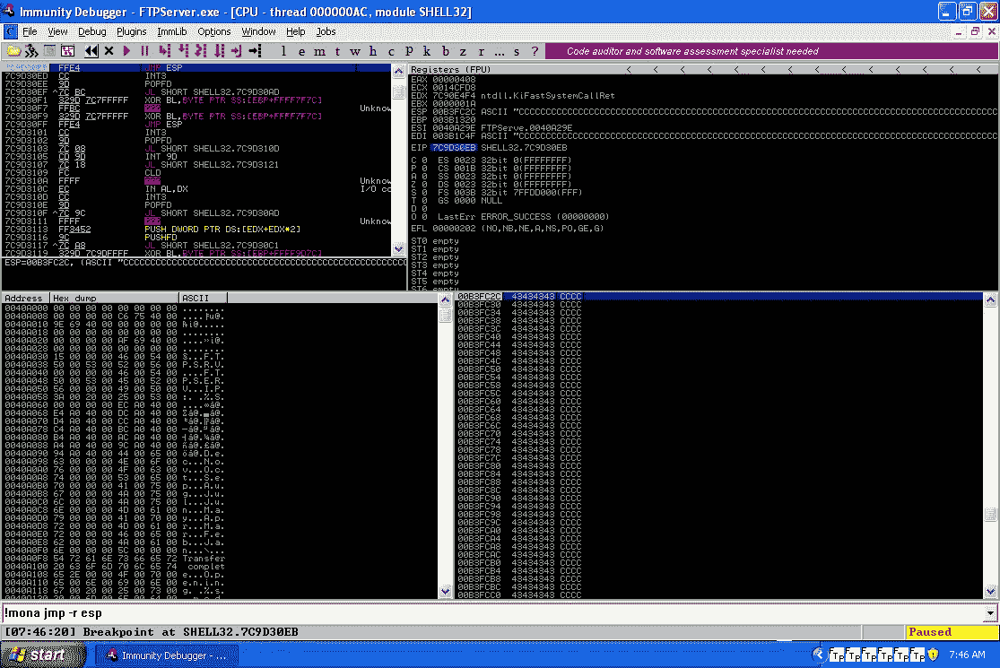
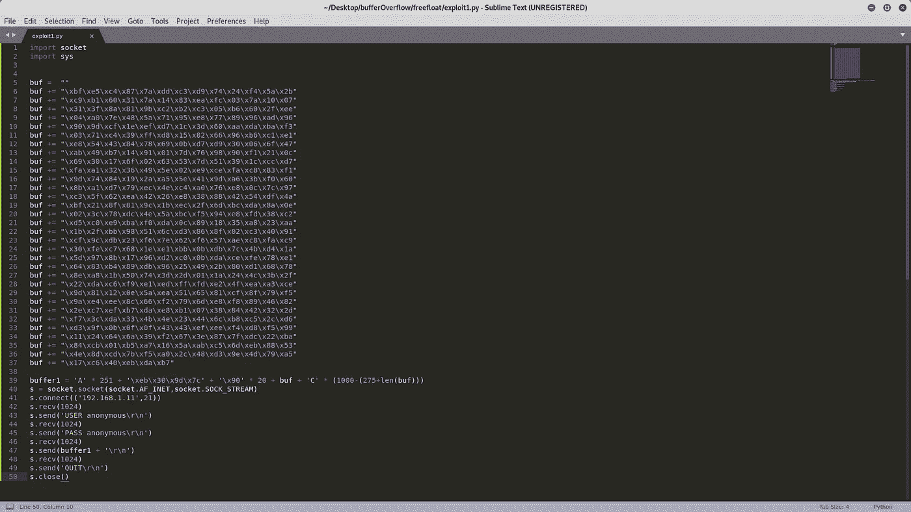

# 漏洞利用开发 101 —缓冲区溢出自由浮动 FTP

> 原文：<https://infosecwriteups.com/exploit-development-101-buffer-overflow-free-float-ftp-81ff5ce559b3?source=collection_archive---------1----------------------->

**简介**

在本教程中，我们将利用一个简单的缓冲区溢出漏洞，从头开始编写我们自己的漏洞利用程序，这将导致一个外壳，让我们能够管理我们要攻击的机器。因此，我们将遵循一种通用的方法，这种方法几乎适用于任何伴随着开发的二进制开发过程。我们将使用的实验设置非常简单，一个主机 Linux 环境(最好是针对安全专业人员的发行版，如 Kali Linux 或 Parrot OS ),尽管它也可以使用任何版本的 Windows 和运行 Windows XP SP3 的虚拟机。尽管 Windows XP 是一个没有支持的旧操作系统，但开发以下漏洞利用所使用的原则是进入漏洞利用开发世界的人所需要的最低要求。在我们的虚拟机中，我们必须安装 Python 2.7，一个调试器，例如免疫调试器，用于调试器的 mona.py 模块，当然还有易受攻击的软件，即自由浮动 FTP 服务器。Free Float FTP 是一个不再使用的服务器，因为正如你将看到的，利用它太容易了。

# ***准备，稳，集合，出发！***

在本文末尾，您可以找到本实验所需的所有资源。

请注意:

主机的本地 IP: 192.168.1.10

虚拟机的本地 IP: 192.168.1.11 —桥接模式下的网络适配器

如果您选择遵循本教程，您的主机和虚拟机的本地 IP 可能会有所不同。

# **起毛**

当我们试图闯入某个系统时，我们必须发现该系统是否存在漏洞。这就是模糊化过程的作用。我们发送越来越大的缓冲区，直到服务器端的程序崩溃。我们可以通过多种方式做到这一点，例如通过编写一个简单的(python？)脚本或使用 SPIKE 命令语言(。spk 文件)或使用 metasploit。我将使用 metasploit 的框架模块模糊程序。你可以选择你喜欢的那个:

*用 python 起毛*

 [## 0x3 Python 教程:Fuzzer

### 这篇博客文章将展示如何利用 Python 创建一个定制的 fuzzer 脚本。执行剥削时…

www.primalsecurity.net](http://www.primalsecurity.net/0x3-python-tutorial-fuzzer/) 

用长钉起毛

 [## 用长钉使服务器变模糊

### Spike 是一个向应用程序发送精心制作的包以使其崩溃的程序。包装可以是…

sh3llc0d3r.com](http://sh3llc0d3r.com/vulnserver-fuzzing-with-spike/) 

使用 metasploit 框架模糊服务器！

# **再撞一次！**

到目前为止一切顺利！我们让程序崩溃了，这意味着我们发现它可能存在一种缓冲区溢出漏洞。现在，让我们复制崩溃。正如我们之前看到的，在大约 600 字节的缓冲区时，程序会崩溃，所以这是我们需要发送的最小缓冲区大小。下面你可以找到发送缓冲区的脚本，通过一步一步修改这个脚本，我们将建立我们的漏洞。重新运行 FreeFloatFTP，将其连接到免疫调试器(CTRL+F1 并选择 FreeFloatFTP)，按 F9 运行服务器，我们准备再次崩溃它，我们将重复这个过程几次。通过运行我们在主机上创建的脚本，我们发现在虚拟机上程序再次崩溃，用 A(十六进制的\x41)覆盖了 EIP 寄存器。

# **巴德查尔！**

当我们开发一个漏洞时，在某些情况下至关重要的一个好的实践是找到 badchars。这些是导致记忆行为怪异的字符。实际上，这些字符对程序有特定的意义。一个非常常见的坏字符是臭名昭著的空字节' \x00 '，它会导致程序立即终止，所以我们立即将其从进程中排除。总的想法是，我们修改我们的脚本，将所有可能的十六进制字节从' \x01 '发送到' \xff '，我们将在调试器上手动检查哪个字节后内存充满垃圾，然后我们将知道在那个字节后是一个坏字符，重新发送缓冲区，再次检查，等等。这是一个相当痛苦的过程，但正如我提到的，它对漏洞利用的工作至关重要。

列出所有可能的十六进制字节:

 [## 用免疫调试器和 Mona.py 查找不良字符

### 在我的书中关于利用开发的章节中，我注意到寻找坏角色超出了…

bulbsecurity.com](https://bulbsecurity.com/finding-bad-characters-with-immunity-debugger-and-mona-py/) 

我们修改后的脚本采用以下形式:

将所有可能的十六进制值从' \x01 '发送到' \xFF '的脚本

正如我们在上面的截图中看到的，十六进制值为 **'\x0A'** 的字节是一个坏字符，因为它在内存中正常传递的最后一个字节是十六进制值为 **'\x09'** 的字节，请记住，WinXP_SP3 的架构是 x86_32 little endian，这意味着我们从右向左读取内存中的字节。通过重复这个过程，我们找到另一个 badchar **'\x0D'** 。最后，我们必须从漏洞利用表单中排除的 badchars 列表如下:

\x00\x0A\x0D '

# **寻找偏移量**

下一步是获得对 EIP 寄存器的控制，我们希望在那里设置一个 JMP ESP 命令，该命令将程序的执行分支到我们稍后将生成的外壳代码。首先，为了找到覆盖 EIP 的位置，我们必须生成一个字符串模式，这样在我们的虚拟机上，我们将能够识别 EIP 在字符串的哪个部分被覆盖。我们将使用 Metasploit 框架的 pattern_create 和 pattern_offset 模块，或者有许多在线网站可以完成这项工作。

*root @ shad 3:~/Desktop/buffer overflow/free float #/usr/share/metasploit-framework/tools/exploit/pattern _ create . r b-l 1000*

编辑脚本并发送！下面可以清楚地看到，EIP 已经被 **'\x34\x69\x41\x33'** 的值覆盖。

使用下面的命令，我们在 251 个字节中找到一个精确的匹配！！

*root @ shad 3:~/Desktop/buffer overflow/free float #/usr/share/metasploit-framework/tools/exploit/pattern _ offset . r b-q 34694133*

现在我们知道，我们将 251 字节的 EIP 覆盖到字符串缓冲区中。从逻辑上考虑，如果我们发送一个如下构造的缓冲区，我们应该能够用 B 覆盖 EIP

缓冲区结构:[A * 251]+[B * 4]+[C…很多]

再次修改脚本发送！

我们用\x42 * 4 覆盖了 EIP！

# **mona.py！**

mona.py 模块派上用场的时候到了。现在，我们需要在内存中找到一个调用 JMP ESP 命令的地址，我们将使用该地址来覆盖 EIP，这样在下一步中，我们将能够跳转到 ESP，执行 NOP sled，并最终执行我们的外壳代码。执行以下豁免命令:

！mona jmp -r esp

这将给你一个这个命令被执行的所有地址的列表。选择一个你喜欢的，例如 7C9D30EB，重新运行程序，并设置一个断点(F2)。修改脚本，用上述地址的十六进制值替换 B，并运行它(**注意:**您必须以 little endian '\xeb\x30\x9d\x7c ')的格式书写地址。之后，你通常应该点击如下所示的断点。

我们碰到断点了！

# **外壳代码**

是时候扔了！唯一剩下的就是，生成一个外壳代码，打开一个端口让我们连接。为了生成外壳代码，我们将使用 msfvenom:

root @ shad 3:~/Desktop/buffer overflow/free float # MSF venom-p windows/shell _ bind _ TCP LPORT = 1337-e x86/shikata _ ga _ nai-b ' \ x00 \ x0A \ x0D '-I 3-f python

将外壳代码添加到您的 POC 漏洞利用中，发送它并使用以下命令连接机器:

*nc -nv 192.168.1.11 1337*

就这样了！！我们找到弹壳了！！

# **最终想法**

这可能是一个重复的过程，因为您必须多次重启 FTP 服务器。这也需要非常小心，你可以用不同的方式破坏整个漏洞，但这是值得的。这并不是说你在本教程结束后就能写出缓冲区溢出漏洞，但你已经离这一目标更近了一步。感谢阅读，鼓掌会有所帮助，因为这是我第一次尝试写一个漏洞开发教程。

**类似漏洞利用教程**

 [## FuzzySecurity | ExploitDev:第 2 部分

### 好了，到目前为止一切顺利，当我们将调试器连接到 FTP 服务器并发送 POC 缓冲区时，程序崩溃了。在…

www.fuzzysecurity.com](https://www.fuzzysecurity.com/tutorials/expDev/2.html)  [## 基于 Windows 的攻击—VulnServer TRUN 命令缓冲区溢出

### 使用 IDA Pro 反转并用 Python 注入外壳代码

medium.com](https://medium.com/bugbountywriteup/windows-based-exploitation-vulnserver-trun-command-buffer-overflow-707faa669b4c) 

# **资源:**

抗干扰调试器:

 [## 抗干扰调试器

### 下载此处下载免疫调试器！概述具有专门为安全设计的功能的调试器…

www.immunityinc.com](https://www.immunityinc.com/products/debugger/) 

mona.py:

 [## 科勒兰/莫娜

### 通过在 GitHub 上创建一个帐户，为 corelan/mona 开发做出贡献。

github.com](https://github.com/corelan/mona) 

自由浮动 FTP:

 [## 自由浮动 FTP 服务器:http://freefloat.com/ftpserver:免费下载，借用，和流…

### 这是一个功能齐全的 FTP 服务器为您的 PDA。它不需要用户验证。

archive.org](https://archive.org/details/tucows_367516_Freefloat_FTP_Server)