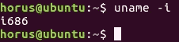
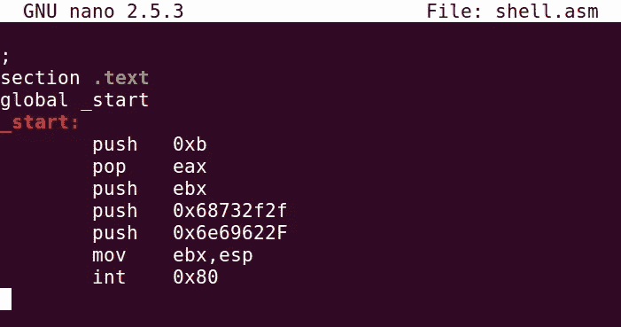
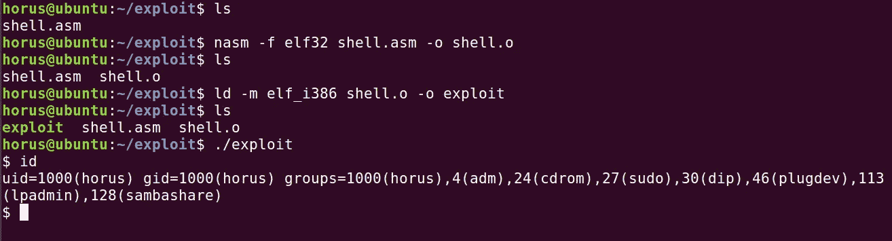
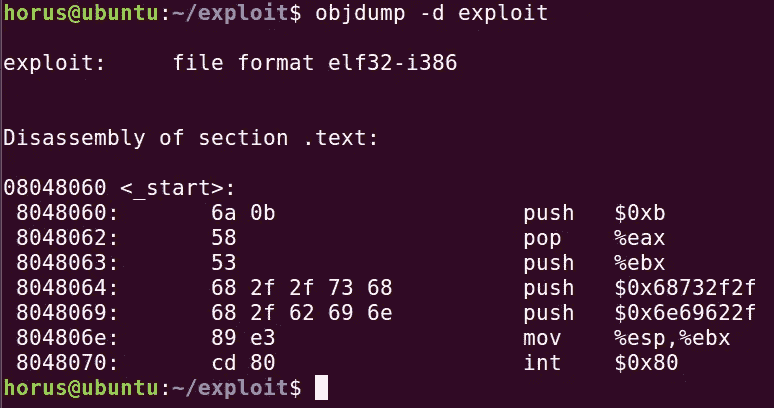
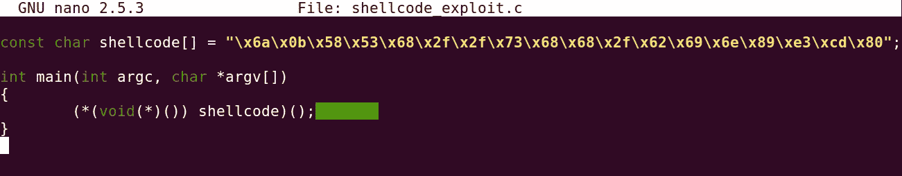
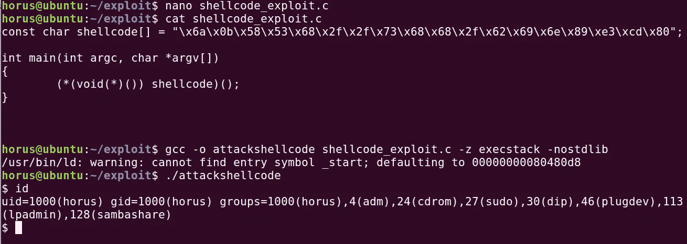

# 利用外壳代码

> 原文：<https://infosecwriteups.com/exploitation-with-shellcode-23470cd2aa55?source=collection_archive---------2----------------------->


外壳代码是执行特定操作的一段代码

外壳代码是用 ASM 编写的

外壳代码是特定于架构的，因此它在不同的处理器类型之间是不可移植的

外壳代码通常被编写来直接操作处理器寄存器，以便为使用操作码进行的各种系统调用设置它们

当编写了 ASM 代码来执行所需的操作时，必须将它转换为机器码，并且不包含任何“空字节”，因为它必须不包含任何空字节，因为许多字符串运算符(如 strcpy()在遇到它们时会终止

# 系统调用(SYSCALL)

系统调用(通常缩写为 syscall)是一种编程方式，在这种方式下，计算机程序从执行它的操作系统的内核请求服务

系统调用在进程和操作系统之间提供了一个重要的接口

系统调用只能从用户空间进程进行

特权系统代码也发出系统调用

中断会自动将 CPU 置于某个提升的特权级别，然后将控制权交给内核，由内核决定是否授予调用程序所请求的服务。如果服务被授予，内核执行一组调用程序不能直接控制的特定指令，将特权级别返回给调用程序，然后将控制权返回给调用程序。

系统调用提供了一种方法来管理与硬件的通信以及内核提供的功能，这些功能可能不包括在应用程序的地址空间中

大多数系统使用环级别(通常为 4 个特权级别)来提供安全性和保护，防止应用程序直接访问硬件和某些系统功能

用户级程序要访问其地址空间之外的函数，如 setuid()，它必须识别所需函数的系统调用号，然后发送中断 0x80 (int 0x80)

## 注意

```
The instruction 'int 0x80/syscall' is an assembly instruction that invokes system calls on most *NIX OSs
```

## 为什么是 SYSCALL？

进入内核可以使用硬件中断、硬件陷阱和软件启动陷阱

我们不能触发和使用硬件相关的中断和陷阱

所以让我们使用“软件启动的陷阱”来进入内核模式

系统调用是软件启动陷阱的一个特例。用于启动系统调用的机器指令通常会导致一个由内核专门处理的硬件陷阱

在 Linux 中，系统调用是使用

```
lcall7/lcall27 gates (lcall7_func)

int0x80 (software interrupt)
```

## 工作流程

要执行系统调用，需要两个或更多参数

“系统调用号”被载入“EAX 寄存器”

需要通过系统调用传递的参数按照系统调用表的顺序存储在寄存器 EBX、ECX 和 EDX(32 位)中

在 64 位的情况下，QWORD 寄存器和 R8-R15 寄存器用于存储参数

# 为 SYSCALL 生成示例 ASM 代码

## 示例 1

让我们通过 ASM 使用 syscall 来触发 exit(0)

```
mov eax,1
mov ebx,0
int 0x80
```

这里 EAX 装载了 1，所以它得到的 syscall 值为 1

syscall _ value = 1—--> syscall = sys _ exit()

值 0 被加载到 EBX 中，以便它可以用作 syscall 的参数

int 0x80 用于触发中断并执行 syscall

## 示例 2

使用 execve()生成一个“sh”shell

```
mov eax,0x0         //initialization
push edx            //nullbyte to terminate string (0x0)
push 0x68732f2f     //4bytes needed (//sh)['//' is same as '/'] 
push 0x6e69622f     //4bytes needed (/bin) little endian
mov ebx, esp        //moving SP into EBX
push edx            //pushing EDX into stack (0x0)
push esp            // ESP above EDX in stack
mov ecx, esp        // ESP stored in ECX for argv
mov eax, 0x0b       //loading eax with syscall value for execve()
int 0x80            //calling syscall to perform interrupt
```

# 关于 SYSCALL 的更多信息

在终端中键入以下命令

```
man syscall
man 'syscall(2)'
```

另外，请参考此[表](https://chromium.googlesource.com/chromiumos/docs/+/master/constants/syscalls.md)了解每个架构的更多 syscall 值

# 空字节 0x00

# 空字节的影响

依赖 strcpy()等字符串操作符将数据复制到缓冲区的函数，当这些函数遇到 0x00 等空字节时，它们会将其转换为字符串终止符。这当然会导致我们的外壳代码失败

# 空字节的原因

汇编指令导致空字节驻留在外壳代码中

寄存器初始化不正确

# 删除空字节

## 类型 1

假设您使用的是寄存器 EAX(32 位/4 字节)

当你试图在 EAX(32 位)中存储一个小数值时

```
mov eax,0x10
```

您可以使用 AX(16 位)来存储这些小值(基于大小)

低位寄存器 AL(8 位)用值填充，高位寄存器 AH(8 位)用空值填充

当将其转换为外壳代码时，这会导致空字节

代替在整个寄存器中加载小值，

我们可以用它的一半

```
mov al,0x10
```

## 类型 2

在这种情况下，我们需要将 0 作为参数传递给 syscall

在这种情况下，我们不能将 0 加载到寄存器中，因为它可能会在外壳代码中创建空字节

为了克服这一点，我们可以在寄存器中存储任意值，

我们可以对寄存器进行异或运算

```
mov ebx,0x10
xor ebx,ebx
```

这是最好的方法，因为它不会影响 EFLAGS 寄存器

## 类型 3 —我们可以对寄存器进行 SUB

```
mov ebx,0x10
sub ebx,ebx
```

## 类型 4 — INC 或 DEC 寄存器

将计数值存储在 ECX

执行 INC(递增)和 DEC(递减)

```
inc ebx
dec edx
```

## 类型 5 —从另一个寄存器移动 0

假设 0x00 在 EDX

加载 EBX 中的值并防止空字节

```
mov ebx,edx
```

# 生成外壳代码

让我们假设一个场景，我们想要从一个攻击媒介调用/产生一个 shell

要打开外壳，我们需要执行外壳代码

让我们修正一下，我们需要生成“/bin/sh”

让我们复制这个[执行外壳代码](https://www.exploit-db.com/exploits/44321)

# 公共代码结构

利用 C 程序执行外壳代码的常见代码结构是

```
char shellcode[] = "SHELLCODE HERE";
            int main(int argc, char **argv){
                int (*attack)();
                attack = (int (*)())shellcode;
                (int)(*attack)();
            }
```

运筹学

```
char shellcode[] = "SHELLCODE HERE";
            int main(int argc, char **argv){
                    ((int (*)())shellcode)();
            }
```

# 剥削

在我们攻击之前，我们需要检查受害者机器的架构



让我们在编辑器中编写 ASM 代码脚本来处理它



现在，让我们测试从 ASM 代码生成的漏洞



运行“objdump”以查看每个 ASM 指令的十六进制值，从而创建外壳代码



这是我们利用的外壳代码

复制外壳代码并将其嵌入到另一个脚本中，以便它可以在可执行内存中运行



用“-z execstack”和“-nostdlib”编译源代码，以避免“分段错误”，并允许二进制文件在可执行内存中运行



# 剥削结束了

## GitHub Repo 中提供了漏洞利用示例

## [aiden peace 369](https://github.com/AidenPearce369/ExploitDev)