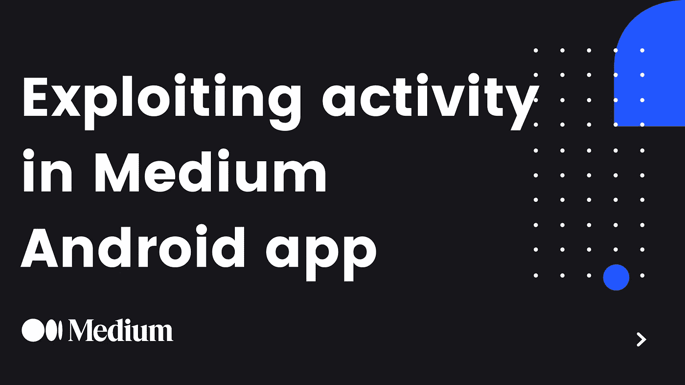
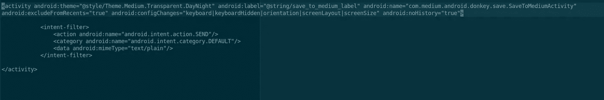
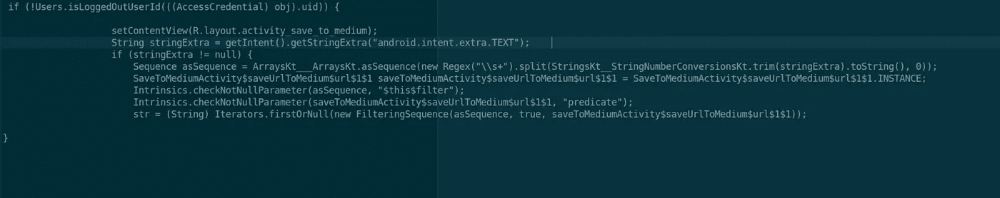
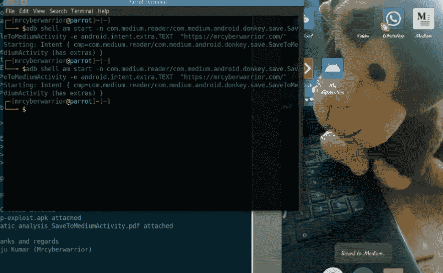
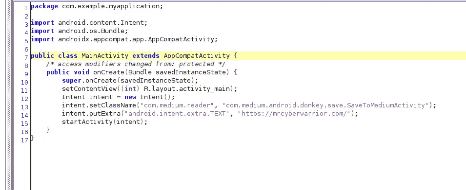

# 利用中型 android 应用中的活动

> 原文：<https://infosecwriteups.com/exploiting-activity-in-medium-android-app-e2e6f3553eef?source=collection_archive---------3----------------------->

朋友们好，我是拉朱·库马尔，又名赛博战士先生。让我们来看看这个故事，我在网络和 android 应用程序中发现了漏洞，但网络漏洞尚未修复，所以在这里我将讨论在 Andriod 应用程序 ie 中发现的一个错误。剥削活动。如果你已经了解了 jadx-gui，并且对 android 应用有一个基本的概念，可以跳过第一节，直接阅读漏洞的检测和利用。

**jadx:** 它是一个命令行和 GUI 工具，用于从 Android Dex 和 apk 文件生成 Java 源代码。

**AndroidManifest.xml:** 每个应用程序都必须有一个 AndroidManifest.xml 文件，它包含关于你的包的信息，包括应用程序的组件，如活动、服务、广播接收器、内容提供商等。

**活动:**Android 活动是 Android 应用程序用户界面的一个屏幕。它是在 androidmanifest.xml 文件中定义的。

有关更多信息，请查看开发者指南[https://developer.android.com/guide/](https://developer.android.com/guide/)

# **漏洞的检测和利用**

我使用 jadx-gui 反编译应用程序，然后查看 AndriodManifest.xml 文件。我发现 SaveToMediumActivity 是一个导出的活动。这意味着它可以由安装在同一台设备上的任意应用程序启动。

(点击图像进行缩放)

让我们跳到 SaveToMediumActivity 的代码中，开始分析静态代码及其功能。

(点击图像进行缩放)

通过使用这个应用程序，我发现媒体上发布的每篇文章都有一个保存按钮，一旦用户点击保存按钮，文章就会被添加到用户保存列表中。作为一个攻击者，我只是想把我自己没有在媒体上发表的文章保存到受害者保存列表中。

正如您在上面的代码中看到的，它将文章保存在保存列表中。这里存在漏洞。攻击者提供的 URL 通过 getIntent()加载。getstring extra(" Android . intent . extra . text ")

让我们利用亚行来利用这一点

ADB shell am start-n com . medium . reader/com . medium . Android . donkey . save . savetomediumactivity-e Android . intent . extra . text " https://attack . com "

Java 开发代码的概念验证；

我用上面的代码创建了一个应用程序，让我们利用它。

感谢阅读。

报告错误:2020 年 9 月 29 日

Bug 修复，悬赏:2020 年 10 月 2 日

如有疑问，可以在 [Twitter](https://twitter.com/mrcyberwarrior) 上 DM。随时欢迎反馈。

黑客快乐:)