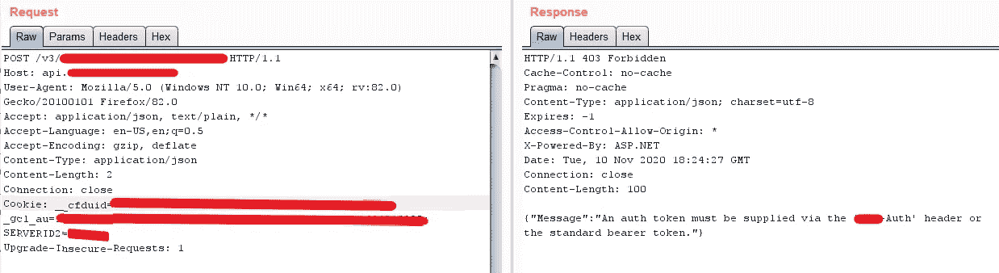
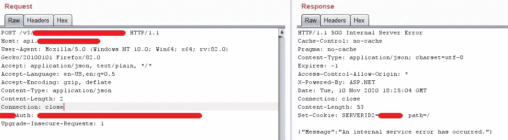

# 利用 AuthToken 开发 API

> 原文：<https://infosecwriteups.com/exploiting-api-with-authtoken-3bea7b1fb6a9?source=collection_archive---------1----------------------->

大家好，研究员们，

我自己，**拉菲阿哈迈德**。我是来自孟加拉国的网络安全研究员。我喜欢以不同的方式做事。无论如何，事不宜迟，让我们进入今天的主题。

**今天的主题是关于使用 AuthToken 开发 API 端点。不是找一个。**

我们中的许多人在侦察过程中发现了 **AuthToken** ，但是由于不能显示任何影响，这个重要的发现经常被拒绝。我自己也被拒绝了几次。

# 什么是 API？

> API 是应用程序编程接口的首字母缩写，它是一个软件中介，允许两个应用程序相互通信。每次你使用脸书这样的应用程序，发送即时消息，或者在手机上查看天气，你都在使用 API。

# 假设

让我们假设您在侦察过程中发现了任何用户的 AuthToken 或 API token。简单的汇报会给你一个 ***在大多数情况下不适用*** 。

# 通过 AuthToken 利用 API

最近我在 **Bugcrowd** 中测试了一个私人程序，在我的侦察过程中，我发现了一个 **AuthToken** ，你总能得到它。但是最难的是利用它。首先，程序没有提供任何 ***凭证*** 进行测试，也没有办法让 ***注册*** 。所以，我不知道他们的基础设施实际上是如何工作的。

在我的侦察中，我发现的令牌是一个 **AuthToken** (写在代码中)，它可以替代 API 用于认证的**认证载体**令牌。现在，我得到了一个提示，这个令牌更像是一个 API 令牌。但我不知道他们的 API 基础设施是如何工作的，因为我无法访问任何用户帐户或任何东西。所以，我放弃了。

接下来，当我测试另一个 web 应用程序时，我在更新用户信息时看到一个 API 调用。我想也许我可以用这个 API 调用来利用昨天的调用。因此，我使用**打嗝**将该请求发送给**中继器**。用我在侦察过程中发现的一个端点更改了主机&请求端点。这给了我如下的回应:

我得了 **403 禁**。但这给了我们一些信息，什么头丢失了。然后，我添加了使用响应显示的**头名称**获得的令牌。这给了我如下的回应:

**500 内部服务器错误！！**

这意味着我和 API 有联系。如您所见，该请求是一个 POST 请求，请求中没有 POST 数据。这就是应用程序显示 **500 内部服务器错误的原因。**然后我又侦察了一下&得到了一些可以用来测试端点的 POST 数据。我添加了帖子数据，再次发送请求，看到回复时我震惊了。

我得到了 100 个客户的数据。那一刻我就像爆炸了🤯

> *我很快向****bug crowd****&举报了这个 bug，并被归类为****【P1】****以及一笔可观的 4 位数赏金。*

**报道:**11 月 10 日。

**不适用**:11 月 13 日。

**三月:**十一月十三日。

**已解决:**11 月 14 日。

希望你们喜欢这个。如有任何问题，请随时联系我，电话:****或 [**LinkedIn**](https://www.linkedin.com/in/rafi-ahamed) 。****