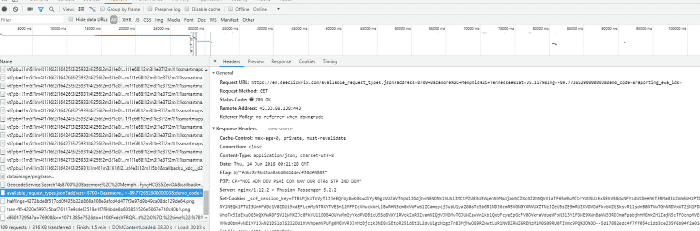
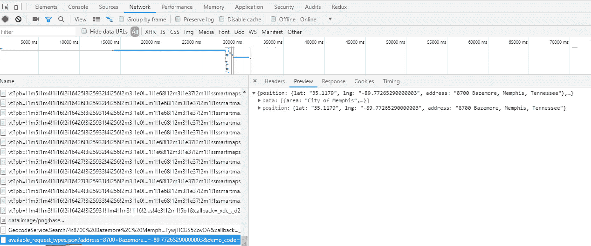
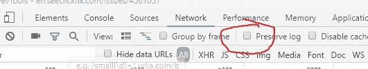
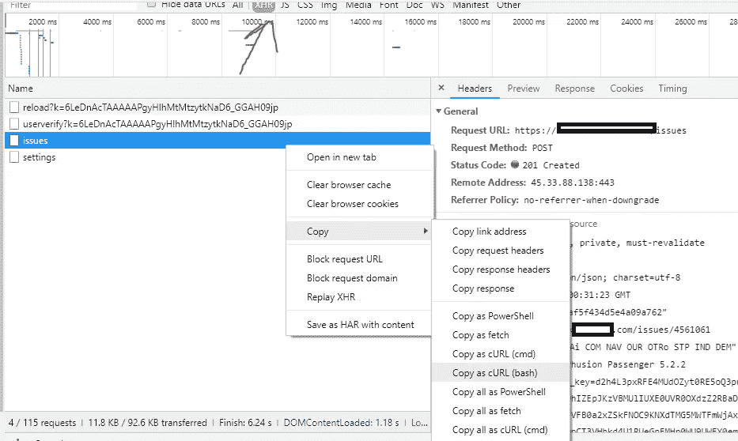
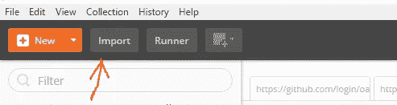
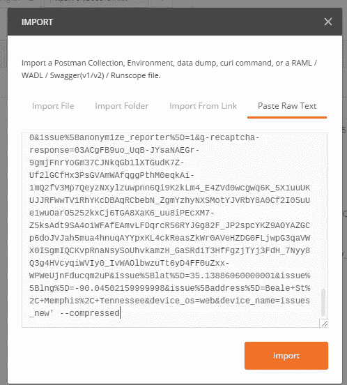
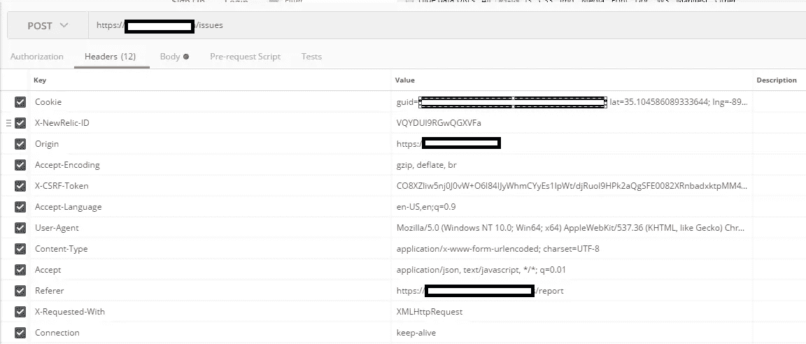
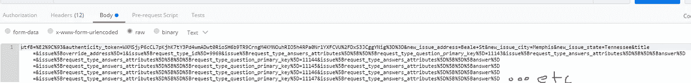
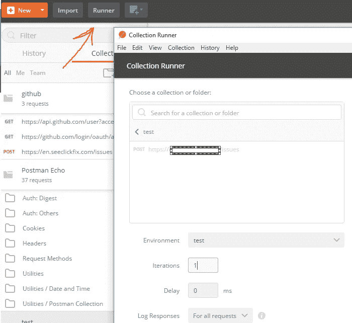
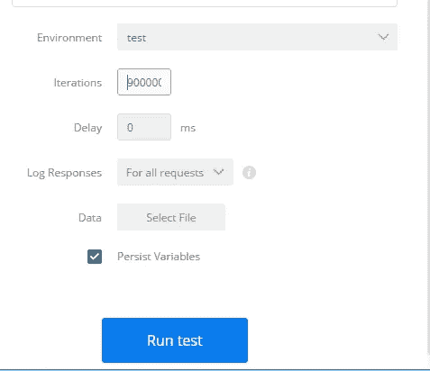

# 用 Postman 和 Google Chrome 开发 Api

> 原文：<https://infosecwriteups.com/exploiting-apis-with-postman-and-google-chrome-ade13ce74e2b?source=collection_archive---------3----------------------->

强制性巨幅中型照片

利用任何 REST Web API 的第一步是确保您正在使用的网站正在调用 API 端点。我检查的方式是打开谷歌 Chrome 中的开发者工具，在一个网站上做几个无辜的请求。

没有身份验证标头—检查

将 JSON 发送到服务器—检查

在这个特定的网站上，我不需要用我的名字登录来提交一张票。我可以以“客人”的身份提交。

现在是时候找些有趣的东西来开发了。这个特殊的系统提交工单，让城市来清理垃圾、肢体等。

我将创建一个工作订单，并捕获 JSON 请求。稍后我们将使用 Postman 来进一步检查和操作这些请求。

在 Chrome Developer tools 的“网络”选项卡上，打开“保存日志”来保存请求。

下一步是通过系统提交订单，并在 network 选项卡中找到 api 请求。

然后右键单击它，将请求复制为 cURL(bash)脚本。您可能还想过滤 XHR 的请求。

**开机邮递员**

单击右上角的导入。

然后点击粘贴原始文本，并点击导入

现在，您应该可以看到完整的 POST 请求。

正文选项卡显示我输入的票据信息。(确保在您自己的应用程序上也实现了服务器端验证)

现在是有趣的事情(负载测试)的时候了。

在“邮差”的左上角，单击“跑步者”。runner 将允许我们在刚刚捕获的端点上进行负载测试。

由于是一个集合运行器，我可以选择运行 1 次、10 次或 900 万次，而没有延迟。

这将在系统中创建 900 万个工作订单，并可能导致系统崩溃。有人知道吗？

我会推荐那些经常过期的不记名代币。

这个方法是我用来对我自己的 API 进行负载测试的。