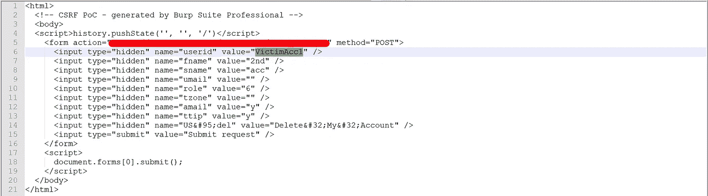

# 用 IDOR 开发 CSRF 链接

> 原文：<https://infosecwriteups.com/exploiting-csrf-chaining-with-idor-7617371ce6e3?source=collection_archive---------1----------------------->

**各位研究员好，**

我自己，**拉菲阿哈迈德**。我是来自孟加拉国的网络安全研究员。我目前在达卡大学攻读 BBA。但是我喜欢无聊的东西。让我们不要浪费时间进入我们的主题。

# 什么是 CSRF？

> **跨站请求伪造**，也称为**一键攻击**或**会话骑行**，缩写为 **CSRF** 或 **XSRF** ，是一种恶意利用网站的方式，在这种方式下，web 应用程序信任的用户会提交未经授权的命令。

# IDOR 是什么？

> *不安全的直接对象引用(IDOR)是一种访问控制漏洞，当应用程序使用用户提供的输入直接访问对象时会出现这种漏洞。*

我在测试一个 **NDA ( *保密协议* )** 程序，我注意到网络应用程序有一个**删除用户账户的选项。**

我使用 Burp 来拦截请求，以测试 IDOR，因为我喜欢查找 IDOR。但我找不到任何数字身份证或任何相同的东西。但是有一个**用户 ID 参数**包含了用户的**用户名**。我用我的第二个帐户的用户名更改了用户 ID，但是没有用。然后我注意到没有任何 CSRF 令牌。因此，我使用 Burp 生成了一个 CSRF PoC，并使用我的另一个帐户打开了 HTML 文档。但是没有用。

CSRF 文件

然后我想起了那个用户 ID 参数。我再次用我的第二个帐户的用户名更改了用户 ID。我用我的第二个帐户打开了文档，我的帐户被删除了。

利用

我很快报告了这个漏洞，公司在 24 小时内修复了这个漏洞。

开发商

希望你们喜欢这个。PM 我在**[**、LinkedIn**](https://www.linkedin.com/in/rafi-ahamed) 或 [**Twitter**](https://twitter.com/L3onid1s) 如果你有任何问题。**

*****#吃 _ 睡 _ 黑 _ 重复
#全部黑掉*****