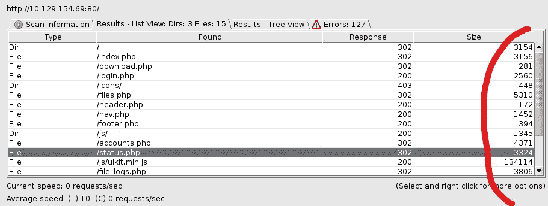
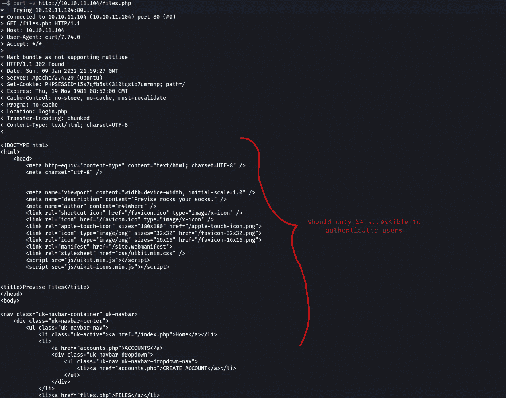
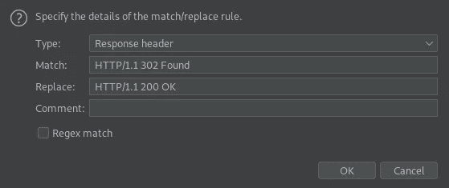

# 利用 HTB 版本中的重定向后执行(EAR)漏洞

> 原文：<https://infosecwriteups.com/exploiting-execute-after-redirect-ear-vulnerability-in-htb-previse-92ea3f1dbf3d?source=collection_archive---------2----------------------->

来源:www.wallpaperflare.com

# 简短的介绍

> 重定向后执行(EAR)是一种攻击，攻击者忽略重定向并检索针对经过身份验证的用户的敏感内容。成功利用 EAR 漏洞可能导致应用程序完全受损。

考虑一个具有登录功能的 web 应用程序。拥有帐户的用户只能通过登录来访问此 web 应用程序中的内容/功能。未经身份验证的用户将被重定向到登录页面，以便他们首次登录并获得经过身份验证的会话。这是重定向后执行或 EAR 漏洞可能出现的许多情况之一。在不正确的代码实现中会出现一个 EAR 漏洞，开发人员会认为重定向后执行会停止。然而，事实并非如此，页面的其余部分也会被执行。

下面的代码片段显示了这样一个实现:

如果你眼尖的话，你可能已经注意到了。如果你没赶上，没问题。让我给你看看。PHP 代码检查用户是否经过身份验证。如果没有，它会将他们重定向到位于`/login`的登录页面。但是没有人告诉程序在重定向后停止执行所有代码。因此，所有应该只在用户拥有有效会话时运行的代码也将被执行。如果我们使用代理工具，比如 BurpSuite 或 ZAP(是的，我喜欢这两个工具)，我们可以将`302 Found`重定向的响应修改为`200 OK`响应。我们稍后将进入这一部分。让我们先快速修复代码。

通过简单地调用`die()`函数，我们能够停止代码的执行。剩余的代码现在不会执行。

# 演示—有趣的部分:)

有趣的部分来了，是吗？HTB 盒子上的网站 Previse(现已退役)易受此 EAR 漏洞的攻击。我首先用一个叫做 dirbuster 的工具来模糊文件名。这些文件中的大多数都以 302 Found 状态代码响应。这里需要注意的一点是，响应中的 Content-Length 头的值非常高，这在重定向响应中并不常见。

使用 dirbuster 对文件进行模糊处理

如果我们使用 cURL 等不遵循重定向的工具访问任何这样的页面(作为未经身份验证的用户)，我们可以清楚地看到只有经过身份验证的用户才能看到的内容。

它可以让攻击者窃取私人敏感数据，并执行未经授权的操作。

我们可以使用 BurpSuite 内置的匹配和替换特性来自动将 302 重定向转换为 200 OK 响应。但是请记住，它可能会与某些页面冲突，并且行为怪异。

在 BurpSuite 上匹配和替换

我希望你喜欢阅读这篇文章。如果你有任何问题，随时联系我。通过我的社交网络与我联系

 [## Manash Saikia —安全顾问实习生— Payatu | LinkedIn

### 查看世界上最大的职业社区 LinkedIn 上 Manash Saikia 的个人资料。Manash 有 3 个工作列在他们的…

www.linkedin.com](https://www.linkedin.com/in/manash-saikia-065146176/) 

[https://twitter.com/manash036](https://twitter.com/manash036)