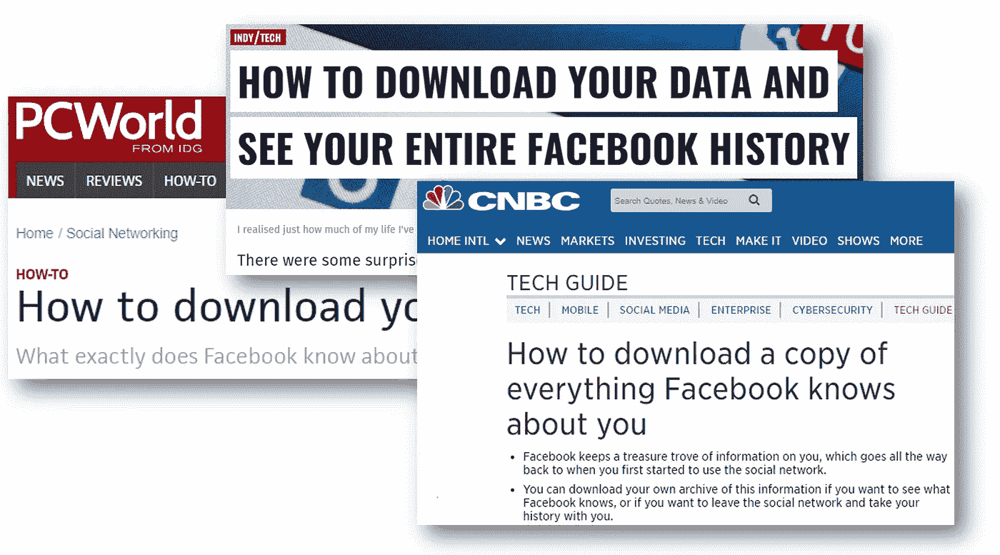
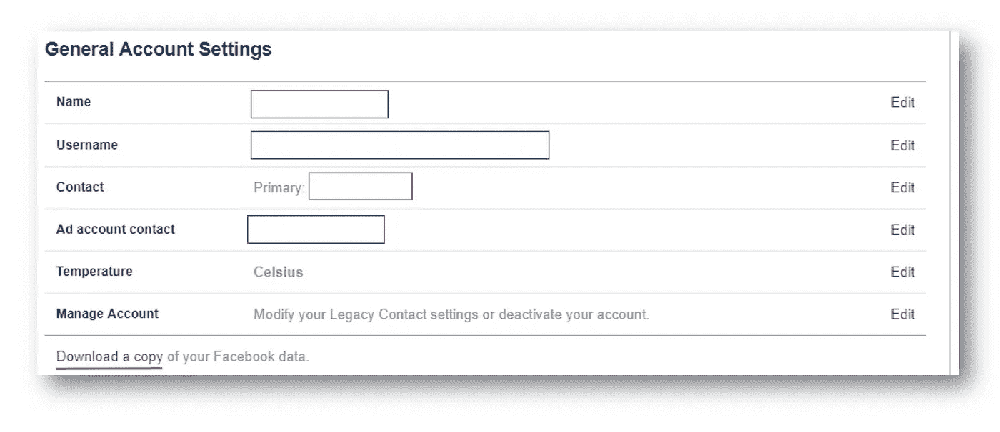
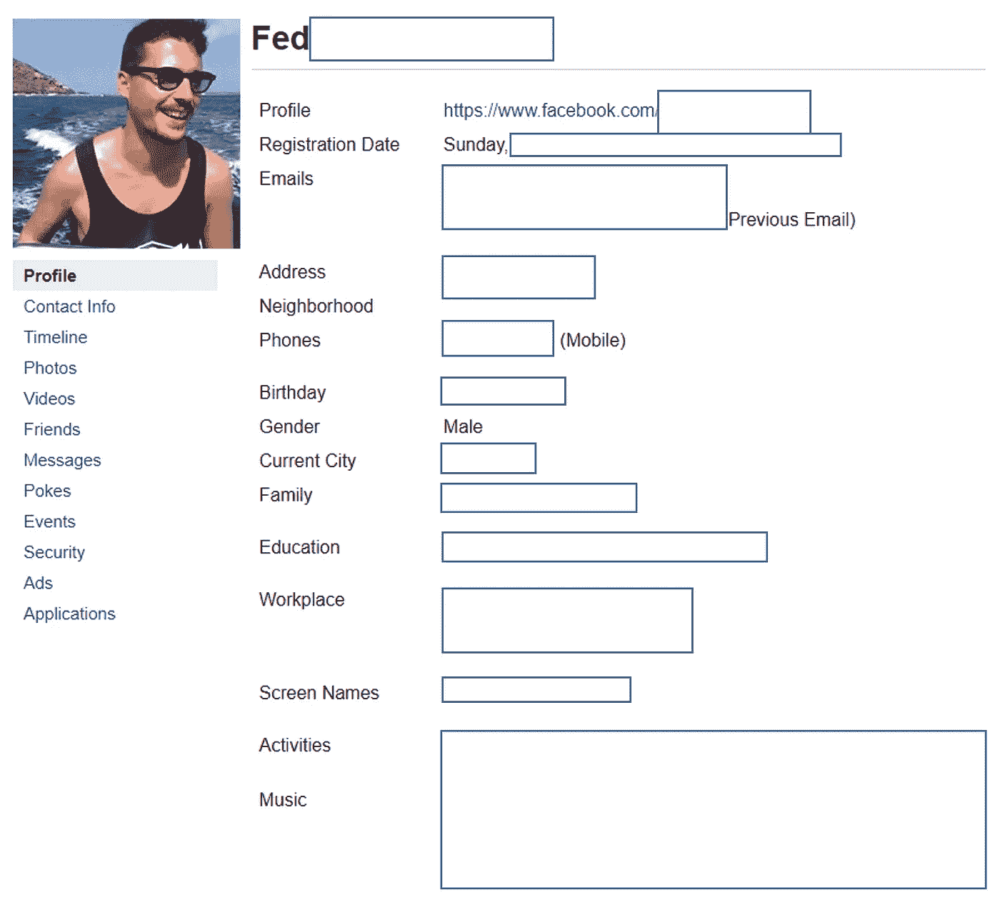
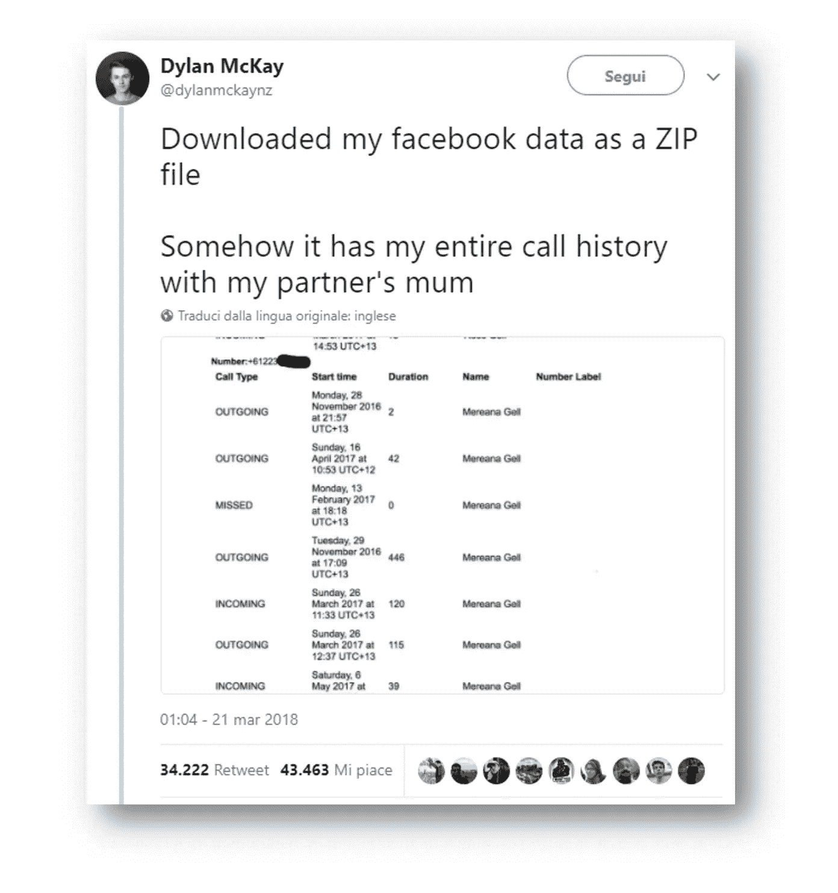
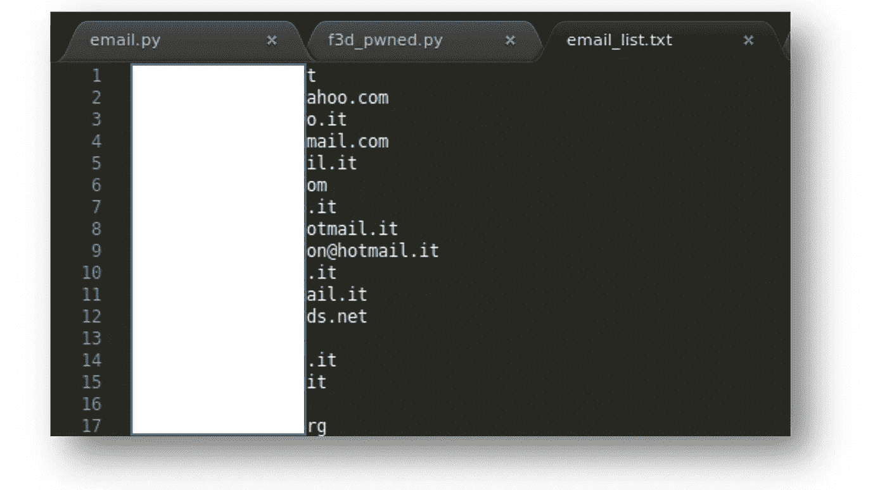
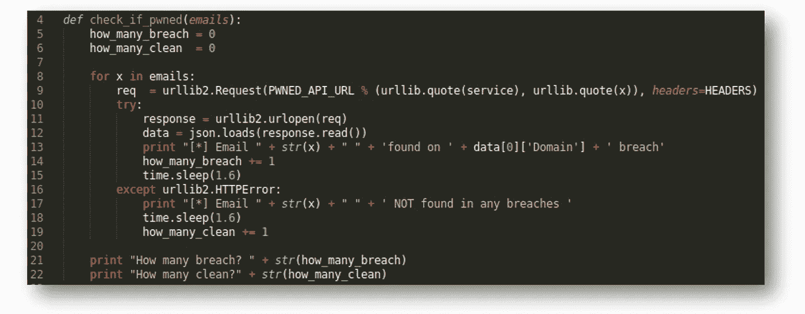
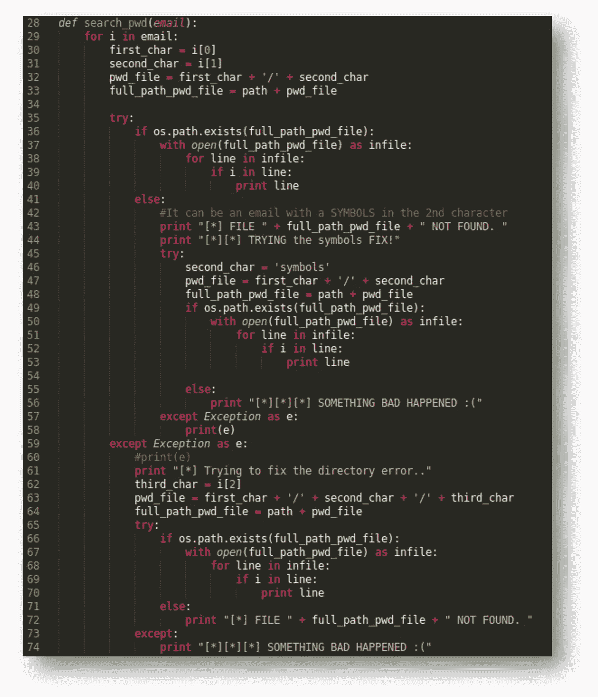
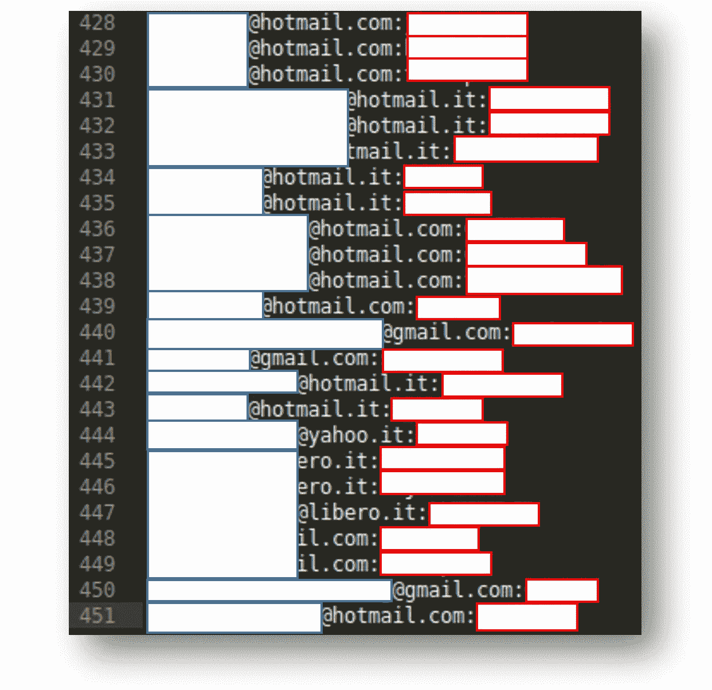
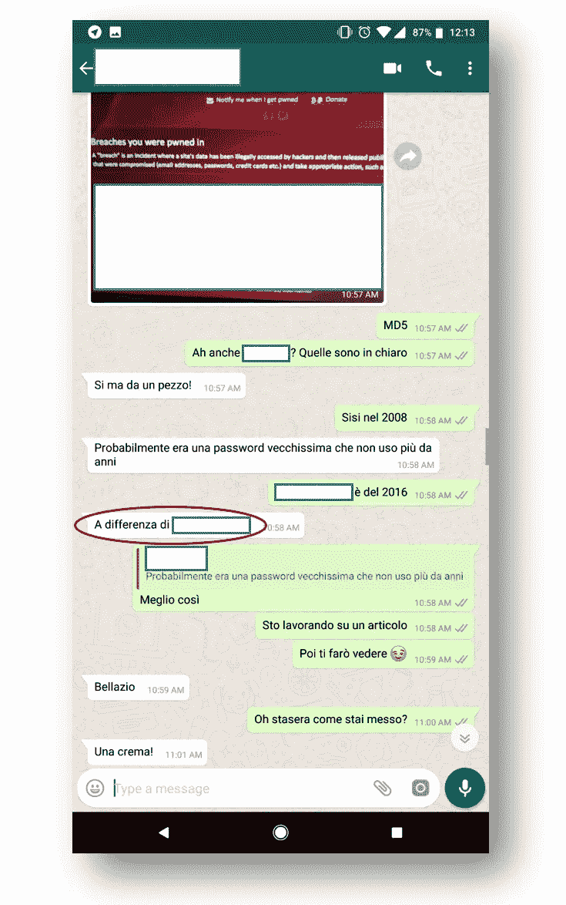

# 利用脸书数据窃取你朋友的数字身份

> 原文：<https://infosecwriteups.com/exploiting-facebook-data-for-stealing-your-friends-digital-identities-68511ec2d21d?source=collection_archive---------0----------------------->

*马克·扎克伯格(贾斯汀·沙利文/盖蒂图片社)*

# 放弃

> 所有分享的信息仅用于教育目的。请自行使用这些物品，并记住:**你要对造成的任何损害负责**。
> 
> **本文观点仅代表我个人，不代表其他人的观点**。
> 
> 对所有的脚本小子们:抱歉，我不会发布任何即插即用的脚本。

# 介绍

脸书的糟糕日子，嗯？

这个月,《卫报》和《纽约时报》都让脸书陷入了信任和隐私方面最大的丑闻。总之，长话短说，**脸书向剑桥分析公司(Cambridge Analytica)的一名研究人员披露了 5000 万脸书不知情用户的数据**，该公司为川普竞选团队工作。但听起来更可怕的是剑桥分析公司是如何获得这些海量数据的:看起来，我引用《纽约时报》的话，“剑桥付费通过一名外部研究人员获取个人信息，脸书说，这名研究人员声称收集这些信息是为了学术目的”。

在这次丑闻之后，很多人开始变得有点多疑，开始质疑脸书如何有效地处理他们的数据，以及出于什么目的。在线报纸和杂志没有等太久，就开始发表如下文章:

网络媒体开始告知读者如何下载你的脸书数据。

所以，我决定做我的功课:**我想知道脸书对我了解多少**。

# 1)请求并下载我的脸书数据

这个过程非常简单:登录后，我进入“设置”并点击“**下载你的脸书数据副本**”按钮。这样，您将向脸书发送对您的数据的请求，几分钟后(< 15 分钟。在我的情况下)你会收到一个通知，你的文件可以下载了。

让我们检查一下。

请求下载我的脸书个人数据。

我收到的文件是一个”。zip”文件(350 MB 左右)，我把它提取出来，打开“index.htm”文件。

它看起来是这样的:

我的个人脸书数据。

正如你所看到的，它充满了分类良好的信息，你可以很容易地通过侧边菜单搜索:媒体内容，信息，应用程序使用，等等。

那是很多数据，不是吗？

**一些不好的事情**:我在 Twitter 上发现一些用户声称也收到了如下可怕的数据(当我写这篇文章时，这个故事也出现在[黑客新闻](https://thehackernews.com/2018/03/facebook-android-data.html)):

【https://twitter.com/dylanmckaynz/status/976368845635035138 

是的，这是疯狂的，但幸运的是，这不是我的情况，我没有找到任何关于我的电话或我的短信发送或接收的数据。

> “似乎在旧版本的 Android 中，权限要宽松得多，脸书应用在安装时取消了联系人权限，允许公司自动访问电话和消息数据。”(《黑客新闻》)

除此之外，一个特殊的类别引起了我的注意:**联系信息**。

这个类别的标题是不言而喻的，事实上，我能够从我手机的联系人列表中检索到我的脸书朋友的完整列表，其中也包含我不再拥有的旧号码。作为个人备份，这可能很有用，但是**我不明白为什么我的很多联系人也有与之相关的个人电子邮件地址**。

脸书联系信息页面。

我也确信所有这些邮件都直接来自脸书，而不是来自我手机的联系人列表:我检查了每一封邮件，发现我手机上的联系人不到 5%。所以，他们来自脸书。

事实上，脸书让您有机会与以下人员分享您的电子邮件地址:

*   人人
*   只有你的朋友
*   没有人

对于大多数人来说，分享他们的个人电子邮件不是问题，我的意思是，这只是一个电子邮件地址，对不对？

这就是我的“黑帽人格”出现的时候。

# 2)收集信息并开始享受乐趣

我写了一个脚本来抓取 HTML 页面并提取其中的所有电子邮件:**我能够找到 585 封不同的电子邮件。**

一些提取的邮件

> 给读者一个提示:不止一封电子邮件可能指向一个人(第二封电子邮件也可能来自脸书)。

在那之后，我决定在 [haveibeenpwned](https://haveibeenpwned.com/) API 的帮助下，检查这些电子邮件是否在之前的数据泄露中被泄露。我编写了一个简单的 Python 脚本，它可以自动为我完成这项检查。

查询 haveibeenpwned API。

我发现的一些结果:

*   唯一电子邮件: **585**
*   发现公共违规: **310**
*   未发现公开违规: **275**

因此，我 50%以上的电子邮件联系人已经在之前的数据泄露中(或不止一次)受到了威胁。好的，会很有趣的。

以下是涉及的主要违规行为列表，按降序排列:

*   土坯: **83**
*   Myspace: **82**
*   Dropbox: **34**
*   领英: **19**
*   每日运动: **17**
*   等等…

现在，让我们更深入地开始搜索密码。我是说，这些违规行为是公开的，对吧？所以密码应该在某个地方。

# 3)密码，密码，密码…

三个月前在 [r/pwned](https://www.reddit.com/r/pwned/.) subreddit 上出现了似乎是迄今为止在黑暗网络中发现的最大的聚合数据库:这些文件组织良好，包含**14 亿个明文凭证**，它是 **41GB** 。数据按字母顺序组织在一个目录树中，分成 1，981 个片段，以便快速搜索。

转储文件夹结构。

> 如果你需要关于这个数据库的更多细节，检查这个媒体[帖子](https://medium.com/4iqdelvedeep/1-4-billion-clear-text-credentials-discovered-in-a-single-database-3131d0a1ae14)。如果你对如何下载它有疑问，我不会提供任何来源或“如何”指南，抱歉。

我将它转移到一个外部驱动器，并编写另一个 Python 脚本来搜索它，以便找到一些以前泄露的密码。同样，这个脚本非常简单:

在 Python 中自动提取密码。

我花了大约 15 分钟来处理我在脸书的数据中找到的所有电子邮件地址，但这是值得的:**已经找到了 451 个独特的电子邮件/密码对**。\_(ツ)_/

找到 400 多对不同的用户名/密码。

由于在多次数据泄露中发现了一些电子邮件地址，发现的密码数量大于搜索的电子邮件数量( **310** 电子邮件地址返回给我 **451** 唯一密码)。

我把我的发现告诉了几个朋友，他们向我承认:**那些发现的密码仍然在其他平台上使用**。下图是我和我的一个朋友关于我发现的他的密码的对话(我们都是意大利人):

我的一个朋友证实他仍在使用我找到的密码。

# 4)结论和开放点

*   如果没有必要，避免分享私人邮件，记住:脸书不是一个分享邮件的安全地方。
*   密码重用是现实生活中的风险。只是停下来到处使用相同的简单密码。
*   了解 2FA 以及如何启用([如果可用的话](https://twofactorauth.org/))。
*   密码管理器还没有被广泛采用，我们需要解决这个问题，但是你可以尝试一下。有很多选择(有免费和付费的选择)。

## 谢谢你阅读它。

## 如果你喜欢这篇文章，给我一些掌声。

