# 利用格式字符串漏洞

> 原文：<https://infosecwriteups.com/exploiting-format-string-vulnerability-97e3d588da1b?source=collection_archive---------0----------------------->


# 什么是格式字符串漏洞？

当输入字符串数据由易受攻击的函数处理时，就会发生格式字符串攻击，因此攻击者可以借助格式字符串函数/printf()系列函数传递格式以利用堆栈值

通过格式字符串漏洞，攻击者可以执行代码、读取堆栈值或在应用程序中导致分段错误

# PRINTF()系列中的常见格式

1.  %c —格式化单个字符
2.  % d-将整数格式化为十进制值
3.  % f-格式以十进制值浮动
4.  %p —格式化指向地址位置的指针
5.  %s —格式化字符串
6.  %x —格式化十六进制值
7.  %n —写入的字节数

# 格式化 SRING 的易受攻击的函数

1.  printf()
2.  fprintf()
3.  sprintf()
4.  vprintf()
5.  snprintf()
6.  vsnprintf()
7.  vfprintf()
8.  vfprintf()

# 为什么会出现格式字符串漏洞

当我们传递带有格式字符串的输入时，printf()调用它来显示输出

因此，如果输入具有与格式相关的有效数据，它将被正确打印

如果数据具有与 printf()无关的格式值，就可能被利用

示例:

```
1\. If printf(data) is used, I can pass "junkdata %d %p %lp %x" to exploit the function

2\. If printf("%s %p %p",data), here data gets filled by %s and the remaining formats can get exploited into stack
```

当格式字符串没有相应的变量来调用数据时，它将开始从堆栈中弹出随机值，而不管它们的位置/地址

# 剥削

# 示例 1

让我们考虑一个简单的程序来测试这个漏洞

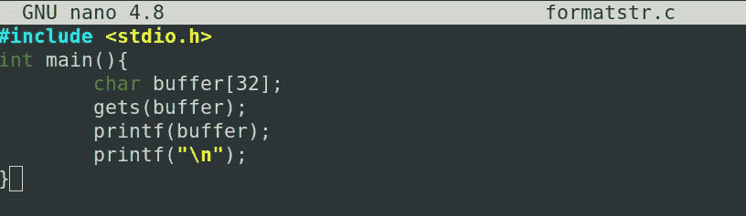

用 GCC 编译这个二进制文件(没有标志)

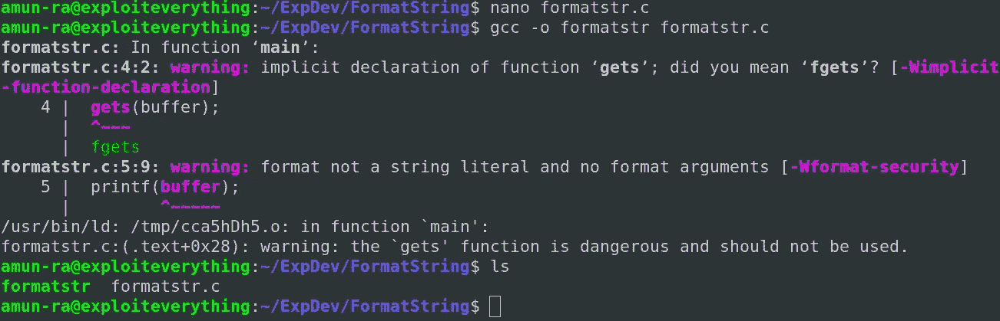

当我们传递一个普通的字符串数据时，它成功地打印出来

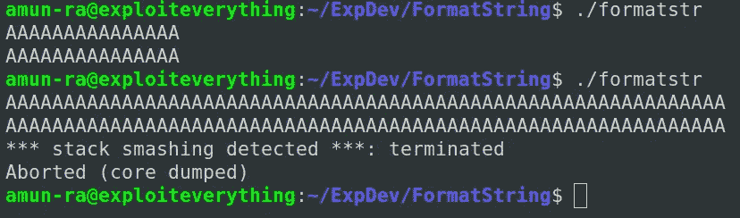

如果我们越过缓冲区，它就会崩溃

但是如果我们传递带格式值的字符串，它会给我们随机的堆栈值

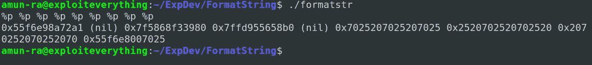

我们传递“%p”来获取指针格式的地址值

让我们在格式值前面传递一些数据

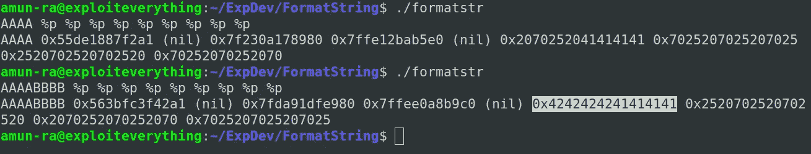

我们可以从第 6 个位置的堆栈值中看到我们的输入

像这样传递字符串输入可以帮助我们定位数据的位置，从而有助于利用数据

现在我们已经追踪到了我们的输入在堆栈中存储的位置

当我们从它没有的地址调用不同的格式时，应用程序有可能崩溃

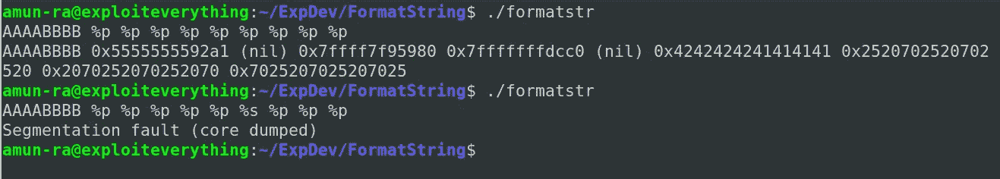

我们已经通过 AAAABBBB 传递了我们的输入

答— -> 0x41

b—--> 0x 42

由于我们运行在 64 位，我们可以在每个地址存储多达 8 个字节

我们已经找到了存储输入的位置&我们把它看作堆栈中的指针地址

当我们试图用“%s”格式调用该位置时，“分段错误”发生了

因为地址 0x42424242414141 中没有任何字符串，或者超出了应用程序的内存范围

所以错误发生时，请确定您试图调用的格式的地址和类型

您要调用的地址中应该有一个值，它可以支持您需要的格式类型

# 示例 2

让我们尝试获取一些应用程序中没有使用的数据

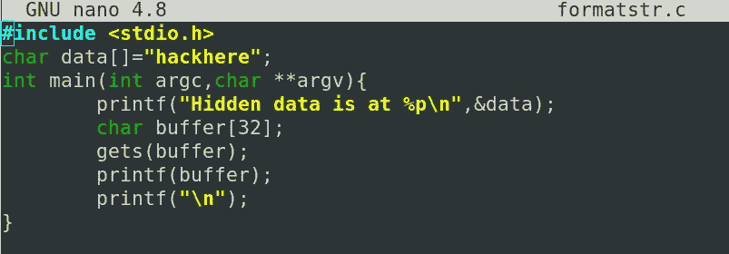

这里我们使用一个全局变量“data ”,其中包含一些字符串

我们打印了变量的地址

让我们用 32 位的 GCC 编译程序

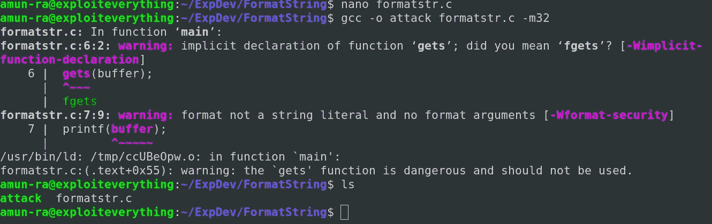

通过用输入测试该应用程序(模糊化过程)

你可以看到我们的输入从内存输出的第 11 个位置打印出来

您可以“直接”引用格式字符串漏洞中的位置，以便从堆栈中调用所需位置的值

要从第 11 个位置打印堆栈值，您可以使用“%11$p”来表示堆栈的第 11 个位置

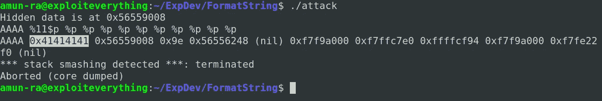

让我们传递“数据”的地址作为我们的第二个输入，以便它存储在第一个输入旁边的堆栈中

如果是“小端”,则以相反的顺序传递地址

## 注意

```
Always remember to fill with 8 bytes / 4 bytes (64bit/32bit) or else the address / expected value may get broken
```

现在我们的第二个数据在第 12 位

我们知道其中有一些字符串数据，但不知道是什么

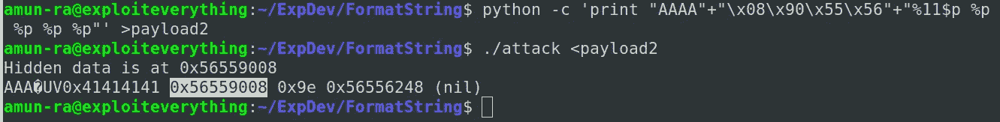

所以我们传递“%s”格式从堆栈内存中读取字符串

通过超过第 12 位的“%s”

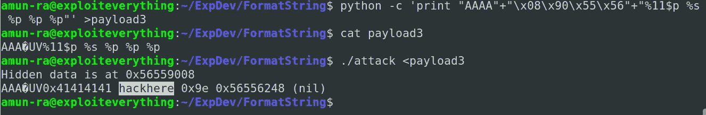

让我们用“%s”制作我们的有效负载

用“%s”传递我们的有效负载使我们以字符串形式查看第 12 位的数据

我们还可以通过进一步访问堆栈来利用此漏洞

# 缓解措施

1.  使用对应于指定变量的格式字符串
2.  使用“%s”作为格式字符串可以将整个输入作为单个字符串
3.  使用参数调用值和函数
4.  可以使用像“格式 _ 高”这样的防御策略

## GitHub Repo 中提供了漏洞利用示例

## [aiden peace 369](https://github.com/AidenPearce369/ExploitDev)