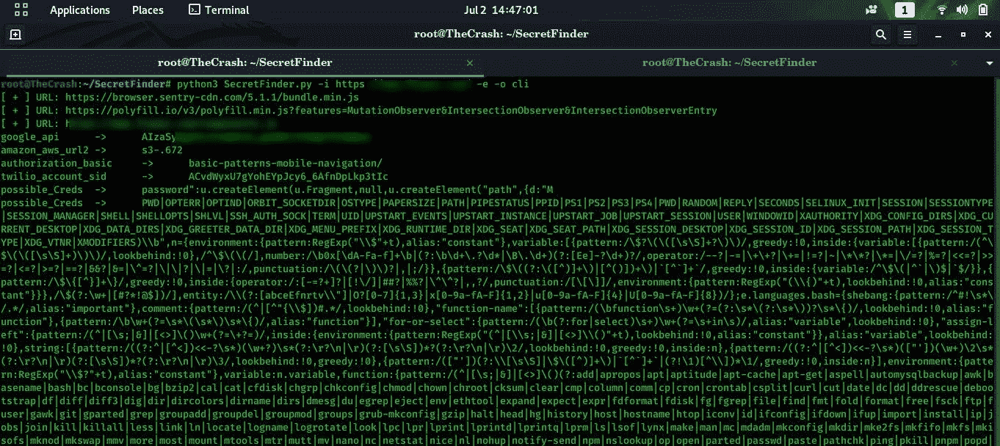
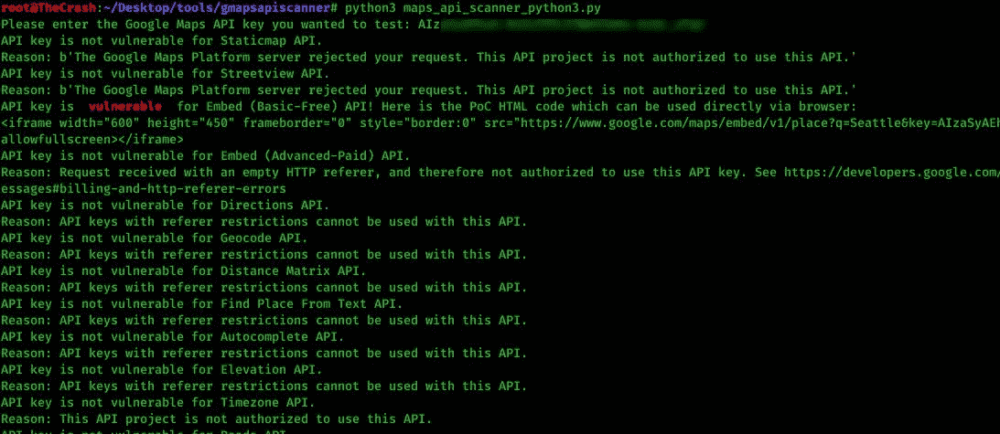

# 利用谷歌地图 API 密钥牟利

> 原文：<https://infosecwriteups.com/exploiting-google-maps-api-keys-for-profit-3903dd2c829c?source=collection_archive---------2----------------------->

嗨，我的黑客伙伴们，我希望你们都喜欢 WFH 并学习新的技术。在这里，我写了一篇关于如何检查一个易受攻击的谷歌地图 API 键的文章。让我们开始讲述:)

对于那些不了解这项服务及其 API 密钥的人来说，谷歌地图 API 是一项付费服务，它允许应用程序嵌入和搜索谷歌地图数据库，并在自己的应用程序上使用它。虽然一些服务在 2018 年初是免费的，但他们在那之后改变了他们的使用计划。从那时起，开发人员需要为他们使用的所有 API 使用 API 密钥或客户端 id 解决方案。详细信息请访问本博客从 [Ozgur Alp](https://medium.com/u/d836b28cb997?source=post_page-----3903dd2c829c--------------------------------) :- { [**关于谷歌地图 API 键**](https://medium.com/bugbountywriteup/unauthorized-google-maps-api-key-usage-cases-and-why-you-need-to-care-1ccb28bf21e) 的详情}

因此，在不浪费你的时间的情况下，让我们开门见山地开始步骤:-当我在阅读有关 Google API 关键漏洞的内容时，我想在几个网站上应用它，我发现其中一些很容易受到攻击。有几种方法可以找到 Google API 键。第一个是手动观察。 **js 文件。如果一个网站正在接受谷歌的登录功能，找到谷歌地图 API 密钥的机会很大。我个人真的不做，但是如果你愿意，你可以试一试。**

第二个，对我来说最好的是使用一个叫做**secret finder**{可以从这里下载:-[**secret finder**](https://github.com/m4ll0k/SecretFinder)}。我下载了这个工具，用它做了一个网站。这个工具从特定的域中抓取 js 数据，并根据正则表达式中定义的关键字在终端上给出输出。如果您愿意，也可以将它存储在一个文件中。下面是它找到一个 Google API 键的截图

如您所见，它找到了一个 API 密钥。现在，您可以借助名为 **Gmapsapiscanner 的工具来检查它是否可被利用。你可以从这里的 [**下载。**](https://github.com/ozguralp/gmapsapiscanner) 一旦你使用它，它会给你这样的输出:-**

开始了。！一旦你发现它有漏洞，你就可以报告它。即使这是一个唾手可得的水果，如果你运气好的话，你也可以得到几块钱。谁知道呢！！！大多数公司接受它作为 P4。

还有其他方法可以废弃 Google API 密匙，比如你可以使用一个叫做 **Git-hound** 的工具从 Github 中废弃数据。确保密钥应该与公司的存储库或他们的某个员工相关，否则您将获得 **N/A.**

**影响:？？就是这里:-**

*   如果公司在 API 预算上没有任何限制设置，则可能会消耗公司的每月配额，或者因未经授权使用该服务而超额计费，并对公司造成财务损失。
*   如果 Google 帐户中存在任何最大账单控制设置限制，则针对该服务进行拒绝服务攻击。虽然如果使用此类“联系我们”页面的应用程序部分，这可能不会太危险，但是如果应用程序的主要业务/功能在这些地图中处理，如优步(通过地图查找/跟踪乘车)和预订(通过地图搜索酒店)，这可能会非常危险。

所以，这次就这样了！！！我希望你喜欢这本书，并从中学到一些东西。如果你有，请继续与他人分享，帮助他们爬上你今天的位置！还有，一定要用这个用户名在 twitter 上关注我: **@manas_hunter。与此同时，如果你喜欢这篇文章，请按下面的拍手图标。后会有期:)继续学习！**

保重…Adios❤

推特:-[https://twitter.com/manas_hunter](https://twitter.com/manas_hunter)

LinkedIn:-[https://www.linkedin.com/in/manas-harsh-05636a154/](https://www.linkedin.com/in/manas-harsh-05636a154/)